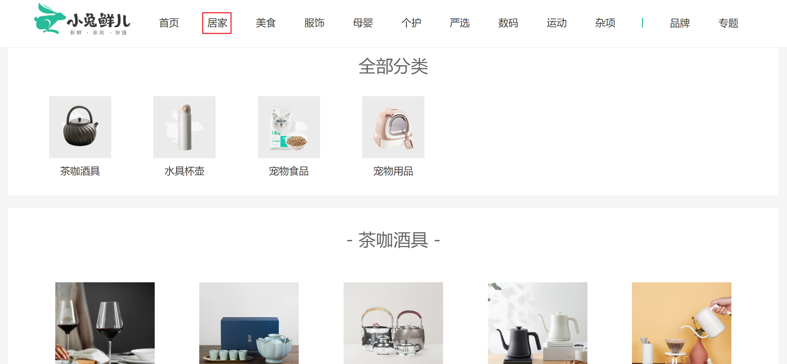
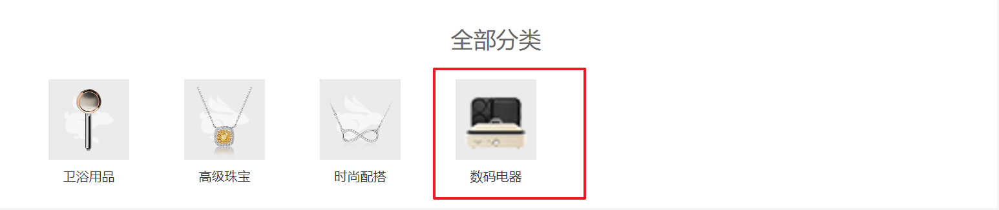

#  顶级类目

> 目标：主要讲解开发时路由处理的要点，列表渲染部分自己课后实现即可。




## 路由和组件

`任务目标:` 新增顶级类目组件并绑定路由

**实现步骤**

1. 新建相关组件
2. 把组件和路由绑定在一起
3. 给路由在导航区域添加上跳转链接
4. 点击跳转链接测试是否成功跳转

**代码落地**

1）新建组件

`src/views/Category/index.vue`

```vue
<script setup lang="ts"></script>

<template>
  <div class="top-category">
    <div class="container">顶级类目</div>
  </div>
</template>

<style scoped lang="less"></style>

```

2）绑定路由

`src/router/index.ts`

```diff
const routes = [
  {
    path: '/',
    component: Layout,
    children: [
      {
        path: '/',
        component: () => import('@/views/Home/index.vue')
      },
+      {
+        path: '/category/:id',
+        component: () => import('@/views/Category/index.vue')
+      }
    ]
  },
  {
    path: '/login',
    component: () => import('@/views/Login/index.vue')
  },
  {
    path: '/test',
    component: () => import('@/views/Test/index.vue')
  }
]
```

3）添加路由跳转链接

`src/components/app-header-nav.vue`

```jsx
<template v-if="list.length > 0">
  <li v-for="item in list" :key="item.id">
    <RouterLink :to="`/category/${item.id}`">{{ item.name }}</RouterLink>
  </li>
</template>
```


## 解决路由缓存问题🚨

`任务目标:`  解决路由切换，组件复用时，数据不重新获取的问题

> 现存问题：由于路由的组件复用机制，当路由的路径path没有发生变化时，路由对应的组件会被直接复用，
>
> 也就是生命周期钩子函数不再执行，请求也就不会再次发起
>
> 解决思路：给`router-view` 加上 key 值为每次路由切换的完整路径

`Layout/index.vue`

```html
<RouterView :key="$route.fullPath" />
```

```jsx
fulllPath        /category/1029487?username=zs&age=18

path             /category/1029487
```


## 修复路由滚动行为🚨

刷新时，或者跳转到新页面组件时，希望回到顶部，配置路由的配置项即可。

官方文档：[详细阅读](https://router.vuejs.org/zh/guide/advanced/scroll-behavior.html)

```jsx
// 使用createRouter创建路由实例
const router = createRouter({
  ...
  // 始终滚动到顶部
  scrollBehavior: () => {
      return {  top : 0  }
  }
})
```

PS：vueRouter@4 和 vueRouter@3 返回顶部代码有些小差异，建议查阅官方文档。

## 顶级类目数据渲染-课后练习

> 主要就是列表渲染，自己课后实现即可。

效果参考：[效果地址](http://erabbit.itheima.net/#/category/1005000)

###  面包屑组件使用

使用范例：

```jsx
<XtxBread>
  <XtxBreadItem to="/">首页</XtxBreadItem>
  <XtxBreadItem>美食</XtxBreadItem>
</XtxBread>
```


### 参考代码

`src/views/Category/components/goods-item.vue`

```vue
<script setup lang="ts">
import { RouterLink } from "vue-router";
import type { Goods } from "@/types";
defineProps<{
  goods?: Goods;
}>();
</script>

<template>
  <RouterLink :to="`/goods/${goods?.id}`" class="goods-item">
    
    <p class="name ellipsis">{{ goods?.name }}</p>
    <p class="desc ellipsis">{{ goods?.desc }}</p>
    <p class="price">&yen;{{ goods?.price }}</p>
  </RouterLink>
</template>

<style scoped lang="less">
.goods-item {
  display: block;
  width: 220px;
  padding: 20px 30px;
  text-align: center;
  img {
    width: 160px;
    height: 160px; 
  }
  p {
    padding-top: 10px;
  }
  .name {
    font-size: 16px;
  }
  .desc {
    color: #999;
    height: 29px;
  }
  .price {
    color: @priceColor;
    font-size: 20px;
  }
}
</style>

```


`src/views/Category/index.vue`

```vue
<script setup lang="ts">
import { http } from '@/utils/request';
import { onMounted, ref } from 'vue';
import { useRoute } from 'vue-router';
import GoodsItem from './components/goods-item.vue';
// 获取当前路由对象
const route = useRoute();
// 获取动态路由参数的id
const id = route.params.id;
// 组件挂载完毕，发送请求获取数据
const topCategory = ref();
onMounted(async () => {
  const res = await http('GET', '/category', { id });
  console.log('/category', res.data.result);
  topCategory.value = res.data.result;
});
</script>

<template>
  <div class="top-category">
    <div class="container">
      <!-- 面包屑 -->
      <XtxBread>
        <XtxBreadItem to="/">首页</XtxBreadItem>
        <XtxBreadItem>{{ topCategory?.name }}</XtxBreadItem>
      </XtxBread>
      <!-- 所有二级分类 -->
      <div class="sub-list">
        <h3>全部分类</h3>
        <ul>
          <li v-for="item in topCategory?.children" :key="item.id">
            <a href="javascript:;">
              
              <p>{{ item.name }}</p>
            </a>
          </li>
        </ul>
      </div>
      <!-- 楼层商品 -->
      <div
        class="ref-goods"
        v-for="item in topCategory?.children"
        :key="item.id"
      >
        <div class="head">
          <h3>- {{ item.name }} -</h3>
          <XtxMore />
        </div>
        <div class="body">
          <GoodsItem
            v-for="goods in item.goods"
            :key="goods.id"
            :goods="goods"
          />
        </div>
      </div>
    </div>
  </div>
</template>

<style scoped lang="less">
.top-category {
  h3 {
    font-size: 28px;
    color: #666;
    font-weight: normal;
    text-align: center;
    line-height: 100px;
  }
  .sub-list {
    margin-top: 20px;
    background-color: #fff;
    ul {
      display: flex;
      padding: 0 32px;
      flex-wrap: wrap;
      li {
        width: 168px;
        height: 160px;
        a {
          text-align: center;
          display: block;
          font-size: 16px;
          img {
            width: 100px;
            height: 100px;
          }
          p {
            line-height: 40px;
          }
          &:hover {
            color: @xtxColor;
          }
        }
      }
    }
  }
  .ref-goods {
    background-color: #fff;
    margin-top: 20px;
    position: relative;
    .head {
      .xtx-more {
        position: absolute;
        top: 20px;
        right: 20px;
      }
      .tag {
        text-align: center;
        color: #999;
        font-size: 20px;
        position: relative;
        top: -20px;
      }
    }
    .body {
      display: flex;
      justify-content: space-around;
      padding: 0 40px 30px;
    }
  }
}
</style>

```


# 二级类目 - 课后练习

> 主要就是列表渲染，自己课后实现即可。



> 说明：
>
> 1. 二级类目为顶级类目下的子类目，每个顶级类目下都有N个二级类目，属于细分分类，点击这里可以进入到当前二级分类的详情展示。
>

**代码落地**

1）绑定路由

`src/router/index.ts`

```diff
const routes = [
  {
    path: '/',
    component: Layout,
    children: [
      {
        path: '/',
        component: () => import('@/views/Home/index.vue')
      },
      {
        path: '/category/:id',
        component: () => import('@/views/Category/index.vue')
      },
+      {
+        path: '/category/sub/:id',
+        component: () => import('@/views/Category/Sub.vue')
+      }
    ]
  }
]
```

