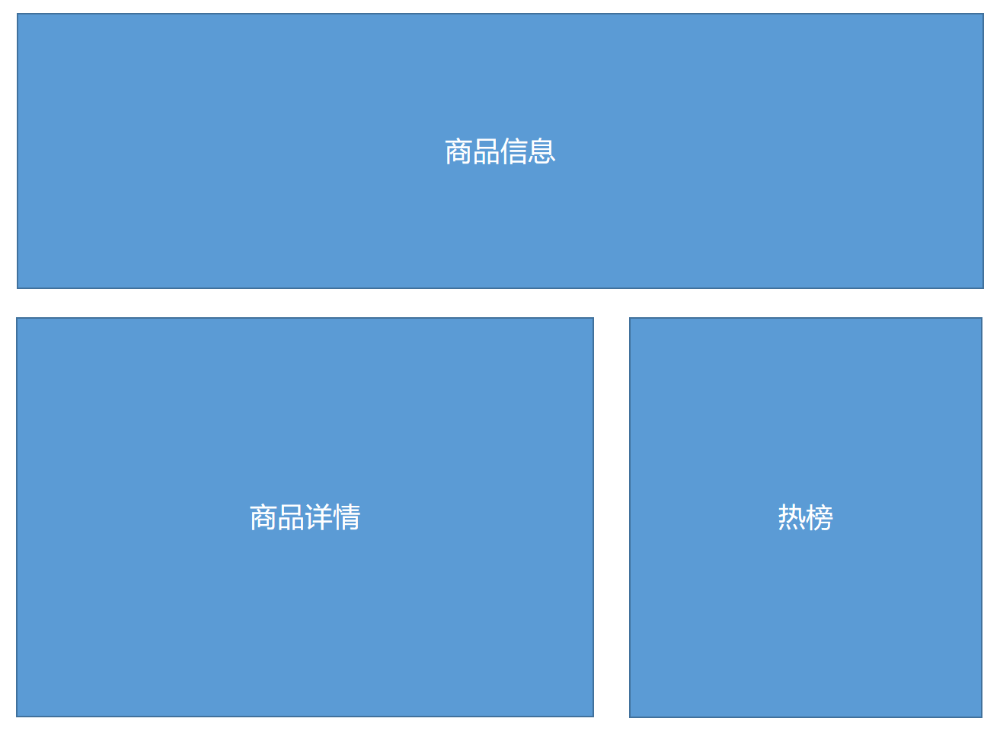
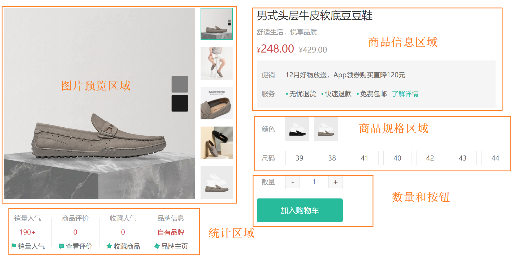
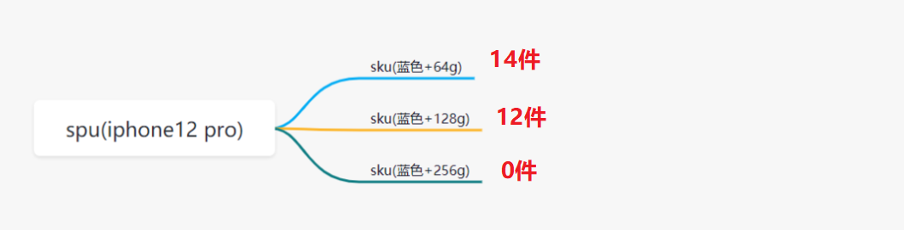
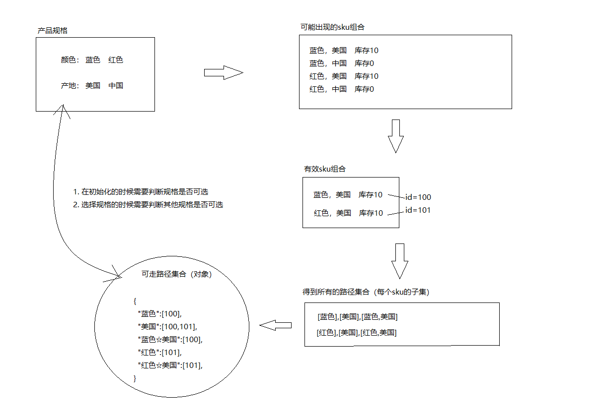
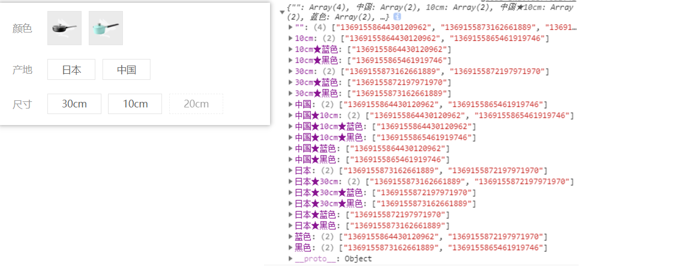
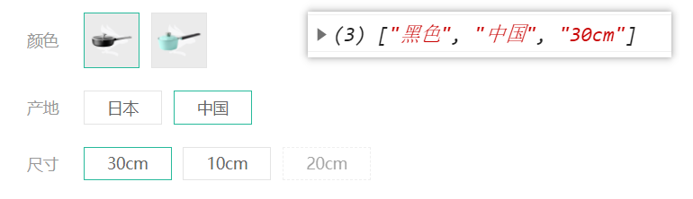

#  详情模块

> 目标：界面渲染部分我们快速准备，详情模块的重点都在组件封装。

##  基础布局和路由

`任务目标:`   完成商品详情的基础布局和路由配置



1）新建页面组件

`src/views/Goods/index.vue`

```vue
<script setup lang="ts">
//
</script>

<template>
  <div class="xtx-goods-page">
    <div class="container">
      <!-- 商品信息 -->
      <div class="goods-info">
        <!-- 图片预览区 -->
        <div class="./media"></div>
        <!-- 商品信息区 -->
        <div class="spec"></div>
      </div>
      <!-- 商品详情 -->
      <div class="goods-footer">
        <div class="goods-article">
          <!-- 商品详情 -->
          <div class="goods-tabs"></div>
        </div>
        <!-- 24热榜+专题推荐 -->
        <div class="goods-aside"></div>
      </div>
    </div>
  </div>
</template>

<style scoped lang="less">
.container {
  margin-top: 20px;
}
.goods-info {
  min-height: 600px;
  background: #fff;
  display: flex;
  ../media {
    width: 580px;
    height: 600px;
    padding: 30px 50px;
  }
  .spec {
    flex: 1;
    padding: 30px 30px 30px 0;
  }
}
.goods-footer {
  display: flex;
  margin-top: 20px;
  .goods-article {
    width: 940px;
    margin-right: 20px;
  }
  .goods-aside {
    width: 280px;
    min-height: 1000px;
  }
}
.goods-tabs {
  min-height: 600px;
  background: #fff;
}
.goods-warn {
  min-height: 600px;
  background: #fff;
  margin-top: 20px;
}
</style>

```

2）路由配置

`src/router/index.ts`

```js
const routes = [
  {
    path: '/',
    component: Layout,
    children: [
      // ...
      {
        path: '/goods/:id',
        component: () => import('@/views/Goods/index.vue')
      }
    ]
  }
]
```

3）测试路由跳转


## 获取商品详情数据

### 步骤

1. 获取路由 id 参数

2. 在组件中直接调用 axios 发送请求

3. 准备 TS 类型声明文件

4. 保存后端返回数据，并指定TS类型(有更好的提示)

### 商品详情接口

**基本信息**

**Path：** /goods

**Method：** GET

**接口描述：**

规格集合一定要和 `skus` 集合下的 `specs` 顺序保持一致

**请求参数**

**Query**

| 参数名称 | 是否必须 | 示例    | 备注   |
| -------- | -------- | ------- | ------ |
| id       | 是       | 3995885 | 商品id |

### 发送请求

**实现步骤**

1. 在组件setup中获取商品详情数据

```vue
<script setup lang="ts">
import { http } from "@/utils/request";
import { onMounted } from "vue";
import { useRoute } from "vue-router";

const route = useRoute();
const { id } = route.params;
onMounted(async () => {
  const res = await http("GET", "/goods", { id: id });
  console.log("/goods", res.data.result);
});
</script>
```

### 定义 TS 类型

新建类型声明文件：`src/types/api/goods.d.ts`

```js
// 统一先使用 Sku 组件中定义的商品详情类型
export * from "@/components/XtxUI/Sku/goods";
```

类型出口绑定：`src\types\index.d.ts`

```diff
// 统一导出所有类型文件
export * from "./api/home";
export * from "./api/category";
+ export * from "./api/goods";
```

组件中应用类型

`src/views/goods/index.vue`

```vue
<script setup lang="ts">
import { http } from "@/utils/request";
import { onMounted, ref } from "vue";
import { useRoute } from "vue-router";
import type { GoodsDetail } from "@/types";

const route = useRoute();
const { id } = route.params;
const goods = ref<GoodsDetail>();
onMounted(async () => {
  const res = await http<GoodsDetail>("GET", "/goods", { id: id });
  console.log("/goods", res.data.result);
  goods.value = res.data.result;
});
</script>
```


## 商品信息渲染



### 静态结构准备-CV

`src\views\Goods\index.vue`

```vue
<template>
  <div class="xtx-goods-page">
    <div class="container">
      <!-- 商品信息 -->
      <div class="goods-info">
        <div class="./media">
          <!-- 图片预览区 -->
          <div class="goods-image">
            <!-- 图片预览组件 -->
          </div>
          <!-- 统计数量 -->
          <ul class="goods-sales">
            <li>
              <p>销量人气</p>
              <p>100+</p>
              <p><i class="iconfont icon-task-filling"></i>销量人气</p>
            </li>
            <li>
              <p>商品评价</p>
              <p>200+</p>
              <p><i class="iconfont icon-comment-filling"></i>查看评价</p>
            </li>
            <li>
              <p>收藏人气</p>
              <p>80+</p>
              <p><i class="iconfont icon-favorite-filling"></i>收藏商品</p>
            </li>
            <li>
              <p>品牌信息</p>
              <p>90+</p>
              <p><i class="iconfont icon-dynamic-filling"></i>品牌主页</p>
            </li>
          </ul>
        </div>
        <!-- 商品信息区 -->
        <div class="spec">
          <!-- 商品主要信息 -->
          <div class="goods-main">
            <p class="g-name">这是商品标题</p>
            <p class="g-desc">这是商品描述</p>
            <p class="g-desc">这是选中的商品规格</p>
            <p class="g-price">
              <span>商品现在的价钱</span>
              <span>商品原来的价格</span>
            </p>
            <div class="g-service">
              <dl>
                <dt>促销</dt>
                <dd>12月好物放送，App领券购买直降120元</dd>
              </dl>
              <dl>
                <dt>配送</dt>
                <dd>至</dd>
                <dd>
                  <XtxCity />
                </dd>
              </dl>
              <dl>
                <dt>服务</dt>
                <dd>
                  <span>无忧退货</span>
                  <span>快速退款</span>
                  <span>免费包邮</span>
                  <a href="javascript:;">了解详情</a>
                </dd>
              </dl>
            </div>
          </div>
          <!-- 规格选择组件 -->
          <!-- 数量选择组件 -->
          <!-- 按钮组件 -->
        </div>
      </div>
      <!-- 商品详情 -->
      <div class="goods-footer">
        <div class="goods-article">
          <!-- 商品详情 -->
          <div class="goods-tabs"></div>
        </div>
        <!-- 24热榜+专题推荐 -->
        <div class="goods-aside"></div>
      </div>
    </div>
  </div>
</template>

<style scoped lang="less">
.container {
  margin-top: 20px;
}

// 商品信息
.goods-info {
  min-height: 600px;
  background: #fff;
  display: flex;
  ../media {
    width: 580px;
    height: 600px;
    padding: 30px 50px;
  }
  .spec {
    flex: 1;
    padding: 30px 30px 30px 0;
  }
}

// 图片预览区
.goods-image {
  width: 480px;
  height: 400px;
  background-color: #eee;
}

// 统计数量
.goods-sales {
  display: flex;
  width: 400px;
  align-items: center;
  text-align: center;
  height: 140px;
  li {
    flex: 1;
    position: relative;
    ~ li::after {
      position: absolute;
      top: 10px;
      left: 0;
      height: 60px;
      border-left: 1px solid #e4e4e4;
      content: "";
    }
    p {
      &:first-child {
        color: #999;
      }
      &:nth-child(2) {
        color: @priceColor;
        margin-top: 10px;
      }
      &:last-child {
        color: #666;
        margin-top: 10px;
        i {
          color: @xtxColor;
          font-size: 14px;
          margin-right: 2px;
        }
        &:hover {
          color: @xtxColor;
          cursor: pointer;
        }
      }
    }
  }
}

// 商品信息区
.spec {
  .g-name {
    font-size: 22px;
  }
  .g-desc {
    color: #999;
    margin-top: 10px;
  }
  .g-price {
    margin-top: 10px;
    span {
      &::before {
        content: "¥";
        font-size: 14px;
      }
      &:first-child {
        color: @priceColor;
        margin-right: 10px;
        font-size: 22px;
      }
      &:last-child {
        color: #999;
        text-decoration: line-through;
        font-size: 16px;
      }
    }
  }
  .g-service {
    background: #f5f5f5;
    width: 500px;
    padding: 20px 10px 0 10px;
    margin-top: 10px;
    dl {
      padding-bottom: 20px;
      display: flex;
      align-items: center;
      dt {
        width: 50px;
        color: #999;
      }
      dd {
        color: #666;
        &:last-child {
          span {
            margin-right: 10px;
            &::before {
              content: "•";
              color: @xtxColor;
              margin-right: 2px;
            }
          }
          a {
            color: @xtxColor;
          }
        }
      }
    }
  }
}

.goods-footer {
  display: flex;
  margin-top: 20px;
  .goods-article {
    width: 940px;
    margin-right: 20px;
  }
  .goods-aside {
    width: 280px;
    min-height: 1000px;
  }
}
.goods-tabs {
  min-height: 600px;
  background: #fff;
}
.goods-warn {
  min-height: 600px;
  background: #fff;
  margin-top: 20px;
}
</style>

```


### 商品信息渲染

`任务目标:`  按照功能渲染商品信息。


商品信息区

```html
  <!-- 商品信息区 -->
  <div class="spec">
    <div class="goods-main">
      <p class="g-name">{{ goods.name }}</p>
      <p class="g-desc">{{ goods.desc }}</p>
      <p class="g-desc">这是选中的商品规格</p>
      <p class="g-price">
        <span>{{ goods.price }}</span>
        <span>{{ goods.oldPrice }}</span>
      </p>
    ...
```

### 图片预览实现


`任务目标:`  通过图片预览组件，实现商品图片预览功能。

```html
<!-- 图片预览区 -->
<div class="./media">
  <!-- 图片预览区 -->
  <XtxImageView :image-list="goods.mainPictures" />
</div>
```


### 添加 loading 效果

- 为了使用方便，商品数据在渲染是添加 `v-if` 条件，使用数据时省略大量的  `?.` 写法。

- 同时增强用户体验，添加 `loading` 效果。

```diff
<template>
  <div class="xtx-goods-page">
    <div class="container">
      <!-- 商品信息 -->
-      <div class="goods-info">
+      <div v-if="goods" class="goods-info">
       ...
+      <div v-else class="goods-info xtx-loading"></div>
    ...
</template>

<style scoped lang="less">
// ...
+ .xtx-loading {
+   background: #fff url(@/assets/images/loading.gif) no-repeat center;
+ }
</style>
```


## 按钮组件实现🚨

先直接使用组件库提供的组件，尝试自己实现 `Button` 组件的封装。

```html
<!-- 按钮组件 -->
<XtxButton type="primary" size="middle" style="margin-top: 20px">
    加入购物车
</XtxButton>
```

### 按钮组件开发步骤

1. 准备静态结构
2. 分析按钮组件的自定义属性
3. `defineProps` 定义 Props 接收值
4.  模板中使用父组件传过来的值设置按钮样式

### 静态结构-CV

```vue
<script setup lang="ts">
// 步骤：
// 1. 准备静态结构
// 2. 分析按钮组件的自定义属性
// 3. `defineProps` 定义 Props 接收值
// 4. 模板中使用父组件传过来的值设置按钮样式
</script>

<template>
  <button class="xtx-button ellipsis" :class="`middle default`">
    <slot></slot>
  </button>
</template>

<style scoped lang="less">
// 基于类名定义一些和定制样式无关的样式
.xtx-button {
  appearance: none;
  border: none;
  outline: none;
  background: #fff;
  text-align: center;
  border: 1px solid transparent;
  border-radius: 4px;
  cursor: pointer;
}
// ---------大小类名-------------
// 大
.large {
  width: 240px;
  height: 50px;
  font-size: 16px;
}
// 中
.middle {
  width: 180px;
  height: 50px;
  font-size: 16px;
}
// 小
.small {
  width: 100px;
  height: 32px;
}
//超小
.mini {
  width: 60px;
  height: 32px;
}

// ---------颜色类名----------
// 默认色
.default {
  border-color: #e4e4e4;
  color: #666;
}
// 确认
.primary {
  border-color: @xtxColor;
  background-color: @xtxColor;
  color: #fff;
}
// 普通
.plain {
  border-color: @xtxColor;
  color: @xtxColor;
  background-color: lighten(@xtxColor, 50%);
}
// 灰色
.gray {
  border-color: #ccc;
  background-color: #ccc;
  color: #fff;
}
</style>
```

### Props 默认值

#### 写法1 - 类型断言写法

- `PropType` 类型断言写法同样适用于 `选项式API` 和 `组合式API`

```vue
<script setup lang="ts">
// 设置 Props 默认值
// PropType 类型定义写法同样适用于选项式 API
import type { PropType } from "vue";

defineProps({
  size: {
    type: String as PropType<"mini" | "small" | "middle" | "large">,
    default: "small",
  },
  type: {
    type: String as PropType<"gray" | "plain" | "primary" | "default">,
    default: "gray",
  },
});
</script>
```


#### 写法2 - `withDefaults` 写法

- `withDefaults` 比较少见，写法比较繁琐，了解一下即可。

```ts
withDefaults(
  defineProps<{
    // 按钮大小
    size?: "mini" | "small" | "middle" | "large";
    // 按钮颜色
    type?: "gray" | "plain" | "primary" | "default";
  }>(), 
  {
  size: 'mini',
  type: 'primary',
});
```


#### 写法3 - 响应性语法糖(实验性)

- 实验性写法 `Vue` 版本要求 `vue@3.2.25+`，需修改 `Vite` 的配置，并且修改 `EsLint` 检查规则后才能使用。
- 实验性写法很方便，属于[响应性语法糖](https://staging-cn.vuejs.org/guide/extras/reactivity-transform.html#reactive-props-destructure)，但官方还没正式发布。

```vue
<script setup lang="ts">
// 响应性语法糖(实验性)写法 `Vue` 版本要求 `vue@3.2.25+`
// 🚨 需修改配置后才能使用：
//      1. vite.config.ts   开启响应性语法糖(实验性)
//      2. .eslintrc.cjs    关闭检查规则
// 注意：实验性写法在 yarn dev 时会有黄色提醒，我们知道自己再干什么，忽略黄色提醒即可
const { type = 'default', size = 'middle' } = defineProps<{
  type?: 'default' | 'primary' | 'plain' | 'gray';
  size?: 'large' | 'middle' | 'small' | 'mini';
}>();
</script>
```

`vite.config.ts` 

```diff
import { fileURLToPath, URL } from 'url';

import { defineConfig } from 'vite';
import vue from '@vitejs/plugin-vue';
import vueJsx from '@vitejs/plugin-vue-jsx';

// https://vitejs.dev/config/
export default defineConfig({
  plugins: [
    vue({
+      // 开启<实验性>的响应性语法糖来解决 prop 定义默认值的问题
+      reactivityTransform: true,
    }),
    vueJsx(),
  ],
});

```

关闭 eslint 规则

```diff
/* eslint-env node */
require('@rushstack/eslint-patch/modern-module-resolution');

module.exports = {
  root: true,
  // 自定义规则
  rules: {
    // 关闭多词组合的组件命名要求: off 关闭
    'vue/multi-word-component-names': 'off',
+    // 关闭props不能解构
+    'vue/no-setup-props-destructure': 'off',
  },
  extends: [
    'plugin:vue/vue3-essential',
    'eslint:recommended',
    '@vue/eslint-config-typescript/recommended',
    '@vue/eslint-config-prettier',
  ],
};

```


常见问题：

- 问：三种设置默认值的写法，开发者如何选择？
- 答：
  - `Vue` 官方也在探索阶段，实验性写法最方便，但要求Vue版本较新，目前还没完全定稿。
  - 正式项目建议按团队习惯来选择，老项目用类型断言写法较为常见。

##  v-model 语法糖

> 目标：熟悉 v-model 双向绑定语法糖原理，并实现自定义组件双向绑定。

### 父组件

- `vue3`中，组件 v-model 双向绑定语法糖其实由 `:modelValue` 和 `@update:modelValue` 两部分组合而成。

```vue
<!-- v-model 语法糖由 :modelValue 和 @update:modelValue 两部分组合而成 -->
<MyCount  v-model="count" />

<!-- 语法糖原理 -->
<MyCount :model-value="count" @update:model-value="(val) => (count = val)" />
<!-- 或 -->
<MyCount :model-value="count" @update:model-value="count = $event" />
```

补充：在 `Vue2`中，组件 v-model 双向绑定语法糖其实由 `:value` 和 `@input` 两部分组合而成。

### 子组件

- 子组件处理 `v-model` 需要定义 `modelValue` 属性和 `update:modelValue` 事件。

```vue
<script setup lang="ts">
// 接收 v-model 的自定义属性 modelValue
const props = defineProps<{
  modelValue: number;
}>();

// 注册 v-model 的自定义事件 update:modelValue
const emit = defineEmits<{
  (event: 'update:modelValue', val: number): void;
}>();
</script>
```


## 数量组件实现🚨🚨

`任务目标:`  实现商品的数量操作组件的封装


**实现步骤**

1. 搭建组件静态结构并实现增减逻辑
2. 通过props传入控制最大和最小值
3. 实现组件的 `v-model` 双向绑定 （难点）

```jsx
<MyCount v-model="num"><MyCount>  数字框

希望实现 v-model 双向绑定
1. 父组件中，修改了，设置了 num 值， 子组件需要实时更新
2. 子组件中，点击了 +  -, 调整了数值， 希望绑定的 num 值也能自动更新
```

### 静态结构-CV

新建组件：`src\views\Test\components\goods-count.vue`

```html
<script setup lang="ts">
// 需求：
//   1. 显示标签和数量
//   2. 加号和最大值处理
//   3. 减号和最小值处理
//   4. props 默认值处理
</script>

<template>
  <div class="xtx-numbox">
    <div class="label">数量</div>
    <div class="numbox">
      <a href="javascript:;">-</a>
      <input type="text" readonly :value="1" />
      <a href="javascript:;">+</a>
    </div>
  </div>
</template>

<style scoped lang="less">
.xtx-numbox {
  display: flex;
  align-items: center;
  .label {
    width: 60px;
    color: #999;
    padding-left: 10px;
  }
  .numbox {
    width: 120px;
    height: 30px;
    border: 1px solid #e4e4e4;
    display: flex;
    > a {
      width: 29px;
      line-height: 28px;
      text-align: center;
      background: #f8f8f8;
      font-size: 16px;
      color: #666;
      &:first-of-type {
        border-right: 1px solid #e4e4e4;
      }
      &:last-of-type {
        border-left: 1px solid #e4e4e4;
      }
    }
    > input {
      width: 60px;
      padding: 0 5px;
      text-align: center;
      color: #666;
    }
  }
}
</style>

```

### 显示标签和数量

```vue
<script setup lang="ts">
defineProps<{
  // 是否显示标签
  isLabel?: boolean;
  // v-model 语法糖的 props
  modelValue: number;
}>();
</script>

<template>
  <div class="xtx-numbox">
    <div class="label" v-if="isLabel">数量</div>
    <div class="numbox">
      <a href="javascript:;">-</a>
      <input type="text" readonly :value="modelValue" />
      <a href="javascript:;">+</a>
    </div>
  </div>
</template>
```

### 加号和最大值处理

```vue
<script setup lang="ts">
const { isLabel, modelValue, max } = defineProps<{
  // 是否显示标签
  isLabel?: boolean;
  // v-model 语法糖的 props
  modelValue: number;
  // 最大值
  max: number;
}>();

// v-model 语法糖的 update:modelValue
const emit = defineEmits<{
  (event: 'update:modelValue', value: number): void;
}>();

// 加号和最大值处理
const add = () => {
  // 临时加
  const temp = modelValue + 1;
  // 是否超过最大值，超过直接 return 退出，不更新父组件的数据
  if (temp > max) return;
  // 更新 v-model 绑定的数据
  emit('update:modelValue', temp);
};
</script>

<template>
  <div class="xtx-numbox">
    <div v-if="isLabel" class="label">数量</div>
    <div class="numbox">
      <a href="javascript:;">-</a>
      <input type="text" readonly :value="modelValue" />
      <a href="javascript:;" @click="add">+</a>
    </div>
  </div>
</template>
```

### 减号和最小值处理

- 参考最大值处理

### 默认值处理

- 可选 props 添加默认值。

```vue
<script setup lang="ts">
const {
  modelValue,
  isLable = false,
  max = 100,
  min = 1,
} = defineProps<{
  // 数量
  modelValue: number;
  // 是否显示标签
  isLable?: boolean;
  // 最大值
  max?: number;
  // 最小值
  min?: number;
}>();
</script>
```


## 商品规格组件实现🚨🚨🚨

> 目标：商品规格处理是电商网站一个非常核心的功能模块，我们课堂自己实现一版商品规格组件的封装。
>
> 测试商品id： 1379052170040578049 和 1369155859933827074


### 1. ★ 理解基础 sku 概念

官方话术：

- `SPU`（Standard Product Unit）：标准化产品单元。（`IphoneX`）   `Iphone12`

  是商品信息聚合的最小单位，是一组可复用、易检索的标准化信息的  **`集合`**，该集合描述了一个产品的特性。

  通俗点讲，属性值、特性相同的商品就可以称为一个SPU。(广义，宽泛)

- `SKU`（Stock Keeping Unit）**`库存 量 单位`**。（`Iphone`  蓝色红色粉色黑色，64g 128g 256g  =>  4色 * 3规格  =>  12种 SKU ）

  即库存进出计量的单位， 可以是以件、盒、托盘等为单位。

  **SKU是物理上不可分割的最小存货单元。**在使用时要根据不同业态，不同管理模式来处理。

图解：




**规格组件参考用法**

```diff
<script setup lang="ts">
+import type { SkuInfo } from "@/components/XtxUI/Sku/index.vue";


+const changeSku = (skuInfo: SkuInfo) => {
+  console.log("当前选择的sku信息为", skuInfo);
+};
</script>


<template>
        ...
        <!-- 商品信息区 -->
        <div class="spec">
          <!-- 商品主要信息 -->
          <div class="goods-main">
              ...
          </div>
+          <!-- 📌规格选择组件 -->
+          <XtxSku :goods="goods" @change="changeSku" />
          <!-- 数量选择组件 -->
          <!-- 按钮组件 -->
        </div>
        ...
</template>
```


### 2. ★ 规格组件-基础结构和样式

> 目标：自己实现 `Sku` 组件库的封装，功能参考组件库中的 `XtxSku` 组件。

自己封装大致步骤：

- 准备组件
- 使用组件

落地代码：

- 新建组件结构 `src/views/goods/components/goods-sku.vue`

```html
<script setup lang="ts" name="MySku">
//
</script>

<template>
  <div class="goods-sku">
    <dl>
      <dt>颜色</dt>
      <dd>
        
        
      </dd>
    </dl>
    <dl>
      <dt>尺寸</dt>
      <dd>
        <span class="disabled">10英寸</span>
        <span class="selected">20英寸</span>
        <span>30英寸</span>
      </dd>
    </dl>
    <dl>
      <dt>版本</dt>
      <dd>
        <span>美版</span>
        <span>港版</span>
      </dd>
    </dl>
  </div>
</template>

<style scoped lang="less">
.sku-state-mixin () {
  border: 1px solid #e4e4e4;
  margin-right: 10px;
  cursor: pointer;
  &.selected {
    border-color: @xtxColor;
  }
  &.disabled {
    opacity: 0.6;
    border-style: dashed;
    cursor: not-allowed;
  }
}
.goods-sku {
  padding-left: 10px;
  padding-top: 20px;
  dl {
    display: flex;
    padding-bottom: 20px;
    align-items: center;
    dt {
      width: 50px;
      color: #999;
    }
    dd {
      flex: 1;
      color: #666;
      > img {
        width: 50px;
        height: 50px;
        .sku-state-mixin ();
      }
      > span {
        display: inline-block;
        height: 30px;
        line-height: 28px;
        padding: 0 20px;
        .sku-state-mixin ();
      }
    }
  }
}
</style>

```

导入使用组件

```jsx
<!-- 商品信息区 -->
<div class="spec">
  <!-- 参考的Sku组件 -->
  <XtxSku :goods="goods" @change="changeSku" />
  <!-- 自己的Sku组件 -->
  <GoodsSku :goods="goods"/>
</div>
```


**父传子**

`Sku` 组件接收数据：  `src\views\Goods\components\goods-sku.vue`

```vue
<script setup lang="ts">
import type { Goods } from "@/components/XtxUI/Sku/goods";

interface Props {
  goods: Goods;
}
const props = defineProps<Props>();
</script>
```


### 3. ★ 规格组件-渲染与选中效果

> 目的：根据商品信息渲染规格，完成选中，取消选中效果。

大致步骤：

- 依赖 `goods.specs` 渲染规格
- 绑定按钮点击事件，完成选中和取消选中
  - 当前点的是选中，取消即可
  - 当前点的未选中，先当前规格按钮全部取消，当前按钮选中。

落地代码：

```jsx
<GoodsSku :goods="goods" />
```

`src/views/goods/components/goods-sku.vue` 基本渲染

```html

<script setup lang="ts">
import type { Goods } from "@/components/XtxUI/Sku/goods";

interface Props {
  goods: Goods;
}
const props = defineProps<Props>();
</script>

<template>
  <div class="goods-sku">
    <dl v-for="(spec, index) in goods.specs" :key="index">
      <dt>{{ spec.name }}</dt>
      <dd>
        <template v-for="btnObj in spec.values" :key="btnObj.name">
          
          <span v-else>{{ btnObj.name }}</span>
        </template>
      </dd>
    </dl>
  </div>
</template>
```

注意：每个按钮，都应该有自己的状态，标记选中还是没选中。

1. 约定每个按钮都有自己的选中状态 selected
2. 点击已选中项： 取消选中
3. 点击未选中项： 排他，进行自我选中

`src/views/goods/components/goods-sku.vue`

```html
<script setup lang="ts">
import type { Goods, Spec, Value } from "@/components/XtxUI/Sku/goods";

interface Props {
  goods: Goods;
}
const props = defineProps<Props>();

const changeSku = (btnObj: Value, spec: Spec) => {
  if (btnObj.selected) {
    btnObj.selected = false;
  } else {
    // 点亮自己，先干掉所有人
    spec.values.forEach((bt: Value) => {
      bt.selected = false;
    });
    btnObj.selected = true;
  }
};
</script>

<template>
  <div class="goods-sku">
    <dl v-for="(spec, index) in goods.specs" :key="index">
      <dt>{{ spec.name }}</dt>
      <dd>
        <template v-for="btnObj in spec.values" :key="btnObj.name">
          
          <span
            :class="{ selected: btnObj.selected }"
            @click="changeSku(btnObj, spec)"
            v-else
            >{{ btnObj.name }}</span
          >
        </template>
      </dd>
    </dl>
  </div>
</template>
```


### 4. ★ 规格组件-禁用效果-思路分析

> 目标：大致了解禁用效果的整体思路，注意只是了解。



大致步骤：

1. 根据后台返回的 `skus` 数据得到有效 `sku` 组合
2. 根据有效的 `sku` 组合得到所有的子集集合
3. 根据子集集合组合成一个路径字典，也就是对象。
4. 在组件初始化的时候去判断每个规格是否点击
5. 在点击规格的时候去判断其他规格是否可点击
6. 判断的依据是，拿着说有规格和现在已经选中的规则取搭配，得到可走路径。
   1. 如果可走路径在字典中，可点击
   2. 如果可走路径不在字典中，禁用

### 5. ★ 规格组件-路径字典准备🚨🚨🚨

> 目的：根据后台 `skus` 数据得到可走路径字典对象

- JavaScript 算法库[点击查看](https://gitee.com/megasu/javascript-algorithms)
- 幂集算法 [点击查看](https://gitee.com/Megasu/javascript-algorithms/blob/master/src/algorithms/sets/power-set/bwPowerSet.js) 

新建文件： `src/vendor/power-set.ts`  准备求子集的算法函数。

```jsx
/**
 * Find power-set of a set using BITWISE approach.
 *
 * @param {*[]} originalSet
 * @return {*[][]}
 */
export default function bwPowerSet(originalSet: unknown[]) {
  const subSets = [];

  // We will have 2^n possible combinations (where n is a length of original set).
  // It is because for every element of original set we will decide whether to include
  // it or not (2 options for each set element).
  const numberOfCombinations = 2 ** originalSet.length;

  // Each number in binary representation in a range from 0 to 2^n does exactly what we need:
  // it shows by its bits (0 or 1) whether to include related element from the set or not.
  // For example, for the set {1, 2, 3} the binary number of 0b010 would mean that we need to
  // include only "2" to the current set.
  for (
    let combinationIndex = 0;
    combinationIndex < numberOfCombinations;
    combinationIndex += 1
  ) {
    const subSet = [];

    for (
      let setElementIndex = 0;
      setElementIndex < originalSet.length;
      setElementIndex += 1
    ) {
      // Decide whether we need to include current element into the subset or not.
      if (combinationIndex & (1 << setElementIndex)) {
        subSet.push(originalSet[setElementIndex]);
      }
    }

    // Add current subset to the list of all subsets.
    subSets.push(subSet);
  }

  return subSets;
}

```

`src/views/goods/components/goods-sku.vue`

1. 过滤出 有库存的  有效 sku
2. 处理得到 sku属性值 数组
3. 处理得到 sku属性值 数组的子集
4. 整理到字典中

```vue
<script setup lang="ts">
import type {
  Goods,
  Sku,
  Spec,
  Value,
} from "@/components/XtxUI/Sku/goods";
import bwPowerSet from "@/vendor/power-set";

interface Props {
  goods: Goods;
}
const props = defineProps<Props>();

const changeSku = (btnObj: Value, spec: Spec) => {
  if (btnObj.selected) {
    btnObj.selected = false;
  } else {
    // 点亮自己，先干掉所有人
    spec.values.forEach((bt: Value) => {
      bt.selected = false;
    });
    btnObj.selected = true;
  }
};

// 处理可走路径字典对象
type PathMap = { [key: string]: string[] };
type Skus = Sku[]
const spliter = "★";
// 根据skus数据得到路径字典对象
const getPathMap = (skus: Skus) => {
  // 0. 初始化可走路径字典对象为空对象
  const pathMap = {} as PathMap;
  // 1. 遍历 skus 集合
  skus.forEach((sku) => {
    // 2. 过滤出有库存有效的sku
    if (sku.inventory) {
      // 3. 得到sku属性值数组
      const specs = sku.specs.map((spec) => spec.valueName);
      // 4. 得到sku属性值数组的子集
      const powerSet = bwPowerSet(specs);
      // 5. 设置给路径字典对象
      powerSet.forEach((set) => {
        // 6. 处理成字符串方便查找
        const key = set.join(",");
        // 7. 如果还没有数组，创建一个空数组
        if (!pathMap[key]) {
            pathMap[key] = []
        }
        // 8. 已经有key往数组追加 skuid
        pathMap[key].push(sku.id);
      });
    }
  });
  return pathMap;
};

// 获取可走路径字典对象
const pathMap = getPathMap(props.goods.skus);
console.log(`组合字典结果`, pathMap);
</script>
```

- 参照示例


### 6. ★ 规格组件-禁用效果

>  测试商品id： 1379052170040578049 和 1369155859933827074

目标：在组件初始化的时候，点击规格的时候，去更新其他按钮的禁用状态。

核心思路：

1. 遍历所有的规格按钮，判断规格按钮在 `pathMap` 中是否存在， 如果不存在，就要禁用



#### 初始化按钮禁用状态

`src/views/goods/components/goods-sku.vue`

准备 `更新按钮状态` 的方法

```diff
<template>
  <div class="goods-sku">
    <dl v-for="(spec, index) in goods.specs" :key="index">
      <dt>{{ spec.name }}</dt>
      <dd>
        <template v-for="btnObj in spec.values" :key="btnObj.name">
          
          <span
-            :class="{ selected: btnObj.selected }"
+            :class="{ selected: btnObj.selected, disabled: btnObj.disabled }"
            @click="changeSku(btnObj, spec)"
            v-else
            >{{ btnObj.name }}</span
          >
        </template>
      </dd>
    </dl>
  </div>
</template>
```

```jsx
// 🚨 更新按钮的禁用状态
// 🚨 更新禁用状态核心：获取当前用户选中的规格，再模拟用户下一次的规格选择，去字典中查询，查询不到设置为禁用状态
type Specs = Spec[];
const updateDisabledStatus = (specs: Specs, pathMap: PathMap) => {
  specs.forEach((spec) => {
    spec.values.forEach((btnObj) => {
      if (pathMap[btnObj.name]) {
        btnObj.disabled = false;
      } else {
        btnObj.disabled = true;
      }
    });
  });
};

// ⌛ 组件初始化的时候更新禁用状态
updateDisabledStatus(props.goods.specs, pathMap);
```


#### 更新禁用状态 🚨🚨

2. 默认进来的禁用已经完成， 但是一旦我们选中某个按钮了，会需要额外决定其他按钮是否禁用  （中国，日本是否禁用）

测试用的商品 id：`1369155859933827074`



​    **需要封装一个方法，获取选中的值：**

​	什么都没选：  `["",  "",  ""]`

​	选中黑色:         `["黑色", "", ""]`

​	选中10cm:       `["",  "",  "10cm"]`

```jsx
// 获取选中的规格的值
// 原则：得到的结果要保证顺序 ["选中规格", undefined, undefined]
// 🚨 由于书写顺序问题，可以用 function 定义函数提升
function getSelectedSpec(specs: Specs) {
  // 注意类型定义
  const arr: string[] = [];
  specs.forEach((spec, index) => {
    // 根据spec中values中找是否有，selected为true的，把selected为true的那个按钮存储起来
    const btnObj = spec.values.find((item) => item.selected);
    // 如果为选中，就把 name 添加到数组中
    arr[index] = btnObj ? btnObj.name : "";
  });
  return arr;
}
```

3. 每次重新选择后，更新按钮的禁用状态

```jsx
// 🔔 更新禁用状态核心：获取当前用户选中的规格，再模拟用户下一次的规格选择，去字典中查询，查询不到设置为禁用状态
type Specs = Spec[];
// 更新按钮的禁用状态
const updateDisabledStatus = (specs: Specs, pathMap: PathMap) => {
  // 遍历每一种规格
  specs.forEach((spec, i) => {
    // 先拿到当前选择的项目
    const selectedValues = getSelectedSpec(specs);
    // 遍历每一个按钮
    spec.values.forEach((btnObj) => {
      // 如果按钮未被选择
      if (!btnObj.selected) {
        // 🚨模拟用户选择
        selectedValues[i] = btnObj.name;
        // 去掉空值之后组合成查找字典的 key
        const key = selectedValues.filter((v) => v).join(",");
        // 判断组合后的情况，在字典中是否能找到
        if (pathMap[key]) {
          btnObj.disabled = false;
        } else {
          btnObj.disabled = true;
        }
      }
    });
  });
};


// 点击按钮事件
const changeSku = (btnObj: Value, spec: Spec) => {
  ...
  // 每次点击更新选中状态
  updateDisabledStatus(props.goods.specs, pathMap);
```

 

### 7. ★ 规格组件-数据通讯

> 目的：选择规格后触发change事件传出选择的 `sku` 数据。

根据选择的完整 `sku` 规格传出 `sku` 信息

`src/views/goods/components/goods-sku.vue`

```jsx
// 点击按钮事件
const changeSku = (btnObj: Value, spec: Spec) => {
  ...
  // 🚨规格组件-数据通讯
  if (btnObj.disabled) return;
  // 获取选中状态
  const selectedArr = getSelectedSpec(props.goods.specs).filter((v) => v);
  // 选中满全部
  if (selectedArr.length === props.goods.specs.length) {
    // 根据选中组合去字典查找
    const getSkuPath = pathMap[selectedArr.join(spliter)];
    // 如果查找不到直接退出
    if (!getSkuPath) return;
    // 查找到获取 SkuId
    const skuId = getSkuPath[0];
    // 获取 Sku 信息
    const sku = props.goods.skus.find((sku) => sku.id === skuId);
    if (sku) {
      // 传递给父组件
      emit("change", {
        skuId: sku.id,
        price: sku.price,
        oldPrice: sku.oldPrice,
        inventory: sku.inventory,
      });
    }
  } else {
    // 有没选中的
    emit("change", {});
  }
};
```

父组件监听接收

```jsx
<script setup lang="ts" name="Goods">
// ...
const changeSkuFn = (val: unknown) => {
  console.log("当前选中sku信息为", val);
};
</script>

<GoodsSku :goods="goods" @change="changeSkuFn"/>
```

### 8. ★ TS 自定义事件类型注解

普通用法，形参中没有类型。

```ts
// 普通用法
const emit = defineEmits(['change']);
```

进阶用法，定义形参类型。

```ts
export interface SkuEmit {
  skuId: string;
  price: string;
  oldPrice: string;
  inventory: number;
};
// 定义类型
const emit = defineEmits<{
  (e: 'change', val: SkuEmit): void;
}>()
```

升级改造

```ts
const changeSkuFn = (skuInfo: SkuEmit) => {
  console.log("🎯当前商品规格", skuInfo);
};
```

### 9. ★更新商品信息

```ts
// 当商品规格选择发生改变时
const skuId = ref('');
const attrsText = ref('');
const changeSkuFn = (skuInfo: SkuEmit) => {
  console.log('🎯当前商品规格', skuInfo);
  // 存储 skuId，用于加入购物车
  skuId.value = skuInfo.skuId || '';
  // 存储规格文本，用于加入购物车(本地版)
  attrsText.value = skuInfo.specsText || '';
  // 非空判断
  if (goods.value && skuInfo.skuId) {
    // 更新商品最新价格，商品原价，商品库存
    goods.value.price = skuInfo.price;
    goods.value.oldPrice = skuInfo.oldPrice;
    goods.value.inventory = skuInfo.inventory;
  }
};
```


## 详情展示实现-课后练习

> 说明：列表渲染部分，自己课后实现即可。

`任务目标:`  实现商品详情信息的展示

**实现步骤**

1. 把详情数据通过 props 传入
2. 接收数据并渲染模板

**代码落地**

1）传入数据

```html
<!-- 商品详情 -->
<GoodsDetail :goods="goods"/>
```

2）接收并渲染数据

```html
<script setup lang="ts">
import type { Goods } from "@/types";

interface Props {
  goods: Goods;
}
defineProps<Props>();
</script>

<template>
  <div class="goods-tabs">
    <nav>
      <a>商品详情</a>
    </nav>
    <div class="goods-detail">
      <!-- 属性 -->
      <ul class="attrs">
        <li v-for="item in goods.details.properties" :key="item.value">
          <span class="dt">{{ item.name }}</span>
          <span class="dd">{{ item.value }}</span>
        </li>
      </ul>
      <!-- 图片 -->
      
    </div>
  </div>
</template>

<style scoped lang="less">
.goods-tabs {
  min-height: 600px;
  background: #fff;
  nav {
    height: 70px;
    line-height: 70px;
    display: flex;
    border-bottom: 1px solid #f5f5f5;
    a {
      padding: 0 40px;
      font-size: 18px;
      position: relative;
      > span {
        color: @priceColor;
        font-size: 16px;
        margin-left: 10px;
      }
    }
  }
}
.goods-detail {
  padding: 40px;
  .attrs {
    display: flex;
    flex-wrap: wrap;
    margin-bottom: 30px;
    li {
      display: flex;
      margin-bottom: 10px;
      width: 50%;
      .dt {
        width: 100px;
        color: #999;
      }
      .dd {
        flex: 1;
        color: #666;
      }
    }
  }
  > img {
    width: 100%;
  }
}
</style>
```

## 热榜区域实现-课后练习

> 说明：列表渲染部分，自己课后实现即可。

`任务目标:`  展示24小时热榜商品，和周热榜商品

**实现步骤**

1. 定义一个组件，完成多个组件展现型态，根据传入组件的类型决定
   - 1: 代表24小时热销榜 	
   - 2: 代表周热销榜	 
   - 3: 代表总热销榜
2. 根据传入的type获取数据，完成商品展示和标题样式的设置

### 1. 定义组件

`src/views/Goods/components/goods-hot.vue`

```html
<script setup lang="ts">
import GoodsItem from "@/views/Category/components/goods-item.vue";
import type { PropType } from "vue";
const props = defineProps({
  type: {
    type: Number as PropType<1 | 2 | 3>,
    default: 1,
  },
});

// 标题对象
const titleObj = {
  1: "24小时热销榜",
  2: "周热销榜",
  3: "总热销榜",
};
</script>

<template>
  <div class="goods-hot">
    <h3>{{ titleObj[props.type] }}</h3>
    <div class="goods-list">
      <!-- 商品区块 -->
      <GoodsItem v-for="(item, index) in 4" :key="index" />
    </div>
  </div>
</template>

<style scoped lang="less">
.goods-hot {
  background-color: #fff;
  margin-bottom: 20px;
  h3 {
    height: 70px;
    background: @helpColor;
    color: #fff;
    font-size: 18px;
    line-height: 70px;
    padding-left: 25px;
    margin-bottom: 10px;
    font-weight: normal;
  }
  .goods-list {
    display: flex;
    flex-direction: column;
    align-items: center;
  }
}
</style>

```

2）使用组件

`src/views/Goods/index.vue`

```jsx
import GoodsHot from './components/goods-hot'

components: { GoodsHot }

<!-- 24热榜+专题推荐 -->
<div class="goods-aside">
  <GoodsHot :type="1" />
  <GoodsHot :type="2" />
  <GoodsHot :type="3" />
</div>
```

### 2. 获取数据渲染组件

`src/views/goods/components/goot-hot.vue`

```html
<script setup lang="ts">
// 🚨导入时出现命名冲突，可以通过 as 重命名
import type { GoodsItem as Item } from "@/types";
import { http } from "@/utils/request";
import GoodsItem from "@/views/Category/components/goods-item.vue";
import { onMounted, ref, type PropType } from "vue";
import { useRoute } from "vue-router";
const props = defineProps({
  type: {
    type: Number as PropType<1 | 2 | 3>,
    default: 1,
  },
});

// 标题对象
const titleObj = {
  1: "24小时热销榜",
  2: "周热销榜",
  3: "总热销榜",
};

// 发送请求获取数据
const route = useRoute();
const { id } = route.params;
const list = ref<Item[]>([]);
onMounted(async () => {
  const res = await http<Item[]>("GET", "/goods/hot", {
    id: id,
    type: props.type,
  });
  list.value = res.data.result;
});
</script>

<template>
  <div class="goods-hot">
    <h3>{{ titleObj[props.type] }}</h3>
    <div class="goods-list">
      <!-- 商品区块 -->
      <GoodsItem v-for="item in list" :key="item.id" :goods="item" />
    </div>
  </div>
</template>

<style scoped lang="less">
.goods-hot {
  background-color: #fff;
  margin-bottom: 20px;
  h3 {
    height: 70px;
    background: @helpColor;
    color: #fff;
    font-size: 18px;
    line-height: 70px;
    padding-left: 25px;
    margin-bottom: 10px;
    font-weight: normal;
  }
  .goods-list {
    display: flex;
    flex-direction: column;
    align-items: center;
  }
}
</style>

```


