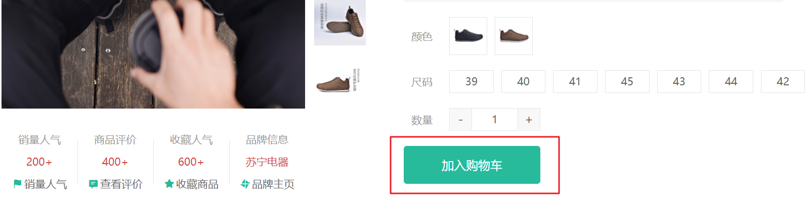
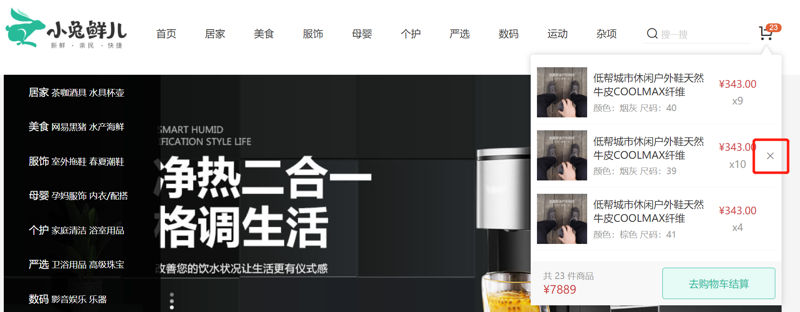
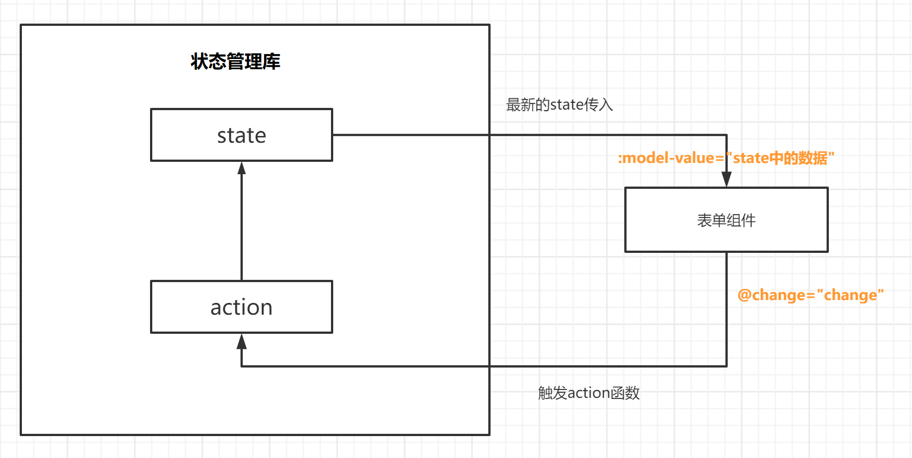
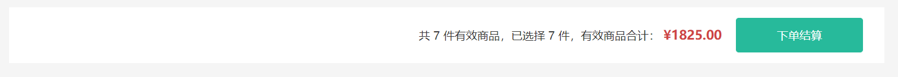
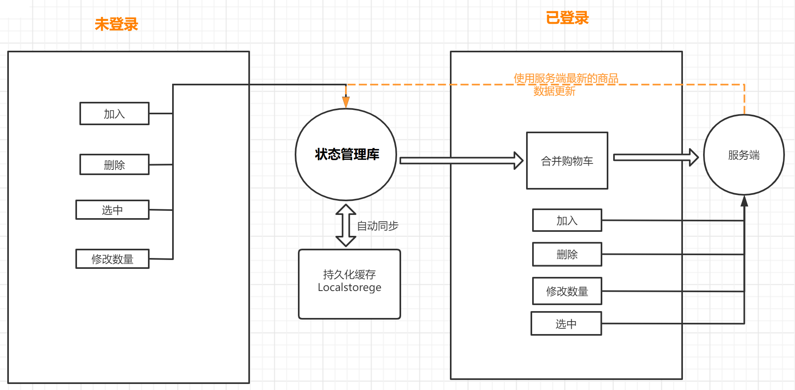

# 购物车模块

## 购物车功能分析


**思路流程**

1. 购物车的各种操作都会有两种状态的区分，登录和未登录
2. 所有操作都封装到 `Pinia` 中，组件只需要触发 `actions` 函数
3. 在`actions`中通过 `member` 信息去区分登录状态
   1. 已登录，通过调用接口去服务端操作，响应成功会通过 `actions` 修改 `Pinia` 中的数据即可
   2. 未登录时，通过 `actions` 修改 `Pinia` 中的数据即可， `Pinia` 实现持久化，同步保存在本地


## 准备购物车 Store

> 本节目标：为购物车业务定义专属的 Store，多个组件都要用到购物车数据。

`Pinia`  基本结构

```jsx
import { defineStore } from "pinia";

const useCartStore = defineStore("cart",{
  // 状态
  state: () => ({
    // 购物车列表
    list: [],
  }),
  // 计算
  getters: {},
  // 方法
  actions: {},
});

export default useCartStore;
```

📌注意：记得到 `src\store\index.ts` 合并新 `Store`

## 添加购物车功能实现-已登录

> 本节目标:   完成商品详情的添加购物车操作。



**实现步骤**

1. `actions` 中封装加入购物车的接口。
2. 在商品详情页实现添加逻辑触发 `actions` 函数调用接口。

### 接口：加入购物车

**接口基本信息**

**Path：** /member/cart

**Method：** POST

**请求参数**

**Body**

| 名称  | 类型    | 是否必须 | 默认值 | 备注  | 其他信息 |
| ----- | ------- | -------- | ------ | ----- | -------- |
| skuId | string  | 必须     |        | SKUID |          |
| count | integer | 必须     |        | 数量  |          |

文件：`src\store\modules\cart.ts`

```ts
const useCartStore = defineStore("cart", {
  ...
  // 方法
  actions: {
    // 加入购物车
    async addCart(data: { skuId: string; count: number }) {
      const res = await http("POST", "/member/cart", data);
      console.log("POST", "/member/cart", res.data.result);
    },
  },
});

```

### 点击按钮调用接口

在商品详情组件调用 `actions` 函数加入购物车。

1. 准备好加入购物车接口所需的参数：`skuId` 和 `count`
2. 点击按钮，调用接口。
2. 没有 `skuId` 需提示用户。

```vue
<script setup lang="ts">

// 商品数量
const count = ref(1);

// XtxSku 组件选中的商品信息
const skuId = ref("");
const changeSku = (value: SkuEmit) => {
  // 🔔存储 skuId 用于加入购物车
  skuId.value = value.skuId || "";
  // console.log("当前选择的SKU为信息为", value);
  ...省略
};

// 加入购物按钮点击
const { cart } = useStore();
const addCart = () => {
  // 没有 skuId，提醒用户并退出函数
  if (!skuId.value) {
    return message({ type: "warn", text: "请选择完整商品规则~" });
  }
  // 调用加入购物车接口
  cart.addCart({
    skuId: skuId.value,
    count: count.value,
  });
};
</script>

<template>
   ...
          <!-- 按钮组件 -->
          <XtxButton
            @click="addCart"
            size="middle"
            type="primary"
            style="margin-top: 20px"
          >
            加入购物车
          </XtxButton>
   ...
</template>
```


## 头部购物车实现-已登录


### 1. 基础布局

`本节目标:`  在网站头部购物车图片处，鼠标经过展示购物车列表

**实现步骤**

1. 提取头部购物车组件，完成基础布局
2. 通过 `getters` 返回有效商品总数和有效商品列表
3. 渲染头部购物车组件

**代码落地**

1）新建头部购物车组件

 `src/views/Layout/components/app-header-cart.vue`

```html
<script setup lang="ts">
//
</script>

<template>
  <div class="cart">
    <a class="curr" href="javascript:;">
      <i class="iconfont icon-cart"></i><em>20</em>
    </a>
    <div class="layer">
      <div class="list">
        <div class="item" v-for="i in 4" :key="i">
          <RouterLink to="">
            
            <div class="center">
              <p class="name ellipsis-2">
                和手足干裂说拜拜 ingrams手足皲裂修复霜
              </p>
              <p class="attr ellipsis">颜色：修复绿瓶 容量：150ml</p>
            </div>
            <div class="right">
              <p class="price">&yen;45.00</p>
              <p class="count">x2</p>
            </div>
          </RouterLink>
          <i class="iconfont icon-close-new"></i>
        </div>
      </div>
      <div class="foot">
        <div class="total">
          <p>共 3 件商品</p>
          <p>&yen;135.00</p>
        </div>
        <XtxButton type="plain">去购物车结算</XtxButton>
      </div>
    </div>
  </div>
</template>

<style scoped lang="less">
.cart {
  width: 50px;
  position: relative;
  z-index: 600;
  .curr {
    height: 32px;
    line-height: 32px;
    text-align: center;
    position: relative;
    display: block;
    .icon-cart {
      font-size: 22px;
    }
    em {
      font-style: normal;
      position: absolute;
      right: 0;
      top: 0;
      padding: 1px 6px;
      line-height: 1;
      background: @helpColor;
      color: #fff;
      font-size: 12px;
      border-radius: 10px;
      font-family: Arial;
    }
  }
  &:hover {
    .layer {
      opacity: 1;
      transform: none;
    }
  }
  .layer {
    opacity: 0;
    transition: all 0.2s 0.1s;
    transform: translateY(-200px) scale(1, 0);
    width: 400px;
    height: 400px;
    position: absolute;
    top: 50px;
    right: 0;
    box-shadow: 0 0 10px rgba(0, 0, 0, 0.2);
    background: #fff;
    border-radius: 4px;
    padding-top: 10px;
    &::before {
      content: '';
      position: absolute;
      right: 14px;
      top: -10px;
      width: 20px;
      height: 20px;
      background: #fff;
      transform: scale(0.6, 1) rotate(45deg);
      box-shadow: -3px -3px 5px rgba(0, 0, 0, 0.1);
    }
    .foot {
      position: absolute;
      left: 0;
      bottom: 0;
      height: 70px;
      width: 100%;
      padding: 10px;
      display: flex;
      justify-content: space-between;
      background: #f8f8f8;
      align-items: center;
      .total {
        padding-left: 10px;
        color: #999;
        p {
          &:last-child {
            font-size: 18px;
            color: @priceColor;
          }
        }
      }
    }
  }
  .list {
    height: 310px;
    overflow: auto;
    padding: 0 10px;
    &::-webkit-scrollbar {
      width: 10px;
      height: 10px;
    }
    &::-webkit-scrollbar-track {
      background: #f8f8f8;
      border-radius: 2px;
    }
    &::-webkit-scrollbar-thumb {
      background: #eee;
      border-radius: 10px;
    }
    &::-webkit-scrollbar-thumb:hover {
      background: #ccc;
    }
    .item {
      border-bottom: 1px solid #f5f5f5;
      padding: 10px 0;
      position: relative;
      i {
        position: absolute;
        bottom: 38px;
        right: 0;
        opacity: 0;
        color: #666;
        transition: all 0.5s;
      }
      &:hover {
        i {
          opacity: 1;
          cursor: pointer;
        }
      }
      a {
        display: flex;
        align-items: center;
        img {
          height: 80px;
          width: 80px;
        }
        .center {
          padding: 0 10px;
          width: 200px;
          .name {
            font-size: 16px;
          }
          .attr {
            color: #999;
            padding-top: 5px;
          }
        }
        .right {
          width: 100px;
          padding-right: 20px;
          text-align: center;
          .price {
            font-size: 16px;
            color: @priceColor;
          }
          .count {
            color: #999;
            margin-top: 5px;
            font-size: 16px;
          }
        }
      }
    }
  }
}
</style>

```

2）header组件使用购物车组件

 `src/views/Layout/components/header/index.vue`

```diff
<template>
  <header class="app-header">
    <div class="container">
      <h1 class="logo">
        <RouterLink to="/">小兔鲜</RouterLink>
      </h1>
      <AppHeaderNav />
      <div class="search">
        <i class="iconfont icon-search"></i>
        <input type="text" placeholder="搜一搜" />
      </div>
-      <div class="cart">
-        <a class="curr" href="#">
-          <i class="iconfont icon-cart"></i>
-          <em>2</em>
-        </a>
-      </div>  
+      <!-- 购物车 -->
+      <AppHeaderCart />
    </div>
  </header>
</template>
```

### 2. 准备数据

#### 接口：购物车列表

**Path：** /member/cart

**Method：** GET

请求参数：无

#### 封装 `action`

```ts
const useCartStore = defineStore('cart', {
  // ...
  actions: {
    // 获取购物车列表
    async getCartList() {
      // 已登录，调用接口
      const res = await http('GET', '/member/cart');
      console.log('GET', '/member/cart', res.data.result);
    },
  },
});

```

#### 定义TS类型声明文件

- 新建文件：`src\types\api\cart.d.ts`

```ts
// 单个购物车商品
export interface CartItem {
  id: string;
  skuId: string;
  name: string;
  attrsText: string;
  // specs: any[];
  picture: string;
  price: string;
  nowPrice: string;
  nowOriginalPrice: string;
  selected: boolean;
  stock: number;
  count: number;
  isEffective: boolean;
  // discount?: any;
  isCollect: boolean;
  postFee: number;
}

// 购物车列表
export type CartList = CartItem[];

```

- 整合导出：`src\types\index.d.ts`

```diff
// types 总管，统一导出类型声明
export * from './api/home';
export * from './api/category';
export * from './api/goods';
export * from './api/member';
export * from './api/qq';
+ export * from './api/cart';
```

- 指定类型  `src\store\modules\cart.ts` ，并完善加入购物车后，主动获取服务器最新列表。

```diff
+ import type { CartList } from '@/types';

const useCartStore = defineStore('cart', {
  // 状态
  state: () => ({
    // 购物车列表
-    list: [],
+    list: [] as CartList,
  }),
  // 方法
  actions: {
    // 加入购物车
    async addCart(data: { skuId: string; count: number }) {
      // 已登录，调用接口
      const res = await http('POST', '/member/cart', data);
      // 成功提示
      message({ type: 'success', text: '加入购物车成功' });
+      // 加入成功后，主动获取服务器最新列表
+      this.getCartList();
    },
    // 获取购物车列表
    async getCartList() {
      // 已登录，调用接口
-      const res = await http('GET', '/member/cart');
+      const res = await http<CartList>('GET', '/member/cart');
+      // 保存购物车列表数据
+      this.list = res.data.result;
    },
  },
});

```

### 3. 列表渲染与计算

#### 列表渲染

> 🚨注意：
>
> 1. 列表渲染的时候 `key` 值用 `skuId`，`RouterLink` 跳转的时候用产品 `id`
> 2. 购物车列表的  `price` 为加入时价格，最新价格是 `nowPrice`

```diff
<template>
  <div class="cart">
    <a class="curr" href="javascript:;">
      <i class="iconfont icon-cart"></i><em>2</em>
    </a>
    <div class="layer">
      <div class="list">
+        <div class="item" v-for="item in cart.list" :key="item.skuId">
+          <RouterLink :to="`/product/${item.id}`">
+            
+            <div class="center">
+              <p class="name ellipsis-2">
+                {{ item.name }}
+              </p>
+              <p class="attr ellipsis">{{ item.attrsText }}</p>
+            </div>
+            <div class="right">
+              <p class="price">&yen;{{ item.nowPrice }}</p>
+              <p class="count">x{{ item.count }}</p>
+            </div>
+          </RouterLink>
+          <i class="iconfont icon-close-new"></i>
+        </div>
      </div>
      <div class="foot">
        <div class="total">
          <p>共 3 件商品</p>
          <p>&yen;135.00</p>
        </div>
        <XtxButton type="plain">去购物车结算</XtxButton>
      </div>
    </div>
  </div>
</template>
```


#### 列表计算

说明：

1. 购物车的商品可能会下架，下架后就变成无效商品。
2. 商品会被其他用户购买，商品库存是动态变化的，没有库存的商品也为无效商品。

> 本节目标:  使用  `Pinia`  的 `getters` 属性计算 有效商品列表，有效商品总数，有效商品总金额。

1）使用 `getters` 得到有效商品列表，总数量， 总价

```ts
  getters: {
    // 计算有效商品列表 isEffective = true  filter
    effectiveList(state): CartList {
      return state.list.filter((item) => item.stock > 0 && item.isEffective);
    },
    // 有效商品总数量 把effctiveList中的每一项的count叠加起来
    effectiveListCount(): number {
      return this.effectiveList.reduce((sum, item) => sum + item.count, 0);
    },
    // 总钱数  = 所有单项的钱数累加  单项的钱数 = 数量 * 单价
    effectiveListPrice(): string {
      return this.effectiveList
        .reduce((sum, item) => sum + item.count * Number(item.nowPrice), 0)
        .toFixed(2);
    },
  },
```

2）渲染头部购物车模板

```diff
<template>
  <div class="cart">
    <a class="curr" href="javascript:;">
+      <i class="iconfont icon-cart"></i><em>{{ cart.effectiveListCount }}</em>
    </a>

    <!-- 显示隐藏的弹层 -->
    <div class="layer">
      <div class="list">
-        <div class="item" v-for="item in cart.list" :key="item.skuId">
+        <div class="item" v-for="item in cart.effectiveList" :key="item.skuId">
          <RouterLink :to="`/goods/${item.id}`">
            
            <div class="center">
              <p class="name ellipsis-2">{{ item.name }}</p>
              <p class="attr ellipsis">{{ item.attrsText }}</p>
            </div>
            <div class="right">
              <p class="price">&yen;{{ item.nowPrice }}</p>
              <p class="count">x{{ item.count }}</p>
            </div>
          </RouterLink>
          <i class="iconfont icon-close-new"></i>
        </div>
      </div>
      <div class="foot">
        <div class="total">
+          <p>共 {{ cart.effectiveListCount }} 件商品</p>
+          <p>&yen;{{ cart.effectiveListPrice }}</p>
        </div>
        <XtxButton type="plain">去购物车结算</XtxButton>
      </div>
    </div>
  </div>
</template>
```


### 4. 删除功能实现

> 本节目标:  实现头部购物车中的列表删除功能



#### 接口：删除/清空购物车商品

**基本信息**

**Path：** /member/cart

**Method：** DELETE

**请求参数**

**Body**

| 名称 | 类型      | 是否必须 | 默认值 | 备注       | 其他信息          |
| ---- | --------- | -------- | ------ | ---------- | ----------------- |
| ids  | string [] | 必须     |        | SKUID 集合 | item 类型: string |

**实现步骤**

1. 编写 actions 进行删除操作
2. 在头部购物车进行 action 调用
3. 删除请求发送后，主动获取购物车最新列表
4. 优化：购物车没有数据的时候，不需要渲染列表

**代码落地**

1） Pinia 的actions代码 

`src/store/modules/cart.js`

```js

  actions: {
    // 删除购物车商品
    async deleteCart(ids: string[]) {
      // 发送请求让后端删除商品
      await http("DELETE", "/member/cart", {ids: ids});
      // 🎯主动获取最新购物车列表
      this.getCartList();
      // 提示
      message({ type: 'success', text: '删除成功' });
    },
  },
```

3）小优化

> 购物车没有数据的时候，不显示移入鼠标效果

```html
<div class="layer" v-if="cart.effectiveList.length > 0">
```


## 列表购物车实现-已登录

### 1. 路由和组件

> 本节目标：完成购物车组件基础布局和路由配置与跳转链接。


1）新建购物车页面组件

 `src/views/Cart/index.vue`

```vue
<script setup lang="ts">
//
</script>

<template>
  <div class="xtx-cart-page">
    <div class="container">
      <XtxBread>
        <XtxBreadItem to="/">首页</XtxBreadItem>
        <XtxBreadItem>购物车</XtxBreadItem>
      </XtxBread>
      <div class="cart">
        <table>
          <thead>
            <tr>
              <th width="120"><XtxCheckBox>全选</XtxCheckBox></th>
              <th width="400">商品信息</th>
              <th width="220">单价</th>
              <th width="180">数量</th>
              <th width="180">小计</th>
              <th width="140">操作</th>
            </tr>
          </thead>
          <!-- 有效商品 -->
          <tbody>
            <tr v-for="i in 3" :key="i">
              <td><XtxCheckBox :model-value="true" /></td>
              <td>
                <div class="goods">
                  <RouterLink to="/">
                    
                  </RouterLink>
                  <div>
                    <p class="name ellipsis">
                      和手足干裂说拜拜 ingrams手足皲裂修复霜
                    </p>
                    <p class="attr">商品规格</p>
                  </div>
                </div>
              </td>
              <td class="tc">
                <p>&yen;200.00</p>
              </td>
              <td class="tc">
                <XtxCount :model-value="1" />
              </td>
              <td class="tc"><p class="f16 red">&yen;200.00</p></td>
              <td class="tc">
                <p><a href="javascript:;">移入收藏夹</a></p>
                <p><a class="green" href="javascript:;">删除</a></p>
                <p><a href="javascript:;">找相似</a></p>
              </td>
            </tr>
          </tbody>
        </table>
      </div>
      <!-- 操作栏 -->
      <div class="action">
        <div class="batch"></div>
        <div class="total">
          共 7 件有效商品，已选择 2 件，商品合计：
          <span class="red">¥400</span>
          <XtxButton type="primary">下单结算</XtxButton>
        </div>
      </div>
    </div>
  </div>
</template>

<style scoped lang="less">
.tc {
  text-align: center;
  .xtx-numbox {
    margin: 0 auto;
    width: 120px;
  }
}
.red {
  color: @priceColor;
}
.green {
  color: @xtxColor;
}
.f16 {
  font-size: 16px;
}
.goods {
  display: flex;
  align-items: center;
  img {
    width: 100px;
    height: 100px;
  }
  > div {
    width: 280px;
    font-size: 16px;
    padding-left: 10px;
    .attr {
      font-size: 14px;
      color: #999;
    }
  }
}
.action {
  display: flex;
  background: #fff;
  margin-top: 20px;
  height: 80px;
  align-items: center;
  font-size: 16px;
  justify-content: space-between;
  padding: 0 30px;
  .xtx-checkbox {
    color: #999;
  }
  .batch {
    a {
      margin-left: 20px;
    }
  }
  .red {
    font-size: 18px;
    margin-right: 20px;
    font-weight: bold;
  }
}
.tit {
  color: #666;
  font-size: 16px;
  font-weight: normal;
  line-height: 50px;
}
.xtx-cart-page {
  .cart {
    background: #fff;
    color: #666;
    table {
      border-spacing: 0;
      border-collapse: collapse;
      line-height: 24px;
      th,
      td {
        padding: 10px;
        border-bottom: 1px solid #f5f5f5;
        &:first-child {
          text-align: left;
          padding-left: 30px;
          color: #999;
        }
      }
      th {
        font-size: 16px;
        font-weight: normal;
        line-height: 50px;
      }
    }
  }
}
</style>

```

2）准备路由

```jsx
{
  path: '/cart',
  component: () => import('@/views/Cart/index.vue')
}
```

3)  点击购物车按钮跳转

```jsx
<RouterLink to="/cart" class="curr">
  <i class="iconfont icon-cart"></i><em>{{ cart.effectiveListCount }}</em>
</RouterLink>


<XtxButton @click="$router.push('/cart')" type="plain">去购物车结算</XtxButton>
```


### 2.列表数据展示

> `本节目标:`  实现购物车商品列表展示功能

1) 渲染有效商品

- 最新价格是 `nowPrice`
- 计数器需要设置最大库存值 `max`
- 价格小计需要 `toFixed(2)` 保留两位小数

```html
<!-- 有效商品 -->
<tbody>
  <tr v-for="goods in cart.effectiveList" :key="goods.skuId">
    <td><XtxCheckBox :model-value="goods.selected" /></td>
    <td>
      <div class="goods">
        <RouterLink :to="`/product/${goods.id}`">
          
        </RouterLink>
        <div>
          <p class="name ellipsis">{{ goods.name }}</p>
          <p class="attr">{{ goods.attrsText }}</p>
        </div>
      </div>
    </td>
    <td class="tc">
      <p>&yen;{{ goods.nowPrice }}</p>
    </td>
    <td class="tc">
      <XtxCount :model-value="goods.count" :max="goods.stock" />
    </td>
    <td class="tc">
      <p class="f16 red">
        &yen;{{ (Number(goods.nowPrice) * goods.count).toFixed(2) }}
      </p>
    </td>
    <td class="tc">
      <p><a class="green" href="javascript:;">删除</a></p>
    </td>
  </tr>
</tbody>
```

### 3. 删除操作实现

> `本节目标:`  实现商品删除功能

**思路分析**

1. 点击删除按钮记录当前点击的商品 `skuId`
2. 调用 action 函数实现删除即可。

**代码落地**

> 删除按钮绑定事件触发删除action函数

```jsx
<td class="tc">
  <p><a @click="cart.deleteCart([goods.skuId])" class="green" href="javascript:;">删除</a></p>
</td>
```

删除光购物车之后使用元素占位

```html
<!-- 删除光购物车之后使用元素占位 -->
<tr>
  <td colspan="6">
    <div class="cart-none" style="text-align: center">
      
      <p>购物车内暂时没有商品</p>
      <div class="btn" style="margin: 20px">
        <XtxButton type="primary">
          继续逛逛
        </XtxButton>
      </div>
    </div>
  </td>
</tr>
```


### 4. 单选操作实现🚨

> `本节目标:`  实现的商品单选功能
>
> 从单选开始，我们进入到一个 `Pinia`  + 表单数据的交互功能实现，这里面有些小坑，我们先来看一下



**思路分析**

1. 通过切换选择框组件获得当前的最新状态
2. 获取点击单选框的商品 `skuId`
3. 获取点击单选框的`selected`的最新状态


#### 接口：修改购物车商品

**Path：** /member/cart/:id

**Method：** PUT

**请求参数**

**路径参数**

| 参数名称 | 示例 | 备注  |
| -------- | ---- | ----- |
| id       |      | SKUID |

**Body**

| 名称     | 类型    | 是否必须 | 默认值 | 备注     | 其他信息 |
| -------- | ------- | -------- | ------ | -------- | -------- |
| selected | boolean | 非必须   |        | 是否选中 |          |
| count    | integer | 非必须   |        | 数量     |          |

**代码落地**

1）定义 `Pinia` 中操作 selected 的 action 函数

```ts

const useCartStore = defineStore('cart', {
  // 方法
  actions: {
    // 修改购物车商品(是否选中,商品数量)
    async updateCart( skuId: string,data: { selected?: boolean; count?: number } ) {
      // 已登录，调用接口
      const res = await http('PUT', `/member/cart/${skuId}`, data);
      // 主动获取最新列表
      this.getCartList();
    },
  },
});

```

2）获取到当前选择框的最新状态

```tsx
<XtxCheckBox
  :model-value="item.selected"
  @update:model-value="cart.updateCart(item.skuId, { selected: $event })"
/>
```


### 5. 修改数量实现

> `本节目标:`  实现商品数量修改功能

**思路分析**

1. 参考单选操作实现。
2. 🔔温馨提醒：XtxUI 组件库为了方便开发者使用，提供两种自定义事件获取值 @update:model-value 和 @change 功能是等价的。

**代码落地**

2）绑定事件触发 action

```tsx
<td class="tc">
  <XtxCount
    :max="goods.stock"
    :model-value="goods.count"
    @change="cart.updateCart(item.skuId, { count: $event })"
  />
</td>
```

### 6. 全选切换实现🚨🚨

> `本节目标:`  实现商品全选切换功能。

#### 接口：购物车全选/取消全选

**Path：** /member/cart/selected

**Method：** PUT

**接口描述：**

ids参数如果不传，表示用户访问的是全选和取消全选操作，后端根据 selected 确定用户是全选和取消全选

**请求参数**

**Body**

| 名称     | 类型      | 是否必须 | 默认值 | 备注      | 其他信息          |
| -------- | --------- | -------- | ------ | --------- | ----------------- |
| selected | boolean   | 必须     |        | 是否选中  |                   |
| ids      | string [] | 非必须   |        | skuId集合 | item 类型: string |
| ├─       |           | 非必须   |        | skuId     |                   |

**思路分析**

1. 通过 `getters` 计算出选中状态 （注意： `Pinia` 的 `getters` 没有 `set` ）
2. 封装调用修改全选接口的 `actions` 。
3. 实现全选效果。🚨🚨
   1. 方案1：`:model-value` 和 `@update:model-value` 组合。
   2. 方案2： `v-model` 和 `computed` 组合。

**代码落地**

1）在 `src\store\modules\cart.ts` 中封装 `actions`  和 `getters` 。

```jsx
const useCartStore = defineStore("cart", {
  // 计算
  getters: {
    ...
    // 计算全选状态
    isAllSelected(): boolean {
      return (
        this.effectiveList.length > 0 &&
        this.effectiveList.every((v) => v.selected)
      );
    },
  },
  // 方法
  actions: {
    ...
    // 购物车全选/取消全选
    async updateCartAllSelected(data: { selected: boolean; ids?: string[] }) {
      // 已登录，调用接口
      const res = await http("PUT", "/member/cart/selected", data);
      // 获取购物车列表
      this.getCartList();
    },
  },
});

```

2）页面中调用

```vue
  <XtxCheckBox
    :model-value="cart.isAllSelected"
    @update:model-value="cart.updateCartAllSelected({ selected: $event })"
  >
    全选
  </XtxCheckBox>
```

### 7. 操作栏数据计算和渲染



```jsx
// 已选择的列表
selectedList ():CartList {
  return this.effectiveList.filter(item => item.selected)
},
// 已选择的商品总数
selectedListCount ():number {
  return this.selectedList.reduce((sum, item) => sum + item.count, 0)
},
// 已选择的列表总价
selectedListPrice ():string {
  return this.selectedList.reduce((sum, item) => sum + item.count * Number(item.nowPrice), 0).toFixed(2)
}
```

```vue
<!-- 操作栏 -->
<div class="action">
  <div class="total">
    共 {{ cart.effectiveListCount }} 件有效商品，已选择 {{ cart.selectedListCount }} 件，有效商品合计：
    <span class="red">¥{{ cart.selectedListPrice }}</span>
    <XtxButton type="primary">下单结算</XtxButton>
  </div>
</div>
```


## 【转折点】退出登录

> `本节目标:`  退出登录，为实现未登录版购物车做准备。



### 问题思考

- 思考1：退出登录后，直接调用购物车系列接口会报错，怎么办？
  - 调用接口前，判断是否已登录。
- 思考2：退出登录后，为什么还能看到购物车数据，要怎么处理？
  - 数据存储到 `Pinia` 中，退出登录后要清空购物车列表。

- 思考3：如何判断用户登录还是未登录，要如何处理？？
  - 获取 `member` 模块的 `是否有 token` 即可。
- 思考4：根据上面需求，该如何设计程序？
  - 给操作购物车数据的 `actions` 内部都添加判断，已登录调用接口，未登录本地操作。

### 退出登录清空购物车

购物车模块：`src\store\modules\cart.ts`

```diff
const useCartStore = defineStore("cart", {
  // 方法
  actions: {
    ...
+    // 清空购物车
+    clearCart() {
+      // 退出登录需清空购物车
+      this.list = [];
+    },
  },
});
```

会员中心模块：`src\store\modules\member.ts`

```diff
const useMemberStore = defineStore("member",{
  ...
  actions: {
    ...
    // 退出登录
    async logout() {
      this.profile = {} as Profile;
      clearStorageProfile();
      router.push("/login");
+      // 退出登录-主动清空购物车数据
+      const { cart } = useStore();
+      cart.clearCart();
    },
  },
});
```

### 已登录和未登录程序设计


```diff
const useCartStore = defineStore("cart",{
  ...
  // 计算
  getters: {
+    // 🔑登录状态，购物车模块缓存 member.isLogin 登录状态
+    isMemberLogin(): boolean {
+      const { member } = useStore();
+      return member.isLogin;
+    },
    ...
  },
  // 方法
  actions: {
    // 加入购物车
    async addCart(data: CartItem) {
+      // 🚨判断登录状态
+      if (this.isMemberLogin) {
+        // 1️⃣已登录情况 - 调用接口
          const { skuId, count } = data;
          const res = await http("POST", "/member/cart", { skuId, count });
          this.getCartList();
+      } else {
+        // 2️⃣未登录情况 - 操作本地数据(相当于高级版todos)
+      }
      message({ type: "success", text: "添加成功~" });
    }
    ...
  },
});

export default useCartStore;

```

退出登录还需要清空 `Pinia` 中的购物车数据。

## 购物车操作-未登录

### 1. 加入购物车🚨🚨🚨

> `本节目标:`  实现加入购物车业务。

**实现步骤**

1. 点击加入购物车的时候，从商品详情中收集购物车商品展示所需数据。（🚨🚨字段很多，操作小心）
2. actions 中完成添加操作（未登录）。

**落地代码**

商品详情页：`src\views\Goods\index.vue`

```vue
<script setup lang="ts">
...
// 选中的商品规格文本
const attrsText = ref("");
// 加入购物按钮点击
const addCart = () => {
  // 没有 skuId，提醒用户并退出函数
  if (!skuId.value) {
    return message({ type: "warn", text: "请选择完整商品规则~" });
  }

  // 🚨🚨 高级版todos而已，但是数据收集字段名很多坑，小心操作，容易出错
  if (!goods.value) return;
  const cartItem = {
    // 第一部分：商品详情中有的
    id: goods.value.id, // 商品id
    name: goods.value.name, // 商品名称
    picture: goods.value.mainPictures[0], // 图片
    price: goods.value.oldPrice, // 旧价格
    nowPrice: goods.value.price, // 新价格
    stock: goods.value.inventory, // 库存
    // 第二部分：商品详情中没有的，自己通过响应式数据收集
    count: count.value, // 商品数量
    skuId: skuId.value, // skuId
    attrsText: attrsText.value, // 商品规格文本
    // 第三部分：设置默认值即可
    selected: true, // 默认商品选中
    isEffective: true, // 默认商品有效
  } as CartItem;  // 📌 as 断言防止类型报错
 
  console.log('📌cartItem 数据终于准备完毕了', cartItem);

  // 调用加入购物车接口
  cart.addCart(cartItem);
};
</script>
```

购物车模块：`src/store/modules/cart.js`

```jsx
actions: {
  // 加入购物车
  async addCart(data: CartItem) {
    // 解构出接口所需参数
    const { skuId, count } = data;
    if (this.isMemberLogin) {
      // 已登录情况 - 调用接口
      const res = await http("POST", "/member/cart", { skuId, count });
      this.getCartList();
    } else {
      // 未登录情况 - 操作本地数据(相当于高级版todos)
      // 添加商品分两种情况：
      const cartItem = this.list.find((item) => item.skuId === skuId);
      if (cartItem) {
        // 情况1：已添加过的的商品，累加数量即可
        cartItem.count += count;
      } else {
        // 情况2：新添加的商品，前添加到数组中
        this.list.unshift(data);
      }
    }
    message({ type: "success", text: "添加成功~" });
  },
}
```


### 2. 删除购物车

> `本节目标:`  实现删除操作。

**实现步骤**

- actions 中完成删除操作（未登录）。

**落地代码**

完善业务：`src/store/modules/cart.js`

```diff
actions: {    
    // 删除购物车商品
    async deleteCart(data: { ids: string[] }) {
      // 是否登录两种情况
      if (this.isMemberLogin) {
        // 已登录，调用接口
        const res = await http('DELETE', '/member/cart', data);
        console.log('DELETE', '/member/cart', res.data.result);
        // 主动获取最新列表
        this.getCartList();
        // 成功提示
        message({ type: 'success', text: '删除成功' });
      } else {
        // 未登录，操作本地数据(相当于高级版todos)
+        this.list = this.list.filter((v) => !data.ids.includes(v.skuId));
      }
    },
}
```

### 3. 购物车列表持久化存储

> `本节目标:`  实现 `Pinia` 购物车列表的持久化存储。

**实现步骤**

- 前面我们已经安装了 `Pinia` 持久化存储插件，在模块中开启插件功能即可。

**代码落地**

`src/store/modules/cart.js`

```diff
const useCartStore = defineStore("cart", {
+  // 🔔购物车开启持久化
+  persist: true,
  ...
});
```

步骤验证：开启持久化设置后，打开浏览器本地存储面板检查是否生效。


### 4. 选中状态切换&修改数量

> `本节目标:`  实现商品选中状态的切换和修改商品数量。

**实现步骤**

- actions 中完成修改操作（未登录）。
- 注意点：由于修改数量和修改选择状态都是同一个 action 完成，所以本地修改前需要判断。

**代码落地**

完善业务：`src/store/modules/cart.js`

```diff
actions: { 
    // 修改购物车商品-修改选中-修改数量
    async updateCart( skuId: string,data: { selected?: boolean; count?: number } ) {
      if (this.isMemberLogin) {
        // 已登录情况 - 调用接口
        await http("PUT", `/member/cart/${skuId}`, data);
        this.getCartList();
      } else {
        // 未登录情况 - 操作本地数据(相当于高级版todos)
+        // 根据 skuId 查找待修改的商品项
+        const cartItem = this.list.find((v) => v.skuId === skuId);
+        // 如果能查找到
+        if (cartItem) {
+          // 解构出需要修改的字段
+          const { selected, count } = data;
+          // 由于修改数量和修改选择状态都是同一个 action 完成，所以本地修改前需要判断
+          if (count !== undefined) cartItem.count = count;
+          if (selected !== undefined) cartItem.selected = selected;
+        }
      }
    },
}
```


### 5. 全选切换-本地

>  `本节目标:`  实现商品选中状态的切换。

**实现步骤**

- actions 中完成全选切换操作（未登录）。

**代码落地**

完善业务：`src/store/modules/cart.js`

```diff
actions: { 
    // 购物车全选/取消全选
    async updateCartAllSelected(data: { selected: boolean; ids?: string[] }) {
      if (this.isMemberLogin) {
        // 已登录情况 - 调用接口
        await http("PUT", "/member/cart/selected", data);
        this.getCartList();
      } else {
        // 未登录情况 - 操作本地数据(相当于高级版todos)
+        this.list.forEach((item) => {
+          item.selected = data.selected;
+        });
      }
    },
}
```


### 6. 更新本地购物车商品关键信息🚨🚨

> **本节目标：** 未登录情况下，更新本地购物车商品关键信息。
>
> 原因解释：本地存储的库存信息和价格**不是服务器最新的**，所以需**要主动更新**最新商品关键信息。
>
> 关键信息主要包括：商品最新价格，商品最新库存，商品是否还有效。

#### 接口：查询商品库存价格信息

**Path：** /goods/stock/:id

**Method：** GET

**请求参数**

**路径参数**

| 参数名称 | 示例                | 备注   |
| -------- | ------------------- | ------ |
| id       | 1352956998412406785 | SKU_ID |

**实现思路**

1. 获取购物车列表的 action 中，**未登录情况** 下主动获取商品库存价格。
1. 购物车的商品库存，价格，是否有效，更新成最新的。

**代码落地**

完善业务：`src/store/modules/cart.js`

```diff
actions: { 
    // 获取购物车列表
    async getCartList() {
      if (this.isMemberLogin) {
        // 已登录情况 - 调用接口
        const res = await http<CartList>("GET", "/member/cart");
        this.list = res.data.result;
      } else {
+        // 🚨未登录情况，首次打开时需查询购物车列表商品最新价格，库存，是否有效
+        this.list.forEach(async (item) => {
+          // 根据 skuId 获取最新商品信息
+          const res = await http<CartItem>("GET", `/goods/stock/${item.skuId}`);
+          // 保存最新商品信息
+          const newCartItemInfo = res.data.result;
+          // 更新商品现价
+          item.nowPrice = newCartItemInfo.nowPrice;
+          // 更新商品库存
+          item.stock = newCartItemInfo.stock;
+          // 更新商品是否有效
+          item.isEffective = newCartItemInfo.isEffective;
+        });
      }
    },
}
```


## 两个版本购物车同步

### 1. 登录后合并购物车🚨🚨

`本节目标:`  登录后把本地的购物车数据合并到后端服务

> 本地已经存好的所有购物车列表数据都需要和服务器合并一下。

**实现思路**

1. 编写并调用  合并购物车的 `action` 函数 （将对于购物车的处理，统一到 `Pinia` 中）

   思考：在哪调用 合并购物车的 `action` 函数？

   答：登录完成后。

### 接口：合并购物车

**基本信息**

**Path：** /member/cart/merge

**Method：** POST

请求参数

**Body**

| 名称        | 类型      | 是否必须 | 默认值 | 备注          | 其他信息          |
| ----------- | --------- | -------- | ------ | ------------- | ----------------- |
|             | object [] | 必须     |        | 购物车sku集合 | item 类型: object |
| ├─ skuId    | string    | 必须     |        | skuId         |                   |
| ├─ selected | boolean   | 必须     |        | 是否选中      |                   |
| ├─ count    | integer   | 必须     |        | 数量          |                   |

### 登录后合并购物车

**落地代码**

1）编写合并购物车的 `actions` 函数

- 映射接口所需参数
- 调用合并购物车的接口
- 主动获取最新列表

购物车模块：`src/store/modules/cart.js`

```js
actions: {
    // 合并购物车
    async mergeLocalCart() {
      // 映射接口所需参数
      const data = this.list.map(({ skuId, selected, count }) => ({
        skuId,
        selected,
        count,
      }));
      // 调用合并购物车的接口
      await http("POST", "/member/cart/merge", data);
      // 合并成功，重新获取购物车列表
      this.getCartList();
    },
}
```

2）在登录完成功后，调用合并购物车 `actions`  函数

用户模块：`src\store\modules\member.ts`

```diff
const useMemberStore = defineStore("member", {
  ...
  // 方法
  actions: {
    // 登录成功通用业务
    loginSuccess(profile: Profile) {
      // 登录成功后的业务
      // 1. 成功提示
      message({ type: 'success', text: '登录成功~' });
      // 2. 存储数据
      this.profile = profile;
      // 获取目标页面 target，如果没有目标页，则设置默认值 '/' 去首页
      const { target = '/' } = router.currentRoute.value.query;
      // 3. 跳转页面
      router.push(target as string);
+      // 4. 合并购物车
+      const { cart } = useStore();
+      cart.mergeLocalCart();
    },
  },
});

```


