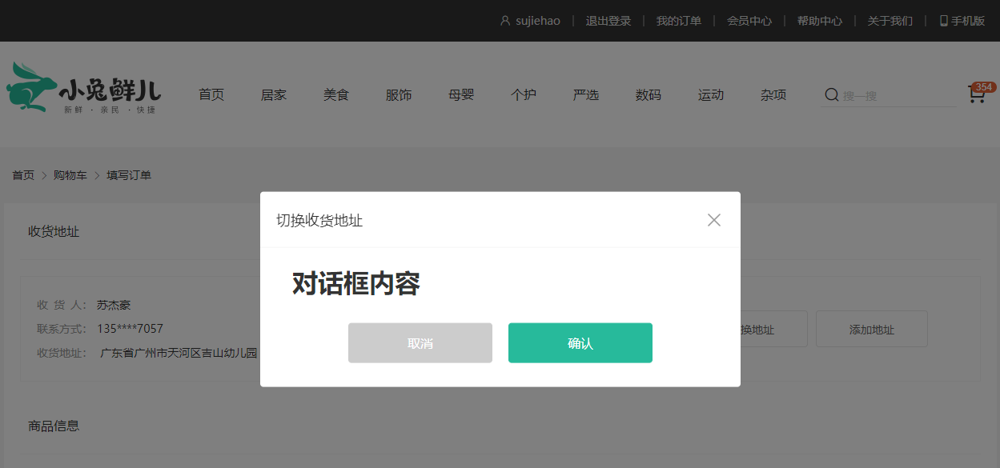
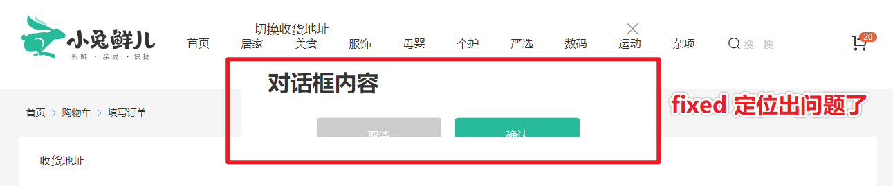
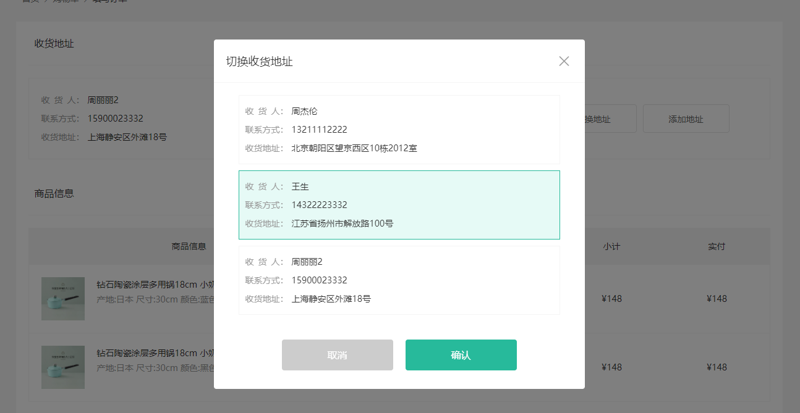
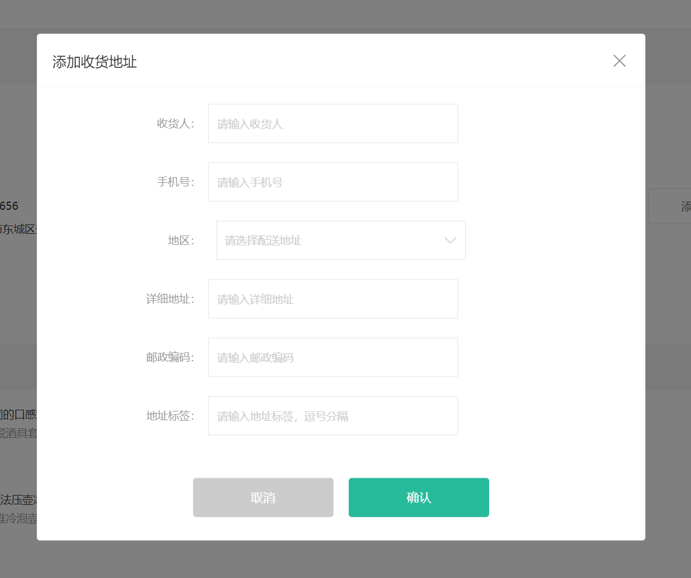

# 填写订单模块


## 填写订单实现

> `本节目标:`  实现填写订单跳转

### 填写订单页组件和路由

1）准备填写订单页面

新建页面组件：`src/views/Checkout/index.vue`

```html
<script setup lang="ts">
//
</script>

<template>
  <div>填写订单页面</div>
</template>

```

2）二级路由：`router/index.ts`

```js
  {
    path: '/',
    component: Layout,
    children: [
      ...
      {
        path: "/member/checkout",
        component: () => import("@/views/Checkout/index.vue"),
      },
    ]
  },
```

### 购物车页结算按钮

**思路分析**

购物车页，填写订单环节的主要任务就是做各种判断，其中包括

1. 判断是否选中商品，没选中商品提醒。

2. 判断是否登录，未登录提醒。

   满足以上条件跳转去填写订单页面。

**落地代码**

`src\views\Cart\index.vue`

```jsx
// 点击填写订单按钮
const router = useRouter();
const goToCheckout = () => {
  // 1. 判断选中数量不能为零
  if (!selectedListCount.value) {
    return message({ type: "warn", text: "请选择商品下单" });
  }
  // 2. 判断是否登录
  if (!member.isLogin) {
    return message({ type: "warn", text: "请先登录~" });
  }
  // 跳转到填写订单
  router.push("/member/checkout");
};


<XtxButton type="primary" @click="goToCheckout()">填写订单</XtxButton>
```

## 获取预付订单数据

> `本节目标:` 获取预付订单数据并定义TS类型声明文件。

### 接口：生成订单(即填写订单或结算页)

**基本信息**

**Path：** /member/order/pre

**Method：** GET

**请求参数**

无

### 获取订单数据

**实现步骤**

1. 准备订单的 Store
2. 定义获取结算信息 API 接口
3. 页面组件获取数据，渲染页面内容

**代码落地** 

新建 Store： `src/store/modules/order.ts`  

```ts
import { defineStore } from 'pinia';

// 定义 Store 时建议遵循命名规范 useXxxStore
const useOrderStore = defineStore('order', {
  // state 相当于 data
  state: () => ({}),
  // getters 相当于 computed
  getters: {},
  // actions 相当于 methods
  actions: {},
});

export default useOrderStore;
```

合并 Store，`src/store/index.ts`

```diff
import useOrderStore from './modules/order';

const useStore = defineStore('main', {
  state: () => ({
     // ...代码省略
    order: useOrderStore(),
  }),
});
```

准备 actions 

```ts
 actions: {
    async getCheckoutInfo() {
      const res = await http('GET', '/member/order/pre');
      console.log('GET', '/member/order/pre', res);
    },
  },
```

组件中调用

```html
<script setup lang="ts">
const { order } = useStore();
order.getCheckoutInfo();
</script>
```

### 定义 TS 类型文件

新建类型文件 `src\types\modules\order.d.ts`

```ts
export interface UserAddresse {
  id: string;
  receiver: string;
  contact: string;
  provinceCode: string;
  cityCode: string;
  countyCode: string;
  address: string;
  isDefault: number;
  fullLocation: string;
  postalCode: string;
  addressTags: string;
}

export interface Good {
  id: string;
  name: string;
  picture: string;
  count: number;
  skuId: string;
  attrsText: string;
  price: string;
  payPrice: string;
  totalPrice: string;
  totalPayPrice: string;
}

export interface Summary {
  goodsCount: number;
  totalPrice: number;
  totalPayPrice: number;
  postFee: number;
  discountPrice: number;
}

// 生成订单
export interface CheckoutInfo {
  userAddresses: UserAddresse[];
  goods: Good[];
  summary: Summary;
}
```

合并导出 `src\types\index.d.ts`

```tsx
// 统一导出所有自定义的类型文件
...
export * from "./api/order";
```

## 填写订单数据渲染

> 本节目标：完成结算页静态结构和数据渲染

### 静态结构

1）准备结构 `src/views/Checkout/index.vue` 

```html

<template>
  <div class="xtx-pay-checkout-page">
    <div class="container">
      <XtxBread>
        <XtxBreadItem to="/">首页</XtxBreadItem>
        <XtxBreadItem to="/cart">购物车</XtxBreadItem>
        <XtxBreadItem>填写订单</XtxBreadItem>
      </XtxBread>
      <div class="wrapper">
        <!-- 收货地址 -->
        <h3 class="box-title">收货地址</h3>
        <div class="box-body">
          <div class="address">
            <div class="text">
              <ul>
                <li><span>收&ensp;货&ensp;人：</span>朱超</li>
                <li><span>联系方式：</span>132****2222</li>
                <li>
                  <span>收货地址：</span>海南省三亚市解放路108号物质大厦1003室
                </li>
              </ul>
              <!-- <div class="none">您需要先添加收货地址才可提交订单。</div> -->
            </div>
            <div class="action">
              <XtxButton class="btn">切换地址</XtxButton>
              <XtxButton class="btn">添加地址</XtxButton>
            </div>
          </div>
        </div>
        <!-- 商品信息 -->
        <h3 class="box-title">商品信息</h3>
        <div class="box-body">
          <table class="goods">
            <thead>
              <tr>
                <th width="520">商品信息</th>
                <th width="170">单价</th>
                <th width="170">数量</th>
                <th width="170">小计</th>
                <th width="170">实付</th>
              </tr>
            </thead>
            <tbody>
              <tr v-for="item in 4" :key="item">
                <td>
                  <a href="javascript:;" class="info">
                    
                    <div class="right">
                      <p>轻巧多用锅雪平锅 麦饭石不粘小奶锅煮锅</p>
                      <p>颜色：白色 尺寸：10cm 产地：日本</p>
                    </div>
                  </a>
                </td>
                <td>&yen;100.00</td>
                <td>2</td>
                <td>&yen;200.00</td>
                <td>&yen;200.00</td>
              </tr>
            </tbody>
          </table>
        </div>
        <!-- 配送时间 -->
        <h3 class="box-title">配送时间</h3>
        <div class="box-body">
          <a class="my-btn active" href="javascript:;"
            >不限送货时间：周一至周日</a
          >
          <a class="my-btn" href="javascript:;">工作日送货：周一至周五</a>
          <a class="my-btn" href="javascript:;">双休日、假日送货：周六至周日</a>
        </div>
        <!-- 支付方式 -->
        <h3 class="box-title">支付方式</h3>
        <div class="box-body">
          <a class="my-btn active" href="javascript:;">在线支付</a>
          <a class="my-btn" href="javascript:;">货到付款</a>
          <span style="color: #999">货到付款需付5元手续费</span>
        </div>
        <!-- 金额明细 -->
        <h3 class="box-title">金额明细</h3>
        <div class="box-body">
          <div class="total">
            <dl>
              <dt>商品件数：</dt>
              <dd>5件</dd>
            </dl>
            <dl>
              <dt>商品总价：</dt>
              <dd>¥5697.00</dd>
            </dl>
            <dl>
              <dt>运<i></i>费：</dt>
              <dd>¥0.00</dd>
            </dl>
            <dl>
              <dt>应付总额：</dt>
              <dd class="price">¥5697.00</dd>
            </dl>
          </div>
        </div>
        <!-- 提交订单 -->
        <div class="submit">
          <XtxButton type="primary">提交订单</XtxButton>
        </div>
      </div>
    </div>
  </div>
</template>

<style scoped lang="less">
.wrapper {
  background: #fff;
  padding: 0 20px;
  .box-title {
    font-size: 16px;
    font-weight: normal;
    padding-left: 10px;
    line-height: 70px;
    border-bottom: 1px solid #f5f5f5;
  }
  .box-body {
    padding: 20px 0;
  }
}
.address {
  border: 1px solid #f5f5f5;
  display: flex;
  align-items: center;
  .text {
    flex: 1;
    min-height: 90px;
    display: flex;
    align-items: center;
    .none {
      line-height: 90px;
      color: #999;
      text-align: center;
      width: 100%;
    }
    > ul {
      flex: 1;
      padding: 20px;
      li {
        line-height: 30px;
        span {
          color: #999;
          margin-right: 5px;
          > i {
            width: 0.5em;
            display: inline-block;
          }
        }
      }
    }
    > a {
      color: @xtxColor;
      width: 160px;
      text-align: center;
      height: 90px;
      line-height: 90px;
      border-right: 1px solid #f5f5f5;
    }
  }
  .action {
    width: 420px;
    text-align: center;
    .btn {
      width: 140px;
      height: 46px;
      line-height: 44px;
      font-size: 14px;
      &:first-child {
        margin-right: 10px;
      }
    }
  }
}
.goods {
  width: 100%;
  border-collapse: collapse;
  border-spacing: 0;
  .info {
    display: flex;
    text-align: left;
    img {
      width: 70px;
      height: 70px;
      margin-right: 20px;
    }
    .right {
      line-height: 24px;
      p {
        &:last-child {
          color: #999;
        }
      }
    }
  }
  tr {
    th {
      background: #f5f5f5;
      font-weight: normal;
    }
    td,
    th {
      text-align: center;
      padding: 20px;
      border-bottom: 1px solid #f5f5f5;
      &:first-child {
        border-left: 1px solid #f5f5f5;
      }
      &:last-child {
        border-right: 1px solid #f5f5f5;
      }
    }
  }
}
.my-btn {
  width: 228px;
  height: 50px;
  border: 1px solid #e4e4e4;
  text-align: center;
  line-height: 48px;
  margin-right: 25px;
  color: #666666;
  display: inline-block;
  &.active,
  &:hover {
    border-color: @xtxColor;
  }
}
.total {
  dl {
    display: flex;
    justify-content: flex-end;
    line-height: 50px;
    dt {
      i {
        display: inline-block;
        width: 2em;
      }
    }
    dd {
      width: 240px;
      text-align: right;
      padding-right: 70px;
      &.price {
        font-size: 20px;
        color: @priceColor;
      }
    }
  }
}
.submit {
  text-align: right;
  padding: 60px;
  border-top: 1px solid #f5f5f5;
}
// 对话框地址列表
.xtx-dialog {
  .addressWrapper {
    max-height: 500px;
    overflow-y: auto;
  }
  .text {
    flex: 1;
    min-height: 90px;
    display: flex;
    align-items: center;
    &.item {
      border: 1px solid #f5f5f5;
      margin-bottom: 10px;
      cursor: pointer;
      &.active,
      &:hover {
        border-color: @xtxColor;
        background: lighten(@xtxColor, 50%);
      }
      > ul {
        padding: 10px;
        font-size: 14px;
        line-height: 30px;
      }
    }
  }
}
</style>

```

### 渲染基本信息

**渲染商品列表**

```html
<!--商品信息 -->
<tbody>
  <tr v-for="item in checkoutInfo.goods" :key="item.skuId">
    <td>
      <RouterLink :to="`/goods/${item.id}`" class="info">
        
        <div class="right">
          <p>{{ item.name }}</p>
          <p>{{ item.attrsText }}</p>
        </div>
      </RouterLink>
    </td>
    <td>&yen;{{ item.payPrice }}</td>
    <td>{{ item.count }}</td>
    <td>&yen;{{ item.totalPrice }}</td>
    <td>&yen;{{ item.totalPayPrice }}</td>
  </tr>
</tbody>
```

**金额明细**

```vue
<!-- 金额明细 -->
<h3 class="box-title">金额明细</h3>
<div class="box-body">
  <div class="total">
    <dl>
      <dt>商品件数：</dt>
      <dd>{{ checkoutInfo.summary.goodsCount }}件</dd>
    </dl>
    <dl>
      <dt>商品总价：</dt>
      <dd>¥{{ checkoutInfo?.summary.totalPrice }}</dd>
    </dl>
    <dl>
      <dt>运<i></i>费：</dt>
      <dd>¥{{ checkoutInfo?.summary.postFee }}</dd>
    </dl>
    <dl>
      <dt>应付总额：</dt>
      <dd class="price">¥{{ checkoutInfo?.summary.totalPayPrice }}</dd>
    </dl>
  </div>
</div>
```

### 加载优化体验

> **本节目标：**加载订单信息用时较长，添加 loading 效果（骨架屏同理）。

修改代码：

```diff
<template>
  ...
-    <div class="wrapper">
+    <div v-if="checkoutInfo" class="wrapper">
      ...
    </div>
+    <div v-else class="wrapper loading"></div>
  ...
</template>

<style scoped lang="less">
+// loading 效果添加权重，.wrapper.loading 表示同时存在两个类名
+.wrapper.loading {
+  min-height: 500px;
+  background: #fff url("@/assets/images/loading.gif") no-repeat center;
+}
</style>
```

🔔 温馨提示：添加了 `v-if="checkoutInfo"` 后，结构内部访问 `checkoutInfo` 数据的时候，不需要大量书写 `?.` 可选链操作符。


### 渲染收货地址

**测试账号 sujiehao/zhousg  密码：123456  测试账号下有多个收货地址**

> 收货地址字段比较特殊一些，一个用户可能有多个地址，也有可能随时切换收获地址，所以我们单独设置一个响应式数据用来渲染收获地址

```vue
<script setup lang="ts">
import { http } from "@/utils/request";
import { onMounted, ref } from "vue";
import type { CheckoutInfo, UserAddresse } from "@/types";

// 订单信息
const checkoutInfo = ref<CheckoutInfo>();
// 收货地址
const currAddress = ref<UserAddresse>();
onMounted(async () => {
  const res = await http<CheckoutInfo>("GET", "/member/order/pre");
  console.log("GET", "/member/order/pre", res.data.result);
  // 订单信息
  checkoutInfo.value = res.data.result;
  // 收货地址
  currAddress.value = res.data.result.userAddresses[0] || {};
});
</script>


<template>
  ...
        <!-- 收货地址 -->
        <h3 class="box-title">收货地址</h3>
        <div class="box-body">
          <div class="address">
            <div class="text">
              <ul v-if="currAddress?.receiver">
                <li>
                  <span>收&ensp;货&ensp;人：</span>{{ currAddress.receiver }}
                </li>
                <li><span>联系方式：</span>{{ currAddress.contact }}</li>
                <li>
                  <span>收货地址：</span>
                  {{ currAddress.fullLocation + currAddress.address }}
                </li>
              </ul>
              <div class="none" v-else>您需要先添加收货地址才可提交订单。</div>
            </div>
            <div class="action">
              <XtxButton class="btn">切换地址</XtxButton>
              <XtxButton class="btn">添加地址</XtxButton>
            </div>
          </div>
        </div>
  ...
</template>
```

### 隐藏手机号部分信息

> 本节目标：`Vue3` 没有过滤器，模板中要对数据进行处理直接调用函数即可。

`src\utils\index.ts`

```ts
/**
 * JSDoc注释 隐藏用户手机号码
 * @param mobile 手机号码
 * @returns 处理后的手机号码
 */
export const hiddenMobileNumber = (mobile: string) => {
  // 普通写法
  // return mobile.slice(0, 3) + '****' + mobile.slice(-4);
  // 正则替换，编组() 与 $n
  return mobile.replace(/(\d{3})(\d{4})(\d{4})/, '$1****$3');
};
```

```diff
<li>
    <span>联系方式：</span>
-    {{ currAddress.contact }}
+    {{ hiddenMobileNumber(currAddress.contact) }}
</li>
```

## 对话框组件基本使用



### 基本使用

```vue
const visible = ref(true);


  <XtxDialog title="切换收货地址" :visible="visible" @close="visible = false">
    <template #default>
      <h1>对话框内容</h1>
    </template>
    <template #footer>
      <XtxButton type="gray" style="margin-right: 20px">取消</XtxButton>
      <XtxButton type="primary">确认</XtxButton>
    </template>
  </XtxDialog>


<XtxButton @click="visible = true" class="btn">
    切换地址
</XtxButton>
```

### 层级问题🚨

**position: fixed**   固定定位，指定元素相对于屏幕视口（`viewport`）的位置来指定元素位置。

拓展阅读：[https://developer.mozilla.org/zh-CN/docs/Web/CSS/position](https://developer.mozilla.org/zh-CN/docs/Web/CSS/position)

🐛踩坑：当元素祖先的 `transform`, `perspective` 或 `filter` 属性非 `none` 时，容器由视口改为该祖先。

**问题代码演示**

```diff
+  <!-- 当元素祖先出现 `transform`，对话框固定定位出问题 -->
+  <div style="transform: translate(0)">
    <XtxDialog title="切换收货地址" :visible="true">
      <template #default>
        <h1>对话框内容</h1>
      </template>
      <template #footer>
        <XtxButton type="gray" style="margin-right: 20px">取消</XtxButton>
        <XtxButton type="primary">确认</XtxButton>
      </template>
    </XtxDialog>
+  </div>
```



> 📌 结论：`transform` 属性会对`fixed`属性造成影响。


##  `Vue3` 新增：`Teleport` 传送门组件

> 本节目标：`Teleport` 是 `Vue3` 才新增的内置组件。

拓展阅读：[官方文档](https://staging-cn.vuejs.org/guide/built-ins/teleport.html#teleport)

`Vue3` 官方文档中提到同样的定位问题：

当在初始 HTML 结构中使用这个组件时，会有一些潜在的问题：

- `position: fixed` 能够相对于视口放置的条件是：没有任何祖先元素设置了 `transform`、`perspective` 或者 `filter` 样式属性。而如果我们想要用 `transform` 为祖先节点设置动画，则会破坏模态框的布局结构！
- 模态框的 `z-index` 被包含它的元素所制约。

### 基本用法

- 传送门 `to` 属性可以指定传送到某个节点。

```jsx
  <!-- 🔔 Teleport 的内容会传送到 body 标签中 -->
  <Teleport to="body">
    <XtxDialog title="切换收货地址" :visible="true">
      <template #default>
        <h1>对话框内容</h1>
      </template>
      <template #footer>
        <XtxButton type="gray" style="margin-right: 20px">取消</XtxButton>
        <XtxButton type="primary">确认</XtxButton>
      </template>
    </XtxDialog>
  </Teleport>
```

### 传送到指定结构

- `index.html` 中准备一个结构。

```jsx
<div id="app"></div>

<div id="model"></div>
```

- 如果要传送到指定结构，结构需要提前准备，否则报错。🚨

```vue
  <!-- 🔔传送到指定结构 #model 中 -->
  <Teleport to="#model">
    <XtxDialog title="切换收货地址" :visible="visible" @close="visible = false">
      <template #default>
        <h1>对话框内容</h1>
      </template>
      <template #footer>
        <XtxButton type="gray" style="margin-right: 20px">取消</XtxButton>
        <XtxButton type="primary">确认</XtxButton>
      </template>
    </XtxDialog>
  </Teleport>
```


## 收货地址处理 - 课后练习

### 切换收货地址 - 课后练习

`任务目标:`  能够切换当前显示的地址

> 测试账号 zhousg/sujiehao    123456  账号下有多个收货地址



**实现步骤**

1. 对话框中渲染一个地址列表
2. 实现可以选中的效果，点击确认后变更显示地址

**代码落地**

1）渲染地址列表

```vue
<script setup lang="ts">
import { http } from "@/utils/request";
import { onMounted, ref } from "vue";
import type { CheckoutInfo, UserAddresse } from "@/types";

// 订单信息
const checkoutInfo = ref<CheckoutInfo>();
// 收货地址
const currAddress = ref<UserAddresse>();
onMounted(async () => {
  const res = await http<CheckoutInfo>("GET", "/member/order/pre");
  console.log("GET", "/member/order/pre", res.data.result);
  // 订单信息
  checkoutInfo.value = res.data.result;
  // 收货地址
  currAddress.value = res.data.result.userAddresses[0] || {};
  // 收货地址列表
  addressList.value = checkoutInfo.value.userAddresses;
});

const visible = ref(false);
</script>

<template>
  <div class="xtx-pay-checkout-page">
      ...
              <XtxButton class="btn" @click="visible = true">
                切换地址
              </XtxButton>
      ...            
  </div>
  <!-- 传送到 body 标签中 -->
  <Teleport to="body">
    <XtxDialog title="切换收货地址" :visible="visible" @close="visible = false">
      <template #default>
        <div class="addressWrapper">
          <div class="text item" v-for="item in checkoutInfo?.userAddresses" :key="item.id">
            <ul>
              <li><span>收&emsp;货&emsp;人：</span>{{ item.receiver }}</li>
              <li><span>联系方式：</span>{{ item.contact }}</li>
              <li>
                <span>收货地址：</span>{{ item.fullLocation + item.address }}
              </li>
            </ul>
          </div>
        </div>
      </template>
      <template #footer>
        <XtxButton
          type="gray"
          style="margin-right: 20px"
          @click="visible = false"
        >
          取消
        </XtxButton>
        <XtxButton type="primary" @click="visible = false">确认</XtxButton>
      </template>
    </XtxDialog>
  </Teleport>
</template>
```

2）显示dialog时，默认选中

```jsx
<XtxButton class="btn" @click="changeAddress">切换地址</XtxButton>

// 收货地址
const currAddress = ref<UserAddresse>();
// 临时收货地址
const tempAddress = ref<UserAddresse>();

// 打开切换收货地址的对话框
const changeAddress = () => {
  tempAddress.value = currAddress.value;
  visible.value = true;
}
```

3）实现选中交互效果

```jsx
// 通过id判断active类名是否存在
<div class="text item"
    v-for="item in checkoutInfo?.userAddresses"
    :key="item.id"
    @click="tempAddress = item"
    :class="{active:tempAddress?.id === item.id}"
    >
</div>
```

3）确定按钮之后修改地址

```vue
<script setup lang="ts">
// ...

// 打开切换收货地址的对话框
const changeAddress = () => {
  // 高亮临时地址
  tempAddress.value = currAddress.value;
  // 显示对话框
  visible.value = true;
};

// 点击确认收货地址
const confirmAddress = () => {
  // 确认收货地址
  currAddress.value = tempAddress.value;
  // 隐藏对话框
  visible.value = false;
};
</script>

<template #footer>
  <XtxButton @click="visible = false" type="gray" style="margin-right: 20px">
      取消
  </XtxButton>
  <XtxButton @click="confirmAddress" type="primary">确认</XtxButton>
</template>
```

### 添加收货地址 - 课后练习

> `任务目标:`  实现收货地址的添加操作
>
> - 新注册账户，还没有收货地址，我们支持他进行收货地址的添加操作。
> - 🚨注意事项：一个账号下最多只有 10 个收货地址，如果要进行练习，可以用 `PostMan` 等测试工具调用接口删除地址后再添加新地址。



**实现思路**

1. 完成表单布局
2. 完成确认添加操作

**代码落地**

1）准备添加功能弹框

```html
<script setup lang="ts">
//  准备控制弹框展示的响应式数据
const addVisible = ref(false)
</script>

<template>
  <!-- 弹框布局 -->
  <XtxDialog title="添加收货地址" :visible="addVisible" @close="addVisible=false">
    <div class="address-edit">
      <div class="xtx-form">
        <div class="xtx-form-item">
          <div class="label">收货人：</div>
          <div class="field">
            <input class="input" placeholder="请输入收货人" />
          </div>
        </div>
        <div class="xtx-form-item">
          <div class="label">手机号：</div>
          <div class="field">
            <input class="input" placeholder="请输入手机号" />
          </div>
        </div>
        <div class="xtx-form-item">
          <div class="label">地区：</div>
          <div class="field">
            <XtxCity placeholder="请选择所在地区" />
          </div>
        </div>
        <div class="xtx-form-item">
          <div class="label">详细地址：</div>
          <div class="field">
            <input class="input" placeholder="请输入详细地址" />
          </div>
        </div>
        <div class="xtx-form-item">
          <div class="label">邮政编码：</div>
          <div class="field">
            <input class="input" placeholder="请输入邮政编码" />
          </div>
        </div>
        <div class="xtx-form-item">
          <div class="label">地址标签：</div>
          <div class="field">
            <input class="input" placeholder="请输入地址标签，逗号分隔" />
          </div>
        </div>
      </div>
    </div>
    <template #footer>
      <XtxButton type="gray" style="margin-right: 20px">取消</XtxButton>
      <XtxButton type="primary">确认</XtxButton>
    </template>
  </XtxDialog>
  ...
    
      <!-- 点击按钮打开弹框 -->
      <XtxButton class="btn" @click="addVisible = true">添加地址</XtxButton>
    
</template>


<style scoped lang="less">
// 样式优化：
.xtx-city {
  margin-left: 0px;
  /deep/ .select {
    height: 50px;
    line-height: 50px;
  }
  /deep/ .select .value {
    font-size: 14px;
  }
}
</style>
```

2）实现表单数据和双向绑定

```jsx
 // 表单数据
const addressForm = reactive({
  receiver: '',
  contact: '',
  provinceCode: '',
  cityCode: '',
  countyCode: '',
  address: '',
  postalCode: '',
  addressTags: '',
  isDefault: 0,
  fullLocation: ''
})

// 选择地区
const changeCty = (data) => {
  formData.provinceCode = data.provinceCode
  formData.cityCode = data.cityCode
  formData.countyCode = data.countyCode
  formData.fullLocation = data.fullLocation
}

  <div class="xtx-form">
    <div class="xtx-form-item">
      <div class="label">收货人：</div>
      <div class="field">
        <input v-model="formData.receiver" class="input" placeholder="请输入收货人" />
      </div>
    </div>
    <div class="xtx-form-item">
      <div class="label">手机号：</div>
      <div class="field">
        <input v-model="formData.contact" class="input" placeholder="请输入手机号" />
      </div>
    </div>
    <div class="xtx-form-item">
      <div class="label">地区：</div>
      <div class="field">
        <XtxCity placeholder="请选择所在地区"  @change="changeCty"/>
      </div>
    </div>
    <div class="xtx-form-item">
      <div class="label">详细地址：</div>
      <div class="field">
        <input v-model="formData.address" class="input" placeholder="请输入详细地址" />
      </div>
    </div>
    <div class="xtx-form-item">
      <div class="label">邮政编码：</div>
      <div class="field">
        <input v-model="formData.postalCode" class="input" placeholder="请输入邮政编码" />
      </div>
    </div>
    <div class="xtx-form-item">
      <div class="label">地址标签：</div>
      <div class="field">
        <input v-model="formData.addressTags" class="input" placeholder="请输入地址标签，逗号分隔" />
      </div>
    </div>
  </div>

```

3）准备新增接口函数`src/api/order.js` 

```js
/**
 * 添加收货地址信息
 * @param {Object} address - 地址对象
 */
export const reqAddAddress = (address) => request('/member/address', 'post', address)

/**
 * 获取收货地址列表
 */
export const reqFindAddAddress = () => {
  return request('/member/address', 'get')
}
```

4）调用接口完成新增

```js
// 提交操作
const submit = async () => {
  // 添加收货地址
  await reqAddAddress(addressForm)
  message({ type: 'success', text: '新增地址成功' })
  addVisible.value = false
  // 更新收货地址列表
  const { result } = await reqFindAddAddress()
  checkoutInfo.value.userAddresses = result
}
```


## 提交订单

`任务目标:`  汇总提交订单需要的数据，进行提交

**实现步骤**

1. 绑定提交订单点击事件，收集后端所需数据对象，进行提交即可。
2. 提交成功之后，提示用户
3. 🚨**重新拉取一下购物车列表**
4. 跳转到支付页。

**代码落地**


### 接口：提交订单

**基本信息**

**Path：** /member/order

**Method：** POST

**接口描述：**

**Body**

| 名称             | 类型      | 是否必须 | 默认值 | 备注                                                         | 其他信息          |
| ---------------- | --------- | -------- | ------ | ------------------------------------------------------------ | ----------------- |
| goods            | object [] | 必须     |        | 商品集合                                                     | item 类型: object |
| ├─ skuId         | string    | 必须     |        | skuId                                                        |                   |
| ├─ count         | integer   | 必须     |        | 数量                                                         |                   |
| addressId        | string    | 必须     |        | 所选地址Id                                                   |                   |
| deliveryTimeType | integer   | 必须     |        | 配送时间类型，1为不限，2为工作日，3为双休或假日              |                   |
| payType          | integer   | 必须     |        | 支付方式，1为在线支付，2为货到付款                           |                   |
| payChannel       | integer   | 必须     |        | 支付渠道：支付渠道，1支付宝、2微信--支付方式为在线支付时，传值，为货到付款时，不传值 |                   |
| buyerMessage     | string    | 必须     |        | 买家留言                                                     |                   |

### 完成提交订单业务

添加 actions 

```ts
  actions: {
    // 提交订单(创建订单)
    async createOrder(data: object) {
      // 创建订单
      const res = await http('POST', '/member/order', data);
      console.log('POST', '/member/order', res);
      // 成功提醒用户
      message({ type: 'success', text: '下单成功~' });
      // 🔔刷新购物车列表
      const { cart } = useStore();
      cart.getCartList();
      // 跳转到支付页并传递订单 id
      router.push('/member/pay?')
    },
  },
```

点击提交订单按钮

```vue
<script setup lang="ts">
// 点击提交订单按钮
const submitCheckout = async () => {
  // 没有收货地址提示
  if (!currAddress.value.id) {
    return message({ type: "warn", text: "请选择收货地址" });
  }
  // 准备提交订单后端所需参数
  const data = {
    // 商品集合
    goods: checkoutInfo.value.goods.map(({ skuId, count }) => ({
      skuId,
      count,
    })),
    // 所选地址 id
    addressId: currAddress.value.id,
    // 其他字段比较简单就不额外处理了
    deliveryTimeType: 1,
    payType: 1,
    payChannel: 1,
    buyerMessage: "买家留言",
  };
  // 提交订单
  order.createOrder(data)
};
</script>


<template>
  ...
      <XtxButton type="primary" @click="submitCheckout">提交订单</XtxButton>
  ...
</template>
```

🎉 到此，我们就完成了结算页面的所有核心功能，接下来我们就可以进行正式的支付环节了。

