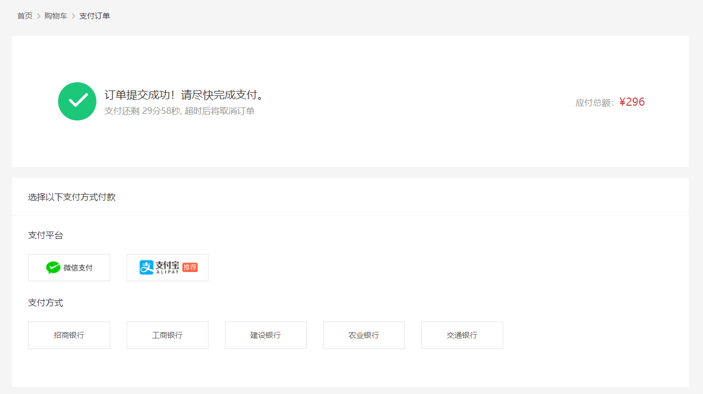

# 支付模块

## 路由和组件

> `任务目标:` 完成支付页路由和组件



1）准备组件

`src/views/Pay/index.vue`

```html
<script setup lang="ts">
//
</script>

<template>
  <div class="xtx-pay-page">
    <div class="container">
      <XtxBread>
        <XtxBreadItem to="/">首页</XtxBreadItem>
        <XtxBreadItem to="/cart">购物车</XtxBreadItem>
        <XtxBreadItem>支付订单</XtxBreadItem>
      </XtxBread>
      <!-- 付款信息 -->
      <div class="pay-info">
        <span class="icon iconfont icon-queren2"></span>
        <div class="tip">
          <p>订单提交成功！请尽快完成支付。</p>
          <p>支付还剩 <span>24分59秒</span>, 超时后将取消订单</p>
        </div>
        <div class="amount">
          <span>应付总额：</span>
          <span>¥5673.00</span>
        </div>
      </div>
      <!-- 付款方式 -->
      <div class="pay-type">
        <p class="head">选择以下支付方式付款</p>
        <div class="item">
          <p>支付平台</p>
          <a class="btn wx" href="javascript:;"></a>
          <a class="btn alipay" href="javascript:;"></a>
        </div>
        <div class="item">
          <p>支付方式</p>
          <a class="btn" href="javascript:;">招商银行</a>
          <a class="btn" href="javascript:;">工商银行</a>
          <a class="btn" href="javascript:;">建设银行</a>
          <a class="btn" href="javascript:;">农业银行</a>
          <a class="btn" href="javascript:;">交通银行</a>
        </div>
      </div>
    </div>
  </div>
</template>

<style scoped lang="less">
.pay-info {
  background: #fff;
  display: flex;
  align-items: center;
  height: 240px;
  padding: 0 80px;
  .icon {
    font-size: 80px;
    color: #1dc779;
  }
  .tip {
    padding-left: 10px;
    flex: 1;
    p {
      &:first-child {
        font-size: 20px;
        margin-bottom: 5px;
      }
      &:last-child {
        color: #999;
        font-size: 16px;
      }
    }
  }
  .amount {
    span {
      &:first-child {
        font-size: 16px;
        color: #999;
      }
      &:last-child {
        color: @priceColor;
        font-size: 20px;
      }
    }
  }
}
.pay-type {
  margin-top: 20px;
  background-color: #fff;
  padding-bottom: 70px;
  p {
    line-height: 70px;
    height: 70px;
    padding-left: 30px;
    font-size: 16px;
    &.head {
      border-bottom: 1px solid #f5f5f5;
    }
  }
  .btn {
    width: 150px;
    height: 50px;
    border: 1px solid #e4e4e4;
    text-align: center;
    line-height: 48px;
    margin-left: 30px;
    color: #666666;
    display: inline-block;
    &.active,
    &:hover {
      border-color: @xtxColor;
    }
    &.alipay {
      background: url(https://cdn.cnbj1.fds.api.mi-img.com/mi-mall/7b6b02396368c9314528c0bbd85a2e06.png)
        no-repeat center / contain;
    }
    &.wx {
      background: url(https://cdn.cnbj1.fds.api.mi-img.com/mi-mall/c66f98cff8649bd5ba722c2e8067c6ca.jpg)
        no-repeat center / contain;
    }
  }
}
</style>
```

2）配置路由

```ts
{
  path: '/',
  component: Layout,
  children: [
    ...
    {
      path: '/member/pay',
      component: () => import('@/views/Pay/index.vue')
    }
  ]
},
```

## 订单跳转页

> 本节目标：订单跳转并传递订单 id 参数。

### 页面跳转思考

- `router.push()` 和 `router.replace()`  的区别是什么？
  - push            追加，后退**能**回到前页面
  - replace        替换，后退**不能**回到前页面

- 提交订单后跳转到 支付详情页，是通过 `push` 合适，还是用 `replace` 更合适呢，为什么？
  - `replace` 更合适，下单后商品在购物车已经没有了，后退回去会报错。

### 传递订单 id 号

- 完善TS 类型声明文件：`src\types\api\order.d.ts`

```ts
// 下单后的返回值
export interface SubmitOrder {
  id: string;
  createTime: string;
  payType: number;
  orderState: number;
  payLatestTime: string;
  postFee: number;
  payMoney: number;
  totalMoney: number;
  totalNum: number;
  payChannel: number;
  // skus?: any;
  // countdown?: any;
}
```

- 跳转时传递订单 `id`

```diff

  actions: {
    // 提交订单(创建订单)
    async createOrder(data: object) {
      // 创建订单
      const res = await http<SubmitOrder>('POST', '/member/order', data);
      // console.log('POST', '/member/order', res);
      // 成功提醒用户
      message({ type: 'success', text: '下单成功~' });
      // 🔔刷新购物车列表
      const { cart } = useStore();
      cart.getCartList();
+      // 跳转到支付页，传递订单id
+      router.push(`/member/pay?orderId=${res.data.result.id}`);
    }
```


## 支付数据渲染

> `任务目标:` 渲染真实支付数据

**实现步骤**

1. 准备API接口函数获取订单详情
2. 在组件获取数据渲染
3. 完成倒计时效果


### 接口：获取我的订单详情

**Path：** /member/order/:id

**Method：** GET

**请求参数**

**路径参数**

| 参数名称 | 示例  | 备注   |
| -------- | ----- | ------ |
| id       | 11111 | 订单id |

2）封装 actions

```ts
  actions: {
    // 获取我的订单详情
    async getOrderDetail(orderId: string) {
      // 根据订单号获取订单详情
      const res = await http<OrderDetail>('GET', `/member/order/${orderId}`);
      // console.log('GET', `/member/order/${orderId}`, res);
      this.orderDetail = res.data.result;
    },
  },
```

3）在组件获取数据渲染 `src/views/Pay/index.vue`

```vue
<script setup lang="ts">
import useStore from '@/store';
import { useRoute } from 'vue-router';

const route = useRoute();
const { orderId } = route.query;
const { order } = useStore();
order.getOrderDetail(orderId as string);
</script>
```

## 理解支付流程

> 学习目标：了解支付的前后端业务流程。


1. PC前台点击支付按钮，新开标签页打开后台提供的支付链接带上 `订单ID和回跳地址`
2. 后台服务发起支付包，等待用户支付结果，用户支付完修改订单状态，回跳PC前台结果页
3. PC前台在结果页获取回跳URL参数订单ID查询支付状态，展示支付结果

**支付宝回跳地址（根据当前业务制定）**

```yaml
http://www.corho.com:8080/#/pay/callback
```

**测试支付**

```text
买家账号: bbxfwb4932@sandbox.com
登录密码: 111111
支付密码: 111111
```

**其他补充**

- 在支付宝网站可以免费开通测试账号。[账号申请地址](https://openhome.alipay.com/platform/appDaily.htm)
- 安卓手机可以下载安卓 `沙箱支付宝` ，模拟 `App` 扫码支付。

## 跳转支付链接

`任务目标:` 携带关键参数进行支付操作

**关键参数**

1. 订单id  （ `orderId` ）
2. 回跳地址  （`redirect`）

`src/views/Pay/index.vue`

支付宝超链接格式(由后端规定)：

```js
// 后端支付链接格式组成：(后端要求)
// const payUrl = '后台服务基准地址+支付接口地址+订单ID+回跳地址'
const baseURL = "http://pcapi-xiaotuxian-front-devtest.itheima.net/"
// 支付宝的回跳地址不识别特殊符号，需要主动转码处理 encodeURIComponent
const redirect = encodeURIComponent('http://www.corho.com:8080/#/member/pay/callback')
const payUrl = `${baseURL}pay/aliPay?orderId=${route.query.orderId}&redirect=${redirect}`
```

支付宝按钮添加超链接：

```ts
<a class="btn alipay" :href="payUrl"></a>
```


## 支付结果展示

`任务目标:` 对支付完的结果进行展示


**实现步骤**

1. 准备一个基础页面
2. 根据地址订单ID查询订单状态进行展示，或者是地址栏支付结果

**代码落地**

1）准备结果页面

`src/views/Pay/callback.vue`

```vue
<script setup lang="ts">
// 
</script>

<template>
  <div class="xtx-pay-page">
    <div class="container">
      <XtxBread>
        <XtxBreadItem to="/">首页</XtxBreadItem>
        <XtxBreadItem to="/cart">购物车</XtxBreadItem>
        <XtxBreadItem>支付结果</XtxBreadItem>
      </XtxBread>
      <!-- 支付结果 -->
      <div class="pay-result">
        <span class="iconfont icon-queren2 green"></span>
        <!-- <span class="iconfont icon-shanchu red" ></span> -->
        <p class="tit">订单支付成功</p>
        <p class="tip">我们将尽快为您发货，收货期间请保持手机畅通</p>
        <p>支付方式：<span>微信支付</span></p>
        <p>支付金额：<span>¥1899.00</span></p>
        <div class="btn">
          <XtxButton type="primary" style="margin-right:20px">查看订单</XtxButton>
          <XtxButton type="gray">进入首页</XtxButton>
        </div>
        <p class="alert">
          <span class="iconfont icon-tip"></span>
          温馨提示：小兔鲜儿不会以订单异常、系统升级为由要求您点击任何网址链接进行退款操作，保护资产、谨慎操作。
        </p>
      </div>
    </div>
  </div>
</template>

<style scoped lang="less">
.pay-result {
  padding: 100px 0;
  background: #fff;
  text-align: center;
  > .iconfont {
    font-size: 100px;
  }
  .green {
    color: #1dc779;
  }
  .red {
    color: @priceColor;
  }
  .tit {
    font-size: 24px;
  }
  .tip {
    color: #999;
  }
  p {
    line-height: 40px;
    font-size: 16px;
  }
  .btn {
    margin-top: 50px;
  }
  .alert {
    font-size: 12px;
    color: #999;
    margin-top: 50px;
  }
}
</style>
```

2) 配置路由

```jsx
{
  path: '/',
  component: Layout,
  children: [
    ...,
    {
      path: '/pay/callback',
      component: () => import('@/views/Pay/callback.vue')
    }
  ]
},
```

4）根据地址订单ID查询订单状态进行展示

```vue
<script setup lang="ts">
import useStore from '@/store';
import { useRoute } from 'vue-router';

const { order } = useStore();
const route = useRoute();
// 获取最新订单信息
order.getOrderInfo(route.query.orderId as string);
</script>

<template>
  <div class="xtx-pay-page">
    <div class="container">
      <XtxBread>
        <XtxBreadItem to="/">首页</XtxBreadItem>
        <XtxBreadItem to="/cart">购物车</XtxBreadItem>
        <XtxBreadItem>支付结果</XtxBreadItem>
      </XtxBread>
      <!-- 支付结果 -->
      <div class="pay-result">
        <span class="iconfont icon-queren2 green"></span>
        <!-- <span class="iconfont icon-shanchu red" ></span> -->
        <p class="tit">
          {{ $route.query.payResult === 'true' ? '订单支付成功' : '支付失败' }}
        </p>
        <p class="tip">我们将尽快为您发货，收货期间请保持手机畅通</p>
        <p>
          支付方式：<span>
            {{ order.orderInfo.payChannel === 1 ? '支付宝' : '微信' }}
          </span>
        </p>
        <p>
          支付金额：<span class="red">¥{{ order.orderInfo.payMoney }}</span>
        </p>
        <div class="btn">
          <XtxButton type="primary" style="margin-right: 20px">
            查看订单
          </XtxButton>
          <XtxButton type="gray">进入首页</XtxButton>
        </div>
        <p class="alert">
          <span class="iconfont icon-tip"></span>
          温馨提示：小兔鲜儿不会以订单异常、系统升级为由要求您点击任何网址链接进行退款操作，保护资产、谨慎操作。
        </p>
      </div>
    </div>
  </div>
</template>
```


## 倒计时效果

3）倒计时函数，完成倒计时效果，指定开始时间

- https://vueuse.org/shared/useIntervalFn/
- https://dayjs.gitee.io/docs/zh-CN/installation/installation

### 安装依赖

```
yarn add dayjs
# 或
npm install dayjs
```

### 基本使用

```jsx
import dayjs from 'dayjs'
console.log(dayjs.unix(100).format('mm分ss秒'))
```

### 升级 hooks 函数

```diff
+ import { computed } from 'vue';
+ import dayjs from 'dayjs';

// 封装倒计时业务
export function useCountDown() {
  // 倒计时初始值
  const count = ref(0);
  // 准备定时器
  // resume  继续启动
  // pause   暂停(清理定时器)
  const { resume, pause } = useIntervalFn(
    () => {
      count.value--; // 倒计时减少
      // 倒计时结束
      if (count.value === 0) {
        pause(); // 停止定时器
      }
    },
    1000, // 间隔为 1 秒
    { im./mediate: false } // 不需要立即执行
  );

  const start = (startTime: number) => {
    // 如果倒计时没结束，直接退出
    if (count.value !== 0) return;

    // 初始化倒计时
    count.value = startTime;

    // 开启倒计时
    resume();
  };

+  // 格式化后的时间
+  const countTime = computed(() => {
+    return dayjs.unix(count.value).format('mm分ss秒');
+  });

  // 🚨 封装后记得 return 返回
  return { 
      count, 
      resume,
      pause,
      start, 
+      countTime 
  };
}
```

```vue
<script setup lang="ts">
// 如果 setup 使用顶层 await ，需要在套一层 Suspense 组件才可以
// 🎯注意：顶层 await 不要滥用，滥用顶层 await 会导致界面白屏时间过长
//         因为顶层 await 需要挨个等待 await 异步执行完后才能看到界面
await order.getOrderDetail(orderId as string);

// 获取倒计时的 hooks
const { countTime, start } = useCountDown();
// 开启倒计时
start(order.orderDetail.countdown);
</script>

<template>
  ...
          <p>订单提交成功！请尽快完成支付。</p>
          <p>
            支付还剩 <span>{{ countTime }}</span>
            , 超时后将取消订单
          </p>
  ...
</template>
```

