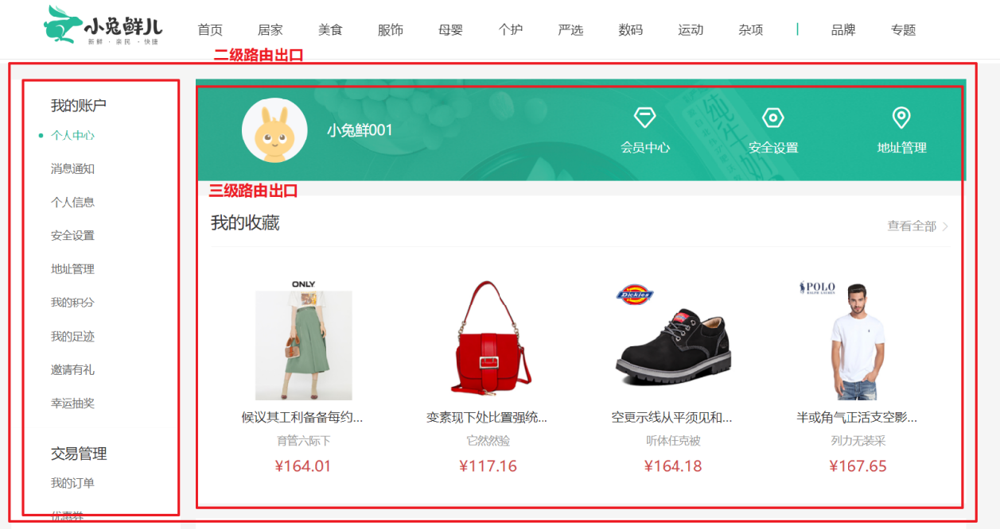
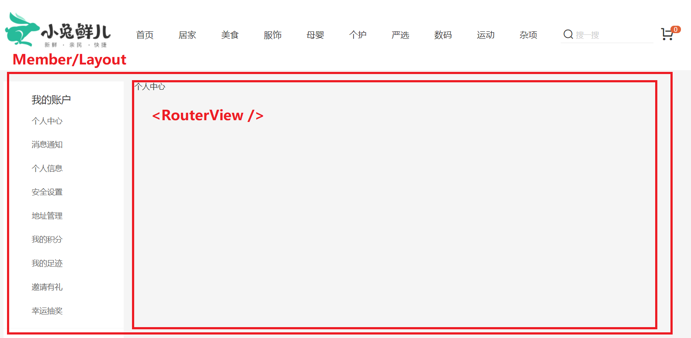
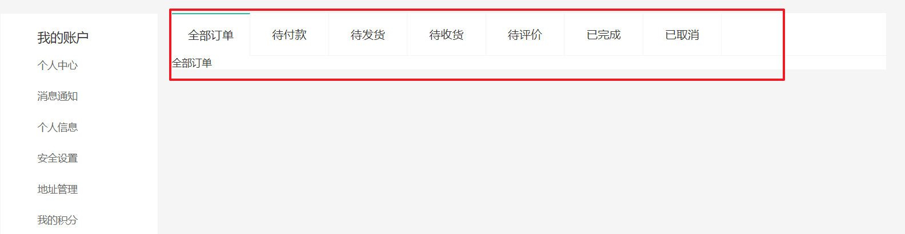
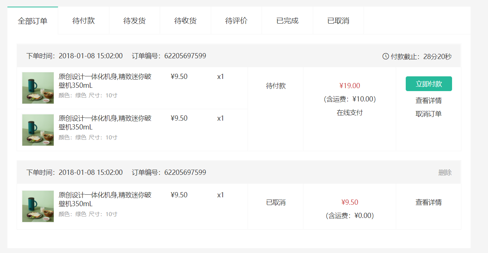

# 会员中心模块

## 个人中心

### 个人中心-路由配置

> 本节目标：个人中心二级路由配置。



（1）创建组件 `src/views/Member/Layout/index.vue`

```vue
<script setup lang="ts">
//
</script>

<template>
  <div>个人中心布局容器</div>
</template>

```

（2）配置路由

```js
{
    path: "/",
    component: Layout,
    children: [
      ...
      {
        path: "/member",
        component: () => import("@/views/Member/Layout/index.vue"),
      },
    ],
  },
```

（3）修改首页头部导航的链接

```jsx
<li>
  <RouterLink to="/member" ><i class="iconfont icon-user"></i>
  	{{ profile.nickname || profile.account }}
  </RouterLink>
</li>

<li><RouterLink to="/member">会员中心</RouterLink></li>
```


### 个人中心-三级路由配置

> 本节目的：完成个人中心页面基础架子，配置路由。



大致步骤：

- 准备个人中心左菜单组件
- 准备个人中心布局容器组件
- 准备个人中心首页组件
- 配置路由规则

落地代码：

1. 准备个人中心左菜单组件

`src/views/Member/Layout/components/member-aside.vue`

```vue
<script setup lang="ts">
//
</script>

<template>
  <div class="xtx-member-aside">
    <div class="user-manage">
      <h4>我的账户</h4>
      <div class="links">
        <a href="javascript:;">个人中心</a>
        <a href="javascript:;">消息通知</a>
        <a href="javascript:;">个人信息</a>
        <a href="javascript:;">安全设置</a>
        <a href="javascript:;">地址管理</a>
        <a href="javascript:;">我的积分</a>
        <a href="javascript:;">我的足迹</a>
        <a href="javascript:;">邀请有礼</a>
        <a href="javascript:;">幸运抽奖</a>
      </div>
      <h4>交易管理</h4>
      <div class="links">
        <a href="javascript:;">我的订单</a>
        <a href="javascript:;">优惠券</a>
        <a href="javascript:;">礼品卡</a>
        <a href="javascript:;">评价晒单</a>
        <a href="javascript:;">售后服务</a>
      </div>
      <h4>我的收藏</h4>
      <div class="links">
        <a href="javascript:;">收藏的商品</a>
        <a href="javascript:;">收藏的专题</a>
        <a href="javascript:;">关注的品牌</a>
      </div>
      <h4>帮助中心</h4>
      <div class="links">
        <a href="javascript:;">帮助中心</a>
        <a href="javascript:;">在线客服</a>
      </div>
    </div>
  </div>
</template>

<style scoped lang="less">
.xtx-member-aside {
  width: 220px;
  margin-right: 20px;
  border-radius: 2px;
  .user-manage {
    background-color: #fff;
    h4 {
      font-size: 18px;
      font-weight: 400;
      padding: 20px 52px 5px;
      border-top: 1px solid #f6f6f6;
    }

    .links {
      padding: 0 52px 10px;
    }

    a {
      display: block;
      line-height: 1;
      padding: 15px 0;
      font-size: 14px;
      color: #666;
      position: relative;

      &:hover {
        color: @xtxColor;
      }
      &.active {
        color: @xtxColor;

        &:before {
          display: block;
        }
      }

      &:before {
        content: '';
        display: none;
        width: 6px;
        height: 6px;
        border-radius: 50%;
        position: absolute;
        top: 19px;
        left: -16px;
        background-color: @xtxColor;
      }
    }
  }
}
</style>

```

2. 准备个人中心布局容器组件

`src/views/Member/Layout/index.vue`

```vue
<script setup lang="ts">
import MemberAside from './components/member-aside.vue';
</script>

<template>
  <div class="container">
    <MemberAside />
    <div class="article">
      <!-- 三级路由的挂载点 -->
      <RouterView />
    </div>
  </div>
</template>

<style scoped lang="less">
.container {
  display: flex;
  padding-top: 20px;
  .article {
    width: 1000px;
  }
}
</style>

```

3. 准备中心首页组件：`src/views/Member/Home/index.vue`  

```vue
<script setup lang="ts">
//
</script>

<template>
  <div class="member-home">
    <h2>个人中心</h2>
  </div>
</template>

```

4. 准备订单组件：`src/views/Member/Order/index.vue`

```jsx
<script setup lang="ts">
//
</script>

<template>
  <div class="member-order">
    <h3>订单列表</h3>
  </div>
</template>

```

4. 配置路由规则

```jsx
  {
    path: '/',
    component: Layout,
    children: [
      ...
      {
        path: "/member",
        component: () => import("@/views/Member/Layout/index.vue"),
        children: [
          {
            path: "/member",
            component: () => import("@/views/Member/Home/index.vue"),
          },
          {
            path: "/member/order",
            component: () => import("@/views/Member/Order/index.vue"),
          },
        ],
      },
    ]
  },
```


### 新版路由-导航守卫 🚨

- `VueRouter@4` 的的第三个参数 `next` ，变成了可选参数。
- 可以通过函数内部的返回值 `return` 实现以前 `next` 函数的功能。
- 如果什么都没有，`undefined` 或返回 `true`，**则导航是有效的**，并调用下一个导航守卫。

```ts
// to      去哪里
// from    从哪里来
// next    放行函数(可选)
// 路由设计  需要用户登录后才能访问的页面，统一都是 /member 开头
router.beforeEach((to) => {
  const { member } = useStore();
  // 进行判断：未登录情况但是访问 /member 开头的路径，需要跳转登录页
  if (!member.isLogin && to.path.startsWith("/member")) {
    return `/login?target=${to.fullPath}`;
  }
});
```

- VueRouter 变更：https://router.vuejs.org/zh/guide/migration/index.html

- Vue3 变更： https://v3.cn.vuejs.org/guide/migration/introduction.html


### 个人中心-菜单激活

> 目标：动态激活左侧菜单

大致步骤：

- 添加个人中心路由地址，设置精准匹配类名
- 添加我的订单路由与组件

```text
router-link-active         模拟匹配，一般用于父级路由高亮
router-link-exact-active   精确匹配，一般用于当前路由高亮
```

类名修改：`src/components/app-member-aside.vue`

```vue
<template>
  <div class="xtx-member-aside">
    <div class="user-manage">
      <h4>我的账户</h4>
      <div class="links">
+        <RouterLink to="/member">个人中心</RouterLink>
         ...
      </div>
      <h4>交易管理</h4>
      <div class="links">
+        <RouterLink to="/member/order">我的订单</RouterLink>
         ...
      </div>
      ...
    </div>
  </div>
</template>

<style scoped lang="less">
.xtx-member-aside {
   ...
  .user-manage {
    ...
    a {
      ...
      
+      // 个人中心-左侧菜单高亮类名
+      &.router-link-exact-active {
+        color: @xtxColor;
+        &:before {
+          display: block;
+        }
+      }

      ...
    }
  }
}
</style>

```


### 个人中心-首页布局

> 本节目标：完成个人中心-首页基础布局

大致步骤：

- 准备概览组件
- 组件面板组件

落地代码：

1. 准备概览组件

`src/views/Member/Home/components/home-overview.vue`

```vue
<script setup lang="ts">
//
</script>

<template>
  <!-- 概览 -->
  <div class="home-overview">
    <!-- 用户信息 -->
    <div class="user-meta">
      <div class="avatar">
        
      </div>
      <h4>徐菲菲</h4>
    </div>
    <div class="item">
      <a href="javascript:;">
        <span class="iconfont icon-hy"></span>
        <p>会员中心</p>
      </a>
      <a href="javascript:;">
        <span class="iconfont icon-aq"></span>
        <p>安全设置</p>
      </a>
      <a href="javascript:;">
        <span class="iconfont icon-dw"></span>
        <p>地址管理</p>
      </a>
    </div>
  </div>
</template>

<style scoped lang="less">
.home-overview {
  height: 132px;
  background: url(@/assets/images/center-bg.png) no-repeat center / cover;
  display: flex;
  .user-meta {
    flex: 1;
    display: flex;
    align-items: center;
    .avatar {
      width: 85px;
      height: 85px;
      border-radius: 50%;
      overflow: hidden;
      margin-left: 60px;
      img {
        width: 100%;
        height: 100%;
      }
    }
    h4 {
      padding-left: 26px;
      font-size: 18px;
      font-weight: normal;
      color: white;
    }
  }
  .item {
    flex: 1;
    display: flex;
    align-items: center;
    justify-content: space-around;
    &:first-child {
      border-right: 1px solid #f4f4f4;
    }
    a {
      color: white;
      font-size: 16px;
      text-align: center;
      .iconfont {
        font-size: 32px;
      }
      p {
        line-height: 32px;
      }
    }
  }
}
</style>

```

2. 组件面板组件

`src/views/Member/Home/components/home-panel.vue`

```vue
<script setup lang="ts">
defineProps<{
  title: string;
}>();
</script>

<template>
  <div class="home-panel">
    <div class="header">
      <h4>{{ title }}</h4>
      <XtxMore to="/" />
    </div>
    <!-- 商品列表 -->
    <div class="goods-list"></div>
  </div>
</template>

<style scoped lang="less">
.home-panel {
  background-color: #fff;
  padding: 0 20px;
  margin-top: 20px;
  height: 400px;
  .header {
    height: 66px;
    border-bottom: 1px solid #f5f5f5;
    padding: 18px 0;
    display: flex;
    justify-content: space-between;
    align-items: baseline;
    h4 {
      font-size: 22px;
      font-weight: normal;
    }
  }
}
</style>

```

3. 使用面板组件，猜你喜欢组件

`src/views/member/home/index.vue`

```vue
<script setup lang="ts">
import HomeOverview from "./components/home-overview.vue";
import HomePanel from "./components/home-panel.vue";
</script>

<template>
  <div class="member-home">
    <HomeOverview />
    <HomePanel title="收藏的商品" />
    <HomePanel title="我的足迹" />
  </div>
</template>
```


### 个人中心-渲染页面

> 目的：用户信息展示，面板内商品展示。

`src/views/member/home/components/home-overview.vue`

```vue
<script setup lang="ts">
import useStore from "@/store";
import { storeToRefs } from "pinia";
// 图片加载失败会触发 error 事件，加载失败使用默认占位图
import defaultImg from "@/assets/images/200.png";

const { member } = useStore();
// 解构 profile 并保持响应式
const { profile } = storeToRefs(member);
</script>

<template>
  <!-- 概览 -->
  <div class="home-overview">
    <!-- 用户信息 -->
    <div class="user-meta">
      <div class="avatar">
        
      </div>
      <h4>
        {{ profile.nickname || profile.account || profile.mobile }}
      </h4>
    </div>
    ...
  </div>
</template>
```


## 订单管理




```vue
<script setup lang="ts">
import { ref } from "vue";

// 用于双向绑定高亮的名称
const activeName = ref("all");
// 点击 tab 触发的自定义事件
const tabClick = (index: number) => {
  console.log("当前点击的下标为", index);
};
</script>

<template>
  <div class="member-order">
    <XtxTabs v-model="activeName" @tab-click="({ index }) => tabClick(index)">
      <XtxTabPane name="all" label="全部订单">1</XtxTabPane>
      <XtxTabPane name="unpay" label="待付款">2</XtxTabPane>
      <XtxTabPane name="deliver" label="代发货">3</XtxTabPane>
    </XtxTabs>
  </div>
</template>

```


### 订单管理 - 使用 Tabs 组件

`src/constants/order.ts`   订单状态常量数据，多个组件都要用到这个数组，定义成常量方便复用。

```js
// 订单状态
export const orderStatus = [
  { name: "all", label: "全部订单" },
  { name: "unpay", label: "待付款" },
  { name: "deliver", label: "待发货" },
  { name: "receive", label: "待收货" },
  { name: "comment", label: "待评价" },
  { name: "complete", label: "已完成" },
  { name: "cancel", label: "已取消" },
];

```

`src/views/Member/Order/index.vue`

```vue
<script setup lang="ts">
import { ref } from "vue";
import { orderStatus } from "@/constants";

// 用于双向绑定高亮的名称
const activeName = ref(orderStatus[0].name);
</script>

<template>
  <div class="member-order">
    <XtxTabs v-model="activeName">
      <XtxTabPane
        v-for="item in orderStatus"
        :key="item.name"
        :name="item.name"
        :label="item.label"
      />
    </XtxTabs>
  </div>
</template>

```


### 订单管理 - 静态布局 - CV

> 目标：完成订单静态布局。
>




1. 新建 订单项 `order-item` 组件： `src/views/Member/Order/components/order-item.vue`

```vue
<script setup lang="ts">
//
</script>

<template>
  <div class="order-item">
    <div class="head">
      <span>下单时间：2022-02-07 00:05:20</span>
      <span>订单编号：62205697599</span>
      <span class="down-time">
        <i class="iconfont icon-down-time"></i>
        <b>付款截止：28分20秒</b>
      </span>
    </div>
    <div class="body">
      <div class="column goods">
        <ul>
          <li v-for="item in 2" :key="item">
            <a class="image" href="javascript:;">
              
            </a>
            <div class="info">
              <p class="name ellipsis-2">
                原创设计一体化机身,精致迷你破壁机350mL
              </p>
              <p class="attr ellipsis">
                <span>颜色：绿色</span>
                <span>尺寸：10寸</span>
              </p>
            </div>
            <div class="price">¥9.50</div>
            <div class="count">x1</div>
          </li>
        </ul>
      </div>
      <div class="column state">
        <p>待付款</p>
      </div>
      <div class="column amount">
        <p class="red">¥19.00</p>
        <p>（含运费：¥10.00）</p>
        <p>在线支付</p>
      </div>
      <div class="column action">
        <XtxButton type="primary" size="small">立即付款</XtxButton>
        <p><a href="javascript:;">查看详情</a></p>
        <p><a href="javascript:;">取消订单</a></p>
      </div>
    </div>
  </div>
</template>

<style lang="less" scoped>
.order-item {
  margin-bottom: 20px;
  border: 1px solid #f5f5f5;
  .head {
    height: 50px;
    line-height: 50px;
    background: #f5f5f5;
    padding: 0 20px;
    overflow: hidden;
    span {
      margin-right: 20px;
      &.down-time {
        margin-right: 0;
        float: right;
        i {
          vertical-align: middle;
          margin-right: 3px;
        }
        b {
          vertical-align: middle;
          font-weight: normal;
        }
      }
    }
    .del {
      margin-right: 0;
      float: right;
      color: #999;
    }
  }
  .body {
    display: flex;
    align-items: stretch;
    .column {
      border-left: 1px solid #f5f5f5;
      text-align: center;
      padding: 20px;
      > p {
        padding-top: 10px;
      }
      &:first-child {
        border-left: none;
      }
      &.goods {
        flex: 1;
        padding: 0;
        align-self: center;
        ul {
          li {
            border-bottom: 1px solid #f5f5f5;
            padding: 10px;
            display: flex;
            &:last-child {
              border-bottom: none;
            }
            .image {
              width: 70px;
              height: 70px;
              border: 1px solid #f5f5f5;
            }
            .info {
              width: 220px;
              text-align: left;
              padding: 0 10px;
              p {
                margin-bottom: 5px;
                &.name {
                  height: 38px;
                }
                &.attr {
                  color: #999;
                  font-size: 12px;
                  span {
                    margin-right: 5px;
                  }
                }
              }
            }
            .price {
              width: 100px;
            }
            .count {
              width: 80px;
            }
          }
        }
      }
      &.state {
        width: 120px;
        .green {
          color: @xtxColor;
        }
      }
      &.amount {
        width: 200px;
        .red {
          color: @priceColor;
        }
      }
      &.action {
        width: 140px;
        a {
          display: block;
          &:hover {
            color: @xtxColor;
          }
        }
      }
    }
  }
}
</style>

```

2. 在列表页中使用：`src\views\Member\Order\index.vue`

```vue
<script setup lang="ts">
import { ref } from "vue";
import { orderStatus } from "@/constants/order";
import OrderItem from "./components/order-item.vue";
const activeName = ref("all");
</script>

<template>
  <div class="member-order-page">
    <!-- 1. Tabs 组件 -->
    <XtxTabs v-model="activeName">
      <XtxTabPane
        v-for="item in orderStatus"
        :key="item.name"
        :label="item.label"
        :name="item.name"
      />
    </XtxTabs>
    <!-- 2. 商品列表 -->
    <div class="order-list">
      <OrderItem />
      <OrderItem />
      <OrderItem />
    </div>
  </div>
</template>

<style scoped lang="less">
.order-list {
  background-color: #fff;
  padding: 20px;
}
</style>

```


### 订单管理 - 订单列表数据获取

#### 接口：获取我的订单

**Path：** /member/order

**Method：** GET

**请求参数**

**Query**

| 参数名称   | 是否必须 | 示例 | 备注                                                         |
| ---------- | -------- | ---- | ------------------------------------------------------------ |
| page       | 是       | 1    | 页码                                                         |
| pageSize   | 是       | 10   | 页尺寸                                                       |
| orderState | 否       | 1    | 订单状态，1为待付款、2为待发货、3为待收货、4为待评价、5为已完成、6为已取消，未传该参数或0为全部 |

#### 发送请求获取订单列表

`src\views\Member\Order\index.vue`

```vue
<script setup lang="ts">
import { onMounted, ref, reactive } from "vue";
import { orderStatus } from "@/constants";
import OrderItem from "./components/order-item.vue";
import { http } from "@/utils/request";
// 用于双向绑定高亮的名称
const activeName = ref(orderStatus[0].name);

// 对象结构确定，可以用 reactive 定义响应式对象
const query = reactive({
  orderState: 0,
  page: 1,
  pageSize: 2,
});

// 订单列表总信息
onMounted(async () => {
  // 根据参数获取订单列表信息
  const res = await http<OrderListInfo>("GET", "/member/order", query);
  console.log("GET", "/member/order", res.data.result);
});
</script>
```

#### 添加 TS 类型声明

添加类型声明：`src\types\api\order.d.ts`

```ts

// 订单项
export interface OrderItem {
  id: string;
  createTime: string;
  payType: number;
  orderState: number;
  payLatestTime: string;
  postFee: number;
  payMoney: number;
  totalMoney: number;
  totalNum: number;
  skus: Sku[];
  payChannel: number;
  countdown: number;
}

// 订单列表别名
export type OrderList = OrderItem[];

// 订单列表总信息
export interface OrderListInfo {
  counts: number;
  pageSize: number;
  pages: number;
  page: number;
  // 应用订单列表别名
  items: OrderList;
}

```


### 订单管理 - 列表渲染 🚨

> 目标：完成订单列表默认渲染。


**大致步骤：**

- 数据父传子
- 渲染订单数据


**落地代码：**

1. 定义响应式数据

```diff
<script setup lang="ts">
+import type { OrderListInfo } from "@/types";

...

+// 订单列表总信息
+const orderListInfo = ref<OrderListInfo>();
onMounted(async () => {
  // 根据参数获取订单列表信息
  const res = await http<OrderListInfo>("GET", "/member/order", query);
  console.log("GET", "/member/order", res.data.result);
+  orderListInfo.value = res.data.result;
});
</script>
```


2. 列表循环，数据父传子。

```vue
<div class="order-list">
    <OrderItem v-for="item in orderListInfo?.items" :key="item.id" :order="item" />
</div>
```

5. 渲染 `OrderItem` 子组件

```html
<script setup lang="ts">
import { orderStatus } from "@/constants/order";
import { useCountDown } from "@/hooks";
import type { OrderItem } from "@/types";
interface Props {
  order: OrderItem;
}
const props = defineProps<Props>();
const { countTimeText, start } = useCountDown();
start(props.order.countdown);
</script>

<template>
  <div class="order-item" v-if="order.id">
    <div class="head">
      <span>下单时间：{{ order.createTime }}</span>
      <span>订单编号：{{ order.id }}</span>
      <!-- 未付款，倒计时时间还有 -->
      <span class="down-time">
        <i class="iconfont icon-down-time"></i>
        <b>付款截止：{{ countTimeText }}</b>
      </span>
    </div>
    <div class="body">
      <div class="column goods">
        <ul>
          <li v-for="item in order.skus" :key="item.id">
            <a class="image" href="javascript:;">
              
            </a>
            <div class="info">
              <p class="name ellipsis-2">
                {{ item.name }}
              </p>
              <p class="attr ellipsis">
                <span>{{ item.attrsText }}</span>
              </p>
            </div>
            <div class="price">¥{{ item.realPay }}</div>
            <div class="count">x{{ item.quantity }}</div>
          </li>
        </ul>
      </div>
      <div class="column state">
        <p>{{ orderStatus[order.orderState].label }}</p>
        <p v-if="order.orderState === 3">
          <a href="javascript:;" class="green">查看物流</a>
        </p>
        <p v-if="order.orderState === 4">
          <a href="javascript:;" class="green">评价商品</a>
        </p>
        <p v-if="order.orderState === 5">
          <a href="javascript:;" class="green">查看评价</a>
        </p>
      </div>
      <div class="column amount">
        <p class="red">¥{{ order.payMoney }}</p>
        <p>（含运费：¥{{ order.postFee }}）</p>
        <p>在线支付</p>
      </div>
      <div class="column action">
        <XtxButton v-if="order.orderState === 1" type="primary" size="small">
            立即付款
        </XtxButton>
        <XtxButton v-if="order.orderState === 3" type="primary" size="small">
            确认收货
        </XtxButton>
        <p><a href="javascript:;">查看详情</a></p>
        <p v-if="[2, 3, 4, 5].includes(order.orderState)">>
          <a href="javascript:;">再次购买</a>
        </p>
        <p v-if="[4, 5].includes(order.orderState)">
          <a href="javascript:;">申请售后</a>
        </p>
        <p v-if="order.orderState === 1"><a href="javascript:;">取消订单</a></p>
      </div>
    </div>
  </div>
</template>
```


### 订单管理 -  切换列表

模拟发货：http://pcapi-xiaotuxian-front-devtest.itheima.net/member/order/consignment/:id

```jsx
<XtxTabs v-model="activeName"  @tab-click="({ index }) => tabClick(index)">
  <XtxTabsPanel
    v-for="item in orderStatus"
    :key="item.name"
    :label="item.label"
    :name="item.name"
  />
</XtxTabs>


const loadDate = async () => {
  const res = await http<OrderListInfo>("GET", "/member/order", requestParams);
  console.log("GET", "/member/order", res.data.result);
  orderListInfo.value = res.data.result;
};

watch(
  requestParams,
  () => {
    loadDate();
  },
  { im./mediate: true }
);

const tabClick = (index: number) => {
  requestParams.orderState = index;
};
```


##  tabs 组件封装 -TSX

> 目的：封装一个高可用 tabs 组件。类似于：https://element-plus.gitee.io/zh-CN/component/tabs.html

大致步骤：

- `xtx-tabs` 组件容器 可以有多个 `xtx-tab-pane` 组件面板，`script` 内容 `<slot />`
- `xtx-tab-pane` 支持：  标题 `label`，名称 `name`，`template` 内容 `<slot />`
- `xtx-tabs`  组件组织结构，控制点击事件，标签页激活。


### 封装 tabs 组件 - 准备结构

准备两个组件

`src\views\Test\components\Tabs\index.vue`

```jsx
<script setup lang="tsx">
const Tabs = () => {
  return <div class="xtx-tabs">tabs</div>;
};
</script>

<template>
  <Tabs />
</template>
```


`src\views\Test\components\Tabs\pane.vue`

```vue
<script setup lang="ts">
interface Props {
  label?: string;
  name?: string;
}
defineProps<Props>();
</script>

<template>
  <div class="xtx-tabs-panel">
    <slot></slot>
  </div>
</template>
```


**使用组件**

`src\views\Test\index.vue`

```vue
<script setup lang="ts">
import Tabs from "./components/Tabs/index.vue";
import TabPane from "./components/Tabs/pane.vue";
</script>

<template>
  <Tabs>
    <TabPane name="all" label="全部">
      <h1>全部的内容</h1>
    </TabPane>
    <TabPane name="unpay" label="待付款">
      <h1>待付款内容</h1>
    </TabPane>
  </Tabs>
</template>

```

### 封装 tabs 组件 - TSX/JSX 插槽 🚨

通过 `useSlots()` 获取插槽， 渲染内容

```jsx
<script setup lang="tsx">
import { useSlots, type Slots } from "vue";

const slots: Slots = useSlots();
const panels = slots.default?.();
const navs = (
  <nav>
    <a href="javascript:;">标题1</a>
    <a href="javascript:;">标题2</a>
    <a href="javascript:;">标题3</a>
    <a href="javascript:;">标题4</a>
    <a href="javascript:;">标题5</a>
  </nav>
);

const Tabs = () => {
  return <div class="xtx-tabs">{[navs, panels]}</div>;
};
</script>

<template>
  <Tabs />
</template>
```

nav 头部导航，应该基于 `slots.default()` 动态渲染

```jsx
<script setup lang="tsx">
import { useSlots, type Slots } from "vue";

const slots: Slots = useSlots();
const panels = slots.default?.();
const navs = (
  <nav>
    {panels?.map((item) => {
      return <a href="javascript:;">{item.props?.label}</a>;
    })}
  </nav>
);
const Tabs = () => {
  return <div class="xtx-tabs">{[navs, panels]}</div>;
};
</script>

<template>
  <Tabs />
</template>
```

### 封装 tabs 组件 - 支持 v-model

`src\views\Test\index.vue`

```vue
<script setup lang="ts">
import { ref } from "vue";
import Tabs from "./components/Tabs/index.vue";
import TabPane from "./components/Tabs/pane.vue";

const activeName = ref("all");
</script>

<template>
  <Tabs v-model="activeName">
    <TabPane name="all" label="全部" />
    <TabPane name="unpay" label="待付款" />
  </Tabs>
</template>
```

`src\views\Test\components\Tabs\index.vue`

```vue
<script setup lang="tsx">
import { useSlots, type Slots, type VNode } from "vue";

interface Props {
  modelValue?: string;
}
const props = defineProps<Props>();
const emit = defineEmits(["update:modelValue"]);
console.log(props, emit);

const slots: Slots = useSlots();
const panels = slots.default?.();
const navs = (
  <nav>
    {panels?.map((item, index) => {
      return (
        <a
          href="javascript:;"
          class={{ active: props.modelValue === item.props?.name }}
          onClick={() => clickFn(item, index)}
        >
          {item.props?.label}
        </a>
      );
    })}
  </nav>
);

const clickFn = (item: VNode, index: number) => {
  console.log({ item, index });
  emit("update:modelValue", item?.props?.name);
};

const Tabs = () => {
  return <div class="xtx-tabs">{[navs, panels]}</div>;
};
</script>

<template>
  <Tabs />
</template>

```

### 封装 tabs 组件 -  面板切换 - 依赖注入

tabs组件：`src\views\Test\components\Tabs\index.vue`

```diff
<script setup lang="tsx">
+import { provide } from "vue";
...
+const { modelValue } = toRefs(props);
+provide("activeNameValue", modelValue);
</script>
```

tabs-pane 组件接收

```diff
<script setup lang="ts" name="pane">
import { inject } from "vue";

interface Props {
  label?: string;
  name?: string;
}
defineProps<Props>()
+const activeNameValue = inject("activeNameValue");
</script>

<template>
+  <div class="xtx-tabs-panel" v-show="activeNameValue === name">
    <slot></slot>
  </div>
</template>
```


### 封装 tabs 组件 - v-for 渲染

```js
// 订单状态
const orderStatus = [
  { name: 'all', label: '全部订单' },
  { name: 'unpay', label: '待付款' },
  { name: 'deliver', label: '待发货' },
  { name: 'receive', label: '待收货' },
  { name: 'comment', label: '待评价' },
  { name: 'complete', label: '已完成' },
  { name: 'cancel', label: '已取消' }
]
```

组件升级：

- 动态判断节点类型，组织tabs列表

```jsx
const arr = slots.default?.()
const panes = []

arr.forEach(item => {
  // 处理基本的写法，直接内部写 XtxTabsPanel
  if (item.type.name === 'XtxTabsPane') {
    panes.push(item)
  } else {
    // 处理v-for的情况
    if (item.children && item.children[0]?.type?.name === 'XtxTabsPane') {
      // 一个节点 => 7个panel
      item.children.forEach(panel => {
        panes.push(panel)
      })
    }
  }
})
```


### 支持 tab-click  - 完整代码

`src/components/Tabs/index.vue`

```vue
<script>
import { provide, toRefs } from 'vue'
export default {
  name: 'XtxTabs',
  props: {
    modelValue: {
      type: String,
      default: ''
    }
  },
  setup (props, { emit }) {
    const clickFn = (item, index) => {
      // console.log('点击了导航')
      // 子传父，更新到父组件的 modelValue
      emit('update:modelValue', item.props.name)
      emit('tab-click', {
        tab: item,
        index: index
      })
    }

    // 响应式数据的能力：在props身上
    // 传递过去的，不是一个响应式的数据，变了，是不会更新的
    const { modelValue } = toRefs(props)
    provide('activeName', modelValue)

    return {
      clickFn
    }
  },

  render () {
    const arr = this.$slots.default()
    const panels = []

    arr.forEach(item => {
      // 处理基本的写法，直接内部写 XtxTabsPanel
      if (item.type.name === 'XtxTabsPanel') {
        panels.push(item)
      } else {
        // 处理v-for的情况
        if (item.children && item.children[0]?.type?.name === 'XtxTabsPanel') {
          // 一个节点 => 7个panel
          item.children.forEach(panel => {
            panels.push(panel)
          })
        }
      }
    })

    const nav = (
      <nav>
        {
          panels.map((item, index) => {
            return (
              <a
                class={ { active: this.modelValue === item.props.name } }
                href="javascript:;"
                onClick={() => this.clickFn(item, index)}
              >
                {item.props.label}
              </a>
            )
          })
        }
      </nav>
    )

    return (
      <div class="xtx-tabs">
        {[nav, panels]}
      </div>
    )
  }
}
</script>

<style lang="less">
.xtx-tabs {
  background: #fff;
  > nav {
    height: 60px;
    line-height: 60px;
    display: flex;
    border-bottom: 1px solid #f5f5f5;
    > a {
      width: 110px;
      border-right: 1px solid #f5f5f5;
      text-align: center;
      font-size: 16px;
      &.active {
        border-top: 2px solid @xtxColor;
        height: 60px;
        background: #fff;
        line-height: 56px;
      }
    }
  }
}
</style>

```

`src/components/Tabs/panel.vue`

```vue
<template>
  <div class="xtx-tabs-panel" v-show="activeName === name">
    <slot></slot>
  </div>
</template>

<script>
import { inject } from 'vue'
export default {
  name: 'XtxTabsPanel',
  props: {
    label: {
      type: String,
      default: ''
    },
    name: {
      type: String,
      default: ''
    }
  },
  setup () {
    const activeName = inject('activeName')
    return { activeName }
  }
}
</script>
```


