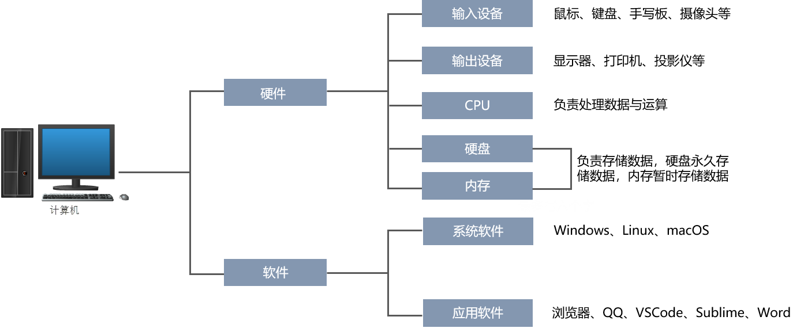
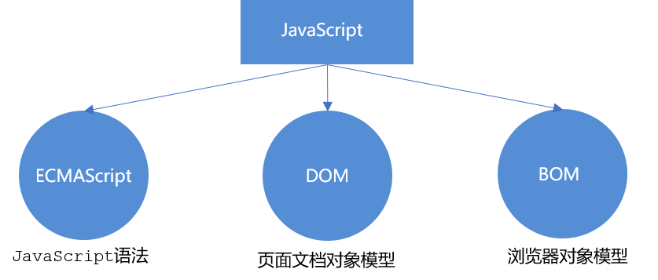
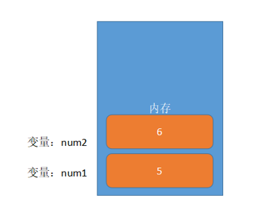
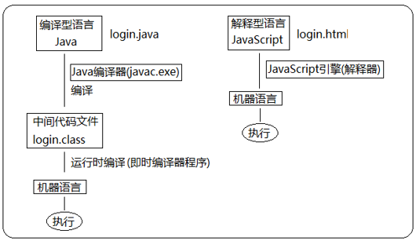

# JavaScript基础第01天

## 1 - 编程语言

### 1.1 编程

- 编程：
  - 就是让计算机为解决某个问题而使用某种程序设计语言编写程序代码，并最终得到结果的过程。
- 计算机程序：
  - 就是计算机所执行的一系列的指令集合，而程序全部都是用我们所掌握的语言来编写的，所以人们要控制计算机一定要通过计算机语言向计算机发出命令。

### 1.2 计算机语言

- 计算机语言指用于人与计算机之间通讯的语言，它是人与计算机之间传递信息的媒介。

- 计算机语言的种类非常的多，总的来说可以分成机器语言，汇编语言和高级语言三大类。

- 实际上计算机最终所执行的都是 机器语言，它是由“0”和“1”组成的二进制数，二进制是计算机语言的基础。

  

### 1.3 编程语言

```html
编程语言：
	可以通过类似于人类语言的“语言”来控制计算机，让计算机为我们做事情，这样的语言就叫做编程语言（Programming Language）。编程语言是用来控制计算机的一系列指令，它有固定的格式和词汇（不同编程语言的格式和词汇不一样），必须遵守。如今通用的编程语言有两种形式：汇编语言和高级语言。
```

| 语言类型     |                             说明                             |
| ------------ | :----------------------------------------------------------: |
| **汇编语言** | 汇编语言和机器语言实质是相同的，都是直接对硬件操作，只不过指令采用了英文缩写的标识符，容易识别和记忆。 |
| **高级语言** | 高级语言主要是相对于低级语言而言，它并不是特指某一种具体的语言，而是包括了很多编程语言，常用的有C语言、C++、Java、C#、Python、PHP、JavaScript、Go语言、Objective-C、Swift等。 |


### 1.4 翻译器

		高级语言所编制的程序不能直接被计算机识别，必须经过转换才能被执行，为此，我们需要一个翻译器。翻译器可以将我们所编写的源代码转换为机器语言，这也被称为二进制化。

 

### 1.5 编程语言和标记语言区别

| 语言     | 说明                                                         |
| -------- | ------------------------------------------------------------ |
| 编程语言 | 编程语言有很强的逻辑和行为能力。在编程语言里, 你会看到很多 if else 、for 、while等具有逻辑性和行为能力的指令，这是主动的。 |
| 标记语言 | 标记语言（html）不用于向计算机发出指令，常用于格式化和链接。标记语言的存在是用来被读取的, 他是被动的。 |

### 总结

1. 计算机可以帮助人类解决某些问题
2. 程序员利用编程语言编写程序发出指令控制计算机来实现这些任务
3. 编程语言有机器语言、汇编语言、高级语言
4. 高级语言需要一个翻译器转换为计算机识别的机器语言
5. 编程语言是主动的有很强的逻辑性

## 2 - 计算机基础

### 2.1 计算机组成




### 2.2 数据存储

1. 计算机内部使用二进制 0 和 1来表示数据。
2. 所有数据，包括文件、等最终都是以二进制数据（0 和 1）的形式存放在硬盘中的。
3. 所有程序，包括操作系统，本质都是各种数据，也以二进制数据的形式存放在硬盘中。平时我们所说的安装软件，其实就是把程序文件复制到硬盘中。
4. 硬盘、内存都是保存的二进制数据。

### 2.3 数据存储单位

```
大小关系：bit < byte < kb < GB < TB<.....
```

- 位(bit)：   1bit 可以保存一个 0 或者 1 （最小的存储单位）
- 字节(Byte)：1B = 8b
- 千字节(KB)：1KB = 1024B
- 兆字节(MB)：1MB = 1024KB
- 吉字节(GB):  1GB = 1024MB
- 太字节(TB):  1TB = 1024GB

### 2.4 程序运行


	计算机运行软件的过程：
	1. 打开某个程序时，先从硬盘中把程序的代码加载到内存中
	2. CPU执行内存中的代码
	   注意：之所以要内存的一个重要原因，是因为 cpu运行太快了，如果只从硬盘中读数据，会浪费cpu性能，所以，才使用存取速度更快的内存来保存运行时的数据。（内存是电，硬盘是机械）

## 3 - 初始JavaScript

### 3.1 JavaScript 是什么


- JavaScript 是世界上最流行的语言之一，是一种运行在客户端的脚本语言 （Script 是脚本的意思）
- 脚本语言：不需要编译，运行过程中由 js 解释器( js 引擎）逐行来进行解释并执行
- 现在也可以基于 Node.js 技术进行服务器端编程

	

### 3.2 JavaScript的作用

-  表单动态校验（密码强度检测）  （ JS 产生最初的目的 ）
-  网页特效
-  服务端开发(Node.js)
-  桌面程序(Electron)
-  App(Cordova) 
-  控制硬件-物联网(Ruff)
-  游戏开发(cocos2d-js)

### 3.3 HTML/CSS/JS 的关系


### 3.4 浏览器执行 JS 简介

**浏览器分成两部分：渲染引擎和 JS 引擎**


		浏览器本身并不会执行JS代码，而是通过内置 JavaScript 引擎(解释器) 来执行 JS 代码 。JS 引擎执行代码时逐行解释每一句源码（转换为机器语言），然后由计算机去执行，所以 JavaScript 语言归为脚本语言，会逐行解释执行。


### 3.5 JS 的组成




1. #### **ECMAScript**

   	​		ECMAScript 是由ECMA 国际（ 原欧洲计算机制造商协会）进行标准化的一门编程语言，这种语言在万维网上应用广泛，它往往被称为 JavaScript或 JScript，但实际上后两者是 ECMAScript 语言的实现和扩展。

   

   ​		ECMAScript：规定了JS的编程语法和基础核心知识，是所有浏览器厂商共同遵守的一套JS语法工业标准。

   更多参看MDN: [MDN手册](https://developer.mozilla.org/zh-CN/docs/Web/JavaScript/JavaScript_technologies_overview)

2. #### **DOM——文档对象模型**

   	​		**文档对象模型**（DocumentObject Model，简称DOM），是W3C组织推荐的处理可扩展标记语言的标准编程接口。通过 DOM 提供的接口可以对页面上的各种元素进行操作（大小、位置、颜色等）

3. #### **BOM——浏览器对象模型**

   	​		**浏览器对象模型**(Browser Object Model，简称BOM) 是指浏览器对象模型，它提供了独立于内容的、可以与浏览器窗口进行互动的对象结构。通过BOM可以操作浏览器窗口，比如弹出框、控制浏览器跳转、获取分辨率等。

### 3.6 JS 初体验

	JS 有3种书写位置，分别为行内、内嵌和外部。

1.  行内式

   ```html
   <input type="button" value="点我试试" onclick="alert('Hello World')" />
   ```

   - 可以将单行或少量 JS 代码写在HTML标签的事件属性中（以 on 开头的属性），如：onclick
   - 注意单双引号的使用：在HTML中我们推荐使用双引号, JS 中我们推荐使用单引号
   - 可读性差， 在html中编写JS大量代码时，不方便阅读；
   - 引号易错，引号多层嵌套匹配时，非常容易弄混；
   - 特殊情况下使用

2. 内嵌式

   ```html
   <script>
       alert('Hello  World~!');
   </script>
   ```

   - 可以将多行JS代码写到 script 标签中
   - 内嵌 JS 是学习时常用的方式

3. 外部JS文件

   ```html
   <script src="my.js"></script>
   ```

   - 利于HTML页面代码结构化，把大段 JS代码独立到 HTML 页面之外，既美观，也方便文件级别的复用
   - 引用外部 JS文件的 script 标签中间不可以写代码
   - 适合于JS 代码量比较大的情况

## 4 - JavaScript注释

### 4.1  单行注释

	为了提高代码的可读性，JS与CSS一样，也提供了注释功能。
	JS中的注释主要有两种，分别是 单行注释 和 多行注释。

单行注释的注释方式如下：

```html
// 我是一行文字，不想被 JS引擎 执行，所以 注释起来	
```

	// 用来注释单行文字（  快捷键   ctrl  +  /   ）

### 4.2 多行注释

多行注释的注释方式如下：

```html
/*
  获取用户年龄和姓名
  并通过提示框显示出来
*/
```

```
/* */  用来注释多行文字（ 默认快捷键  alt +  shift  + a ） 
```


快捷键修改为：   ctrl + shift  +  /

vscode → 首选项按钮 → 键盘快捷方式 → 查找 原来的快捷键 → 修改为新的快捷键 → 回车确认

## 5 - JavaScript输入输出语句

为了方便信息的输入输出，JS中提供了一些输入输出语句，其常用的语句如下：

| 方法             | 说明                           | 归属   |
| ---------------- | ------------------------------ | ------ |
| alert(msg)       | 浏览器弹出警示框               | 浏览器 |
| console.log(msg) | 浏览器控制台打印输出信息       | 浏览器 |
| prompt(info)     | 浏览器弹出输入框，用户可以输入 | 浏览器 |

- 注意：alert() 主要用来显示消息给用户，console.log() 用来给程序员自己看运行时的消息。

## 6 - 变量的概念

### 6.1 什么是变量

白话：变量就是一个装东西的盒子。

通俗：变量是用于存放数据的容器。 我们通过 变量名 获取数据，甚至数据可以修改。


### 6.2 变量在内存中的存储

		本质：变量是程序在内存中申请的一块用来存放数据的空间。类似我们酒店的房间，一个房间就可以看做是一个变量。  



## 7 - 变量的使用

- 变量的声明   
- 变量的赋值 

### 7.1 声明变量

```javascript
//  声明变量  
var age; //  声明一个 名称为age 的变量     
```

- var 是一个 JS关键字，用来声明变量( variable 变量的意思 )。使用该关键字声明变量后，计算机会自动为变量分配内存空间，不需要程序员管

- age 是程序员定义的变量名，我们要通过变量名来访问内存中分配的空间

### 7.2 赋值

```javascript
age = 10; // 给 age  这个变量赋值为 10          
```

- = 用来把右边的值赋给左边的变量空间中   此处代表赋值的意思
- 变量值是程序员保存到变量空间里的值

### 7.3 变量的初始化

```js
var age  = 18;  // 声明变量同时赋值为 18
// 声明一个变量并赋值， 我们称之为变量的初始化。
```

### 7.4 变量语法扩展

- 更新变量

  ​		一个变量被重新复赋值后，它原有的值就会被覆盖，变量值将以最后一次赋的值为准。

  ```js
  var age = 18;
  
  age = 81;   // 最后的结果就是81因为18 被覆盖掉了          
  ```

- 同时声明多个变量

  ​		同时声明多个变量时，只需要写一个 var， 多个变量名之间使用英文逗号隔开。

  ```js
  var age = 10,  name = 'zs', sex = 2;       
  ```

- 声明变量特殊情况

  | 情况                           | 说明                    | 结果      |
  | ------------------------------ | ----------------------- | --------- |
  | var  age ; console.log (age);  | 只声明 不赋值           | undefined |
  | console.log(age)               | 不声明 不赋值  直接使用 | 报错      |
  | age   = 10; console.log (age); | 不声明   只赋值         | 10        |

### 7.5 变量命名规范

规则：

- 由字母(A-Za-z)、数字(0-9)、下划线(_)、美元符号( $ )组成，如：usrAge, num01, _name
- 严格区分大小写。var app; 和 var App; 是两个变量
- 不能 以数字开头。  18age   是错误的
- 不能 是关键字、保留字。例如：var、for、while
- 变量名必须有意义。 MMD   BBD        nl   →     age  
- 遵守驼峰命名法。首字母小写，后面单词的首字母需要大写。myFirstName

推荐翻译网站： 有道    爱词霸

## 8 - 数据类型

### 8.1 数据类型简介

- 为什么需要数据类型

  	​		在计算机中，不同的数据所需占用的存储空间是不同的，为了便于把数据分成所需内存大小不同的数据，充分利用存储空间，于是定义了不同的数据类型。
    		简单来说，数据类型就是数据的类别型号。比如姓名“张三”，年龄18，这些数据的类型是不一样的。

- 变量的数据类型

  	​		变量是用来存储值的所在处，它们有名字和数据类型。变量的数据类型决定了如何将代表这些值的位存储到计算机的内存中。JavaScript 是一种弱类型或者说动态语言。这意味着不用提前声明变量的类型，在程序运行过程中，类型会被自动确定：

  ```js
  var age = 10;        // 这是一个数字型
  var areYouOk = '是的';   // 这是一个字符串     
  ```

  ​		在代码运行时，变量的数据类型是由 JS引擎 根据 = 右边变量值的数据类型来判断 的，运行完毕之后， 变量就确定了数据类型。JavaScript 拥有动态类型，同时也意味着相同的变量可用作不同的类型：
	
  ```js
var x = 6;           // x 为数字
  var x = "Bill";      // x 为字符串    
  ```
  
- 数据类型的分类

  	JS 把数据类型分为两类：

  - 简单数据类型 （Number,String,Boolean,Undefined,Null）

  - 复杂数据类型 （object)	

### 8.2 简单数据类型

简单数据类型（基本数据类型）

JavaScript 中的简单数据类型及其说明如下：


- 数字型 Number

  ​		JavaScript 数字类型既可以保存整数，也可以保存小数(浮点数）。  

  ```js
  var age = 21;       // 整数
  var Age = 21.3747;  // 小数     
  ```

  1. 数字型进制

     最常见的进制有二进制、八进制、十进制、十六进制。

     ```js
       // 1.八进制数字序列范围：0~7
      var num1 = 07;   // 对应十进制的7
      var num2 = 019;  // 对应十进制的19
      var num3 = 08;   // 对应十进制的8
       // 2.十六进制数字序列范围：0~9以及A~F
      var num = 0xA;   
     ```

     现阶段我们只需要记住，在JS中八进制前面加0，十六进制前面加 0x  

  2. 数字型范围

     JavaScript中数值的最大和最小值

     - 最大值：Number.MAX_VALUE，这个值为： 1.7976931348623157e+308
     
     - 最小值：Number.MIN_VALUE，这个值为：5e-32
     
3. 数字型三个特殊值
  
   - Infinity ，代表无穷大，大于任何数值
     
   - -Infinity ，代表无穷小，小于任何数值
     
   - NaN ，Not a number，代表一个非数值
  
  4. isNaN
  
     用来判断一个变量是否为非数字的类型，返回 true 或者 false

   

   ```js
     var usrAge = 21;
   var isOk = isNaN(userAge);
     console.log(isNum);          // false ，21 不是一个非数字
   var usrName = "andy";
     console.log(isNaN(userName));// true ，"andy"是一个非数字
   ```

- 字符串型 String

  ​		字符串型可以是引号中的任意文本，其语法为 双引号 "" 和 单引号''

  ```js
  var strMsg = "我爱北京天安门~";  // 使用双引号表示字符串
  var strMsg2 = '我爱吃猪蹄~';    // 使用单引号表示字符串
  // 常见错误
  var strMsg3 = 我爱大肘子;       // 报错，没使用引号，会被认为是js代码，但js没有这些语法
  ```

  ​		因为 HTML 标签里面的属性使用的是双引号，JS 这里我们更推荐使用单引号。

  1. 字符串引号嵌套

     ​		JS 可以用单引号嵌套双引号 ，或者用双引号嵌套单引号 (外双内单，外单内双)

     ```js
     var strMsg = '我是"高帅富"程序猿';   // 可以用''包含""
     var strMsg2 = "我是'高帅富'程序猿";  // 也可以用"" 包含''
     //  常见错误
     var badQuotes = 'What on earth?"; // 报错，不能 单双引号搭配
     ```

  2. 字符串转义符

     ​		类似HTML里面的特殊字符，字符串中也有特殊字符，我们称之为转义符。

     ​		转义符都是 / 开头的，常用的转义符及其说明如下：

     | 转义符 | 解释说明                          |
     | ------ | --------------------------------- |
     | /n     | 换行符，n   是   newline   的意思 |
     | / /    | 斜杠   /                          |
     | /'     | '   单引号                        |
     | /"     | ”双引号                           |
     | /t     | tab  缩进                         |
     | /b     | 空格 ，b   是   blank  的意思     |

  3. 字符串长度

     	​		字符串是由若干字符组成的，这些字符的数量就是字符串的长度。通过字符串的 length 属性可以获取整个字符串的长度。

     ```js
     var strMsg = "我是帅气多金的程序猿！";
     alert(strMsg.length); // 显示 11
     ```

  4. 字符串拼接

     - 多个字符串之间可以使用 + 进行拼接，其拼接方式为 字符串 + 任何类型 = 拼接之后的新字符串

     - 拼接前会把与字符串相加的任何类型转成字符串，再拼接成一个新的字符串

       ```js
       //1.1 字符串 "相加"
       alert('hello' + ' ' + 'world'); // hello world
       //1.2 数值字符串 "相加"
       alert('100' + '100'); // 100100
       //1.3 数值字符串 + 数值
       alert('11' + 12);     // 1112 
       ```

       - ***+ 号总结口诀：数值相加 ，字符相连***

  5. 字符串拼接加强

     ```js
     console.log('pink老师' + 18);        // 只要有字符就会相连 
     var age = 18;
     console.log('pink老师age岁啦');      // 这样不行哦
     console.log('pink老师' + age);         // pink老师18
     console.log('pink老师' + age + '岁啦'); // pink老师18岁啦
     ```

     - 经常会将字符串和变量来拼接，变量可以很方便地修改里面的值
     - 变量是不能添加引号的，因为加引号的变量会变成字符串
     - 如果变量两侧都有字符串拼接，口诀“引引加加 ”，删掉数字，变量写加中间

- 布尔型Boolean

  ​		布尔类型有两个值：true 和 false ，其中 true 表示真（对），而 false 表示假（错）。

  ​		布尔型和数字型相加的时候， true 的值为 1 ，false 的值为 0。

  ```js
  console.log(true + 1);  // 2
  console.log(false + 1); // 1
  ```

- Undefined和 Null

  ​		一个声明后没有被赋值的变量会有一个默认值undefined ( 如果进行相连或者相加时，注意结果）

  ```js
  var variable;
  console.log(variable);           // undefined
  console.log('你好' + variable);  // 你好undefined
  console.log(11 + variable);     // NaN
  console.log(true + variable);   //  NaN
  ```

  ​		一个声明变量给 null 值，里面存的值为空（学习对象时，我们继续研究null)

  ```js
  var vari = null;
  console.log('你好' + vari);  // 你好null
  console.log(11 + vari);     // 11
  console.log(true + vari);   //  1
  ```

### 8.3 获取变量数据类型

- 获取检测变量的数据类型

  ​		typeof 可用来获取检测变量的数据类型

  ```js
  var num = 18;
  console.log(typeof num) // 结果 number      
  ```

  ​		不同类型的返回值

  

- 字面量

  ​		字面量是在源代码中一个固定值的表示法，通俗来说，就是字面量表示如何表达这个值。

  - 数字字面量：8, 9, 10
  - 字符串字面量：'黑马程序员', "大前端"
  - 布尔字面量：true，false

### 8.4 数据类型转换

​		什么是数据类型转换？

​		使用表单、prompt 获取过来的数据默认是字符串类型的，此时就不能直接简单的进行加法运算，而需要转换变量的数据类型。通俗来说，就是把一种数据类型的变量转换成另一种数据类型，通常会实现3种方式的转换：

```
转换为字符串类型
转换为数字型
转换为布尔型
```

- 转换为字符串

  

  - toString() 和 String()  使用方式不一样。
  - 三种转换方式，更多第三种加号拼接字符串转换方式， 这一种方式也称之为隐式转换。

- 转换为数字型（重点）

  

  - 注意 parseInt 和 parseFloat 单词的大小写，这2个是重点
  - 隐式转换是我们在进行算数运算的时候，JS 自动转换了数据类型

- 转换为布尔型

  

  - 代表空、否定的值会被转换为 false  ，如 ''、0、NaN、null、undefined  

  - 其余值都会被转换为 true

    ```js
    console.log(Boolean('')); // false
    console.log(Boolean(0)); // false
    console.log(Boolean(NaN)); // false
    console.log(Boolean(null)); // false
    console.log(Boolean(undefined)); // false
    console.log(Boolean('小白')); // true
    console.log(Boolean(12)); // true
    ```


## 9 - 解释型语言和编译型语言

### 9.1 概述

	计算机不能直接理解任何除机器语言以外的语言，所以必须要把程序员所写的程序语言翻译成机器语言才能执行程序。程序语言翻译成机器语言的工具，被称为翻译器。


-  翻译器翻译的方式有两种：一个是编译，另外一个是解释。两种方式之间的区别在于翻译的时间点不同
-  编译器是在代码执行之前进行编译，生成中间代码文件
-  解释器是在运行时进行及时解释，并立即执行(当编译器以解释方式运行的时候，也称之为解释器)

### 9.2 执行过程



	类似于请客吃饭：
	
		编译语言：首先把所有菜做好，才能上桌吃饭
	
		解释语言：好比吃火锅，边吃边涮，同时进行

## 10 - 关键字和保留字

### 10.1 标识符

	标识(zhi)符：就是指开发人员为变量、属性、函数、参数取的名字。
	
	标识符不能是关键字或保留字。

### 10.2 关键字

	关键字：是指 JS本身已经使用了的字，不能再用它们充当变量名、方法名。
	
	包括：break、case、catch、continue、default、delete、do、else、finally、for、function、if、in、instanceof、new、return、switch、this、throw、try、typeof、var、void、while、with 等。

### 10.3 保留字

	保留字：实际上就是预留的“关键字”，意思是现在虽然还不是关键字，但是未来可能会成为关键字，同样不能使用它们当变量名或方法名。
	
	包括：boolean、byte、char、class、const、debugger、double、enum、export、extends、fimal、float、goto、implements、import、int、interface、long、mative、package、private、protected、public、short、static、super、synchronized、throws、transient、volatile 等。
	
	注意：如果将保留字用作变量名或函数名，那么除非将来的浏览器实现了该保留字，否则很可能收不到任何错误消息。当浏览器将其实现后，该单词将被看做关键字，如此将出现关键字错误。


