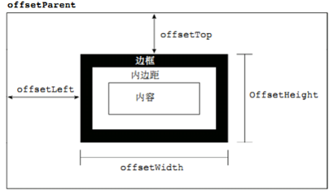
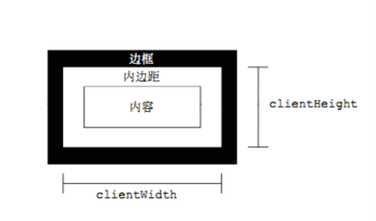
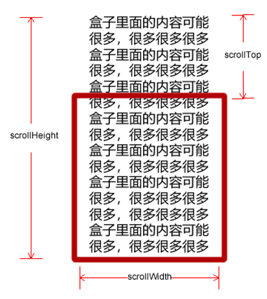

#  **day05 - Web APIs**

> **学习目标:**
>
> 能够说出常见 offset 系列属性的作用
>
> 能够说出常见 client 系列属性的作用
>
> 能够说出常见 scroll 系列属性的作用
>
> 能够封装简单动画函数

## **1.1. **元素偏移量 offset 系列

### 1.1.1 offset 概述 

offset 翻译过来就是偏移量， 我们使用 offset系列相关属性可以动态的得到该元素的位置（偏移）、大小等。

1. 获得元素距离带有定位父元素的位置

2. 获得元素自身的大小（宽度高度）

3. 注意：返回的数值都不带单位

   



### 1.1.2 offset 与 style 区别 

#### offset

- offset 可以得到任意样式表中的样式值

- offset 系列获得的数值是没有单位的

- offsetWidth 包含padding+border+width

- offsetWidth 等属性是只读属性，只能获取不能赋值

- > 所以，我们想要获取元素大小位置，用offset更合适

#### style

- style 只能得到行内样式表中的样式值

- style.width 获得的是带有单位的字符串

- style.width 获得不包含padding和border 的值

- style.width 是可读写属性，可以获取也可以赋值

- > 所以，我们想要给元素更改值，则需要用style改变

> **因为平时我们都是给元素注册触摸事件，所以重点记住 targetTocuhes**

### 1.1.3  案例：获取鼠标在盒子内的坐标

1. 我们在盒子内点击，想要得到鼠标距离盒子左右的距离。
2. 首先得到鼠标在页面中的坐标（e.pageX, e.pageY）
3. 其次得到盒子在页面中的距离 ( box.offsetLeft, box.offsetTop)
4. 用鼠标距离页面的坐标减去盒子在页面中的距离，得到 鼠标在盒子内的坐标
5. 如果想要移动一下鼠标，就要获取最新的坐标，使用鼠标移动

```javascript
var box = document.querySelector('.box');
box.addEventListener('mousemove', function(e) {
var x = e.pageX - this.offsetLeft;
var y = e.pageY - this.offsetTop;
this.innerHTML = 'x坐标是' + x + ' y坐标是' + y;
})
```

### 1.1.4  案例：模态框拖拽

弹出框，我们也称为模态框。

​	1.点击弹出层，会弹出模态框， 并且显示灰色半透明的遮挡层。

​	2.点击关闭按钮，可以关闭模态框，并且同时关闭灰色半透明遮挡层。

​	3.鼠标放到模态框最上面一行，可以按住鼠标拖拽模态框在页面中移动。

​	4.鼠标松开，可以停止拖动模态框移动

### 1.1.5. 案例分析:

1. 点击弹出层， 模态框和遮挡层就会显示出来 display:block;
2. 点击关闭按钮，模态框和遮挡层就会隐藏起来 display:none;
3. 在页面中拖拽的原理：鼠标按下并且移动， 之后松开鼠标
4. 触发事件是鼠标按下mousedown，鼠标移动mousemove 鼠标松开 mouseup
5. 拖拽过程:  鼠标移动过程中，获得最新的值赋值给模态框的left和top值，这样模态框可以跟着鼠标走了
6. 鼠标按下触发的事件源是最上面一行，就是  id 为 title 
7. 鼠标的坐标减去 鼠标在盒子内的坐标， 才是模态框真正的位置。
8. 鼠标按下，我们要得到鼠标在盒子的坐标。
9. 鼠标移动，就让模态框的坐标  设置为  ：鼠标坐标 减去盒子坐标即可，注意移动事件写到按下事件里面。
10. 鼠标松开，就停止拖拽，就是可以让鼠标移动事件解除  

```javascript
 // 1. 获取元素
        var login = document.querySelector('.login');
        var mask = document.querySelector('.login-bg');
        var link = document.querySelector('#link');
        var closeBtn = document.querySelector('#closeBtn');
        var title = document.querySelector('#title');
        // 2. 点击弹出层这个链接 link  让mask 和login 显示出来
        link.addEventListener('click', function() {
                mask.style.display = 'block';
                login.style.display = 'block';
            })
            // 3. 点击 closeBtn 就隐藏 mask 和 login 
        closeBtn.addEventListener('click', function() {
                mask.style.display = 'none';
                login.style.display = 'none';
            })
            // 4. 开始拖拽
            // (1) 当我们鼠标按下， 就获得鼠标在盒子内的坐标
        title.addEventListener('mousedown', function(e) {
            var x = e.pageX - login.offsetLeft;
            var y = e.pageY - login.offsetTop;
            // (2) 鼠标移动的时候，把鼠标在页面中的坐标，减去 鼠标在盒子内的坐标就是模态框的left和top值
            document.addEventListener('mousemove', move)

            function move(e) {
                login.style.left = e.pageX - x + 'px';
                login.style.top = e.pageY - y + 'px';
            }
            // (3) 鼠标弹起，就让鼠标移动事件移除
            document.addEventListener('mouseup', function() {
                document.removeEventListener('mousemove', move);
            })
        })

```

### 1.1.6  案例：仿京东放大镜

1. 整个案例可以分为三个功能模块
2. 鼠标经过小图片盒子， 黄色的遮挡层 和 大图片盒子显示，离开隐藏2个盒子功能
3. 黄色的遮挡层跟随鼠标功能。 
4. 移动黄色遮挡层，大图片跟随移动功能。

### 1.1.7. 案例分析:

1. 黄色的遮挡层跟随鼠标功能。
2. 把鼠标坐标给遮挡层不合适。因为遮挡层坐标以父盒子为准。
3. 首先是获得鼠标在盒子的坐标。 
4. 之后把数值给遮挡层做为left 和top值。
5. 此时用到鼠标移动事件，但是还是在小图片盒子内移动。
6. 发现，遮挡层位置不对，需要再减去盒子自身高度和宽度的一半。
7. 遮挡层不能超出小图片盒子范围。
8. 如果小于零，就把坐标设置为0
9. 如果大于遮挡层最大的移动距离，就把坐标设置为最大的移动距离
10. 遮挡层的最大移动距离：小图片盒子宽度 减去 遮挡层盒子宽度


```javascript
window.addEventListener('load', function() {
    var preview_img = document.querySelector('.preview_img');
    var mask = document.querySelector('.mask');
    var big = document.querySelector('.big');
    // 1. 当我们鼠标经过 preview_img 就显示和隐藏 mask 遮挡层 和 big 大盒子
    preview_img.addEventListener('mouseover', function() {
        mask.style.display = 'block';
        big.style.display = 'block';
    })
    preview_img.addEventListener('mouseout', function() {
            mask.style.display = 'none';
            big.style.display = 'none';
        })
        // 2. 鼠标移动的时候，让黄色的盒子跟着鼠标来走
    preview_img.addEventListener('mousemove', function(e) {
        // (1). 先计算出鼠标在盒子内的坐标
        var x = e.pageX - this.offsetLeft;
        var y = e.pageY - this.offsetTop;
        // console.log(x, y);
        // (2) 减去盒子高度 300的一半 是 150 就是我们mask 的最终 left 和top值了
        // (3) 我们mask 移动的距离
        var maskX = x - mask.offsetWidth / 2;
        var maskY = y - mask.offsetHeight / 2;
        // (4) 如果x 坐标小于了0 就让他停在0 的位置
        // 遮挡层的最大移动距离
        var maskMax = preview_img.offsetWidth - mask.offsetWidth;
        if (maskX <= 0) {
            maskX = 0;
        } else if (maskX >= maskMax) {
            maskX = maskMax;
        }
        if (maskY <= 0) {
            maskY = 0;
        } else if (maskY >= maskMax) {
            maskY = maskMax;
        }
        mask.style.left = maskX + 'px';
        mask.style.top = maskY + 'px';
        // 3. 大图片的移动距离 = 遮挡层移动距离 * 大图片最大移动距离 / 遮挡层的最大移动距离
        // 大图
        var bigIMg = document.querySelector('.bigImg');
        // 大图片最大移动距离
        var bigMax = bigIMg.offsetWidth - big.offsetWidth;
        // 大图片的移动距离 X Y
        var bigX = maskX * bigMax / maskMax;
        var bigY = maskY * bigMax / maskMax;
        bigIMg.style.left = -bigX + 'px';
        bigIMg.style.top = -bigY + 'px';

    })

})
```

## 1.2. 元素可视区 client 系列

### 1.2.1 client概述

client 翻译过来就是客户端，我们使用 client 系列的相关属性来获取元素可视区的相关信息。通过 client
系列的相关属性可以动态的得到该元素的边框大小、元素大小等。




### 1.2.2. 淘宝 flexible.js 源码分析

立即执行函数 (function(){})()  或者 (function(){}())

主要作用： 创建一个独立的作用域。 避免了命名冲突问题

下面三种情况都会刷新页面都会触发 load 事件。

1.a标签的超链接

2.F5或者刷新按钮（强制刷新）

3.前进后退按钮

但是 火狐中，有个特点，有个“往返缓存”，这个缓存中不仅保存着页面数据，还保存了DOM和JavaScript的状态；实际上是将整个页面都保存在了内存里。

所以此时后退按钮不能刷新页面。

此时可以使用 pageshow事件来触发。，这个事件在页面显示时触发，无论页面是否来自缓存。在重新加载页面中，pageshow会在load事件触发后触发；根据事件对象中的persisted来判断是否是缓存中的页面触发的pageshow事件

`注意这个事件给window添加。`


## 1.3.元素滚动 scroll 系列

### 1.3.1. scroll 概述

scroll 翻译过来就是滚动的，我们使用 scroll 系列的相关属性可以动态的得到该元素的大小、滚动距离等。




### 1.3.2. 页面被卷去的头部

如果浏览器的高（或宽）度不足以显示整个页面时，会自动出现滚动条。当滚动条向下滚动时，页面上面被隐藏掉的高度，我们就称为页面被卷去的头部。滚动条在滚动时会触发 onscroll事件。


### 1.3.3.案例：仿淘宝固定右侧侧边栏

1. 原先侧边栏是绝对定位
2. 当页面滚动到一定位置，侧边栏改为固定定位
3. 页面继续滚动，会让 返回顶部显示出来

### 1.3.4.案例分析: 

1. 需要用到页面滚动事件 scroll  因为是页面滚动，所以事件源是document
2. 滚动到某个位置，就是判断页面被卷去的上部值。
3. 页面被卷去的头部：可以通过window.pageYOffset 获得  如果是被卷去的左侧window.pageXOffset
4. 注意，元素被卷去的头部是element.scrollTop  , 如果是页面被卷去的头部 则是 window.pageYOffset
5. 其实这个值 可以通过盒子的 offsetTop可以得到，如果大于等于这个值，就可以让盒子固定定位了

```javascript
  //1. 获取元素
        var sliderbar = document.querySelector('.slider-bar');
        var banner = document.querySelector('.banner');
        // banner.offestTop 就是被卷去头部的大小 一定要写到滚动的外面
        var bannerTop = banner.offsetTop
            // 当我们侧边栏固定定位之后应该变化的数值
        var sliderbarTop = sliderbar.offsetTop - bannerTop;
        // 获取main 主体元素
        var main = document.querySelector('.main');
        var goBack = document.querySelector('.goBack');
        var mainTop = main.offsetTop;
        // 2. 页面滚动事件 scroll
        document.addEventListener('scroll', function() {
            // console.log(11);
            // window.pageYOffset 页面被卷去的头部
            // console.log(window.pageYOffset);
            // 3 .当我们页面被卷去的头部大于等于了 172 此时 侧边栏就要改为固定定位
            if (window.pageYOffset >= bannerTop) {
                sliderbar.style.position = 'fixed';
                sliderbar.style.top = sliderbarTop + 'px';
            } else {
                sliderbar.style.position = 'absolute';
                sliderbar.style.top = '300px';
            }
            // 4. 当我们页面滚动到main盒子，就显示 goback模块
            if (window.pageYOffset >= mainTop) {
                goBack.style.display = 'block';
            } else {
                goBack.style.display = 'none';
            }

        })
```

### 1.3.5.页面被卷去的头部兼容性解决方案

需要注意的是，页面被卷去的头部，有兼容性问题，因此被卷去的头部通常有如下几种写法：

1. 声明了 DTD，使用 document.documentElement.scrollTop
2. 未声明 DTD，使用  document.body.scrollTop
3. 新方法 window.pageYOffset和 window.pageXOffset，IE9 开始支持

```javascript
function getScroll() {
    return {
      left: window.pageXOffset || document.documentElement.scrollLeft || document.body.scrollLeft||0,
      top: window.pageYOffset || document.documentElement.scrollTop || document.body.scrollTop || 0
    };
 } 
使用的时候  getScroll().left

```

## 1.4. 三大系列总结


他们主要用法：

1.offset系列 经常用于获得元素位置    offsetLeft  offsetTop

2.client经常用于获取元素大小  clientWidth clientHeight

3.scroll 经常用于获取滚动距离 scrollTop  scrollLeft  

4.注意页面滚动的距离通过 window.pageXOffset  获得

## 1.5. mouseenter 和mouseover的区别

- 当鼠标移动到元素上时就会触发mouseenter 事件
- 类似 mouseover，它们两者之间的差别是
- mouseover 鼠标经过自身盒子会触发，经过子盒子还会触发。mouseenter  只会经过自身盒子触发
- 之所以这样，就是因为mouseenter不会冒泡
- 跟mouseenter搭配鼠标离开 mouseleave  同样不会冒泡


## 1.6. 动画函数封装

### 1.6.1. 动画实现原理 

> 核心原理：通过定时器 setInterval() 不断移动盒子位置。

实现步骤：

1. 获得盒子当前位置
2. 让盒子在当前位置加上1个移动距离
3. 利用定时器不断重复这个操作
4. 加一个结束定时器的条件
5. 注意此元素需要添加定位，才能使用element.style.left

### 1.6.2. 动画函数给不同元素记录不同定时器 

如果多个元素都使用这个动画函数，每次都要var 声明定时器。我们可以给不同的元素使用不同的定时器（自己专门用自己的定时器）。

> 核心原理：利用 JS 是一门动态语言，可以很方便的给当前对象添加属性。

```javascript
 function animate(obj, target) {
            // 当我们不断的点击按钮，这个元素的速度会越来越快，因为开启了太多的定时器
            // 解决方案就是 让我们元素只有一个定时器执行
            // 先清除以前的定时器，只保留当前的一个定时器执行
            clearInterval(obj.timer);
            obj.timer = setInterval(function() {
                if (obj.offsetLeft >= target) {
                    // 停止动画 本质是停止定时器
                    clearInterval(obj.timer);
                }
                obj.style.left = obj.offsetLeft + 1 + 'px';

            }, 30);
        }

```


