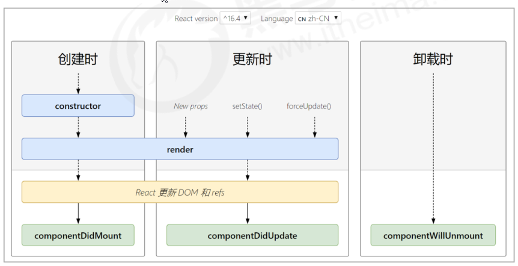

# 组件的生命周期

## 概述

- 意义：组件的生命周期有助于理解组件的运行方式、完成更复杂的组件功能、分析组件错误原因等
- 组件的生命周期：组件从被创建到挂载到页面中运行，再到组件不用时卸载的过程
- 钩子函数的作用：为开发人员在不同阶段操作组件提供了时机。
- **只有 类组件 才有生命周期。**

## 生命周期的整体说明

- 每个阶段的执行时机
- 每个阶段钩子函数的执行顺序
- 每个阶段钩子函数的作用
- <http://projects.wojtekmaj.pl/react-lifecycle-methods-diagram/>

## 挂载阶段

执行时机：组件创建时（页面加载时）

执行顺序：

| 钩子 函数         | 触发时机                  | 作用                                     |
| ----------------- | ------------------------- | ---------------------------------------- |
| constructor       | 创建组件时，最先执行      | 1. 初始化state  2. 创建Ref等             |
| render            | 每次组件渲染都会触发      | 渲染UI（**注意： 不能调用setState()** ） |
| componentDidMount | 组件挂载（完成DOM渲染）后 | 1. 发送网络请求   2.DOM操作              |

## 更新阶段

- 执行时机：1. setState() 2. forceUpdate() 3. 组件接收到新的props
- 说明：以上三者任意一种变化，组件就会重新渲染
- 执行顺序

| 钩子函数           | 触发时机                  | 作用                                                 |
| ------------------ | ------------------------- | ---------------------------------------------------- |
| render             | 每次组件渲染都会触发      | 渲染UI（与 挂载阶段 是同一个render）                 |
| componentDidUpdate | 组件更新（完成DOM渲染）后 | DOM操作，可以获取到更新后的DOM内容，不要调用setState |

## 卸载阶段

- 执行时机：组件从页面中消失

| 钩子函数             | 触发时机                 | 作用                               |
| -------------------- | ------------------------ | ---------------------------------- |
| componentWillUnmount | 组件卸载（从页面中消失） | 执行清理工作（比如：清理定时器等） |

# todomvc案例优化

