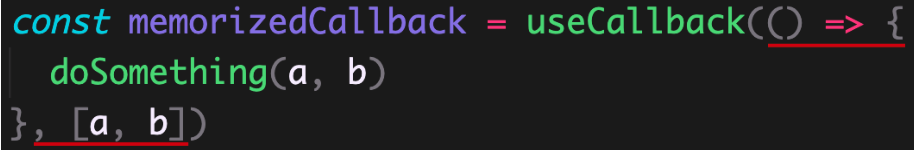

# Hooks其他API

## useRef hook


## useContext hook


# Hooks进阶

## 概述

根据前面的学习我们知道，Hooks（内置或自定义）只能在函数组件中使用。因此，Hooks 与函数组件是密不可分的。

所以，要想深入理解 Hooks，就必须先理解函数组件的特性，因为这些特性会影响到了 Hooks 的使用。

本节，我们先来理解函数组件的特性。然后，根据这些特性对实际开发产生的影响，我们再来学习 **useCallback / useMemo / useRef** 等内置 Hooks。

最后，我们来模拟实现 useState / useEffect 这两个 Hooks，来深入理解 Hooks 的实现原理。

## 函数组件的特性

React 中的函数组件是通过函数来实现的，函数组件的公式：`f(state) => UI`，即：数据到视图的映射。

函数组件本身很简单，但因为是通过函数实现的，所以，在使用函数组件时，就会体现出函数所具有的特性来。

函数组件的特性说明：

- 对于函数组件来说，每次状态更新后，组件都会重新渲染。
- 并且，**每次组件更新都像是在给组件拍照。每张照片就代表组件在某个特定时刻的状态。**
- 或者说：`组件的每次特定渲染，都有自己的 props/state/事件处理程序` 等。
- 这些照片记录的状态，从代码层面来说，是通过 JS 中函数的闭包机制来实现的。

这就是 React 中函数组件的特性，更加的函数式（利用函数的特性）

```jsx
import { useState } from 'react'
import ReactDOM from 'react-dom'

// 没有 hooks 的函数组件：
const Counter = ({ count }) => {
  // console.log(count)
  const showCount = () => {
    setTimeout(() => {
      console.log('展示 count 值：', count)
    }, 3000)
  }

  return (
    <div>
      <button onClick={showCount}>点击按钮3秒后显示count</button>
    </div>
  )
}

const App = () => {
  const [count, setCount] = useState(0)

  return (
    <div>
      <h1>计数器：{count}</h1>
      <button onClick={() => setCount(count + 1)}>+1</button>
      <hr />
      {/* 子组件 */}
      <Counter count={count} />
    </div>
  )
}

ReactDOM.render(<App />, document.getElementById('root'))

```

## 函数组件特性带来的问题

函数组件的特性：**组件的每次特定渲染，都有自己的 props/state/事件处理程序 等。**

该特性，导致了几个问题：

- 组件每次重新渲染时，*组件内部的事件处理程序等函数都会重新创建，导致子组件每次都会接收到不同的 props，从而重复进行不必要的渲染（性能问题）*。
- 组件内的事件处理程序等函数中，只能获取到那一次特定渲染时的数据，这是合理的（闭包的原因）。

说明：函数组件配合 Hooks 使用时，会不会因为闭包以及每次都创建新的函数等，让组件变慢？答案：[不会！](https://react.docschina.org/docs/hooks-faq.html#are-hooks-slow-because-of-creating-functions-in-render)

注意：在没有发现性能问题前，避免过早的性能优化。如果要优化，一定要考虑优化成本是否大于优化后的价值。

对于第一个问题，我们使用 `React.memo` 配合 `useCallback/useMemo` 这两个 Hooks 来解决。

对于第二个问题，我们使用 `useRef Hook` 来解决。

## React.memo高阶组件

### 介绍

React.memo 高阶组件的使用场景说明：

React 组件更新机制：只要父组件状态更新，子组件就会无条件的一起更新。

- 子组件 props 变化时更新过程：组件代码执行 -> JSX Diff（配合虚拟 DOM）-> 渲染（变化后的内容）【 DOM 操作】。
- 子组件 props 无变化更新过程：组件代码执行 -> JSX Diff（配合虚拟 DOM）【无 DOM 操作】。

注意：此处更新指的是组件代码执行、JSX 进行 Diff 操作（纯 JS 的操作，速度非常快，不会对性能产生太多影响）。

- 如果组件 props 改变了，那么，该组件就必须要更新，才能接收到最新的 props。
- 但是，如果组件 props 没有改变时，组件也要进行一次更新。实际上，这一次更新是没有必要的。

如果要避免组件 props 没有变化而进行的不必要更新（Diff），这种情况下，就要使用 React.memo 高阶组件。

注：`对于 class 组件来说，可以使用 PureComponent 或 shouldComponentUpdate 钩子函数来实现`。

```jsx
import { useState } from 'react'
import ReactDOM from 'react-dom'

const Child2 = ({ count }) => {
  console.log('Child2 子组件代码执行了')
  return <div style={{ backgroundColor: '#abc' }}>子组件2：{count}</div>
}

const Child1 = () => {
  console.log('Child1 子组件代码执行了')
  return <div style={{ backgroundColor: '#def' }}>子组件1</div>
}

const App = () => {
  const [count, setCount] = useState(0)

  return (
    <div style={{ backgroundColor: 'pink', padding: 10 }}>
      <h1>计数器：{count}</h1>
      <button onClick={() => setCount(count + 1)}>+1</button>
      <hr />

      {/* 子组件 */}
      <Child1 />
      <br />
      <Child2 count={count} />
    </div>
  )
}

ReactDOM.render(<App />, document.getElementById('root'))

```

### 语法

使用场景：当你想要避免函数组件 props 没有变化而产生的不必要更新时，就要用到 React.memo 了。

作用：**记忆组件上一次的渲染结果，在 props 没有变化时复用该结果，避免函数组件不必要的更新**。


解释：

- React.memo 是一个高阶组件，用来记忆（memorize）组件。
- 参数（Child）：需要被记忆的组件，或者说是需要避免不必要更新的组件。
- 返回值（MemoChild）：React 记住的 Child 组件。

原理：通过对比检查更新前后 props 是否相同，来决定是否复用上一次的渲染结果，

- 如果相同，复用上一次的渲染结果；
- 如果不同，重新渲染组件。


**并不是所有的组件都适合使用memo，比如child2组件，每次都需要重新渲染，使用memo反而会使性能变得更低，逻辑也变得更复杂**

### 浅层对比

默认情况下，React.memo 只会对更新前后的 props 进行浅对比（shallow compare）与 PureComponent 相同。

也就是说，对于对象类型的 prop 来说，只会比较引用

- 如果更新前后的引用相同，复用上一次的渲染结果（不会重新渲染该组件）。
- 如果更新前后的引用不同，重新渲染该组件。

如果你要手动控制比较过程，可以使用 React.memo 的第二个参数：


解释：

- 第二个参数：用来比较更新前后 props 的函数。
- 返回值：如果返回 true，表示记住（不重新渲染）该组件；如果返回 false，表示重新渲染该组件。

## useCallback

### 使用场景

在使用 React.memo 时，对于对象类型的 props，只会比较引用（浅对比）。

但是，因为**组件每次更新都会创建新的 props 值**，比如，新的对象、事件处理程序等（函数组件的特性）。

这就导致：React.memo 在处理对象类型的 props 时，会失效（每次的 props 都是新对象）。

但是，我们还是想让 React.memo 在处理对象类型的 props 时，也有效。


为了让 React.memo 处理对象类型的 props 有效，只要在*组件更新期间保持对象类型引用相*等，就可以了。

这时候，就要用到以下两个 Hooks：

- `useCallback` Hook：记住函数的引用，在组件每次更新时返回相同引用的函数。
- `useMemo` Hook：记住任意数据（数值、对象、函数等），在组件每次更新时返回相同引用的数据【功能之一】


### 基本使用

使用场景：在使用 React.memo 时，为了组件每次更新时都能获取到相同引用的函数，就要用到 useCallback Hook

注意：**需要配合 React.memo 高阶函数一起使用**。

作用：记忆传入的回调函数，这个被记住的回调函数会一直生效，直到依赖项发生改变



解释：

- 第一个参数：必选，需要被记忆的回调函数。
- 第二个参数：必选，依赖项数组，用于指定回调函数中依赖（用到）的数据（类似于 useEffect 的第二个参数）。
- 即使没有依赖，也得传入空数组（[]），此时，useCallback 记住的回调函数就会一直生效。
- 返回值：useCallback 记住的回调函数。
- useCallback 记住的回调函数会一直生效（或者说会一直返回同一个回调函数），直到依赖项发生改变。
