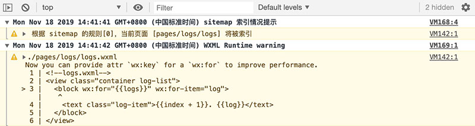
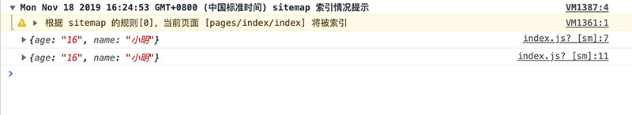

# 小程序基础-进阶

## 今日重点

- 小程序的数据响应
- 小程序的事件注册
- 小程序的生命周期
- 小程序网络请求和常用API
- 案例-猫眼电影

## 数据响应

​		通过前面学习，掌握了小程序页面的布局，然而小程序页面中显示的内容都是静态的，真正线上运行的小程序内容都应该是动态的，接下来我们学习如何在小程序中处理页面**数据响应**。

### 数据定义和绑定

**`本节目标：`**页面数据定义和绑定

* 小程序内容数据是由 JavaScript 控制提供的。每个页面都是由 .wxml、.wxss、.js、.json 构成，其中 wxml 定义结构，wxss 定义表现、json 进行配置，**.js 则专门处理逻辑。**

* **所谓数据绑定是指数据与页面中组件的关联关系。使用 Mustache 语法（双大括号）将数据变量包起来**。和vue用法类似。

> 使用Page()方法，声明data数据对象

1. **简单数据**

```javascript
// Page 是全局提供的，用来创建一个页面实例
Page({
	// 通过 data 属性，初始化页面中用到的数据
	data: {
 	  // 字符串类型
  	  message: 'hello world!',
	}
});
```

   ```html
<text class="msg">{{message}}</text>
   ```

   ```css
.msg {
  display: block;
	font-size: 60rpx;
  font-weight: bold;
}
   ```

   如下图：

   

2. **复杂数据**

```javascript
Page({
  // 通过 data 属性，初始化页面中用到的数据
  data: {
    user: {
      name: '小明',
      age: 16
    },
    courses: ['wxml', 'wxss', 'javascript']
  }
});
```

```html
<text>我叫{{user.name}}，我今年{{user.age}}岁了，我在学习{{courses[0]}}课程。</text>
```

3. **运算**

```javascript
Page({
  // 通过 data 属性，初始化页面中用到的数据
  data: {
    a: 10,
    b: 5,
    flag: true
  }
});
```

```html
<text>{{a}} + {{b}} = {{a + b}}</text>
<text>{{flag ? '是': '否'}}</text>
```


### 列表渲染

**`本节目标：`**使用 wx:for渲染列表数据

> 通过 wx:for 控制（类似vue中的指令v-for）生成多个元素。

* 语法：`wx:for="{{arr}}"`

​       **wx:for 属性将当前组件按着数组的长度动态创建，并且通过内置默认的 index 变量可以访问到数组的索引值，通过内置默认的item变量可以访问到单元值。**

1. **基本用法**

```javascript
Page({
  // 通过 data 属性，初始化页面中用到的数据
  data: {
    users: [
      {name: '小明', age: 16, gender: '男'},
      {name: '小刚', age: 19, gender: '男'},
      {name: '小红', age: 18, gender: '女'},
      {name: '小丽', age: 17, gender: '女'}
    ]
  }
});
```

```html
<view wx:for="{{users}}">
  <text>{{index+1}}</text>
  <text>{{item.name}}</text>
  <text>{{item.age}}</text>
  <text>{{item.gender}}</text>
</view>
```

   

**注意：**

* wx:for="{{list}}"，使用模版语法{{}}绑定数据

* 支持对Object类型的遍历渲染

2. **指定索引值变量、单元值变量**
- 通过 wx:for 对数组数据进行遍历时，可以分别指定访问数组索引值变量和单元值的变量。
   - wx:for-index 指定索引值变量，wx:for-item 指定单元值变量。
   - wx:for 支持嵌套
   
```javascript
Page({
  // 通过 data 属性，初始化页面中用到的数据
  data: {
    brands: [
      {
        name: '耐克',
        origin: '美国',
        category: ['男装', '女装', '鞋', '体育用品']
      },
      {
        name: 'SK-II',
        origin: '韩国',
        category: ['防晒霜','面膜', '洗护']
      }
    ]
  }
});
```

```html
<view wx:for="{{brands}}" wx:for-index="k" wx:for-item="v">
  <view>
    <text>{{k+1}} </text>
    <text> {{v.name}} </text>
    <text> {{v.origin}}</text>
  </view>
  <view>
    <text wx:for="{{v.category}}">{{item}}</text>
  </view>
</view>
```

   


3.  **wx:key**

   当使用 wx:for 遍历数据时，会有如下图所示的警告，其原因是为了提升性能，建议添加 wx:key 属性。
   
   
   
   wx:key 的值以两种形式提供：
   
   1. 字符串
   2. 数字
   
```html
<view wx:key="name" wx:for="{{brands}}" wx:for-index="k" wx:for-item="v">
  <view>
    <text>{{k+1}} </text>
    <text> {{v.name}} </text>
    <text> {{v.origin}}</text>
  </view>
  <view>
    <text wx:for="{{v.category}}">{{item}}</text>
  </view>
</view>
```

### 动态属性

**`本节目标：`**对元素上的属性进行动态绑定

语法：`属性名="{{data}}"`

```js
  data: {
    addClass: true,
    url:'/pages/meng/index',
  }   
```

```html
<view class="{{addClass?'className1':'className2'}}">
	<text>动态class</text>
  <navigator url="{{url}}">go</navigator>
</view>
```


### 条件渲染

**`本节目标：`**根据条件控制是否渲染某个（些）元素

语法：`wx:if="{{布尔值}}"`

1. **基本用法**

```html
<view wx:if="{{true}}">
  <text>看不到我？</text>
</view>
```

2.  **多分支**

```html
<view wx:for="{{users}}">
  <text>{{index+1}} </text>
  <text> {{item.name}}</text>
  <text> {{item.age}} </text>
  <text wx:if="{{item.age <= 14}}"> 儿童</text>
  <text wx:elif="{{item.age < 18}}"> 未成年</text>
  <text wx:else> 成年人</text>
</view>
```

```javascript
Page({
  // 通过 data 属性，初始化页面中用到的数据
  data: {
    users: [
      {name: '小明', age: 16},
      {name: '小红', age: 13},
      {name: '小丽', age: 19}
    ]
  }
});
```

   

   

## 事件处理

> 小程序中的事件同网页 DOM 中的事件含义一样，只是语法及及其执行细节上略有差异。

### 事件监听

**`本节目标：`**给元素注册事件

> 小程中通过属性为组件添加事件的监听。例如 tap 事件（相当于 html 中的 click事件）

**语法： bind:事件名称="回调函数" 或者 bind事件名称="回调函数"**

1. 点击click事件：

```html
<!-- 为button组件绑定了 tap 事件，当用户点击了，会执行 sayHi 函数 -->
<button type="primary" bind:tap="sayHi">点我试试</button>
```

```javascript
Page({
  // 事件回调函数
  sayHi: function () {
    console.log('Hi~')
  }
});
```

2. 监听表单的 blur、 focus事件：

```javascript
Page({
  // 事件回调函数
  sayHi: function () {
    console.log('Hi~');
  },
  sayBye: function () {
    console.log('Bye~');
  }
});
```

```html
<view> 
  <label for="">姓名: </label>
  <input type="text" bind:focus="sayHi" bind:blur="sayBye" />
</view>
<view> 
  <label for="">密码: </label>
  <input type="text"/>
</view>
```

**以前在学习 DOM 时见到的事件，绝大多数在小程序中都是被支持的。**

扩展阅读：[事件文档](https://developers.weixin.qq.com/miniprogram/dev/framework/view/wxml/event.html)

### 事件对象

**`本节目标：`**获取事件对象和传参

> 当某个事件被触发时，通过一个对象可以获得被触发事件的相关信息。事件对象，回调函数的第一个参数即为事件对象。

注意：

* 小程序中**不支持**事件回调函数在**模版中传递参数**
* 获取元素data-params自定义属性值=》推荐使用event对象的**currentTarget去获取对应触发元素自定义属性的值**

说明：**event.target** 获取触发事件的元素属性，例如自定义属性

```javascript
Page({
  // 事件回调函数
  sayHi: function (ev) {
    // ev 即为事件对象，包含了事件相关信息
    // 着重关注 ev.target.dataset 它可以获得 wxml 组件中以 data- 开头的自定义属性
    console.log(ev.target.dataset);
  },
  
  sayHello: function (ev) {
    console.log(ev.target.dataset);
  }
});
```

```html
<view class="parent" data-name="大明" data-age="40" bind:tap="sayHello">
	<view class="child" data-name="小明" data-age="16" bind:tap="sayHi">点我试试</view>
</view>
```



### 事件冒泡

**`本节目标：`**小程序事件冒泡

> 小程序事件处理机制与DOM类似，**冒泡现象依然存在**，但并非所有事件都会冒泡。[查看-事件分类-列表说明]((https://developers.weixin.qq.com/miniprogram/dev/framework/view/wxml/event.html)

```html
<view class="parent" bind:tap="foo">
  <view class="child" bind:tap="bar"></view>
</view>
```

```javascript
Page({
  // 事件回调函数
  foo: function () {
    console.log('parent');
  },
  bar: function () {
    console.log('child');
  }
});
```

如下图所示，当点击 .child 盒子时，同时触发了 .child 和 .parent 的 tap事件


如果想要阻止冒泡现象的发生，可以使用小程序提供了另一种事件监听的方式，**即 catch:事件名称="回调函数" 或 catch事件名称="回调函数"**，bind 和 catch 的区别就在于是否阻止冒泡。

```html
<view class="parent" bind:tap="foo">
  <view class="child" catch:tap="bar"></view>
</view>
```

如下图所示，当点击子盒子，父盒子的事件不会被触发了


## 数据更新

**`本节目标：`**数据驱动视图

> 使用Page.prototype.setData(data:object, callback:function)

| 字段     | 类型     | 必填 | 描述                                      | 最低版本                                                     |
| :------- | :------- | :--- | :---------------------------------------- | :----------------------------------------------------------- |
| data     | Object   | 是   | 要改变的数据                              |                                                              |
| callback | Function | 否   | setData引起的界面更新渲染完毕后的回调函数 | [1.5.0](https://developers.weixin.qq.com/miniprogram/dev/framework/compatibility.html) |

注意：

* 第一个参数传入data变量中变量名和新值：{变量名 : 新值 }

* 其中 **变量名** 可以以数据路径的形式给出，支持改变数组中的某一项或对象的某个属性，如 `array[2].message`，`a.b.c.d`。

示例代码：

wxml：

```jsx
<view>
  <text>{{msg}}</text>
  <button bindtap="rev">reverse</button>
    <!-- 列表 -->
  <view style="display:flex;flex-direction:column">
    <text wx:for="{{list}}">{{index+' '+item.name}}</text>
  </view>
  <button bindtap="changeArr">修改数组</button>
</view>  
```

js:

```js
Page({
  data:{
   	msg: 'hello wx!',
    list: [{ id: 1, name: 'html' }, { id: 2, name: 'css' }, { id: 3, name: 'js' }, { id: 4, name: 'java' }],
  },
  // 数据响应
  rev(){
    this.setData({
      // 反转文字
      msg: this.data.msg.split('').reverse().join('')
    })
  },
  // 修改数组
  changeArr() {
    this.setData({
      'list[3].name': 'python'
    },()=>{
      console.log(this.data.list)
    })
  }
})
```

**注意：**

1. **直接修改 this.data 而不调用 this.setData 是无法触发视图刷新，还会造成数据不一致**。
2. 仅支持设置可 JSON 化的数据。
3. 单次设置的数据不能超过1024kB，请尽量避免一次设置过多的数据。

扩展阅读：[Page方法详解](https://developers.weixin.qq.com/miniprogram/dev/reference/api/Page.html)  [小程序宿主环境](https://developers.weixin.qq.com/miniprogram/dev/framework/quickstart/framework.html#%E6%B8%B2%E6%9F%93%E5%B1%82%E5%92%8C%E9%80%BB%E8%BE%91%E5%B1%82)


## 生命周期

**`本节目标：`**小程序的生命周期钩子函数

> 小程序是按着某种特定的流程序执行的，并且允许开发人员对执行过程中的若干节点进行事件监听，通常将这些节点称为生命周期，如小程序启动、销毁等。

vue: 常用几个生命周期？

### 分类

小程序中将生命周期分成两类：

* **应用级别**

​      App()中触发

* **页面级别**

  Page()中触发

#### App入口

> 在小程序 app.js 文件中调用 App() 函数，可以注册一个小程序，**应用级别**的生命周期在这里进行监听。

```javascript
// App 函数是小程序内置提供的，接受一个对象类型的数据做为参数。
// 注意大小写
App({
  
  // 小程序启动时
  onLaunch: function () {
    // 全局只会触发1次
    console.log('小程序启动了...');
  },
  // 小程序前台运行时
  onShow: function () {
    // 重复执行
    console.log('小程序前台运行了...');
  },
  // 小程序后台运行时
  onHide: function () {
    // 重复执行
    console.log('小程序后台运行了...');
  },
  // 执行错误时
  onError: function (err) {
    console.log('出错啦!!!');
  },
  // 冷启动（如扫码）打开小程序的页面不存在时
  onPageNotFound: function () {
    console.log('你找到页面去火星了？？？');
  }
})
```

注意：		

* 点击小程序右上角的胶囊的关闭时，并不会将小程序销毁而是处于**后台运行**的状态，当再次打开小程序时并不会触发 onLaunch 生命周期的监听，而是触发 onShow 将小程序重新**前台运行**。

* 关于前台和后台的理解可以简单的理解成**最小化**了，桌面上暂时看不到，但程序依然在运行，常见的如按了 home 键、接听电话等都会将小程序置于后台运行。

* 是不是意味着小程序永远都不会被销毁？答案当然不是！小程序销毁是由微信自动控制的，一般情况下如果某个小程序后台运行超过一定时间或者系统内存不足报警时，微信会主动将小程序销毁，当再次从小程序列表找到这个小程序打开时，会再次触发 onLaunch 这个生命周期。

扩展阅读：[运行机制](https://developers.weixin.qq.com/miniprogram/dev/framework/runtime/operating-mechanism.html)

#### Page页面

> 在小程序页面对应的 .js 文件中调用 Page() 函数，可以注册一个小程序页面，页面级别的生命周期在这里进行监听。

```javascript
Page({
  // 页面加载时 vue=>created
  onLoad: function () {
    // 只会触发1次
    console.log('当前页面被加载了...');
  },
  
  // 页面显示时（返回、tabBar切换、前台运行）
  onShow: function () {
    // 重复触发
    console.log('当前页面显示了...');
  },
  // vue=> mounted
  onReady: function () {
    // 只会触发1次
    console.log('当前页面初次渲染完毕了...');
  },
  
  // 页面隐藏时（跳转、tabBar切换、后台运行）
  onHide: function () {
    console.log('当前页面不见了...');
  }
})
```

注意：

onShow 和 onHide 分别表示当前页面是否被显示/隐藏在当前小程序窗口，这其中包括几种情形：

1. 页面跳转 => onHide
2. 返回         => onShow
3. tabBar    => onSow 或 onHide
4. 前台        => onShow
5. 后台       => onHide

### 场景值

**`本节目标：`**小程序场景值

> 打开小程序的方式多种多样，如扫码、转发、搜索、公众号等，通过[场景值](https://developers.weixin.qq.com/miniprogram/dev/reference/scene-list.html)可以区分用户是以何种方式打开的小程序，通常用于条件判断或者数据统计等。

在小程序生命周期=>App()函数 onLaunch 和 onShow 中可以获得场景值：å

```javascript
App({
  onLaunch: function (res) {
    // 根据打开小程序的方式不同，res.scene 的值也不一样
    console.log(res.scene);
  },
  onShow: function (res) {
    // 这里也可以获取场景值
    console.log(res.scene);
  }
})
```


### 页面传参

**`本节目标：`**小程序query传参

> 为小程序组件 navigator 指定 url 属性，可以实现页面间的跳转，在跳转的同时支持通过 ? 向跳转页面传递参数，格式如下：

```html
<navigator url="/pages/demo/index?name=小明&age=18">跳转页面</navigator>
```

在被跳转的页面中通过监听 onLoad 生命周期获得地址中的参数

```javascript
// pages/demo/index.js
Page({
  onLoad: function (query) {
    // 获取地址中的参数
    console.log(query);
  }
})
```


注意⚠️：如果跳转标签页页面，无法使用query形式传递参数


## 网络请求

**`本节目标：`**小程序发送请求获取后台数据

### 基本使用

**语法：**`wx.request(config:object)`

示例代码：

测试接口：http://5990367be1e4470011c46fa8.mockapi.io/meng/user

```js
Page({
    /**
   * 生命周期函数：vue=>created
   */
  onLoad: function () {
    wx.request({
      url: 'http://5990367be1e4470011c46fa8.mockapi.io/meng/user',
      success(res) {
       console.log(res)
      }
    })
  }
})
```

注意：

1. 请求传递参数都是通过data传递
2. 不支持Promise，通过回调success获取数据

### 使用注意

> 非法的请求域名


**解决办法：**

1. 通过添加合法域名：满足=》支持**https协议**和**已经备案**

* 打开小程序管理后台=》开发=〉开发设置


* 在=》服务器域名=〉点击开始配置


2. 在开发者工具=》详情=〉本地设置，关闭校验


⚠️注意：**适用于开发、测试阶段**

扩展阅读：[网络文档](https://developers.weixin.qq.com/miniprogram/dev/api/network/request/wx.request.html)


## 常用API

**`本节目标：`**小程序常用API方法

* API 是小程序开发的核心，通过 API 开发者可以获得微信底层封装的高级特性，如网络请求、设备信息、本地存储等。

* 小程序的 API 以全局对象 **wx** 为命名空间，**格式为 wx.方法名()**，可全局调用。

扩展阅读：[api文档](https://developers.weixin.qq.com/miniprogram/dev/api/)（查阅）

### 界面

1. wx.showToast 提示框
2. wx.showModal 确认框
3. wx.showTabBar 显示 tabBar
4. wx.hideTabBar 隐藏 tabBar

```js
wx.showToast({
  title: '成功',
  icon: 'success',
  duration: 2000
})
```

### 路由跳转

1. wx.navigateTo(Object object)

保留当前页面，跳转到应用内的某个页面。但是不能跳到 tabbar 页面。使用 [wx.navigateBack](https://developers.weixin.qq.com/miniprogram/dev/api/route/wx.navigateBack.html) 可以返回到原页面。

2. wx.switchTab(Object object)

跳转到 tabBar 页面，并关闭其他所有非 tabBar 页面

3. wx.redirectTo(Object object)

关闭当前页面，跳转到应用内的某个页面。但是不允许跳转到 tabbar 页面。


```js
// 跳转
wx.navigateTo({
    url: '/pages/logs/logs'
})
```

### 数据缓存

* wx.setStorage(Object object) 存储=> 如果存储复杂类型，不需要序列化字符串=》直接存
* wx.getStorage(Object object) 获取
* wx.removeStorage(Object object) 删除

注意⚠️：

1. 单个 key 允许存储的最大数据长度为 1MB，所有数据存储上限为 10MB。
2. 除非用户主动删除或因存储空间原因被系统清理，否则数据都一直可用
3. 支持Promise

```js
wx.setStorage({
  key:"key",
  data:"value"
})
```


## 案例-猫眼电影

**`本节目标：`**完成案例猫眼电影


> 准备

1. 模版文件：`02-其它资源/猫眼电影/maoyan-film`

2. 导入模版项目进行开发

### 首页-列表切换

**`本节目标：`**完成tab切换功能

> 需求：点击热映或者待映切换列表

首页：`pages/movie/index`

步骤：

1. 设置active数据，存储当前选中的值
2. 绑定点击事件获取当前选中值，调用setData修改数据
3. 根据当前选中值添加高亮样式和显示对应的列表内容

```js
const tabs = [{
  type: 'hot',
  name: '热映'
}, {
  type: 'plan',
  name: '待映'
}]
Page({
  data:{
    tabs,
    // hot | plan
    active:'hot'
  },
  // 切换
  switch(e) {
    this.setData({
      active:e.target.dataset.active
    })
  }
});
```

```html
	<view class="tabs">
		<text bindtap="switch" data-active="{{item.type}}" wx:for="{{tabs}}" wx:key="type" class="{{item.type === active && 'current'}}">{{item.name}}</text>
	</view>
```


### 首页-热门电影（作业）

**`本节目标：`**完成热门电影数据获取和渲染

接口测试：https://wx.maoyan.com/mmdb/movie/v2/list/hot.json?limit=10&offset=0&ct=%E5%8C%97%E4%BA%AC

步骤：

1. 在data字段设置列表数据，默认为[]
2. 使用wx.request调用热门电影接口，获取数据，然后setData
3. 根据获取的数据绑定模版，渲染列表

```js
Page({
  data:{
    // 列表数据
    list:[]
  },
  // 页面加载时钩子函数
  onLoad() {
    wx.request({
      url: 'https://wx.maoyan.com/mmdb/movie/v2/list/hot.json',
      data: {
        limit: 12,
        offset: 0,
        ct: '上海'
      },
      success: (res) => {
        const {
          statusCode,
          data
        } = res;
        if (statusCode === 200) {
          const list = data.data.hot;
          // 处理图片
          list.forEach((item) => {
            item.img = item.img.replace('w.h', '128.180')
          })
          this.setData({
            list
          })
        }

      }
    })
  }
})
```

```html
<!-- 电影列表 热映 -->
<view class="items hots" wx:if="{{active==='hot'}}">
	<navigator wx:for="{{list}}" url="./detail">
		<view class="item">
			<!-- 播放按钮 -->
			<text class="play"></text>
			<image src="{{item.img}}"></image>
			<!-- 信息 -->
			<view class="meta">
				<text class="name">{{item.nm}}</text>
				<text class="type">{{item.cat}}</text>
				<text class="actor">{{item.desc}}</text>
				<text class="count">{{item.boxInfo}}</text>
			</view>
			<!-- 状态 -->
			<view class="status">
	<block wx:if="{{item.globalReleased}}">
  			<view class="extra">
					{{item.mk}}<text>分</text>
				</view>
				<text class="btn">购票</text>
  </block>
  <block wx:else>
      			<view class="extra">
					{{item.wish}}<text>人想看</text>
				</view>
				<text class="btn presell">预售</text>
  </block>
			</view>
		</view>
	</navigator>
	
</view>
```

注意：

* 处理图片地址=》替换w.h=>对应的图片宽高
* 设置开发者工具=〉详情=》不校验合法域名
* 接口无数据修改=〉ct参数为其它城市名称

## 今日总结

## 今日作业

案例-猫眼电影 再来一遍


