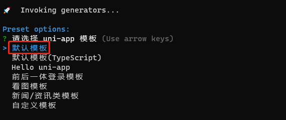

# 黑马优购-首页

## 今日重点

* uni-app入门
* 优购项目介绍和开发准备
* 优购首页开发


## 开发准备

**`本节目标：`**技术选型

> 使用框架开发小程序，提高开发效率

### 原生开发


> 痛点

* 新的语法轮子=》使用TX小程序语法开发
* 开发上的限制

### 使用框架

**`本节目标：`**uni-app介绍和开发方式


> 选型

`uni-app` 是一个**使用 [Vue.js](https://vuejs.org/) 开发所有前端应用的框架**，开发者编写一套代码，可发布到iOS、Android、H5、以及各种小程序（微信/支付宝/百度/头条/QQ/钉钉）等多个平台。

官网：https://uniapp.dcloud.net.cn/

#### 快速上手

 [1. 通过 HBuilderX 可视化界面](https://uniapp.dcloud.net.cn/quickstart.html#_1-%E9%80%9A%E8%BF%87-hbuilderx-%E5%8F%AF%E8%A7%86%E5%8C%96%E7%95%8C%E9%9D%A2)

可视化的方式比较简单，HBuilderX内置相关环境，开箱即用，无需配置nodejs。

开始之前，开发者需先下载安装如下工具：

- HBuilderX：[官方IDE下载地址](http://www.dcloud.io/hbuilderx.html)


 [2. 通过vue-cli命令行](https://uniapp.dcloud.net.cn/quickstart.html#_2-%E9%80%9A%E8%BF%87vue-cli%E5%91%BD%E4%BB%A4%E8%A1%8C)（推荐）=> **演示和基本使用**

除了HBuilderX可视化界面，也可以使用 `cli` 脚手架，可以通过 `vue-cli` 创建 `uni-app` 项目。

#### 创建项目

**`本节目标：`**使用vue-cli创建uni-app项目

> 使用vue-cli创建uni-app项目

* 全局安装vue-cli：`npm install -g @vue/cli`

1. 执行cli

```bash
$ vue create -p dcloudio/uni-preset-vue heima-ugo
```

2. 选择**默认模版**



注意⚠：因为网速原因，下载可能会失败；关掉重新执行即可

#### 运行项目

**`本节目标：`**运行uni-app项目开发小程序

##### 命令说明

```bash
npm run dev:%PLATFORM%
```

`%PLATFORM%` 可取值如下：

| 值            | 平台           |
| ------------- | -------------- |
| h5            | H5             |
| mp-alipay     | 支付宝小程序   |
| mp-baidu      | 百度小程序     |
| **mp-weixin** | 微信小程序     |
| mp-toutiao    | 字节跳动小程序 |
| mp-qq         | qq 小程序      |

##### 开发小程序

步骤：

1. 执行小程序端开发命令

```bash
npm run dev:mp-weixin
```
说明：运行成功之后，项目根目录下会自动打包生成小程序项目代码，如图：


2. 打开小程序开发者工具，**导入上一步生成的小程序项目代码**


注意：填写自己的appid

3. 运行效果


**`总结：`**

1. 运行：`npm run dev:mp-weixin`开启小程序开发服务器
2. 看效果：导入项目下`dist\dev\mp-weixin`目录到小程序开发者工具
3. 在项目src目录修改代码后，会自动重新打包小程序代码，实时查看最新效果

#### 如何开发

**`本节目标：`**使用uni-app开发说明和注意事项

##### 目录结构

一个uni-app工程，默认包含如下目录及文件：

```
┌─components            uni-app组件目录
│  └─comp-a.vue         可复用的a组件
├─pages                 业务页面文件存放的目录
│  ├─index
│  │  └─index.vue       index页面
├─static                存放应用引用静态资源（如图片、视频等）的目录，注意：静态资源只能存放于此
├─App.vue               应用配置，用来配置App全局样式以及监听 应用生命周期
├─main.js               Vue初始化入口文件
├─manifest.json         配置应用名称、appid、logo、版本等打包信息
└─pages.json            配置页面路由、导航条、选项卡等页面类信息
    
```

##### [开发规范](https://uniapp.dcloud.io/frame)

> 开发模式：**vue+原生小程序部分用法**

为了实现多端兼容，综合考虑编译速度、运行性能等因素，`uni-app` 约定了如下开发规范：

- 页面文件遵循 [Vue 单文件组件 (SFC) 规范](https://vue-loader.vuejs.org/zh/spec.html)
- 组件标签靠近小程序规范，详见[uni-app 组件规范](https://uniapp.dcloud.io/component/README)
- 接口能力（JS API）靠近微信小程序规范，但需将前缀 `wx` 替换为 `uni`，详见[uni-app接口规范](https://uniapp.dcloud.io/api/README)
- 数据绑定及事件处理同 `Vue.js` 规范，同时补充了App及页面的生命周期
- 为兼容多端运行，建议使用flex布局进行开发

## 01-项目介绍

**`本节目标：`**黑马优购项目介绍和演示

> 使用uni-app开发微信小程序商城


h5版本预览：https://static-d920919b-787a-4940-ae5e-451fbffcb815.bspapp.com/#/

小程序（代码）：https://gitee.com/heima-project/heima-ugo-wx

## 02-准备页面

**`本节目标：`**准备黑马优购开发页面模板

目录：`02-其它资源/ugo项目相关`

1. 使用vue-cli初始化项目：选择**默认模版**

```bash
$ vue create -p dcloudio/uni-preset-vue heima-ugo
```

2. 运行项目

```bash
$ npm run dev:mp-weixin
```

3. 复制`ugo模板/src`下所有文件，**替换**到自己创建项目的`src`下

说明：出现运行报错，需要安装sass


```bash
$  npm i sass sass-loader -D
```

4. 打开微信开发者工具，导入dist下生成的小程序代码，进行效果预览


## 03-配置小程序AppID 

**`本节目标：`**uni-app项目中配置微信小程序AppID

步骤：

1. 打开`manifest.json`文件
2. 配置`mp-weixin`节点

```json
"mp-weixin": {
  /* 微信小程序特有相关 */
  "appid": "wxa3ec45c12ba77038",
  "setting": {
    "urlCheck": false
  },
  "usingComponents": true
},
```

## 04-项目配置

**`本节目标：`**配置tabBar和window

步骤：

在`pages.json`中

1. 配置window：globalStyle和pages下的style
2. 配置tabBar：`首页 分类 购物车 我的`

```json
{
  "pages": [
    //pages数组中第一项表示应用启动页，参考：https://uniapp.dcloud.io/collocation/pages
    {
      "path": "pages/index/index",
      "style": {
        "navigationBarTitleText": "首页"
      }
    }
    ...
  ],
  "globalStyle": {
    "navigationBarTextStyle": "white",
    "navigationBarTitleText": "黑马ugo",
    "navigationBarBackgroundColor": "#ea4451"
  },
  "tabBar": {
    "color": "#000",
    "selectedColor": "#ea4451",
    "backgroundColor": "#fff",
    "borderStyle": "white",
    "list": [
      {
        "text": "首页",
        "pagePath": "pages/index/index",
        "iconPath": "static/tabs/icon_home@3x.png",
        "selectedIconPath": "static/tabs/icon_home_active@3x.png"
      },
      {
        "text": "分类",
        "pagePath": "pages/category/index",
        "iconPath": "static/tabs/icon_category@3x.png",
        "selectedIconPath": "static/tabs/icon_category_active@3x.png"
      },
      {
        "text": "购物车",
        "pagePath": "pages/cart/index",
        "iconPath": "static/tabs/icon_cart@3x.png",
        "selectedIconPath": "static/tabs/icon_cart_active@3x.png"
      },
      {
        "text": "我的",
        "pagePath": "pages/profile/index",
        "iconPath": "static/tabs/icon_user@3x.png",
        "selectedIconPath": "static/tabs/icon_user_active@3x.png"
      }
    ]
  }
}

```

注意⚠️：

1. 页面路径中的`index文件名`不能省略！
2. 本地静态资源必须放到static目录中才能正常访问

扩展阅读：[配置文档](https://uniapp.dcloud.io/collocation/pages)

## 05-分包配置

**`本节目标：`**小程序分包加载配置

> 因小程序有体积和资源加载限制，各家小程序平台提供了分包方式，优化小程序的下载和启动速度。

* 所谓的**主包**（1个），即放置默认**启动页面/TabBar 页面**，以及一些所有分包都需用到**公共资源**/JS 脚本
* **分包**（多个）默认不需要加载页面资源

原理分析：

在小程序启动时，**默认会下载主包并启动主包内页面**，当用户进入分包内某个页面时，会把对应分包自动下载下来，下载完成后再进行展示。此时终端界面会有等待提示。

步骤：

1. 分析页面=》拆**分非标签页为单独包**（分包）

2. 新建分包目录packone，和pages目录同级

   

3. 在`pages.json`中配置`subPackages`

```json
  "pages": [
    //pages数组中第一项表示应用启动页，参考：https://uniapp.dcloud.io/collocation/pages
    {
      "path": "pages/index/index",
      "style": {
        "enablePullDownRefresh": true
      }
    },
    {
      "path": "pages/category/index"
    },
    {
      "path": "pages/cart/index"
    },
    {
      "path": "pages/profile/index"
    }
    // {
    //   "path": "pages/goods/index"
    // },
    // {
    //   "path": "pages/list/index"
    // },
    // {
    //   "path": "pages/order/index"
    // },
    // {
    //   "path": "pages/auth/index"
    // }
  ],
  // 分包
  "subPackages": [
    {
      // 子包的根目录
      "root": "packone",
      // 子包由哪些页面组成
      "pages": [
        {
          "path": "goods/index",
          "style": {
            "navigationBarTitleText": "详情"
          }
        },
        {
          "path": "list/index"
        },
        {
          "path": "order/index"
        },
        {
          "path": "auth/index"
        }
      ]
    }
  ]
```

4. 重新执行：`npm run dev:mp-weixin`
5. 微信开发者工具中，项目详情=》基本信息中=〉查看分包大小


**`总结：`**

1. 微信小程序微信小程序每个分包的大小是2M，总体积一共不能超过20M
2. `subPackages` 里的pages的路径是 `root` 下的相对路径，不是全路径。

扩展阅读：https://uniapp.dcloud.io/collocation/pages?id=subpackages


## 06-首页-自定义-搜索组件

**`本节目标：`**抽离（封装）首页搜索模块为单独的自定义组件

步骤：

1. 在src下新建components目录
2. 在该目录下新建search.vue组件，放入搜索结构和样式
3. 导入到首页组件中使用

示例：

搜索：`components/search.vue`

```vue
<template>
  <view class="search focused1">
    <view class="sinput">
      <input type="text" placeholder="搜索" />
      <button>取消</button>
    </view>
    <!-- 搜索状态显示=》下边内容 -->
    <view class="scontent" style="display: none">
      <div class="title">
        搜索历史
        <span class="clear"></span>
      </div>
      <!-- 搜索历史 -->
      <div class="history">
        <navigator url="/pages/list/index">小米</navigator>
        <navigator url="/pages/list/index">智能电视</navigator>
        <navigator url="/pages/list/index">小米空气净化器</navigator>
        <navigator url="/pages/list/index">西门子洗碗机</navigator>
        <navigator url="/pages/list/index">华为手机</navigator>
        <navigator url="/pages/list/index">苹果</navigator>
        <navigator url="/pages/list/index">锤子</navigator>
      </div>
      <!-- 结果 -->
      <scroll-view scroll-y class="result">
        <navigator url="/pages/goods/index">小米</navigator>
        <navigator url="/pages/goods/index">小米</navigator>
        <navigator url="/pages/goods/index">小米</navigator>
        <navigator url="/pages/goods/index">小米</navigator>
        <navigator url="/pages/goods/index">小米</navigator>
        <navigator url="/pages/goods/index">小米</navigator>
        <navigator url="/pages/goods/index">小米</navigator>
        <navigator url="/pages/goods/index">小米</navigator>
        <navigator url="/pages/goods/index">小米</navigator>
        <navigator url="/pages/goods/index">小米</navigator>
        <navigator url="/pages/goods/index">小米</navigator>
        <navigator url="/pages/goods/index">小米</navigator>
        <navigator url="/pages/goods/index">小米</navigator>
        <navigator url="/pages/goods/index">小米</navigator>
        <navigator url="/pages/goods/index">小米</navigator>
        <navigator url="/pages/goods/index">小米</navigator>
        <navigator url="/pages/goods/index">小米</navigator>
        <navigator url="/pages/goods/index">小米</navigator>
      </scroll-view>
    </view>
  </view>
</template>

<script>
export default {

}
</script>

<style lang="scss" scoped>
// 搜索
.search {
  display: flex;
  flex-direction: column;
  .sinput {
    box-sizing: border-box;
    padding: 20rpx 16rpx;
    background: #ff2d4a;
    position: relative;
    //伪元素
    &::after {
      position: absolute;
      top: 28rpx;
      left: 302rpx;
      content: "";
      width: 44rpx;
      height: 44rpx;
      line-height: 1;
      background-image: url(https://static.botue.com/ugo/images/icon_search%402x.png);
      background-size: 32rpx;
      background-position: 6rpx center;
      background-repeat: no-repeat;
    }
    input {
      background: #fff;
      flex: 1;
      height: 60rpx;
      line-height: 60rpx;
      text-align: center;
      font-size: 24rpx;
      color: #bbb;
      border-radius: 5rpx;
    }
    button {
      display: none;
      margin-left: 20rpx;
      width: 150rpx;
      height: 60rpx;
      line-height: 60rpx;
      text-align: center;
      font-size: 24rpx;
      border-radius: 5rpx;
      background: transparent;
      color: #666;
    }
  }
  &.focused {
    position: absolute;
    width: 100%;
    height: 100%;
    z-index: 10;
    .sinput {
      display: flex;
      background: #eee;
      input {
        text-align: left;
        padding-left: 60rpx;
      }
      button {
        display: block;
      }
      &::after {
        left: 30rpx;
      }
    }
  }
  .scontent {
    background: #fff;
    position: relative;

    flex: 1;
    padding: 27rpx;
    .title {
      font-size: 27rpx;
      line-height: 1;
      color: #333;
    }
    .clear {
      display: block;
      width: 27rpx;
      height: 27rpx;
      float: right;
      background-image: url(http://static.botue.com/ugo/images/clear.png);
      background-size: cover;
    }

    .history {
      padding-top: 30rpx;
      navigator {
        display: inline-block;
        line-height: 1;
        padding: 15rpx 20rpx 12rpx;
        background-color: #ddd;
        font-size: 24rpx;
        margin-right: 20rpx;
        margin-bottom: 15rpx;
        color: #333;
      }
    }

    .result {
      display: none;
      position: absolute;
      left: 0;
      right: 0;
      top: 0;
      bottom: 0;
      background-color: #fff;
      navigator {
        line-height: 1;
        padding: 20rpx 30rpx;
        font-size: 24rpx;
        color: #666;
        border-bottom: 1px solid #eee;

        &:last-child {
          border-bottom: none;
        }
      }
    }
  }
}
</style>
```

首页：`pages/index/index.vue`

```diff
 <template>
   <view class="index">
   <!-- 搜索 -->
+   <search />
   <!-- ... -->
   </view>
 </template>
 <script>
 // 导入组件
+ import search from "@/components/search";
 export default {
   data() {
     return {
       title: "Hello"
     };
   },
   // 注册组件
   components: {
+     search
   },
   onLoad() {},
   methods: {}
 };
 </script>
```


## 07-首页-搜索组件-交互功能

**`本节目标：`**实现搜索组件切换效果

效果图：


步骤：

1. 设置搜索状态数据：isSearch
2. 添加获取焦点focus事件处理状态数据
3. 根据是否是搜索状态添加搜索样式=>.focused和控制.scontent是否显示

示例：

```diff
+   <view class="search" :class="{focused:isSearch}">
     <view class="sinput">
+       <input @focus="search" type="text" placeholder="搜索" />
+       <button @click="cancel">取消</button>
     </view>
+     <view class="scontent" v-show="isSearch">
        <div class="title">
        搜索历史
        <span class="clear"></span>
        </div>
        <div class="history">
        <navigator url="/pages/list/index">小米</navigator>
        <navigator url="/pages/list/index">智能电视</navigator>
        <navigator url="/pages/list/index">小米空气净化器</navigator>
        <navigator url="/pages/list/index">西门子洗碗机</navigator>
        <navigator url="/pages/list/index">华为手机</navigator>
        <navigator url="/pages/list/index">苹果</navigator>
        <navigator url="/pages/list/index">锤子</navigator>
       </div>
     </view>
   </view>
<script>
 export default {
   data() {
     return {
       // 是否是搜索状态
+       isSearch: false
     };
   },
   methods: {
     search() {
+       this.isSearch = true;
     },
     cancel() {
+       this.isSearch = false;
     }
   }
 };
</script>
```

## 08-首页-搜索组件-交互完善

**`本节目标：`**搜索状态下的滚动条问题和隐藏tabBar

步骤：

1. **触发搜索时**，搜索组件绝对定位和满屏显示
2. 使用uni API=>getSystemInfoSync()获取系统信息，拿到屏幕可视高度
3. 使用自定义事件传递高度数据，禁止页面滚动
4. 隐藏底部tabBar=》uni.hideTabBar()

注意：uni-app下使用小程序的API是以=》[uni.api](https://uniapp.dcloud.io/api/system/info?id=getsysteminfosync)（替代wx.api）

示例：

子组件search：

```js
   methods: {
     search() {
       this.isSearch = true;
       const pageHeight = uni.getSystemInfoSync().windowHeight + "px";
       uni.hideTabBar();
       this.$emit("search", pageHeight);
     },
     cancel() {
       this.isSearch = false;
       uni.showTabBar();
       this.$emit("search", "auto");
     }
   }
```

父组件index:

```diff
<template>
+   <view class="index" :style="{overflow:'hidden',height:pageHeight}">
     <!-- 搜索 -->
+     <search @search="disScroll" />
     ...
   </view>
</template>
<script>
export default {
  data () {
     return {
+     pageHeight: "auto",
     }
   },
    methods: {
+     // 搜索时禁止页面滚动
+     disScroll (e) {
+       this.pageHeight = e
+     }
  }
}
</script>

```

## 09-全局-网路请求封装

**`本节目标：`**封装uni.request方法

注意：uni.request是异步的方法，如果不传入 success、fail、complete 等 callback 参数，将以 Promise 返回数据

接口文档：https://www.showdoc.com.cn/128719739414963

步骤：

1. 新建utils目录
2. utils目录下新建request.js模块，定义BASE_URL
3. 封装异步函数，接收{ url, method, data }参数，返回结果：msg和data
4. 请求前后添加loading效果

* 了解uni.request基本方法

```js
uni.request({
  url: "https://api-hmugo-web.itheima.net/api/public/v1/home/swiperdata"
}).then(res => {
  console.log("结果：", res);
});
```

示例：

1. 封装请求模块

`request.js`

```js
/**
 * uni.request()封装
 * @param {*} param 请求参数
 */
// 基础地址
const BASE_URL = "https://api-hmugo-web.itheima.net"
async function request ({ url, header = {}, method, data }) {
  uni.showLoading({
    title: '加载中...'
  })
  // 处理token
  let token = uni.getStorageSync('token')
  if (token) {
    header.Authorization = token
  }
  let [error, res] = await uni.request({
    url: BASE_URL + url,
    header,
    method,
    data
  })
  uni.hideLoading()
  if (!error) {
    const _data = {
      msg: res.data.meta,
      data: res.data.message
    }
    return _data
  } else {
    return new Error(error)
  }
}
```

2. Vue 插件形式

`request.js`

```js
// vue 插件形式
// 1. 定义插件
const MyRequest = {
  install(Vue, opts) {
    Vue.prototype.request = request
  }
}
export default MyRequest
```

`main.js`

```js
import MyRequest from '@/utils/request';
// 入口文件
// 2. 注册插件
Vue.use(MyRequest)
```

说明：小程序不支持axios

## 10-首页-数据请求-渲染

**`本节目标：`**使用封装的request方法，获取首页所有模块数据并渲染

步骤：

1. 定义data数据
2. 调用请求方法获取数据，渲染

注意：

> **处理路由跳转url**

* 轮播图：'/packone/goods/index?id='+item.goods_id

* 功能导航：'/packone/list/index?query='+item.name

* 栏目楼层：'/packone/list/index?query=' +prd.name

```js
data() {
    return {
      pageHeight: "auto",
      // 轮播图
      swiper: [],
      // 导航
      navs: [],
      // 楼层
      floors: []
    };
  }, 
   // 类似 vue=>created
  onLoad() {
    this.getSwiper();
    this.getNavs();
    this.getFloors();
  },
methods: {
    // 搜索时禁止页面滚动
    disScroll(e) {
      this.pageHeight = e;
    },
    async getSwiper() {
      const res = await this.request({
        url: "/api/public/v1/home/swiperdata"
      });
      if (res.msg.status === 200) {
        this.swiper = res.data;
      }
    },
    async getNavs() {
      const res = await this.request({
        url: "/api/public/v1/home/catitems"
      });
      if (res.msg.status === 200) {
        this.navs = res.data;
      }
    },
    async getFloors() {
      const res = await this.request({
        url: "/api/public/v1/home/floordata"
      });
      if (res.msg.status === 200) {
        this.floors = res.data;
      }
    }
  }
```

```vue
    <!-- 轮播图 -->
    <view class="slider">
      <swiper
        autoplay
        interval="2000"
        circular
        indicator-dots
        indicator-color="rgba(255,255,255,1)"
        indicator-active-color="rgba(255,255,255,.6)"
      >
        <swiper-item v-for="item in swiper" :key="item.goods_id">
          <navigator :url="'/packone/goods/index?id=' + item.goods_id">
            <image :src="item.image_src" />
          </navigator>
        </swiper-item>
      </swiper>
    </view>
    <!-- 功能导航 -->
    <view class="navs">
      <navigator
        :open-type="item.navigator_url ? 'switchTab' : 'navigate'"
        :url="
          item.navigator_url
            ? '/pages/category/index'
            : '/packone/list/index?query=' + item.name
        "
        v-for="item in navs"
        :key="item.name"
      >
        <image :src="item.image_src" />
      </navigator>
    </view>
    <!-- 栏目楼层 -->
    <view class="floors">
      <!-- 1 -->
      <view class="floor" v-for="(item, i) in floors" :key="i">
        <!-- title -->
        <view class="ftitle">
          <image :src="item.floor_title.image_src" />
        </view>
        <!-- pics -->
        <view class="fitem">
          <navigator
            :url="'/packone/list/index?query=' + prd.name"
            v-for="prd in item.product_list"
            :key="prd.name"
          >
            <image :src="prd.image_src" />
          </navigator>
        </view>
      </view>
    </view>
```


## 11-首页-下拉刷新-配置

**`本节目标：`**配置下拉刷新效果


步骤：

1. 在`pages.json`文件中pages字段：配置**首页**的下拉刷新效果
2. style(window)属性中：`"enablePullDownRefresh": true`

```js
    {
      "path": "pages/index/index",
      "style": {
        "enablePullDownRefresh": true,
        "backgroundColor": "#fd1800" // 下拉区域背景色
      }
    },
```

## 12-首页-下拉刷新-实现

**`本节目标：`**实现下拉刷新首页功能

步骤：

1. 调用[onPullDownRefresh](https://developers.weixin.qq.com/miniprogram/dev/reference/api/Page.html#onPullDownRefresh)钩子函数，刷新首页
2. 等到首页获取完数据刷新后，关闭下拉loading

```js
  onPullDownRefresh() {
    Promise.all([this.getSwiper(), this.getNavs(), this.getFloors()]).then(
      () => {
        // 执行完停止loading
        uni.stopPullDownRefresh();
      }
    );
  },
```

注意⚠️：

* 用户手动触发，会自动关闭loading效果（模拟器）
* 真机测试=》**需要调用**uni.stopPullDownRefresh()方法关闭

## 13-首页-回到顶部

**`本节目标：`**实现首页回到顶部功能

步骤：

1. 绑定点击事件
2. 调用页面滚动方法：uni.pageScrollTo()
3. 控制到一定位置显示到顶部按钮

   * 获取页面滚动高度：onPageScroll()
   * 获取页面半屏高度：uni.getSystemInfoSync().windowHeight / 2
   * 如果滚动高度大于半屏高度=》显示回顶按钮

```vue
<view v-if="isTop" @click="goTop" class="goTop icon-top"></view>
```

```js
goTop() {
    uni.pageScrollTo({
        scrollTop: 0,
        duration: 300
    });
},
onPageScroll(e) {
    // console.log('页面滚动：', e)
    this.scrollTop = e.scrollTop
    // 显示回顶按钮条件：滚动高度大于半屏幕高度
    if (this.scrollTop > uni.getSystemInfoSync().windowHeight / 2) {
      this.isTop = true
    } else {
      this.isTop = false
    }
  },
```

注意⚠️：v-show在uni-app某些情况下不生效的bug，使用v-if（情况不明）

## 今日总结


