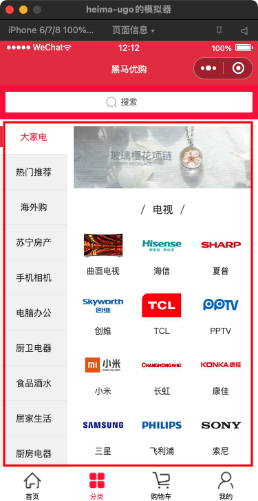
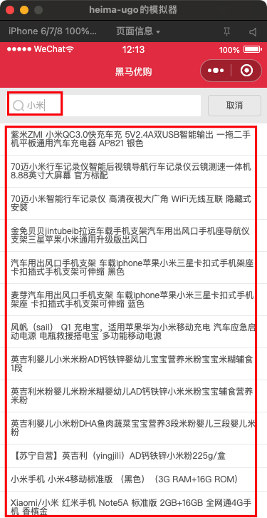
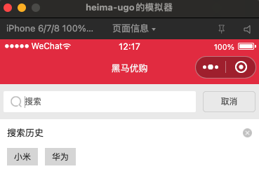
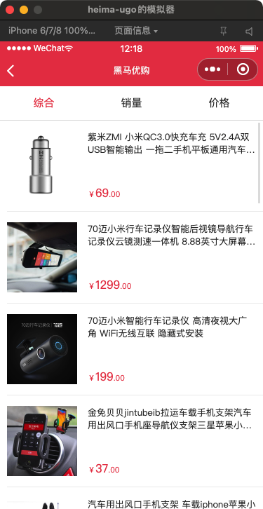

# 黑马优购-分类

## 今日重点

* 商品分类和搜索

## 01-分类-需求分析

**`本节目标：`**商城分类功能需求分析

* 模版结构分析

* 页面滚动和区域滚动

  移动端两者之间存在冲突，小程序下使用**scroll-view组件实现区域滚动**。

* 接口分析

技巧：使用微信编译模式切换分类为默认首页

## 02-分类-获取数据-渲染

**`本节目标：`**获取分类数据，渲染模版



步骤：

1. 默认渲染第一个二级分类
2. 使用计算属性，处理二三级分类渲染数据

```js
  data() {
    return {
      // 分类数据
      cates: []
    };
  },
  computed: {
    // 子级分类
    sub() {
      return this.cates.length && this.cates[0].children;
    }
  },
  methods: {
    // 获取分类数据
    async getCate() {
      const { msg, data } = await this.request({
        url: "/api/public/v1/categories"
      });
      console.log(msg, data);
      if (msg.status === 200) {
        this.cates = data;
      }
    }
  },
  onLoad() {
    this.getCate();
  },
```

```html
    <!-- 分类 -->
    <view class="category">
      <!-- 顶级分类 -->
      <view class="sup">
        <scroll-view scroll-y>
          <text
            :key="item.cat_id"
            v-for="(item,i) in cates"
          >{{item.cat_name}}</text>
        </scroll-view>
      </view>
      <!-- 子级分类 -->
      <view class="sub">
        <scroll-view scroll-y>
          <!-- 封面图 -->
          <image src="http://static.botue.com/ugo/uploads/category.png" class="thumb" />
          <view class="children" :key="item.cat_id" v-for="item in sub">
            <view class="title">{{item.cat_name}}</view>
            <!-- 品牌 -->
            <view class="brands">
              <navigator
                :url="'/packone/list/index?query='+it.cat_name"
                :key="it.cat_id"
                v-for="it in item.children"
              >
                <image :src="it.cat_icon" />
                <text>{{it.cat_name}}</text>
              </navigator>
            </view>
          </view>
        </scroll-view>
      </view>
    </view>
```

注意：处理cates空数组情况=》跟元素`<view v-if="cates.length">`

## 03-分类-交互功能

**`本节目标：`**实现分类切换功能

步骤：

1. 绑定事件，获取索引，设置当前选中的一级分类索引
2. 根据索引添加class高亮样式

```js
  data() {
    return {
      // 一级分类选中的索引
      active: 0
    };
  },
```

```js
      <!-- 顶级分类 -->
      <view class="sup">
        <scroll-view scroll-y>
          <text
            @click="switchCate(i)"
            :class="{active:i === active}"
            :key="item.cat_id"
            v-for="(item,i) in cates"
          >{{item.cat_name}}</text>
        </scroll-view>
      </view>
```

```js
    switchCate(index) {
      this.active = index;
    },
```


## 04-分类-搜索-建议商品

**`本节目标：`**实现搜索组件，搜索时展示建议的商品名称列表



说明：API查询建议商品`/api/public/v1/goods/qsearch`

步骤：

1. 搜索框绑定input事件和v-model
2. 根据关键词查询API接口，获取建议的商品数据，并展示

   * 根据result长度，条件渲染=》是否显示建议商品列表

`search.vue`

事件和模板渲染

```diff
    <view class="sinput">
      <input
        @focus="search"
        type="text"
+        @input="searchPrd"
+        v-model="keyWord"
        placeholder="搜索"
      />
      <button @click="cancel">取消</button>
    </view>

    <!-- 搜索状态显示=》下边内容 -->
    <view class="scontent" v-show="isSearch">
      <!-- 搜索历史 -->
+      <block v-if="result.length === 0">
        <div class="title">
          搜索历史
          <span class="clear"></span>
        </div>
        <!-- 搜索历史 -->
        <div class="history">
          <navigator url="/pages/list/index">小米</navigator>
          <navigator url="/pages/list/index">智能电视</navigator>
          <navigator url="/pages/list/index">小米空气净化器</navigator>
          <navigator url="/pages/list/index">西门子洗碗机</navigator>
          <navigator url="/pages/list/index">华为手机</navigator>
          <navigator url="/pages/list/index">苹果</navigator>
          <navigator url="/pages/list/index">锤子</navigator>
        </div>
      </block>
      <!-- 搜索建议商品 -->
+      <scroll-view scroll-y class="result" v-else>
        <navigator
          v-for="item in result"
          :key="item.goods_id"
          :url="'/packone/goods/index?id=' + item.goods_id"
          >{{ item.goods_name }}</navigator
        >
      </scroll-view>
    </view>
```

变量

```diff
data() {
  return {
    isSearch: false,
+    keyWord: "",
+    result: []
  };
},
```
方法
```js
  // 获取搜索建议商品=》函数防抖处理
  searchPrd () {
    this.timer && clearTimeout(this.timer)
    this.timer = setTimeout(async () => {
      // 如果关键词为空=》清除历史建议商品列表
      if (!this.keyWord) {
        return this.result = []
      }
      const { msg, data } = await this.request({
        url: "/api/public/v1/goods/qsearch",
        data: {
          query: this.keyWord
          // cid: this.activeId
        }
      })
      console.log(data)
      if (msg.status === 200) {
        this.result = data
      }
    }, 600)
  }
```


## 05-分类-搜索-跳转

**`本节目标：`**实现搜索组件，搜索确认时跳转到商品列表（结果）页面

说明：商品结果页`/packone/list/index`

步骤：

1. input绑定confirm事件（测试时，使用回车确认）
2. 搜索确认时，路由跳转到结果页并携带查询参数

`search.vue`

```js
goResult() {
  uni.navigateTo({
    url: "/packone/list/index?query="+this.keyWord
  });
},
```

```diff
      <input
+        @confirm="goResult"
        @input="searchPrd"
        @focus="search"
        v-model="keyWord"
        type="text"
        placeholder="搜索"
      />
```


## 06-分类-搜索-历史

**`本节目标：`**实现搜索组件，搜索历史展示和清除（本地存储）



步骤：

1. 设置history:[]数据和默认值，从本地获取
2. **搜索确认时**，把搜索关键词保存到本地=》去重
3. 点击清除按钮，清除本地搜索历史数据

```vue
      <!-- 搜索历史 -->
      <block v-if="result.length === 0">
        <div class="title">
          搜索历史
          <span @click="clearHistory" class="clear"></span>
        </div>
        <!-- 搜索历史 -->
        <div class="history">
          <navigator
            :key="i"
            v-for="(item, i) in history"
            :url="`/packone/list/index?query=${item}`"
            >{{ item }}</navigator
          >
        </div>
      </block>
```

```js
  data() {
    return {
      history: uni.getStorageSync("history") || []
    };
  },   
    clearHistory() {
      this.history = [];
      uni.removeStorageSync("history");
    },
    goResult () {
      // 处理搜索历史
      this.history.push(this.keyWord)
      // 去重
      this.history = [...new Set(this.history)]
      uni.setStorage({
        key: "history",
        data: this.history
      })
      uni.navigateTo({
        url: "/packone/list/index?query=" + this.keyWord
      })
    },
```

注意：设置history默认值，获取本地数据使用同步方法(传入字符串参数)

## 07-分类-搜索-结果页

**`本节目标：`**根据url中携带参数，请求接口获取搜索商品数据并渲染



说明：

* 目录：`/packone/list/index`
* 查询参数：小米或口红💄（后台有数据）
* 接口：`/api/public/v1/goods/search`

步骤：

1. 通过onLoad生命周期获取查询参数
2. 调用接口获取结果数据渲染

```js
  data() {
    return {
      list: [],
      total:0
    };
  },
```

```js
// event 
onLoad(params) {
    this.getList(params);
},
    // methods
    async getList(data) {
      const { msg, data: _d } = await this.request({
        url: "/api/public/v1/goods/search",
        data
      });
      this.total = _d.total
      if (msg.status === 200) {
        this.list.push(..._d.goods)
      }
    }    
```
```vue
    <!-- 商品列表 -->
    <scroll-view class="goods" scroll-y>
      <!-- 遍历 -->
      <view
        class="item"
        v-for="item in list"
        :key="item.goods_id"
        @click="goDetail(item.goods_id)"
      >
        <!-- 商品图片 -->
        <image class="pic" :src="item.goods_small_logo" />
        <!-- 商品信息 -->
        <view class="meta">
          <view class="name">{{ item.goods_name }}</view>
          <view class="price">
            <text>￥</text>{{ item.goods_price }}
            <text>.00</text>
          </view>
        </view>
      </view>
    </scroll-view>
```


## 08-分类-搜索-结果页-触底事件

**`本节目标：`**实现页面触底监测

```js
 <scroll-view @scrolltolower="getMore" class="goods" scroll-y>
```

注意：

* 两种方式实现
  1. 页面滚动（才会触发）：onReachBottom（钩子函数）
  2. scroll-view组件（区域滚动）：scrolltolower（事件）

## 09-分类-搜索-结果页-上拉加载

**`本节目标：`**实现上拉加载更多（分页）

需求：页面拉到底部时，加载下一页数据并渲染

步骤：

1. 定义查询参数
1. 判断数据是否加载完成
2. 没有完成页码加一继续请求
2. 完成显示没有更多

```diff
  data () {
    // 存储渲染相关数据
    return {
      // 列表
      list: [],
+      query: {
        pagenum: 1,
        pagesize: 20,
        query: ''
+      },
      total: 0
    }
  },
```

```js
onLoad(params) {
  this.query.query = params.query
  this.getList(this.query);
},
```

```js
computed: {
  // 是否加载完成
  nomore () {
    return this.total === this.list.length
  }
},
// 加载更多
getMore () {
  if (this.nomore) return
  this.query.pagenum++
  this.getList(this.query)
},
```
```vue
<!-- 列表加载完成显示 -->
<view class="nomore" v-if="nomore">没有更多数据...</view>
```

## 10-分类-搜索-结果页-优化

**`本节目标：`**全局请求遮罩层

需求：网络情况差到情况下，给请求加上遮罩层

```diff
  uni.showLoading({
    title: '加载中...',
+    mask: true
  });
```

## 今日总结


