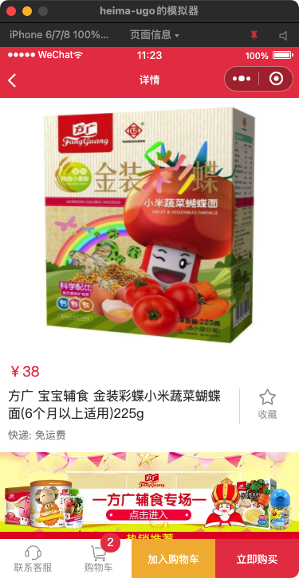
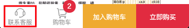
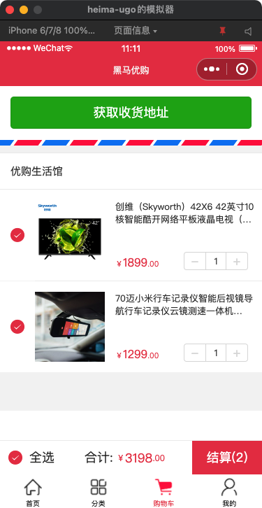
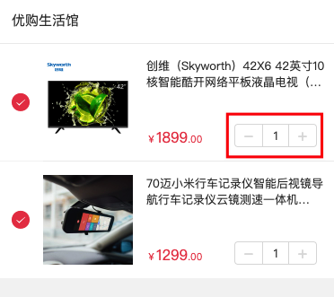
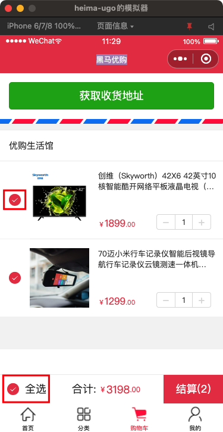
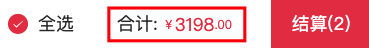
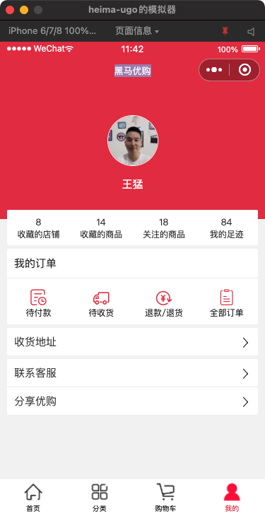

#    

# 黑马优购-购物车

## 今日重点

* 商品详情
* 购物车
* 我的

## 01-商品详情-链接

**`本节目标：`**给商品列表页商品添加链接和ID参数

`/packone/list/index.vue`

```js
    goDetail(id) {
      uni.navigateTo({
          url: `/packone/goods/index?id=${id}`
      });
    },
```

## 02-商品详情-获取数据渲染

**`本节目标：`**根据获取到的页面参数获取详情数据并渲染



步骤：

1. 定义详情变量
2. 获取详情数据渲染

`/packone/goods/index.vue`

```js
data() {
  return {
    // 商品详情数据
    goods: null,
  };
},
```

```js
// methods
async getGoods(goods_id) {
  const { msg, data } = await this.request({
    url: "/api/public/v1/goods/detail",
    data: { goods_id }
  });
  console.log(msg, data);
  if (msg.status === 200) {
    this.goods = data;
  }
}
```

```html
    <!-- 商品详情 -->
    <view class="detail">
      <view v-html="goods.goods_introduce"></view>
      <!-- <rich-text :nodes="goods.goods_introduce"></rich-text> -->
    </view>
```

注意：使用vue指令v-html处理节点字符串

## 03-商品详情-客服

**`本节目标：`**利用微信的button组件实现客服功能



```js
<button open-type="contact" class="icon-handset">联系客服</button>
```

注意：设置buttion的open-type="contact"

## 04-购物车-业务分析

**`本节目标：`**分析购物车的基本处理方式和流程

流程：

* 两种方式

1. 登录=》加入购物车=〉入库
2. 加入购物车=》登录后获取=〉入库

## 05-购物车-添加

**`本节目标：`**添加商品到购物车，存储到本地


步骤：

1. 定义购物车列表变量
1. 绑定点击事件，获取当前商品数据：goods_id,  goods_name,  goods_price,  goods_small_logo,   goods_count（数量），goods_checked（是否被选中）
2. 存入数组（判断是否加过）并持久化到本地
3. 计算加入商品的总数量，显示小红点

`/packone/goods/index.vue`

```diff
<!-- 添加数量显示-绝对定位 -->
+ <text class="cart-count" v-if="carts.length">{{carts.length}}</text>
<!-- 进入购物车 -->
<text class="cart icon-cart" @click="goCart">购物车</text>
<!-- 添加商品 -->
+ <text @click="addCart" class="add">加入购物车</text>
```

```diff
  data() {
    return {
      goods: null,
      // 本地购物车数据
+      carts: uni.getStorageSync("carts") || []
    };
  },
```

```js
addCart () {
  // 判断是否添加过
  let good = this.carts.find(item => item.goods_id === this.goods.goods_id)

  // 没有=》新增
  if (!good) {
    const {
      goods_id,
      goods_name,
      goods_price,
      goods_small_logo
    } = this.goods
    // 没有， 加入新的
    this.carts.push({
      goods_id,
      goods_name,
      goods_price,
      goods_small_logo,
      goods_count: 1,
      // 默认选中
      goods_checked: true
    })

  } else {
    // 有=》数量加一
    good.goods_count++
  }

  // 存储本地
  uni.setStorageSync("carts", this.carts)
  uni.showToast({
    title: '加入成功',
    duration: 2000
  })
},
```

## 06-购物车-列表渲染

**`本节目标：`**从本地获取购物车数据并渲染



步骤：

1. 定义购物车列表数据变量
2. 从本地获取购物车数据并渲染

`/pages/cart/index.vue`

```js
  data() {
    return {
      // 购物车数据
      carts: []
    };
  },
  onShow() {
    this.getCarts();
  }
```

```js
getCarts() {
  this.carts = uni.getStorageSync("carts") || [];
}
```

```html
<view class="shopname">优购生活馆</view>
<view class="goods" :key="item.goods_id" v-for="(item,index) in carts">
...  
```

注意：使用onShow获取本地缓存的购物车商品数据

## 07-购物车-修改数量

**`本节目标：`**实现购物车加减操作



步骤：

1. 绑定事件，传入step（1，-1）代表加减和索引值
2. 更新本地存储数据
3. 根据库存处理边界

```html
<!-- 加减 -->
<view class="amount">
  <!-- 绑定事件 -->
  <text class="reduce" @click="changeCount(index, -1)">-</text>
  <input
         type="number"
         disabled
         v-model="item.goods_count"
         class="number"
         />
  <text class="plus" @click="changeCount(index, 1)">+</text>
</view>
```

```js
    changeCount(index, step) {
      // 处理边界=>库存3
      let count = this.carts[index].goods_count;
      // 1. 最大3
      if (step === 1 && count >= 3) {
        return;
      } else if (step === -1 && count === 1) {
        // 2. 最小1
        return;
      }
      // 执行加减操作
      this.carts[index].goods_count += step;
      // console.log(this.carts[index].goods_count);
      uni.setStorageSync('carts', this.carts)
    },
```

## 08-购物车-选中状态

**`本节目标：`**实现购物车商品的选中状态、全选、单选、显示当前选中商品数量



步骤：

1. 绑定事件，处理**商品选中状态**（单选和全选）=》做取反
2. 过滤购物车数据，获取当前**选中商品数量**

* 处理单选 =〉取反

```diff
<!-- 选框 -->
<view class="checkbox">
  <icon
+        @click="selPrd(index)"
        type="success"
        size="20"
+       :color="item.goods_checked?'#ea4451':'#ccc'"
        ></icon>
</view>
```

* 处理全选=》根据当前选中的商品===购物车中商品总数量 =〉取反

```diff
<!-- 其它 -->
<view class="extra">
  <label
         class="checkall"
+         @click="selAll"
   >
    <icon
    type="success"
+   :color="isAll?'#ea4451':'#ccc'"
    size="20"></icon>全选
  </label>
```

```js
data() {
    return {
      // 购物车商品列表
      carts: [],
    };
  },
computed: {
    // 是否全部选中
    isAll() {
      return this.checkedPrd.length === this.carts.length
    },
    // 当前选中的商品
    checkedPrd() {
      return this.carts.filter((item)=>item.goods_checked) 
    },
  }, 
methods: {
  // 更新本地数据
  updateStorage() {
     uni.setStorageSync('carts', this.carts)
  },
  // 单选
  selPrd(index) {
     this.carts[index].goods_checked = !this.carts[index].goods_checked 
     this.updateStorage()
   },      
  // 全选
  selAll() {
      // 根据计算属性是否全部选中，做取反
      if (this.isAll) {
        this.carts.forEach(item => (item.goods_checked = false));
      } else {
        this.carts.forEach(item => (item.goods_checked = true));
      }
      this.updateStorage();
  }

}      
```

## 09-购物车-计算总金额

**`本节目标：`**计算当前**选中商品的总金额**



提示：使用计算属性

```js
// 总金额
amount() {
  let total = 0;
  this.checkedPrd.forEach(item => {
    total += item.goods_price * item.goods_count;
  });
  return total;
}
```

```html
<view class="total">
  合计:
  <text>￥</text>
  <label>{{amount}}</label>
  <text>.00</text>
</view>
```


## 10-购物车-收货地址

**`本节目标：`**获取当前微信账号的收货地址并渲染


说明：

1. 选择和编辑收货地址的页面，由微信客户端提供
2. 需要设置`manifest.json`配置：

```diff
	"mp-weixin": { /* 微信小程序特有相关 */
		"appid": "",
		"setting": {
			"urlCheck": false
		},
		"usingComponents": true,
+		"requiredPrivateInfos": [
+			"chooseAddress"
+		]
	}
```

步骤：

1. 定义地址变量
2. 使用uni.chooseAddress()获取地址数据

```diff
data () {
    return {
      carts: [],
-      // 收货地址
+      address: null
    }
},
```

```js
computed: {
    addr() {
      return (
        this.address &&
        this.address.provinceName +
        this.address.cityName +
        this.address.countyName +
        this.address.detailInfo
      )
    }
},  
// method  
getAddress() {
  uni.chooseAddress({
    success: res => {
      // console.log(res);
      this.address = res;
    }
  });
}
```

```html
<!-- 收货信息 -->
<view class="shipment">
  <block v-if="address">
    <view class="dt">收货人:</view>
    <view class="dd meta">
      <text class="name">{{address.userName}}</text>
      <text class="phone">{{address.telNumber}}</text>
    </view>
    <view class="dt">收货地址:</view>
    <view class="dd">{{addr}}</view>
  </block>
  <!-- 获取用户地址 -->
  <button v-else @click="getAddress">获取收获地址</button>
</view>
```

注意：block元素绑定事件不生效

## 11-我的-个人中心

**`本节目标：`**获取当前微信账号的头像和用户名



步骤：

1. 使用微信基础组件open-data获取用户信息（[支持性说明](https://developers.weixin.qq.com/community/develop/doc/000e881c7046a8fa1f4d464105b001)）
2. 使用API能力拨打电话
2. 分享小程序

`profile/index.vue`

* 获取个人信息=>微信客户端登录人信息

```html
<!-- 个人资料 -->
<view class="profile">
  <view class="meta">
    <!-- <image class="avatar" src="http://static.botue.com/ugo/uploads/monkey.png" />
<text class="nickname">孙悟空</text>-->
    <open-data class="avatar" type="userAvatarUrl" />
    <open-data class="nickname" type="userNickName" />
  </view>
</view>
```

* 打电话

```html
<view @click="callSer" class="item icon-arrow">联系客服</view>
```

```js
callSer() {
  uni.makePhoneCall({
    phoneNumber: "10086"
  });
}
```

* 分享

```vue
<button class="item icon-arrow" open-type="share">分享优购</button>
```


## 12-我的-个人中心-鉴权

**`本节目标：`**控制登录用户才能访问个人中心

步骤：

1. 定义mixin混入全局鉴权方法
2. 组件onShow时检测

`mixin/index.js`

```js
export default {
  methods: {
    checkAuth () {
      if (!uni.getStorageSync('token')) {
        uni.navigateTo({
          url: '/packone/auth/index'
        })
      }
    }
  },
}
```

`main.js`

```js
// 注册mixin
Vue.mixin(auth)
```

`profile/index.vue`

```vue
<script>
export default {
  onShow () {
    this.checkAuth()
  }
};
</script>
```


## 今日总结


