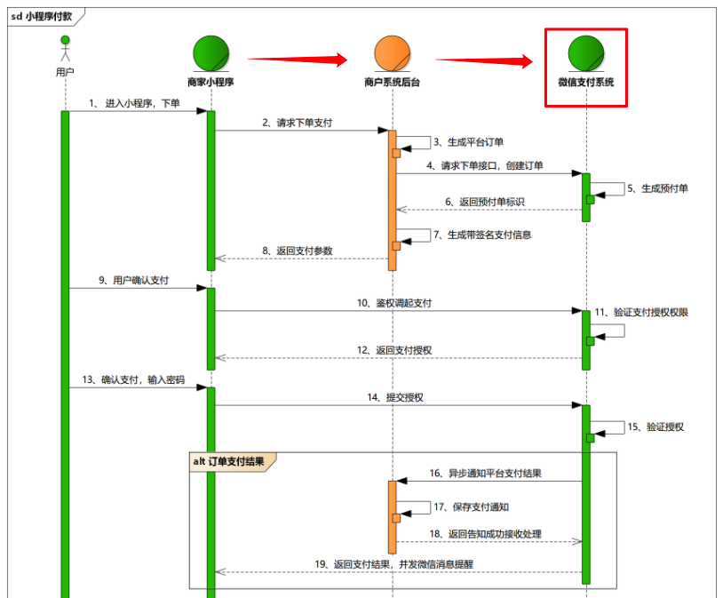

# 黑马优购-登录支付

## 今日重点

* 微信登录
* 创建订单
* 微信支付

## 01-微信登录-准备

**`本节目标：`**获取微信用户信息登录优购


接口：`/api/public/v1/users/wxlogin`

步骤：

1. 通过[getUserProfile方法](https://developers.weixin.qq.com/miniprogram/dev/api/open-api/user-info/wx.getUserProfile.html)，获取微信用户信息=〉调用接口登录
3. 根据**登录接口文档所需参数**，调用接口

`/packone/auth/index.vue`

```diff
<view>
  <button
+          @click="getUserInfo"
          type="primary"
          >
    微信登录
  </button>
</view>
```

```js
async getUserInfo () {
  const [error, userInfo] = await uni.getUserProfile({ desc: '获取微信用户信息' })
  if (!error) {
    console.log(userInfo)
    this.login(userInfo)
  }
},
```

```js
// 调用接口登录
async login(user) {
  // 登录所需参数
  const { encryptedData, iv, rawData, signature } = user;
  // 微信用户登录凭证=》code
  const [err, data] = await uni.login();
  if (!err) {
    let res = await this.request({
      url: "/api/public/v1/users/wxlogin",
      method: "post",
      data: {
        encryptedData,
        iv,
        rawData,
        signature,
        code: data.code
      }
    });
    console.log(res);
  }
}
```

注意⚠️：

查看调用结果是400，无效的登录凭证code


## 02-微信登录-流程

**`本节目标：`**了解微信登录流程

分析：使用微信接口登录，一般需要code(api获取)，AppID(小程序ID)，AppSecret(小程序密钥)访问微信服务器，成功返回：1. openid是用户标识  2. session_key是解密用的（UnionID解密等）

说明：不建议客户端直接调用微信接口登录（不安全）；所以，开发者要搭建服务器由后端调用登录

**结论：**调用失败，是由于**当前开发者AppID和服务器不一致**造成


注意：

登录需要的后端接口appid: wxfb52f2d7b2f6123a（需要该appid拥有者**添加开发者权限**）


> 名词解释

- `code` 临时登录凭证, 有效期五分钟, 通过 `wx.login()` 获取
- `session_key` 会话密钥, 服务端通过 [code2Session](https://developers.weixin.qq.com/miniprogram/dev/api/open-api/login/code2Session.html) 获取
- `openId` 用户在该小程序下的用户唯一标识, 永远不变, 服务端通过 code 获取
- `unionId` 用户在同一个微信开放平台帐号(公众号, 小程序, 网站, 移动应用)下的唯一标识, 永远不变
- `appId` 小程序唯一标识
- `appSecret` 小程序的 app secret, 可以和 code, appId 一起换取 session_key

其他名词

- `rawData` 不包括敏感信息的原始数据字符串，用于计算签名
- `encryptedData` 包含敏感信息的用户信息, 是加密的
- `signature` 用于校验用户信息是否无篡改
- `iv` 加密算法的初始向量

扩展阅读：[微信登录](https://developers.weixin.qq.com/miniprogram/dev/framework/open-ability/login.html)

## 03-微信登录-成功

**`本节目标：`**微信登录成功存储token

注意⚠️：

1. 同学们没法调用登录接口获取token，**直接使用老师提供的token开发**即可

2. 实际工作中，开发小程序=》向公司提供自己的微信号，管理员添加开发者权限=》使用公司的

   appId进行小程序的开发

步骤：

1. 存储token到本地
2. 返回到上一页

`/packone/auth/index.vue`

* 获取code

```js
async onLoad () {
  const [error, data] = await uni.login()
  if (!error) {
    console.log(data)
    // code参数存储到this
    this.code = data.code
  }
},
```

* 传入用户信息和code登录

```js
// 调用接口登录·
async login (user) {
  // 登录所需参数
  const { encryptedData, iv, rawData, signature } = user
  // 微信用户登录凭证=》code
  // const [err, data] = await uni.login()
  let { msg, data } = await this.request({
    url: "/api/public/v1/users/wxlogin",
    method: "post",
    data: {
      encryptedData,
      iv,
      rawData,
      signature,
      code: this.code
    }
  })
  // 存储token，返回上次访问页面
  uni.setStorageSync("token", data.token)
  uni.navigateBack()

}
```

注意⚠️：如果出现`Error: Illegal Buffer`错误[说明](https://developers.weixin.qq.com/miniprogram/dev/framework/open-ability/signature.html)

总结：

> 导致问题的原因是：session_key没有及时更新

在调用wx.login()之前调用了wx.getUserInfo()。在调用getUserInfo()时将获取到 iv 和encryptedData 传给后台，而后调用login()，此时的session_key可能会被新的`session_key`覆盖，就会导致后台在对数据解密时使用新的session_key去解密旧的`encryptedData`，如此就会`Illegal Buffer`报错。

解决：提前调用uni.login()


## 04-创建订单-准备

**`本节目标：`**下单准备

分析：点击结算按钮时，如果没有：收货地址、至少选中一件商品、登录，提示用户处理；

满足这些条件后，才能正常调用接口创建订单。

步骤：

1. 结算按钮注册点击事件
2. 判断是否满足边界条件

`/pages/cart/index.vue`

```diff
<view
+      @click="createOrder"
      class="pay">
  结算({{checkedPrd.length}})
</view>
```

```js
// 创建订单
createOrder() {
  // 有收货地址和选中至少一件商品
  if (!this.address || !this.checkedPrd.length) {
    return uni.showToast({
      title: "请填写收货地址和添加商品！",
      icon: "none"
    });
  }
  // 是否登录
  if (!uni.getStorageSync("token")) {
    // 跳转登录页
    return uni.navigateTo({
      url: "/pages/auth/index"
    });
  }

  // 调用接口：创建订单
	// ...
}
```


## 05-创建订单-实现

**`本节目标：`**点击结算创建新订单

接口：`/api/public/v1/my/orders/create`

步骤：

1. 处理订单接口需要的参数
2. 创建订单
2. 成功跳转到订单列表页

`/pages/cart/index.vue`

```js
// async createOrder()
// ...
// 调用接口：创建订单
let { data, msg } = await this.request({
  url: "/api/public/v1/my/orders/create",
  method: "post",
  data: {
    order_price: this.amount,
    consignee_addr: this.addr,
    goods: this.checkedPrd.map(item => {
            item.goods_number = item.goods_count;
            return item;
   })
  }
});
if (msg.status === 200) {
  // 订单成功创建
  // 1. 获取购物车中剩余的商品
  let residuePrds = this.carts.filter((item) => !item.goods_checked)
  // 更新本地
  uni.setStorageSync('carts', residuePrds)
  // 2. 跳转到订单页面
  uni.navigateTo({
    url: '/packone/order/index'
  })
} else {
  uni.showToast({
    icon: "none",
    title: msg.msg
  });
}
```

## 06-订单列表

**`本节目标：`**获取订单列表数据并渲染


步骤：

1. 判断是否登录，没有跳转=》登录页面
2. 调用接口获取所有订单数据并绑定模版渲染

`/packone/order/index.vue`

```html
<!-- 订单 -->
<scroll-view class="orders" scroll-y>
  <!-- 订单列表 -->
  <view class="item" v-for="order in orders" :key="order.order_number">
    <!-- 订单中包含哪些商品 -->
    <block v-for="prd in order.goods" :key="prd.goods_id">
      <!-- 商品图片 -->
      <image class="pic" :src="prd.goods_small_logo" />
      <!-- 商品信息 -->
      <view class="meta">
        <view class="name">{{ prd.goods_name }}</view>
        <view class="price">
          <text>￥</text>{{ prd.goods_price }}
          <text>.00</text>
        </view>
        <view class="num">x{{ prd.goods_number }}</view>
      </view>
    </block>
    <!-- end -->
    <!-- 总价 -->
    <view class="amount"
          >共{{ order.goods.length }}件商品 总计: ￥{{
      order.total_price
      }}(含运费0.00)</view
      >
    <!-- 其它 -->
    <view class="extra">
      订单号: {{ order.order_number }}
      <button
              size="mini"
              type="primary"
              >
        支付
      </button>
    </view>
  </view>
</scroll-view>
```

```js
data() {
  return {
    // 订单列表数据
    orders: []
  };
},
```

```js
async getOrders() {
  // 判断是否登录
  if (!uni.getStorageSync("token")) {
    return uni.navigateTo({ url: "/pages/auth/index" });
  }
  // 获取订单列表
  let { msg, data } = await this.request({
    url: "/api/public/v1/my/orders/all",
    data: {
      type: 1
    }
  });
  if (msg.status === 200) {
    this.orders = data.orders;
  }
}
```


## 07-微信支付-流程

**`本节目标：`**了解小程序支付流程

> 微信支付，在小程序端要做三件事



1. 使用**`wx.login`**获取临时登录凭证code,发送到后端获取openId=》微信登录
2. 将**`openId`**以及相应需要的商品信息发送到后端，换取服务端进行支付的签名等信息=》创建订单
3. 接收返回的信息（必须要包含发起微信支付**`wx.requestPayment的参数`**），发起微信支付

前端：主要处理第三步，获取支付信息，调起支付窗口

扩展阅读：[支付业务流程](https://pay.weixin.qq.com/wiki/doc/api/wxa/wxa_api.php?chapter=7_4&index=3)

## 08-微信支付-实现

**`本节目标：`**实现订单支付功能


接口：`/api/public/v1/my/orders/req_unifiedorder`

步骤：

1. 调用后台支付接口，传入订单号
2. 成功后，调起微信支付窗口=>uni.requestPayment

`/packone/order/index.vue`

```diff
<!-- 其它 -->
<view class="extra">
  订单号: {{order.order_number}}
  <button
+          @click="pay(order.order_number)"
          size="mini"
          type="primary"
          >支付</button>
</view>
```

```js
// 支付
async pay(order_number) {
  //  发送支付请求
  let { msg, data } = await this.request({
    url: "/api/public/v1/my/orders/req_unifiedorder",
    method: "post",
    data: {
      order_number
    }
  });
  if (msg.status === 200) {
    // 调起微信支付窗口
    let [err, msg] = await uni.requestPayment(data.pay);
    if (!err) {
      uni.showToast({
        title: "支付成功！",
        duration: 2000
      });
    }
  }
}
```

扩展阅读：https://uniapp.dcloud.io/api/plugins/payment?id=requestpayment


## 项目打包-上线

**`本节目标：`**打包上线

步骤：

1. 执行上线打包：`npm run build:mp-weixin`

2. 到微信开发者工具，导入打包生成的build/mp-weixin生产代码
3. 导入成功之后点击=》**上传**=》发布体验版本 =》 通后台查看管理版本


4. 体验版本=》经过测试=》测试通过=》提交审核=》经过TX审核通过才能发布线上版本


注意：删除static目录的uploads和images目录

## 今日总结


