### 小程序 - 基础加强


## Contents

# 目 ◆自定义组件

##### ◆使用npm包

##### ◆全局数据共享

##### ◆分包

##### ◆案例-自定义tabBar


#### 自定义组件 -组件的创建与引用

##### 1.创建组件

① 在项目的根目录中，鼠标右键，创建components-> test文件夹
② 在新建的components -> test 文件夹上，鼠标右键，点击“新建Component”
③ 键入组件的名称之后回车，会自动生成组件对应的 4 个文件，后缀名分别为.js，.json，.wxml 和.wxss

注意：为了保证目录结构的清晰，建议把不同的组件，存放到单独目录中，例如：
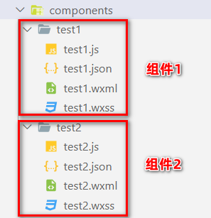

#### 自定义组件 -组件的创建与引用

##### 2.引用组件

###### 组件的引用方式分为“局部引用”和“全局引用”，顾名思义：

###### ⚫ 局部引用：组件只能在当前被引用的页面内使用

###### ⚫ 全局引用：组件可以在每个小程序页面中使用


#### 自定义组件 -组件的创建与引用

##### 3.局部引用组件

在页面的.json 配置文件中引用组件的方式，叫做“局部引用”。示例代码如下：
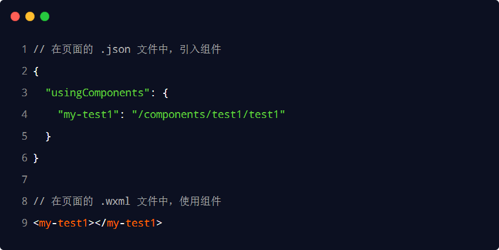

#### 自定义组件 -组件的创建与引用

##### 4.全局引用组件

在app.json 全局配置文件中引用组件的方式，叫做“全局引用”。示例代码如下：
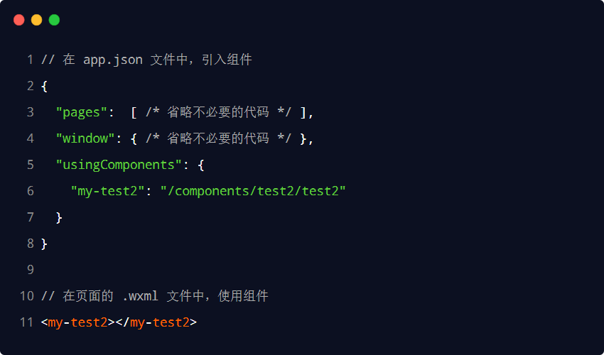

#### 自定义组件 -组件的创建与引用

##### 5.全局引用VS 局部引用

###### 根据组件的使用频率和范围，来选择合适的引用方式：

###### ⚫ 如果某组件在多个页面中经常被用到，建议进行“全局引用”

###### ⚫ 如果某组件只在特定的页面中被用到，建议进行“局部引用”


#### 自定义组件 -组件的创建与引用

##### 6.组件和页面的区别

从表面来看，组件和页面都是由.js、.json、.wxml 和.wxss 这四个文件组成的。但是，组件和页面的.js 与
.json 文件有明显的不同：
⚫ 组件的.json 文件中需要声明"component": true 属性
⚫ 组件的.js 文件中调用的是Component() 函数
⚫ 组件的事件处理函数需要定义到methods节点中
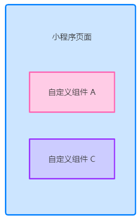

#### 自定义组件 -样式

##### 1.组件样式隔离

###### 默认情况下，自定义组件的样式只对当前组件生效，不会影响到组件之外的

###### UI 结构，如图所示：

###### ⚫ 组件A 的样式不会影响组件C 的样式

###### ⚫ 组件A 的样式不会影响小程序页面的样式

###### ⚫ 小程序页面的样式不会影响组件A 和C 的样式

###### 好处：

###### ① 防止外界的样式影响组件内部的样式

###### ② 防止组件的样式破坏外界的样式


#### 自定义组件 -样式

##### 2.组件样式隔离的注意点

⚫ app.wxss 中的全局样式对组件无效
⚫ 只有class 选择器会有样式隔离效果，id 选择器、属性选择器、标签选择器不受样式隔离的影响

建议：在组件和引用组件的页面中建议使用class 选择器， **不要使用** id、属性、标签选择器！


#### 自定义组件 -样式

##### 3.修改组件的样式隔离选项

###### 默认情况下，自定义组件的样式隔离特性能够防止组件内外样式互相干扰的问题。但有时，我们希望在外界能

够控制组件内部的样式，此时，可以通过styleIsolation修改组件的样式隔离选项，用法如下：
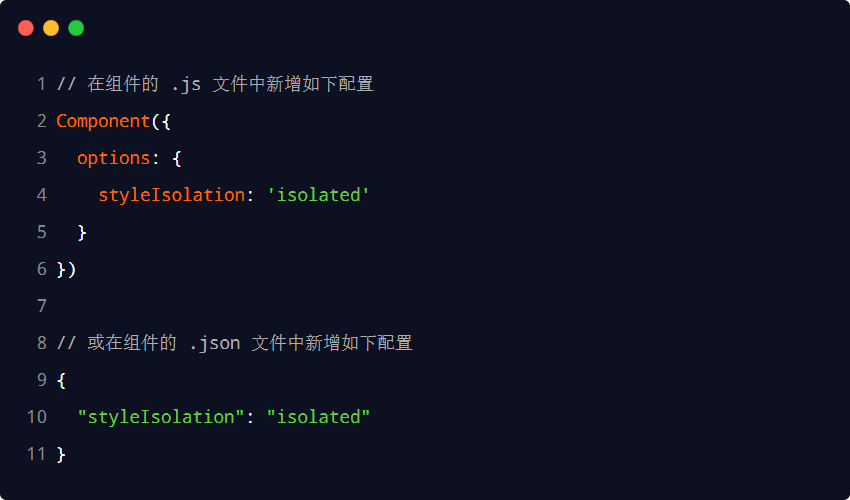

#### 自定义组件 -样式

##### 4.styleIsolation 的可选值
| 可选值 |	默认值 |	描述 |
| ------ | ------ | ------ |
| isolated	|是	|表示启用样式隔离，在自定义组件内外，使用 class 指定的样式将不会相互影响 |
| apply-shared	|否	|表示页面 | wxss | 样式将影响到自定义组件，但自定义组件 wxss 中指定的样式不会影响页面 |
| shared |	否	|表示页面 | wxss | 样式将影响到自定义组件，自定义组件 wxss 中指定的样式也会影响页面和其,他设置了 apply-shared 或 shared 的自定义组件|

```
可选值 默认值 描述
isolated 是 表示启用样式隔离，在自定义组件内外，使用class 指定的样式将不会相互影响
apply-shared 否 表示页面wxss 样式将影响到自定义组件，但自定义组件wxss 中指定的样式不会影响页面
shared 否 表示页面他设置了wxss apply样式将影响到自定义组件，自定义组件-shared 或shared 的自定义组件 wxss 中指定的样式也会影响页面和其
```

#### 自定义组件 -数据、方法和属性

##### 1.data 数据

在小程序组件中，用于组件模板渲染的私有数据，需要定义到data 节点中，示例如下：
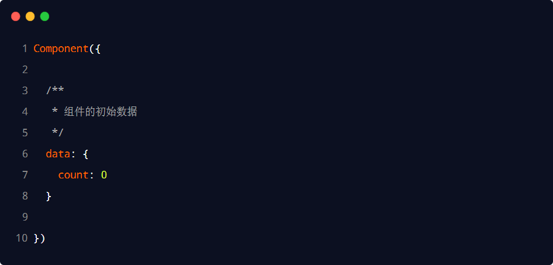

#### 自定义组件 -数据、方法和属性

##### 2.methods 方法

在小程序组件中，事件处理函数和自定义方法需要定义到methods 节点中，示例代码如下：

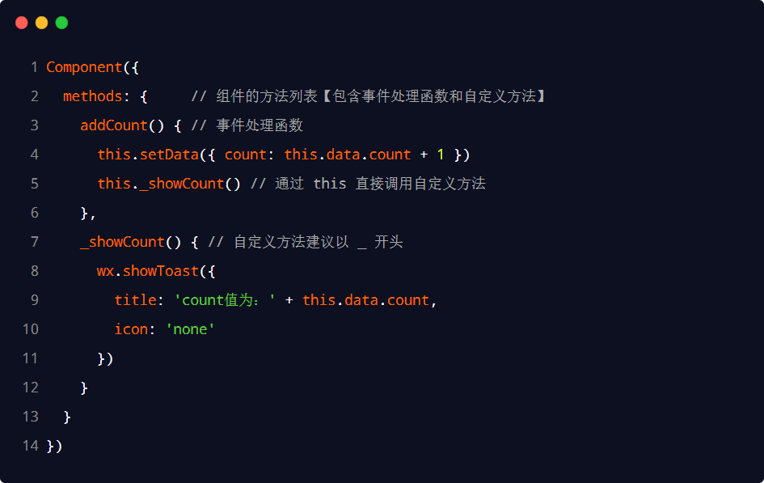
#### 自定义组件 -数据、方法和属性

##### 3.properties 属性

在小程序组件中，properties 是组件的对外属性，用来接收外界传递到组件中的数据，示例代码如下：

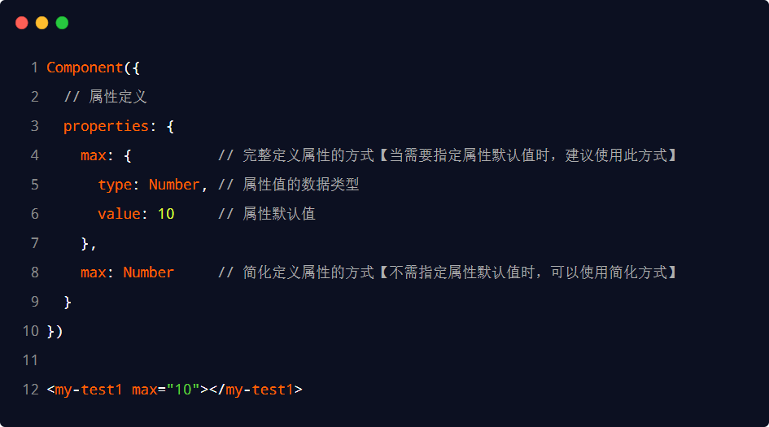
#### 自定义组件 -数据、方法和属性

##### 4.data 和properties 的区别

在小程序的组件中，properties 属性和data 数据的用法相同，它们都是可读可写的，只不过：
⚫ data 更倾向于存储组件的私有数据
⚫ properties 更倾向于存储外界传递到组件中的数据


#### 自定义组件 -数据、方法和属性

##### 5.使用setData 修改properties 的值

由于data 数据和properties 属性在本质上没有任何区别，因此properties 属性的值也可以用于页面渲染，
或使用setData 为properties 中的属性重新赋值，示例代码如下：

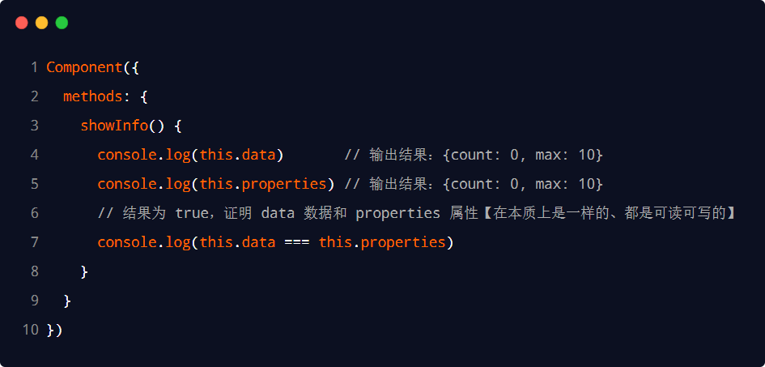
#### 自定义组件 -数据监听器

##### 1.什么是数据监听器

数据监听器用于监听和响应任何属性和数据字段的变化，从而执行特定的操作。它的作用类似于vue 中的
watch侦听器。在小程序组件中，数据监听器的基本语法格式如下：

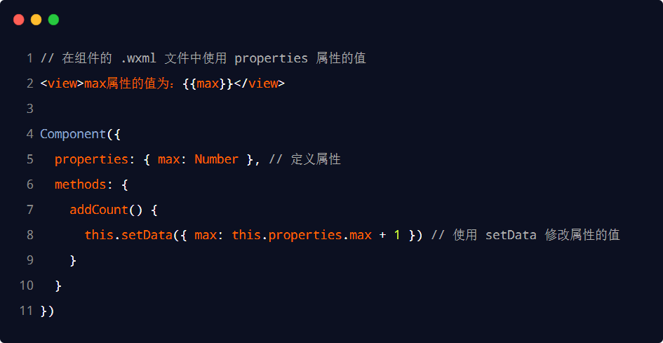
#### 自定义组件 -数据监听器

##### 2.数据监听器的基本用法

###### 组件的UI 结构如下：


#### 自定义组件 -数据监听器

##### 2.数据监听器的基本用法

组件的.js 文件代码如下：
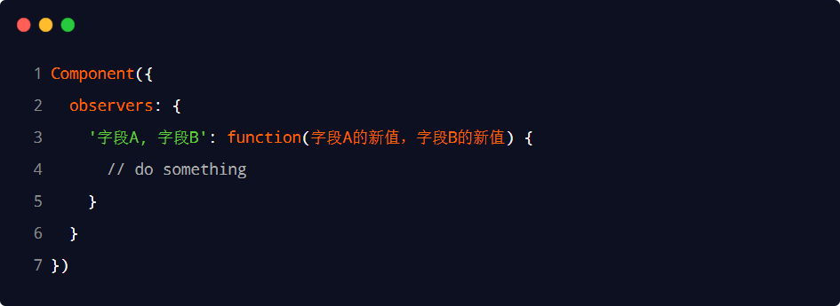

#### 自定义组件 -数据监听器

##### 3.监听对象属性的变化

###### 数据监听器支持监听对象中单个或多个属性的变化，示例语法如下：


#### 自定义组件 -数据监听器 -案例

##### 1.案例效果


#### 自定义组件 -数据监听器 -案例

##### 2.渲染UI 结构
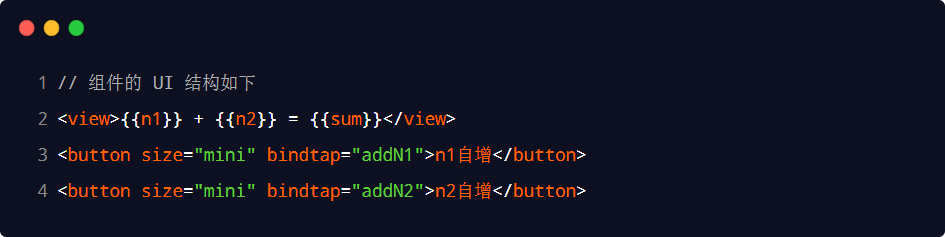

#### 自定义组件 -数据监听器 -案例

##### 3.定义button 的事件处理函数


#### 自定义组件 -数据监听器 -案例

##### 4.监听对象中指定属性的变化


#### 自定义组件 -数据监听器 -案例

##### 5.监听对象中所有属性的变化

###### 如果某个对象中需要被监听的属性太多，为了方便，可以使用通配符** 来监听对象中所有属性的变化，示例

###### 代码如下：


#### 自定义组件 -纯数据字段

##### 1.什么是纯数据字段

概念：纯数据字段指的是那些不用于界面渲染的data 字段。

应用场景：例如有些情况下，某些data 中的字段既不会展示在界面上，也不会传递给其他组件，仅仅在当前
组件内部使用。带有这种特性的data 字段适合被设置为纯数据字段。

好处：纯数据字段有助于提升页面更新的性能。


#### 自定义组件 -纯数据字段

##### 2.使用规则

在Component 构造器的options 节点中，指定pureDataPattern为一个正则表达式，字段名符合这个正则
表达式的字段将成为纯数据字段，示例代码如下：


#### 自定义组件 -纯数据字段

##### 3.使用纯数据字段改造数据监听器案例


#### 自定义组件 -组件的生命周期

##### 1.组件全部的生命周期函数

###### 小程序组件可用的全部生命周期如下表所示：

```
生命周期函数 参数 描述说明
created 无 在组件实例刚刚被创建时执行
attached 无 在组件实例进入页面节点树时执行
ready 无 在组件在视图层布局完成后执行
moved 无 在组件实例被移动到节点树另一个位置时执行
detached 无 在组件实例被从页面节点树移除时执行
error Object Error 每当组件方法抛出错误时执行
```

#### 自定义组件 -组件的生命周期

##### 2.组件主要的生命周期函数

在小程序组件中，最重要的生命周期函数有 3 个，分别是created、 **attached** 、detached。它们各自的特点
如下：
① 组件实例刚被创建好的时候，created 生命周期函数会被触发
⚫ 此时还不能调用setData
⚫ 通常在这个生命周期函数中，只应该用于给组件的this 添加一些自定义的属性字段
② 在组件完全初始化完毕、进入页面节点树后，attached 生命周期函数会被触发
⚫ 此时，this.data已被初始化完毕
⚫ 这个生命周期很有用，绝大多数初始化的工作可以在这个时机进行（例如发请求获取初始数据）
③ 在组件离开页面节点树后，detached 生命周期函数会被触发
⚫ 退出一个页面时，会触发页面内每个自定义组件的detached 生命周期函数
⚫ 此时适合做一些清理性质的工作


#### 自定义组件 -组件的生命周期

##### 3.lifetimes节点

在小程序组件中，生命周期函数可以直接定义在Component 构造器的第一级参数中，可以在lifetimes字段
内进行声明（这是推荐的方式，其优先级最高）。示例代码如下：


#### 自定义组件 -组件所在页面的生命周期

##### 1.什么是组件所在页面的生命周期

###### 有时，自定义组件的行为依赖于页面状态的变化，此时就需要用到组件所在页面的生命周期。

例如：每当触发页面的show 生命周期函数的时候，我们希望能够重新生成一个随机的RGB 颜色值。
在自定义组件中，组件所在页面的生命周期函数有如下 3 个，分别是：

```
生命周期函数 参数 描述
show 无 组件所在的页面被展示时执行
hide 无 组件所在的页面被隐藏时执行
resize Object Size 组件所在的页面尺寸变化时执行
```

#### 自定义组件 -组件所在页面的生命周期

##### 2.pageLifetimes节点

组件所在页面的生命周期函数，需要定义在pageLifetimes 节点中，示例代码如下：


#### 自定义组件 -组件所在页面的生命周期

##### 3.生成随机的RGB 颜色值


#### 自定义组件 -组件所在页面的生命周期

##### 3.生成随机的RGB 颜色值


#### 自定义组件 -插槽

##### 1.什么是插槽

在自定义组件的wxml 结构中，可以提供一个<slot> 节点（插槽），用于承载组件使用者提供的wxml 结构。


#### 自定义组件 -插槽

##### 2.单个插槽

在小程序中，默认每个自定义组件中只允许使用一个<slot> 进行占位，这种个数上的限制叫做单个插槽。


#### 自定义组件 -插槽

##### 3.启用多个插槽

在小程序的自定义组件中，需要使用多<slot> 插槽时，可以在组件的.js 文件中，通过如下方式进行启用。
示例代码如下：


#### 自定义组件 -插槽

##### 4.定义多个插槽

可以在组件的.wxml 中使用多个<slot> 标签，以不同的name来区分不同的插槽。示例代码如下：


#### 自定义组件 -插槽

##### 4.使用多个插槽

在使用带有多个插槽的自定义组件时，需要用slot 属性来将节点插入到不同的<slot> 中。示例代码如下：


#### 自定义组件 -父子组件之间的通信

##### 1.父子组件之间通信的 3 种方式

###### ① 属性绑定

###### ⚫ 用于父组件向子组件的指定属性设置数据，仅能设置JSON 兼容的数据

###### ② 事件绑定

###### ⚫ 用于子组件向父组件传递数据，可以传递任意数据

###### ③ 获取组件实例

```
⚫ 父组件还可以通过this.selectComponent() 获取子组件实例对象
⚫ 这样就可以直接访问子组件的任意数据和方法
```

#### 自定义组件 -父子组件之间的通信

##### 2.属性绑定

###### 属性绑定用于实现父向子传值，而且只能传递普通类型的数据，无法将方法传递给子组件。父组件的示例代码

###### 如下：


#### 自定义组件 -父子组件之间的通信

##### 2.属性绑定

子组件在properties节点中声明对应的属性并使用。示例代码如下：


#### 自定义组件 -父子组件之间的通信

##### 3.事件绑定

###### 事件绑定用于实现子向父传值，可以传递任何类型的数据。使用步骤如下：

① 在父组件的js 中，定义一个函数，这个函数即将通过自定义事件的形式，传递给子组件
② 在父组件的wxml 中，通过自定义事件的形式，将步骤 1 中定义的函数引用，传递给子组件
③ 在子组件的js 中，通过调用this.triggerEvent('自定义事件名称', { /* 参数对象*/ })，将数据发送到父组件
④ 在父组件的js 中，通过e.detail 获取到子组件传递过来的数据


#### 自定义组件 -父子组件之间的通信

##### 3.事件绑定

步骤 1 ：在父组件的js 中，定义一个函数，这个函数即将通过自定义事件的形式，传递给子组件。


#### 自定义组件 -父子组件之间的通信

##### 3.事件绑定

步骤 2 ：在父组件的wxml 中，通过自定义事件的形式，将步骤 1 中定义的函数引用，传递给子组件。


#### 自定义组件 -父子组件之间的通信

##### 3.事件绑定

步骤 3 ：在子组件的js 中，通过调用this.triggerEvent(‘自定义事件名称’, { /* 参数对象*/ })，将数据发送到父组件。


#### 自定义组件 -父子组件之间的通信

##### 3.事件绑定

步骤 4 ：在父组件的js 中，通过e.detail 获取到子组件传递过来的数据。


#### 自定义组件 -父子组件之间的通信

##### 4.获取组件实例

可在父组件里调用this.selectComponent("id或class选择器") ，获取子组件的实例对象，从而直接访问子组
件的任意数据和方法。调用时需要传入一个选择器，例如this.selectComponent(".my-component")。


#### 自定义组件 -behaviors

##### 1.什么是behaviors

behaviors 是小程序中，用于实现组件间代码共享的特性，类似于Vue.js 中的“mixins”。


#### 自定义组件 -behaviors

##### 2.behaviors 的工作方式

每个behavior 可以包含一组属性、数据、生命周期函数和方法。组件引用它时，它的属性、数据和方法会被
合并到组件中。
每个组件可以引用多个behavior，behavior 也可以引用其它behavior。


#### 自定义组件 -behaviors

##### 3.创建behavior

调用Behavior(Object object)方法即可创建一个共享的behavior 实例对象，供所有的组件使用：


#### 自定义组件 -behaviors

##### 4.导入并使用behavior

在组件中，使用require() 方法导入需要的behavior，挂载后即可访问behavior 中的数据或方法，示例代码
如下：


#### 自定义组件 -behaviors

##### 5.behavior 中所有可用的节点

```
可用的节点 类型 是否必填 描述
properties Object Map 否 同组件的属性
data Object 否 同组件的数据
methods Object 否 同自定义组件的方法
behaviors String Array 否 引入其它的behavior
created Function 否 生命周期函数
attached Function 否 生命周期函数
ready Function 否 生命周期函数
moved Function 否 生命周期函数
detached Function 否 生命周期函数
```

#### 自定义组件 -behaviors

##### 6. 同名字段的覆盖和组合规则*

组件和它引用的behavior 中可以包含同名的字段，此时可以参考如下 3 种同名时的处理规则：
① 同名的数据字段(data)
② 同名的属性(properties) 或方法(methods)
③ 同名的生命周期函数

关于详细的覆盖和组合规则，大家可以参考微信小程序官方文档给出的说明：
https://developers.weixin.qq.com/miniprogram/dev/framework/custom-component/behaviors.html


## 总结

#### 总结 -组件

##### ① 能够创建并引用组件

```
⚫ 全局引用、局部引用、usingComponents
```
##### ② 能够知道如何修改组件的样式隔离选项

```
⚫ options -> styleIsolation（isolated, apply-shared, shared）
```
##### ③ 能够知道如何定义和使用数据监听器

```
⚫ observers
```
##### ④ 能够知道如何定义和使用纯数据字段

```
⚫ options -> pureDataPattern
```
##### ⑤ 能够知道实现组件父子通信有哪 3 种方式

```
⚫ 属性绑定、事件绑定、this.selectComponent(' id或class选择器')
```
##### ⑥ 能够知道如何定义和使用behaviors

```
⚫ 调用Behavior() 构造器方法
```

## Contents

# 目 ◆自定义组件

##### ◆使用npm包

##### ◆全局数据共享

##### ◆分包

##### ◆案例-自定义tabBar


#### 使用 npm 包

##### 小程序对npm 的支持与限制

目前，小程序中已经支持使用npm 安装第三方包，从而来提高小程序的开发效率。但是，在小程序中使用
npm 包有如下 3 个限制：
① 不支持依赖于Node.js 内置库的包
② 不支持依赖于浏览器内置对象的包
③ 不支持依赖于C++ 插件的包

总结：虽然npm 上的包有千千万，但是能供小程序使用的包却“为数不多”。


#### 使用 npm 包 -Vant Weapp

##### 1. 什么是Vant Weapp

Vant Weapp 是有赞前端团队开源的一套小程序UI 组件库，助力开发者快速搭建小程序应用。它所使用的是
MIT 开源许可协议，对商业使用比较友好。
官方文档地址https://youzan.github.io/vant-weapp

扫描下方的小程序二维码，体验组件库示例：


#### 使用 npm 包 -Vant Weapp

##### 2. 安装Vant 组件库

在小程序项目中，安装Vant 组件库主要分为如下 3 步：
① 通过npm 安装（建议指定版本为@1.3.3）
② 构建npm 包
③ 修改app.json

详细的操作步骤，大家可以参考Vant 官方提供的快速上手教程：
https://youzan.github.io/vant-weapp/#/quickstart#an-zhuang


#### 使用 npm 包 -Vant Weapp

##### 3. 使用Vant 组件

安装完Vant 组件库之后，可以在app.json 的usingComponents节点中引入需要的组件，即可在wxml 中
直接使用组件。示例代码如下：


#### 使用 npm 包 -Vant Weapp

##### 4. 定制全局主题样式

Vant Weapp 使用CSS 变量来实现定制主题。关于CSS 变量的基本用法，请参考MDN 文档：
https://developer.mozilla.org/zh-CN/docs/Web/CSS/Using_CSS_custom_properties


#### 使用 npm 包 -Vant Weapp

##### 5. 定制全局主题样式

在app.wxss 中，写入CSS 变量，即可对全局生效：

所有可用的颜色变量，请参考Vant 官方提供的配置文件：
https://github.com/youzan/vant-weapp/blob/dev/packages/common/style/var.less


#### 使用 npm 包 -API Promise化

##### 1. 基于回调函数的异步API 的缺点

###### 默认情况下，小程序官方提供的异步API 都是基于回调函数实现的，例如，网络请求的API需要按照如下的方

###### 式调用：

###### 缺点：容易造成回调地狱的问题，代码的可读性、维护性差！


#### 使用 npm 包 -API Promise化

##### 2. 什么是API Promise 化

**API Promise化** ，指的是通过额外的配置，将官方提供的、基于回调函数的异步API，升级改造为基于
Promise 的异步API，从而提高代码的可读性、维护性，避免回调地狱的问题。


#### 使用 npm 包 -API Promise化

##### 3. 实现API Promise 化

在小程序中，实现API Promise 化主要依赖于miniprogram-api-promise这个第三方的npm 包。它的安装
和使用步骤如下：


#### 使用 npm 包 -API Promise化

##### 4. 调用Promise 化之后的异步API


## Contents

# 目 ◆自定义组件

##### ◆使用npm包

##### ◆全局数据共享

##### ◆分包

##### ◆案例-自定义tabBar


#### 全局数据共享

##### 1. 什么是全局数据共享

###### 全局数据共享（又叫做：状态管理）是为了解决组件之间数据共享的问题。

开发中常用的全局数据共享方案有：Vuex、Redux、MobX 等。


#### 全局数据共享

##### 2. 小程序中的全局数据共享方案

在小程序中，可使用mobx-miniprogram配合mobx-miniprogram-bindings实现全局数据共享。其中：
⚫ mobx-miniprogram 用来创建Store 实例对象
⚫ mobx-miniprogram-bindings 用来把Store 中的共享数据或方法，绑定到组件或页面中使用


#### 全局数据共享 - MobX

##### 1. 安装MobX 相关的包

在项目中运行如下的命令，安装MobX 相关的包：

注意：MobX 相关的包安装完毕之后，记得删除miniprogram_npm 目录后，重新构建npm。


#### 全局数据共享 - MobX

##### 2. 创建MobX 的Store 实例


#### 全局数据共享 - MobX

##### 3. 将Store 中的成员绑定到页面中


#### 全局数据共享 - MobX

##### 4. 在页面上使用Store 中的成员


#### 全局数据共享 - MobX

##### 5. 将Store 中的成员绑定到组件中


#### 全局数据共享 - MobX

##### 6. 在组件中使用Store 中的成员


## Contents

# 目 ◆自定义组件

##### ◆使用npm包

##### ◆全局数据共享

##### ◆分包

##### ◆案例-自定义tabBar


#### 分包 -基础概念

##### 1. 什么是分包

###### 分包指的是把一个完整的小程序项目，按照需求划分为不同的子包，在构建时打包成不同的分包，用户在使用

###### 时按需进行加载。


#### 分包 -基础概念

##### 2. 分包的好处

###### 对小程序进行分包的好处主要有以下两点：

###### ⚫ 可以优化小程序首次启动的下载时间

###### ⚫ 在多团队共同开发时可以更好的解耦协作


#### 分包 -基础概念

##### 3. 分包前项目的构成

###### 分包前，小程序项目中所有的页面和资源都被打包到了一起，导致整个项目体积过大，影响小程序首次启动的

###### 下载时间。


#### 分包 -基础概念

##### 4. 分包后项目的构成

###### 分包后，小程序项目由 1 个主包+ 多个分包组成：

⚫ 主包：一般只包含项目的启动页面或TabBar 页面、以及所有分包都需要用到的一些公共资源
⚫ 分包：只包含和当前分包有关的页面和私有资源


#### 分包 -基础概念

##### 5. 分包的加载规则

###### ① 在小程序启动时，默认会下载主包并启动主包内页面

⚫ tabBar 页面需要放到主包中
② 当用户进入分包内某个页面时，客户端会把对应分包下载下来，下载完成后再进行展示
⚫ 非tabBar 页面可以按照功能的不同，划分为不同的分包之后，进行按需下载


#### 分包 -基础概念

##### 6. 分包的体积限制

###### 目前，小程序分包的大小有以下两个限制：

###### ⚫ 整个小程序所有分包大小不超过16M（主包+ 所有分包）

###### ⚫ 单个分包/主包大小不能超过2M


#### 分包 -使用分包

##### 1. 配置方法


#### 分包 -使用分包

##### 2. 打包原则

① 小程序会按subpackages 的配置进行分包，subpackages 之外的目录将被打包到主包中
② 主包也可以有自己的pages（即最外层的pages 字段）
③ tabBar 页面必须在主包内
④ 分包之间不能互相嵌套


#### 分包 -使用分包

##### 3. 引用原则

###### ① 主包无法引用分包内的私有资源

###### ② 分包之间不能相互引用私有资源

###### ③ 分包可以引用主包内的公共资源


#### 分包 -独立分包

##### 1. 什么是独立分包

###### 独立分包本质上也是分包，只不过它比较特殊，可以独立于主包和其他分包而单独运行。


#### 分包 -独立分包

##### 2. 独立分包和普通分包的区别

###### 最主要的区别：是否依赖于主包才能运行

###### ⚫ 普通分包必须依赖于主包才能运行

###### ⚫ 独立分包可以在不下载主包的情况下，独立运行


#### 分包 -独立分包

##### 3. 独立分包的应用场景

###### 开发者可以按需，将某些具有一定功能独立性的页面配置到独立分包中。原因如下：

###### ⚫ 当小程序从普通的分包页面启动时，需要首先下载主包

###### ⚫ 而独立分包不依赖主包即可运行，可以很大程度上提升分包页面的启动速度

###### 注意：一个小程序中可以有多个独立分包。


#### 分包 -独立分包

##### 4. 独立分包的配置方法


#### 分包 -独立分包

##### 5. 引用原则

###### 独立分包和普通分包以及主包之间，是相互隔绝的，不能相互引用彼此的资源！例如：

###### ① 主包无法引用独立分包内的私有资源

###### ② 独立分包之间，不能相互引用私有资源

###### ③ 独立分包和普通分包之间，不能相互引用私有资源

###### ④ 特别注意： 独立分包中不能引用主包内的公共资源


#### 分包 -分包预下载

##### 1. 什么是分包预下载

###### 分包预下载指的是：在进入小程序的某个页面时，由框架自动预下载可能需要的分包，从而提升进入后续分包

###### 页面时的启动速度。


#### 分包 -分包预下载

##### 2. 配置分包的预下载

预下载分包的行为，会在进入指定的页面时触发。在app.json 中，使用preloadRule节点定义分包的预下载
规则，示例代码如下：


#### 分包 -分包预下载

##### 3. 分包预下载的限制

###### 同一个分包中的页面享有共同的预下载大小限额2M，例如：

```
不允许，分包A+B+C 体积大于2M 允许，分包A+B+C 体积小于2M
```

## Contents

# 目 ◆自定义组件

##### ◆使用npm包

##### ◆全局数据共享

##### ◆分包

##### ◆案例-自定义tabBar


#### 案例 -自定义 tabBar

##### 1. 案例效果

###### 在此案例中，用到的主要知识点如下：

###### ⚫ 自定义组件

```
⚫ Vant 组件库
⚫ MobX 数据共享
⚫ 组件样式隔离
⚫ 组件数据监听器
⚫ 组件的behaviors
⚫ Vant 样式覆盖
```

#### 案例 -自定义 tabBar

##### 2. 实现步骤

自定义tabBar 分为 3 大步骤，分别是：
① 配置信息
② 添加tabBar 代码文件
③ 编写tabBar 代码

详细步骤，可以参考小程序官方给出的文档：
https://developers.weixin.qq.com/miniprogram/dev/framework/ability/custom-tabbar.html


## 总结

#### 总结

##### ① 能够知道如何安装和配置vant-weapp 组件库

```
⚫ 参考Vant 的官方文档
```
##### ② 能够知道如何使用MobX实现全局数据共享

```
⚫ 安装包、创建Store、参考官方文档进行使用
```
##### ③ 能够知道如何对小程序的API 进行Promise 化

```
⚫ 安装包、在app.js 中进行配置
```
##### ④ 能够知道如何实现自定义tabBar 的效果

```
⚫ Vant 组件库+自定义组件+ 全局数据共享
```


### 小程序 - 模板与配置


## Contents

# 目 ◆WXML 模板语法

##### ◆WXSS 模板样式

##### ◆全局配置

##### ◆页面配置

##### ◆网络数据请求

##### ◆案例-本地生活（首页）


#### WXML 模板语法 - 数据绑定

##### 1. 数据绑定的基本原则

① 在data 中定义数据
② 在WXML 中使用数据


#### WXML 模板语法 - 数据绑定

##### 2. 在data 中定义页面的数据

在页面对应的.js 文件中，把数据定义到data 对象中即可：


#### WXML 模板语法 - 数据绑定

##### 3. Mustache 语法的格式

把data中的数据绑定到页面中渲染，使用 **Mustache 语法** （双大括号）将变量包起来即可。语法格式为：


#### WXML 模板语法 - 数据绑定

##### 4. Mustache 语法的应用场景

Mustache 语法的主要应用场景如下：
⚫ 绑定内容
⚫ 绑定属性
⚫ 运算（三元运算、算术运算等）


#### WXML 模板语法 - 数据绑定

##### 5. 动态绑定内容

###### 页面的数据如下：

###### 页面的结构如下：


#### WXML 模板语法 - 数据绑定

##### 6. 动态绑定属性

###### 页面的数据如下：

###### 页面的结构如下：


#### WXML 模板语法 - 数据绑定

##### 7. 三元运算

###### 页面的数据如下：

###### 页面的结构如下：


#### WXML 模板语法 - 数据绑定

##### 8. 算数运算

###### 页面的数据如下：

###### 页面的结构如下：


#### WXML 模板语法 - 事件绑定

##### 1. 什么是事件

###### 事件是渲染层到逻辑层的通讯方式。通过事件可以将用户在渲染层产生的行为，反馈到逻辑层进行业务的处理。


#### WXML 模板语法 - 事件绑定

##### 2. 小程序中常用的事件

```
类型 绑定方式 事件描述
tap bindtap 或bind:tap 手指触摸后马上离开，类似于HTML 中的click 事件
input bindinput 或bind:input 文本框的输入事件
change bindchange 或bind:change 状态改变时触发
```

#### WXML 模板语法 - 事件绑定

##### 3. 事件对象的属性列表

当事件回调触发的时候，会收到一个事件对象event，它的详细属性如下表所示：

```
属性 类型 说明
type String 事件类型
timeStamp Integer 页面打开到触发事件所经过的毫秒数
target Object 触发事件的组件的一些属性值集合
currentTarget Object 当前组件的一些属性值集合
detail Object 额外的信息
touches Array 触摸事件，当前停留在屏幕中的触摸点信息的数组
changedTouches Array 触摸事件，当前变化的触摸点信息的数组
```

#### WXML 模板语法 - 事件绑定

##### 4. target 和currentTarget 的区别

target是触发该事件的源头组件，而currentTarget则是当前事件所绑定的组件。举例如下：

```
点击内部的按钮时，点击事件以冒泡的方式向外扩散，也会触发外层view 的tap 事件处理函数。
此时，对于外层的view 来说：
⚫ e.target指向的是触发事件的源头组件，因此，e.target是内部的按钮组件
⚫ e.currentTarget指向的是当前正在触发事件的那个组件，因此，e.currentTarget是当前的view 组件
```

#### WXML 模板语法 - 事件绑定

##### 5. bindtap 的语法格式

在小程序中，不存在HTML 中的onclick 鼠标点击事件，而是通过tap 事件来响应用户的触摸行为。
① 通过bindtap，可以为组件绑定tap 触摸事件，语法如下：

② 在页面的.js 文件中定义对应的事件处理函数，事件参数通过形参event（一般简写成e）来接收：


#### WXML 模板语法 - 事件绑定

##### 6. 在事件处理函数中为data 中的数据赋值

通过调用this.setData(dataObject) 方法，可以给页面data 中的数据重新赋值，示例如下：


#### WXML 模板语法 - 事件绑定

##### 7. 事件传参

###### 小程序中的事件传参比较特殊，不能在绑定事件的同时为事件处理函数传递参数。例如，下面的代码将不能正

###### 常工作：

```
因为小程序会把bindtap 的属性值，统一当作事件名称来处理，相当于要调用一个名称为btnHandler(123)
的事件处理函数。
```

#### WXML 模板语法 - 事件绑定

##### 7. 事件传参

可以为组件提供data-*自定义属性传参，其中* 代表的是参数的名字，示例代码如下：

###### 最终：

```
⚫ info会被解析为参数的名字
⚫ 数值 2 会被解析为参数的值
```

#### WXML 模板语法 - 事件绑定

##### 7. 事件传参

在事件处理函数中，通过event.target.dataset.参数名即可获取到具体参数的值，示例代码如下：


#### WXML 模板语法 - 事件绑定

##### 8. bindinput 的语法格式

在小程序中，通过input 事件来响应文本框的输入事件，语法格式如下：
① 通过bindinput，可以为文本框绑定输入事件：

```
② 在页面的.js 文件中定义事件处理函数：
```

#### WXML 模板语法 - 事件绑定

##### 9. 实现文本框和data 之间的数据同步

###### 实现步骤：

###### ① 定义数据

###### ② 渲染结构

###### ③ 美化样式

④ 绑定input 事件处理函数


#### WXML 模板语法 - 事件绑定

##### 9. 实现文本框和data 之间的数据同步

###### 定义数据：


#### WXML 模板语法 - 事件绑定

##### 9. 实现文本框和data 之间的数据同步

###### 渲染结构：


#### WXML 模板语法 - 事件绑定

##### 9. 实现文本框和data 之间的数据同步

###### 美化样式：


#### WXML 模板语法 - 事件绑定

##### 9. 实现文本框和data 之间的数据同步

绑定input 事件处理函数：


#### WXML 模板语法 - 条件渲染

##### 1. wx:if

在小程序中，使用wx:if="{{condition}}"来判断是否需要渲染该代码块：

```
也可以用wx:elif 和wx:else 来添加else 判断：
```

#### WXML 模板语法 - 条件渲染

##### 2. 结合<block> 使用wx:if

如果要一次性控制多个组件的展示与隐藏，可以使用一个<block></block>标签将多个组件包装起来，并在
<block> 标签上使用wx:if 控制属性，示例如下：

```
注意：<block> 并不是一个组件，它只是一个包裹性质的容器，不会在页面中做任何渲染。
```

#### WXML 模板语法 - 条件渲染

##### 3. hidden

在小程序中，直接使用hidden="{{ condition }}"也能控制元素的显示与隐藏：


#### WXML 模板语法 - 条件渲染

##### 4. wx:if 与hidden 的对比

###### ① 运行方式不同

⚫ wx:if 以动态创建和移除元素的方式，控制元素的展示与隐藏
⚫ hidden 以切换样式的方式（display: none/block;），控制元素的显示与隐藏
② 使用建议
⚫ 频繁切换时，建议使用hidden
⚫ 控制条件复杂时，建议使用wx:if搭配wx:elif、wx:else 进行展示与隐藏的切换


#### WXML 模板语法 - 列表渲染

##### 1. wx:for

通过wx:for 可以根据指定的数组，循环渲染重复的组件结构，语法示例如下：

```
默认情况下，当前循环项的索引用index表示；当前循环项用item表示。
```

#### WXML 模板语法 - 列表渲染

##### 2. 手动指定索引和当前项的变量名*

⚫ 使用wx:for-index 可以指定当前循环项的索引的变量名
⚫ 使用wx:for-item 可以指定当前项的变量名
示例代码如下：


#### WXML 模板语法 - 列表渲染

##### 3. wx:key 的使用

类似于Vue 列表渲染中的 **:key** ，小程序在实现列表渲染时，也建议为渲染出来的列表项指定唯一的key 值，
从而提高渲染的效率，示例代码如下：


## Contents

# 目 ◆WXML 模板语法

##### ◆WXSS 模板样式

##### ◆全局配置

##### ◆页面配置

##### ◆网络数据请求

##### ◆案例-本地生活（首页）


#### WXSS 模板样式

##### 1. 什么是WXSS

WXSS (WeiXin Style Sheets)是一套样式语言，用于美化WXML 的组件样式，类似于网页开发中的CSS。


#### WXSS 模板样式

##### 2. WXSS 和CSS 的关系

###### WXSS 具有CSS 大部分特性，同时，WXSS 还对CSS 进行了扩充以及修改，以适应微信小程序的开发。

###### 与CSS 相比，WXSS 扩展的特性有：

⚫ rpx尺寸单位
⚫ @import 样式导入

```
css 通用的选择器 wxss
通用的样式规则
选择器
样式规则
```
```
rpx 尺寸单位
@import 样式导入
```

#### WXSS 模板样式 - rpx

##### 1. 什么是rpx 尺寸单位

rpx（responsive pixel）是微信小程序独有的，用来解决屏适配的尺寸单位。


#### WXSS 模板样式 - rpx

##### 2. rpx 的实现原理

rpx 的实现原理非常简单：鉴于不同设备屏幕的大小不同，为了实现屏幕的自动适配，rpx 把所有设备的屏幕，
在宽度上等分为 750 份（即：当前屏幕的总宽度为750rpx）。
⚫ 在较小的设备上，1rpx 所代表的宽度较小
⚫ 在较大的设备上，1rpx 所代表的宽度较大

小程序在不同设备上运行的时候，会自动把rpx 的样式单位换算成对应的像素单位来渲染，从而实现屏幕适配。


#### WXSS 模板样式 - rpx

##### 3. rpx 与px 之间的单位换算*

在iPhone6 上，屏幕宽度为375px，共有 750 个物理像素，等分为750rpx。则：
750rpx= 375px= 750 物理像素
1rpx= 0.5px = 1 物理像素
**设备 rpx换算px (屏幕宽度/750) px换算rpx (750/屏幕宽度)**
iPhone5 1rpx =0.42px 1px = 2.34rpx
iPhone6 **1rpx =0.5px** 1px = 2rpx
iPhone6 Plus 1rpx =0.552px 1px = 1.81rpx

官方建议：开发微信小程序时，设计师可以用iPhone6作为视觉稿的标准。
开发举例：在iPhone6 上如果要绘制宽100px，高20px的盒子，换算成rpx单位，宽高分别为200rpx 和40rpx。


#### WXSS 模板样式 - 样式导入

##### 1. 什么是样式导入

使用WXSS 提供的@import 语法，可以导入外联的样式表。


#### WXSS 模板样式 - 样式导入

##### 2. @import 的语法格式

@import 后跟需要导入的外联样式表的相对路径，用;表示语句结束。示例如下：


#### WXSS 模板样式 - 全局样式和局部样式

##### 1. 全局样式

定义在app.wxss 中的样式为全局样式，作用于每一个页面。


#### WXSS 模板样式 - 全局样式和局部样式

##### 2. 局部样式

在页面的.wxss文件中定义的样式为局部样式，只作用于当前页面。

注意：
① 当局部样式和全局样式冲突时，根据就近原则，局部样式会覆盖全局样式
② 当局部样式的权重大于或等于全局样式的权重时，才会覆盖全局的样式


## Contents

# 目 ◆WXML 模板语法

##### ◆WXSS 模板样式

##### ◆全局配置

##### ◆页面配置

##### ◆网络数据请求

##### ◆案例-本地生活（首页）


#### 全局配置

##### 1. 全局配置文件及常用的配置项

小程序根目录下的app.json 文件是小程序的全局配置文件。常用的配置项如下：
① pages
⚫ 记录当前小程序所有页面的存放路径
② window
⚫ 全局设置小程序窗口的外观
③ tabBar
⚫ 设置小程序底部的 tabBar效果
④ style
⚫ 是否启用新版的组件样式


#### 全局配置 - window

##### 1. 小程序窗口的组成部分


#### 全局配置 - window

##### 2. 了解window 节点常用的配置项

```
属性名 类型 默认值 说明
navigationBarTitleText String 字符串 导航栏标题文字内容
navigationBarBackgroundColor HexColor #000000 导航栏背景颜色，如#000000
navigationBarTextStyle String white 导航栏标题颜色，仅支持black/white
backgroundColor HexColor #ffffff 窗口的背景色
backgroundTextStyle String dark 下拉loading 的样式，仅支持dark/light
enablePullDownRefresh Boolean false 是否全局开启下拉刷新
onReachBottomDistance Number 50 页面上拉触底事件触发时距页面底部距离，单位为px
```

#### 全局配置 - window

##### 3. 设置导航栏的标题

设置步骤：app.json -> window-> navigationBarTitleText
需求：把导航栏上的标题，从默认的“WeChat”修改为“黑马程序员”，效果如图所示：


#### 全局配置 - window

##### 4. 设置导航栏的背景色

设置步骤：app.json -> window-> navigationBarBackgroundColor
需求：把导航栏标题的背景色，从默认的#fff修改为#2b4b6b，效果如图所示：


#### 全局配置 - window

##### 5. 设置导航栏的标题颜色

设置步骤：app.json -> window-> navigationBarTextStyle
需求：把导航栏上的标题颜色，从默认的black修改为white，效果如图所示：

```
注意：navigationBarTextStyle 的可选值只有black和white
```

#### 全局配置 - window

##### 6. 全局开启下拉刷新功能

###### 概念：下拉刷新是移动端的专有名词，指的是通过手指在屏幕上的下拉滑动操作，从而重新加载页面数据的行为。

设置步骤：app.json -> window-> 把enablePullDownRefresh的值设置为true

注意：在app.json 中启用下拉刷新功能，会作用于每个小程序页面！


#### 全局配置 - window

##### 7. 设置下拉刷新时窗口的背景色

###### 当全局开启下拉刷新功能之后，默认的窗口背景为白色。如果自定义下拉刷新窗口背景色，设置步骤为:

app.json -> window-> 为backgroundColor指定 16 进制的颜色值#efefef。效果如下：


#### 全局配置 - window

##### 8. 设置下拉刷新时loading 的样式

当全局开启下拉刷新功能之后，默认窗口的loading 样式为白色，如果要更改loading 样式的效果，设置步
骤为app.json -> window-> 为backgroundTextStyle指定dark值。效果如下：

```
注意：backgroundTextStyle的可选值只有light和dark
```

#### 全局配置 - window

##### 9. 设置上拉触底的距离

###### 概念：上拉触底是移动端的专有名词，通过手指在屏幕上的上拉滑动操作，从而加载更多数据的行为。

设置步骤：app.json -> window-> 为onReachBottomDistance设置新的数值

注意：默认距离为50px，如果没有特殊需求，建议使用默认值即可。


#### 全局配置 - tabBar

##### 1. 什么是tabBar

tabBar是移动端应用常见的页面效果，用于实现多页面
的快速切换。小程序中通常将其分为：
⚫ 底部tabBar
⚫ 顶部tabBar

###### 注意：

⚫ tabBar中只能配置最少 2 个、最多 5 个tab 页签
⚫ 当渲染顶部tabBar 时，不显示icon，只显示文本


#### 全局配置 - tabBar

##### 2. tabBar 的 6 个组成部分

```
① backgroundColor：tabBar 的背景色
② selectedIconPath：选中时的图片路径
③ borderStyle：tabBar 上边框的颜色
④ iconPath：未选中时的图片路径
⑤ selectedColor：tab 上的文字选中时的颜色
⑥ color：tab 上文字的默认（未选中）颜色
```

#### 全局配置 - tabBar

##### 3. tabBar 节点的配置项

```
属性 类型 必填 默认值 描述
position String 否 bottom tabBar 的位置，仅支持bottom/top
borderStyle String 否 black tabBar 上边框的颜色，仅支持black/white
color HexColor 否 tab 上文字的默认（未选中）颜色
selectedColor HexColor 否 tab 上的文字选中时的颜色
backgroundColor HexColor 否 tabBar 的背景色
list Array 是 最少tab 2 个页签的列表，、最多 5 个tab
```

#### 全局配置 - tabBar

##### 4. 每个tab 项的配置选项

```
属性 类型 必填 描述
pagePath String 是 页面路径，页面必须在pages 中预先定义
text String 是 tab 上显示的文字
iconPath String 否 未选中时的图标路径；当postion为top时，不显示icon
selectedIconPath String 否 选中时的图标路径；当postion为top时，不显示icon
```

#### 全局配置 - 案例：配置 tabBar

##### 1. 需求描述

###### 根据资料中提供的小图标、

###### 在小程序中配置如图所示的

tabBar 效果：


#### 全局配置 - 案例：配置 tabBar

##### 2. 实现步骤

###### ① 拷贝图标资源

② 新建 3 个对应的tab 页面
③ 配置tabBar 选项


#### 全局配置 - 案例：配置 tabBar

##### 3. 步骤 1 - 拷贝图标资源

① 把资料目录中的./images文件夹，拷贝到小程序项目根目录中

② 将需要用到的小图标分为 3 组，每组两个，其中：

```
⚫ 图片名称中包含-active 的是选中之后的图标
⚫ 图片名称中不包含-active的是默认图标
截图如下：
```

#### 全局配置 - 案例：配置 tabBar

##### 3. 步骤 2 - 新建 3 个对应的tab 页面

通过app.json 文件的pages 节点，快速新建 3 个对应的tab 页面，示例代码如下：

其中，home是首页，message是消息页面，contact是联系我们页面。


#### 全局配置 - 案例：配置 tabBar

##### 3. 步骤 3 - 配置tabBar 选项

① 打开app.json 配置文件，和pages、window 平级，新增tabBar节点

② tabBar 节点中，新增list数组，这个数组中存放的，是每个tab 项的配置对象

③ 在list 数组中，新增每一个tab 项的配置对象。对象中包含的属性如下：

```
⚫ pagePath指定当前tab 对应的页面路径【必填】
⚫ text指定当前tab 上按钮的文字【必填】
⚫ iconPath指定当前tab 未选中时候的图片路径【可选】
⚫ selectedIconPath指定当前tab 被选中后高亮的图片路径【可选】
```

#### 全局配置 - 案例：配置 tabBar

##### 4. 完整的配置代码


## Contents

# 目 ◆WXML 模板语法

##### ◆WXSS 模板样式

##### ◆全局配置

##### ◆页面配置

##### ◆网络数据请求

##### ◆案例-本地生活（首页）


#### 页面配置

##### 1. 页面配置文件的作用

小程序中，每个页面都有自己的.json 配置文件，用来对当前页面的窗口外观、页面效果等进行配置。


#### 页面配置

##### 2. 页面配置和全局配置的关系

小程序中，app.json 中的window 节点，可以全局配置小程序中每个页面的窗口表现。
如果某些小程序页面想要拥有特殊的窗口表现，此时，“页面级别的.json 配置文件”就可以实现这种需求。

注意：当页面配置与全局配置冲突时，根据就近原则，最终的效果以页面配置为准。


#### 页面配置

##### 3. 页面配置中常用的配置项

```
属性 类型 默认值 描述
navigationBarBackgroundColor HexColor #000000 当前页面导航栏背景颜色，如#000000
navigationBarTextStyle String white 当前页面导航栏标题颜色，仅支持black/white
navigationBarTitleText String 当前页面导航栏标题文字内容
backgroundColor HexColor #ffffff 当前页面窗口的背景色
backgroundTextStyle String dark 当前页面下拉loading 的样式，仅支持dark/light
enablePullDownRefresh Boolean false 是否为当前页面开启下拉刷新的效果
onReachBottomDistance Number 50 页面上拉触底事件触发时距页面底部距离，单位为px
```

## Contents

# 目 ◆WXML 模板语法

##### ◆WXSS 模板样式

##### ◆全局配置

##### ◆页面配置

##### ◆网络数据请求

##### ◆案例-本地生活（首页）


#### 网络数据请求

##### 1. 小程序中网络数据请求的限制

###### 出于安全性方面的考虑，小程序官方对数据接口的请求做出了如下

###### 两个限制：

###### ① 只能请求HTTPS类型的接口

###### ② 必须将接口的域名添加到信任列表中


#### 网络数据请求

##### 2. 配置request 合法域名

需求描述：假设在自己的微信小程序中，希望请求https://www.escook.cn/ 域名下的接口
配置步骤：登录微信小程序管理后台-> 开发-> 开发设置-> 服务器域名->修改request 合法域名

注意事项：
① 域名只支持https 协议
② 域名不能使用IP 地址或localhost
③ 域名必须经过ICP 备案
④ 服务器域名一个月内最多可申请 5 次修改


#### 网络数据请求

##### 3. 发起GET 请求

调用微信小程序提供的wx.request() 方法，可以发起GET 数据请求，示例代码如下：


#### 网络数据请求

##### 4. 发起POST 请求

调用微信小程序提供的wx.request() 方法，可以发起POST 数据请求，示例代码如下：


#### 网络数据请求

##### 5. 在页面刚加载时请求数据

在很多情况下，我们需要在页面刚加载的时候，自动请求一些初始化的数据。此时需要在页面的onLoad事件
中调用获取数据的函数，示例代码如下：


#### 网络数据请求

##### 5. 跳过request 合法域名校验

如果后端程序员仅仅提供了http 协议的接口、暂时没有提供https

协议的接口。

此时为了不耽误开发的进度，我们可以在微信开发者工具中，临时

开启「开发环境不校验请求域名、TLS 版本及HTTPS 证书」选项，

跳过request 合法域名的校验。

###### 注意：

```
跳过request 合法域名校验的选项，仅限在开发与调试阶段使用！
```

#### 网络数据请求

##### 6. 关于跨域和Ajax的说明

跨域问题只存在于基于浏览器的Web 开发中。由于小程序的宿主环境不是浏览器，而是微信客户端，所以小
程序中不存在跨域的问题。
Ajax 技术的核心是依赖于浏览器中的XMLHttpRequest这个对象，由于小程序的宿主环境是微信客户端，所
以小程序中不能叫做“发起Ajax 请求”，而是叫做“发起网络数据请求”。


## Contents

# 目 ◆WXML 模板语法

##### ◆WXSS 模板样式

##### ◆全局配置

##### ◆页面配置

##### ◆网络数据请求

##### ◆案例-本地生活（首页）


#### 案例 -本地生活

##### 1. 首页效果以及实现步骤

###### ① 新建项目并梳理项目结构

###### ② 配置导航栏效果

```
③ 配置tabBar效果
④ 实现轮播图效果
⑤ 实现九宫格效果
⑥ 实现图片布局
```

#### 案例 -本地生活

##### 2. 接口地址

###### ① 获取轮播图数据列表的接口

```
⚫ 【GET】https://www.escook.cn/slides
```
② 获取九宫格数据列表的接口

```
⚫ 【GET】https://www.escook.cn/categories
```

## 总结

#### 总结

###### ① 能够使用WXML 模板语法渲染页面结构

```
⚫ wx:if、wx:elif、wx:else、hidden、wx:for、wx:key
② 能够使用WXSS 样式美化页面结构
⚫ rpx 尺寸单位、@import 样式导入、全局样式和局部样式
③ 能够使用app.json 对小程序进行全局性配置
⚫ pages、window、tabBar、style
④ 能够使用page.json 对小程序页面进行个性化配置
⚫ 对单个页面进行个性化配置、就近原则
⑤ 能够知道如何发起网络数据请求
⚫ wx.request() 方法、onLoad() 事件
```


### 小程序 - 起步


## Contents

# 目 ◆小程序简介

##### ◆第一个小程序

##### ◆小程序代码的构成

##### ◆小程序的宿主环境

##### ◆协同工作和发布


#### 小程序简介

##### 1. 小程序与普通网页开发的区别

##### 1. 运行环境不同

```
网页运行在浏览器环境中
小程序运行在微信环境中
```
##### 3. 开发模式不同

```
网页的开发模式：浏览器+ 代码编辑器
小程序有自己的一套标准开发模式：
⚫ 申请小程序开发账号
⚫ 安装小程序开发者工具
⚫ 创建和配置小程序项目
```
##### 2. API 不同

```
由于运行环境的不同，所以小程序中，
无法调用DOM 和BOM 的API。
但是，小程序中可以调用微信环境提供
的各种API，例如：
⚫ 地理定位
⚫ 扫码
⚫ 支付
```

#### 小程序简介

##### 2. 体验小程序

###### 可使用手机微信(6.7.2 及以上版本)扫码下方小程序码，体验小程序：


## Contents

# 目 ◆小程序简介

##### ◆第一个小程序

##### ◆小程序代码的构成

##### ◆小程序的宿主环境

##### ◆协同工作和发布


#### 第一个小程序 - 注册小程序开发帐号

##### 1. 点击注册按钮

使用浏览器打开https://mp.weixin.qq.com/网址，点击右上角的“ **立即注册** ”即可进入到小程序开发账号
的注册流程，主要流程截图如下：


#### 第一个小程序 - 注册小程序开发帐号

##### 2. 选择注册账号的类型


#### 第一个小程序 - 注册小程序开发帐号

##### 3. 填写账号信息


#### 第一个小程序 - 注册小程序开发帐号

##### 4. 提示邮箱激活


#### 第一个小程序 - 注册小程序开发帐号

##### 5. 点击链接激活账号


#### 第一个小程序 - 注册小程序开发帐号

##### 6. 选择主体类型


#### 第一个小程序 - 注册小程序开发帐号

##### 7. 主体信息登记


#### 第一个小程序 - 注册小程序开发帐号

##### 8. 获取小程序的AppID


#### 第一个小程序 - 安装开发者工具

##### 1. 了解微信开发者工具

###### 微信开发者工具是官方推荐使用的小程序开发工具，它提供的主要功能如下：

###### ① 快速创建小程序项目

###### ② 代码的查看和编辑

###### ③ 对小程序功能进行调试

###### ④ 小程序的预览和发布


#### 第一个小程序 - 安装开发者工具

##### 2. 下载

推荐下载和安装最新的稳定版（Stable Build）的微信开发者工具，下载页面的链接如下：
https://developers.weixin.qq.com/miniprogram/dev/devtools/stable.html


#### 第一个小程序 - 安装开发者工具

##### 3. 安装


#### 第一个小程序 - 安装开发者工具

##### 3. 安装


#### 第一个小程序 - 安装开发者工具

##### 3. 安装

###### 点击“完成”按钮，完成对微信开发者工具的安装。


#### 第一个小程序 - 安装开发者工具

##### 4. 扫码登录


#### 第一个小程序 - 安装开发者工具

##### 4. 扫码登录


#### 第一个小程序 - 安装开发者工具

##### 5. 设置外观和代理


#### 第一个小程序 - 创建小程序项目

##### 1. 点击“加号”按钮


#### 第一个小程序 - 创建小程序项目

##### 2. 填写项目信息


#### 第一个小程序 - 创建小程序项目

##### 3. 项目创建完成


#### 第一个小程序 - 创建小程序项目

##### 4. 在模拟器上查看项目效果


#### 第一个小程序 - 创建小程序项目

##### 5. 在真机上预览项目效果


#### 第一个小程序 - 创建小程序项目

##### 5. 主界面的 5 个组成部分


## Contents

# 目 ◆小程序简介

##### ◆第一个小程序

##### ◆小程序代码的构成

##### ◆小程序的宿主环境

##### ◆协同工作和发布


#### 小程序代码的构成 - 项目结构

##### 1. 了解项目的基本组成结构

```
① pages用来存放所有小程序的页面
② utils 用来存放工具性质的模块（例如：格式化时间的自定义模块）
③ app.js 小程序项目的入口文件
④ app.json 小程序项目的全局配置文件
⑤ app.wxss 小程序项目的全局样式文件
⑥ project.config.json 项目的配置文件
⑦ sitemap.json用来配置小程序及其页面是否允许被微信索引
```

#### 小程序代码的构成 - 项目结构

##### 2. 小程序页面的组成部分

小程序官方建议把所有小程序的页面，都存放在pages 目录中，以单独的文件夹存在，如图所示：

###### 其中，每个页面由 4 个基本文件组成，它们分别是：

```
① .js文件（页面的脚本文件，存放页面的数据、事件处理函数等）
② .json文件（当前页面的配置文件，配置窗口的外观、表现等）
③ .wxml 文件（页面的模板结构文件）
④ .wxss 文件（当前页面的样式表文件）
```

#### 小程序代码的构成 - JSON 配置文件

##### 1. JSON 配置文件的作用

###### JSON 是一种数据格式，在实际开发中，JSON 总是以 配置文件 的形式出现。小程序项目中也不例外：通过不同

的.json 配置文件，可以对小程序项目进行不同级别的配置。

小程序项目中有 4 种json 配置文件，分别是：
① 项目根目录中的app.json 配置文件
② 项目根目录中的project.config.json 配置文件
③ 项目根目录中的sitemap.json配置文件
④ 每个页面文件夹中的.json 配置文件


#### 小程序代码的构成 - JSON 配置文件

##### 2. app.json 文件

app.json 是当前小程序的 **全局配置** ，包括了小程序的所有页面路径、窗口外观、界面表现、底部tab 等。
Demo 项目里边的app.json 配置内容如下：

###### 简单了解下这 4 个配置项的作用：

```
① pages：用来记录当前小程序所有页面的路径
② window：全局定义小程序所有页面的背景色、文字颜色等
③ style：全局定义小程序组件所使用的样式版本
④ sitemapLocation：用来指明sitemap.json的位置
```

#### 小程序代码的构成 - JSON 配置文件

##### 3. project.config.json 文件

project.config.json 是项目配置文件，用来记录我们对小程序开发工具所做的个性化配置，例如：
⚫ setting中保存了编译相关的配置
⚫ projectname中保存的是项目名称
⚫ appid中保存的是小程序的账号ID


#### 小程序代码的构成 - JSON 配置文件

##### 4. sitemap.json文件

微信现已开放小程序内搜索，效果类似于PC 网页的SEO。sitemap.json文件用来配置小程序页面是否允许
微信索引。
当开发者允许微信索引时，微信会通过爬虫的形式，为小程序的页面内容建立索引。当用户的搜索关键字和页
面的索引匹配成功的时候，小程序的页面将可能展示在搜索结果中。

```
注意：sitemap 的索引提示是默认开启的，如需要关闭sitemap 的索引提示，可在小程序项目配置文件
project.config.json 的setting中配置字段checkSiteMap为false
```

#### 小程序代码的构成 - JSON 配置文件

##### 5. 页面的.json 配置文件

小程序中的每一个页面，可以使用.json 文件来对本页面的窗口外观进行配置， **页面中的配置项会覆盖
app.json 的window 中相同的配置项** 。例如：


#### 小程序代码的构成 - JSON 配置文件

##### 6. 新建小程序页面

只需要在app.json -> pages中新增页面的存放路径，小程序开发者工具即可帮我们自动创建对应的页面文件，
如图所示：


#### 小程序代码的构成 - JSON 配置文件

##### 7. 修改项目首页

只需要调整app.json -> pages数组中页面路径的前后顺序，即可修改项目的首页。小程序会把排在第一位的页
面，当作项目首页进行渲染，如图所示：


#### 小程序代码的构成 - WXML 模板

##### 1. 什么是WXML

WXML（WeiXin Markup Language）是小程序框架设计的一套标签语言，用来构建小程序页面的结构，其作
用类似于网页开发中的HTML。


#### 小程序代码的构成 - WXML 模板

##### 2. WXML 和HTML 的区别

###### ① 标签名称不同

⚫ HTML （div, span, img, a）
⚫ WXML（view, text, image, navigator）
② 属性节点不同
⚫ <a href="#">超链接</a>
⚫ <navigator url="/pages/home/home"></navigator>
③ 提供了类似于Vue 中的模板语法
⚫ 数据绑定
⚫ 列表渲染
⚫ 条件渲染


#### 小程序代码的构成 - WXSS 样式

##### 1. 什么是WXSS

WXSS (WeiXin Style Sheets)是一套样式语言，用于描述WXML 的组件样式，类似于网页开发中的CSS。


#### 小程序代码的构成 - WXSS 样式

##### 2. WXSS 和CSS 的区别

① 新增了rpx 尺寸单位
⚫ CSS 中需要手动进行像素单位换算，例如rem
⚫ WXSS 在底层支持新的尺寸单位rpx，在不同大小的屏幕上小程序会自动进行换算
② 提供了全局的样式和局部样式
⚫ 项目根目录中的app.wxss 会作用于所有小程序页面
⚫ 局部页面的.wxss 样式仅对当前页面生效
③ WXSS 仅支持部分CSS 选择器
⚫ .class 和#id
⚫ element
⚫ 并集选择器、后代选择器
⚫ ::after 和::before 等伪类选择器


#### 小程序代码的构成 - JS 逻辑交互

##### 1. 小程序中的.js 文件

一个项目仅仅提供界面展示是不够的，在小程序中，我们通过.js 文件来处理用户的操作。例如：响应用户的
点击、获取用户的位置等等。


#### 小程序代码的构成 - JS 逻辑交互

##### 2. 小程序中.js 文件的分类

###### 小程序中的JS 文件分为三大类，分别是：

① app.js
⚫ 是整个小程序项目的入口文件，通过调用App() 函数来启动整个小程序
② 页面的.js 文件
⚫ 是页面的入口文件，通过调用Page() 函数来创建并运行页面
③ 普通的.js 文件
⚫ 是普通的功能模块文件，用来封装公共的函数或属性供页面使用


## Contents

# 目 ◆小程序简介

##### ◆第一个小程序

##### ◆小程序代码的构成

##### ◆小程序的宿主环境

##### ◆协同工作和发布


#### 小程序的宿主环境 - 宿主环境简介

##### 1. 什么是宿主环境

宿主环境（host environment）指的是程序运行所 **必须的依赖环境** 。例如：
Android 系统和iOS 系统是两个不同的宿主环境。安卓版的微信App 是不能在iOS 环境下运行的，所以，
Android 是安卓软件的宿主环境，脱离了宿主环境的软件是没有任何意义的！


#### 小程序的宿主环境 - 宿主环境简介

##### 2. 小程序的宿主环境

###### 手机微信 是小程序的宿主环境，如图所示：

###### 小程序借助宿主环境提供的能力，可以完成许多普通网页无法完成的功能，例如：

```
微信扫码、微信支付、微信登录、地理定位、etc...
```

#### 小程序的宿主环境 - 宿主环境简介

##### 3. 小程序宿主环境包含的内容

###### ① 通信模型

###### ② 运行机制

###### ③ 组件

###### ④ API


#### 小程序的宿主环境 - 通信模型

##### 1. 通信的主体

###### 小程序中通信的主体是渲染层和逻辑层，其中：

###### ① WXML 模板和WXSS 样式工作在渲染层

###### ② JS 脚本工作在逻辑层


#### 小程序的宿主环境 - 通信模型

##### 2. 小程序的通信模型

###### 小程序中的通信模型分为两部分：

###### ① 渲染层和逻辑层之间的通信

###### ⚫ 由微信客户端进行转发

###### ② 逻辑层和第三方服务器之间的通信

###### ⚫ 由微信客户端进行转发


#### 小程序的宿主环境 - 运行机制

##### 5. 小程序启动的过程

###### ① 把小程序的代码包下载到本地

② 解析app.json 全局配置文件
③ 执行app.js 小程序入口文件，调用App() 创建小程序实例
④ 渲染小程序首页
⑤ 小程序启动完成


#### 小程序的宿主环境 - 运行机制

##### 6. 页面渲染的过程

① 加载解析页面的.json 配置文件
② 加载页面的.wxml 模板和.wxss 样式
③ 执行页面的.js 文件，调用Page() 创建页面实例
④ 页面渲染完成


#### 小程序的宿主环境 - 组件

##### 1. 小程序中组件的分类

###### 小程序中的组件也是由宿主环境提供的，开发者可以基于组件快速搭建出漂亮的页面结构。官方把小程序的组

###### 件分为了 9 大类，分别是：

###### ① 视图容器

###### ② 基础内容

###### ③ 表单组件

###### ④ 导航组件

###### ⑤ 媒体组件

⑥ map 地图组件
⑦ canvas 画布组件
⑧ 开放能力
⑨ 无障碍访问


#### 小程序的宿主环境 - 组件

##### 2. 常用的视图容器类组件

① view
⚫ 普通视图区域
⚫ 类似于HTML 中的div，是一个块级元素
⚫ 常用来实现页面的布局效果
② scroll-view
⚫ 可滚动的视图区域
⚫ 常用来实现滚动列表效果
③ swiper 和swiper-item
⚫ 轮播图容器组件和轮播图item 组件


#### 小程序的宿主环境 - 组件

##### 3. view 组件的基本使用

实现如图的flex 横向布局效果：


#### 小程序的宿主环境 - 组件

##### 4. scroll-view 组件的基本使用

###### 实现如图的纵向滚动效果：


#### 小程序的宿主环境 - 组件

##### 5. swiper 和swiper-item 组件的基本使用

###### 实现如图的轮播图效果：


#### 小程序的宿主环境 - 组件

##### 6. swiper 组件的常用属性

###### 属性 类型 默认值 说明

```
indicator-dots boolean false 是否显示面板指示点
indicator-color color rgba(0, 0, 0, .3) 指示点颜色
indicator-active-color color #000000 当前选中的指示点颜色
autoplay boolean false 是否自动切换
interval number 5000 自动切换时间间隔
circular boolean false 是否采用衔接滑动
```

#### 小程序的宿主环境 - 组件

##### 7. 常用的基础内容组件

① text
⚫ 文本组件
⚫ 类似于HTML 中的span 标签，是一个行内元素
② rich-text
⚫ 富文本组件
⚫ 支持把HTML 字符串渲染为WXML 结构


#### 小程序的宿主环境 - 组件

##### 8. text 组件的基本使用

通过text 组件的selectable属性，实现长按选中文本内容的效果：


#### 小程序的宿主环境 - 组件

##### 9. rich-text 组件的基本使用

通过rich-text 组件的nodes属性节点，把HTML 字符串渲染为对应的UI 结构：


#### 小程序的宿主环境 - 组件

##### 10. 其它常用组件

① button
⚫ 按钮组件
⚫ 功能比HTML 中的button 按钮丰富
⚫ 通过open-type 属性可以调用微信提供的各种功能（客服、转发、获取用户授权、获取用户信息等）
② image
⚫ 图片组件
⚫ image 组件默认宽度约300px、高度约240px
③ navigator（后面课程会专门讲解）
⚫ 页面导航组件
⚫ 类似于HTML 中的a 链接


#### 小程序的宿主环境 - 组件

##### 11. button 按钮的基本使用


#### 小程序的宿主环境 - 组件

##### 12. image 组件的基本使用


#### 小程序的宿主环境 - 组件

##### 13. image 组件的mode 属性

image 组件的mode属性用来指定图片的裁剪和缩放模式，常用的mode 属性值如下：

```
mode 值 说明
scaleToFill （默认值）缩放模式，不保持纵横比缩放图片，使图片的宽高完全拉伸至填满image 元素
aspectFit 缩放模式，保持纵横比缩放图片，使图片的长边能完全显示出来。也就是说，可以完整地将图片显示出来。
aspectFill 缩放模式，向是完整的，另一个方向将会发生截取。保持纵横比缩放图片，只保证图片的短边能完全显示出来。也就是说，图片通常只在水平或垂直方
widthFix 缩放模式，宽度不变，高度自动变化，保持原图宽高比不变
heightFix 缩放模式，高度不变，宽度自动变化，保持原图宽高比不变
```

#### 小程序的宿主环境 - API

##### 1. 小程序API 概述

###### 小程序中的API 是由宿主环境提供的，通过这些丰富的小程序API，开发者可以方便的调用微信提供的能力，

###### 例如：获取用户信息、本地存储、支付功能等。


#### 小程序的宿主环境 - API

##### 2. 小程序API 的 3 大分类

###### 小程序官方把API 分为了如下 3 大类：

###### ① 事件监听API

⚫ 特点：以on开头，用来监听某些事件的触发
⚫ 举例：wx.onWindowResize(function callback) 监听窗口尺寸变化的事件
② 同步API
⚫ 特点 1 ：以Sync结尾的API 都是同步API
⚫ 特点 2 ：同步API 的执行结果，可以通过函数返回值直接获取，如果执行出错会抛出异常
⚫ 举例：wx.setStorageSync('key', 'value') 向本地存储中写入内容
③ 异步API
⚫ 特点：类似于jQuery 中的$.ajax(options) 函数，需要通过success、fail、complete 接收调用的结果
⚫ 举例：wx.request() 发起网络数据请求，通过success 回调函数接收数据


## Contents

# 目 ◆小程序简介

##### ◆第一个小程序

##### ◆小程序代码的构成

##### ◆小程序的宿主环境

##### ◆协同工作和发布


#### 协同工作和发布 -协同工作

##### 1. 了解权限管理需求

###### 在中大型的公司里，人员的分工非常仔细：同一个小程序项目，一般会有不同岗位、不同角色的员工同时参与

###### 设计与开发。

###### 此时出于管理需要，我们 迫切需要对 不同岗位、不同角色的 员工的权限进行边界的划分 ，使他们能够高效的进

###### 行协同工作。


#### 协同工作和发布 -协同工作

##### 2. 了解项目成员的组织结构


#### 协同工作和发布 -协同工作

##### 3. 小程序的开发流程


#### 协同工作和发布 -小程序成员管理

##### 1. 成员管理的两个方面

###### 小程序成员管理体现在管理员对小程序项目成员及体验成员的管理：

###### ① 项目成员：

###### ⚫ 表示参与小程序开发、运营的成员

###### ⚫ 可登录小程序管理后台

###### ⚫ 管理员可以添加、删除项目成员，并设置项目成员的角色

###### ② 体验成员：

###### ⚫ 表示参与小程序内测体验的成员

###### ⚫ 可使用体验版小程序，但不属于项目成员

###### ⚫ 管理员及项目成员均可添加、删除体验成员


#### 协同工作和发布 -小程序成员管理

##### 2. 不同项目成员对应的权限

```
权限 运营者 开发者 数据分析者
开发者权限 √
体验者权限 √ √ √
登录 √ √ √
数据分析 √
微信支付 √
推广 √
开发管理 √
开发设置 √
```
```
权限 运营者 开发者 数据分析者
暂停服务 √
解除关联公众号 √
腾讯云管理 √
小程序插件 √
游戏运营管理 √
```

#### 协同工作和发布 -小程序成员管理

##### 3. 开发者的权限说明

###### ① 开发者权限：可使用小程序开发者工具及对小程序的功能进行代码开发

###### ② 体验者权限：可使用体验版小程序

###### ③ 登录权限：可登录小程序管理后台，无需管理员确认

###### ④ 开发设置：设置小程序服务器域名、消息推送及扫描普通链接二维码打开小程序

###### ⑤ 腾讯云管理：云开发相关设置


#### 协同工作和发布 -小程序成员管理

##### 4. 添加项目成员和体验成员


#### 协同工作和发布 -小程序的版本

##### 1. 软件开发过程中的不同版本

###### 在软件开发过程中，根据时间节点的不同，会产出不同的软件版本，例如：

###### ① 开发者编写代码的同时，对项目代码进行自测（开发版本）

###### ② 直到程序达到一个稳定可体验的状态时，开发者把体验版本给到产品经理和测试人员进行体验测试

③ 最后修复完程序的Bug 后，发布正式版供外部用户使用


#### 协同工作和发布 -小程序的版本

##### 2. 小程序的版本

```
版本阶段 说明
开发版本 使用开发者工具，可将代码上传到开发版本中。点击提交审核，可将代码提交审核。开发版本可删除，不影响线上版本和审核中版本的代码。开发版本只保留每人最新的一份上传的代码。
体验版本 可以选择某个开发版本作为体验版，并且选取一份体验版。
审核中的版本 只能有一份代码处于审核中。有审核结果后可以发布到线上，也可直接重新提交审核，覆盖原审核版本。
线上版本 线上所有用户使用的代码版本，该版本代码在新版本代码发布后被覆盖更新。
```

#### 协同工作和发布 -发布上线

##### 1. 小程序发布上线的整体步骤

###### 一个小程序的发布上线，一般要经过上传代码-> 提交审核-> 发布这三个步骤。


#### 协同工作和发布 -发布上线

##### 2. 上传代码

###### ① 点击开发者工具顶部工具栏中的“上传”按钮

###### ② 填写版本号以及项目备注


#### 协同工作和发布 -发布上线

##### 3. 在后台查看上传之后的版本

###### 登录小程序管理后台-> 管理-> 版本管理-> 开发版本，即可查看刚才提交上传的版本了：


#### 协同工作和发布 -发布上线

##### 4. 提交审核

###### ⚫ 为什么需要提交审核：为了保证小程序的质量，以及符合相关的规范，小程序的发布是需要经过腾讯官方

###### 审核的。

###### ⚫ 提交审核的方式：在开发版本的列表中，点击“提交审核”按钮之后，按照页面提示填写相关的信息，就

###### 能把小程序提交到腾讯官方进行审核。


#### 协同工作和发布 -发布上线

##### 5. 发布

###### 审核通过之后，管理员的微信中会收到小程序通过审核的通知，此时在审核版本的列表中，点击“发布”按钮

###### 之后，即可把“审核通过”的版本发布为“线上版本”，供所有小程序用户访问和使用。


#### 协同工作和发布 -发布上线

##### 6. 基于小程序码进行推广

###### 相对于普通二维码来说，小程序码的优势如下：

###### ① 在样式上更具辨识度和视觉冲击力

###### ② 能够更加清晰地树立小程序的品牌形象

###### ③ 可以帮助开发者更好地推广小程序

###### 获取小程序码的 5 个步骤：

###### 登录小程序管理后台-> 设置-> 基本设置-> 基本信息-> 小程序码及线下物料下载


#### 协同工作和发布 -运营数据

##### 1. 查看小程序运营数据的两种方式

###### ① 在“小程序后台”查看

###### 1. 登录小程序管理后台

###### 2. 点击侧边栏的“统计”

3. 点击相应的tab 可以看到相关的数据
② 使用“小程序数据助手”查看
1. 打开微信
2. 搜索“小程序数据助手”
3. 查看已发布的小程序相关的数据


## 总结

#### 总结

###### ① 能够知道如何创建小程序项目

```
⚫ 微信开发者工具的使用、appID 的获取
② 能够清楚小程序项目的基本组成结构
⚫ app.js、app.json、app.wxss、pages 文件夹
③ 能够知道小程序页面由几部分组成
⚫ wxml、wxss、json、js
④ 能够知道小程序中常见的组件如何使用
⚫ view、text、image
⑤ 能够知道小程序如何进行协同开发和发布
⚫ 成员管理、发布小程序、查看运营数据
```


### 小程序 - 视图与逻辑


## Contents

# 目 ◆页面导航

##### ◆页面事件

##### ◆生命周期

##### ◆WXS 脚本

##### ◆案例-本地生活（列表页面）


#### 页面导航

##### 1.什么是页面导航

###### 页面导航指的是页面之间的相互跳转。例如，浏览器中实现页面导航的方式有如下两种：

① <a> 链接
② location.href


#### 页面导航

##### 2.小程序中实现页面导航的两种方式

###### ① 声明式导航

⚫ 在页面上声明一个<navigator> 导航组件
⚫ 通过点击<navigator> 组件实现页面跳转
② 编程式导航
⚫ 调用小程序的导航API，实现页面的跳转


#### 页面导航 - 声明式导航

##### 1.导航到tabBar 页面

tabBar 页面指的是被配置为tabBar 的页面。
在使用<navigator> 组件跳转到指定的tabBar 页面时，需要指定url属性和open-type属性，其中：
⚫ url 表示要跳转的页面的地址，必须以/开头
⚫ open-type 表示跳转的方式，必须为switchTab
示例代码如下：


#### 页面导航 - 声明式导航

##### 2.导航到非tabBar 页面

非tabBar 页面指的是没有被配置为tabBar 的页面。
在使用<navigator> 组件跳转到普通的非tabBar 页面时，则需要指定url属性和open-type属性，其中：
⚫ url 表示要跳转的页面的地址，必须以/开头
⚫ open-type 表示跳转的方式，必须为navigate
示例代码如下：

##### 注意：为了简便，在导航到非tabBar 页面时，open-type="navigate"属性可以省略。


#### 页面导航 - 声明式导航

##### 3.后退导航

如果要后退到上一页面或多级页面，则需要指定open-type 属性和delta 属性，其中：
⚫ open-type的值必须是navigateBack，表示要进行后退导航
⚫ delta的值必须是数字，表示要后退的层级
示例代码如下：

注意：为了简便，如果只是后退到上一页面，则可以省略delta 属性，因为其默认值就是 1 。


#### 页面导航 - 编程式导航

##### 1.导航到tabBar 页面

调用wx.switchTab(Object object)方法，可以跳转到tabBar 页面。其中Object 参数对象的属性列表如下：

```
属性 类型 是否必选 说明
url string 是 需要跳转的tabBar 页面的路径，路径后不能带参数
success function 否 接口调用成功的回调函数
fail function 否 接口调用失败的回调函数
complete function 否 接口调用结束的回调函数（调用成功、失败都会执行）
```

#### 页面导航 - 编程式导航

##### 1.导航到tabBar 页面

###### 示例代码如下：


#### 页面导航 - 编程式导航

##### 2.导航到非tabBar 页面

调用wx.navigateTo(Object object)方法，可以跳转到非tabBar 的页面。其中Object 参数对象的属性列表
如下：

```
属性 类型 是否必选 说明
url string 是 需要跳转到的非tabBar 页面的路径，路径后可以带参数
success function 否 接口调用成功的回调函数
fail function 否 接口调用失败的回调函数
complete function 否 接口调用结束的回调函数（调用成功、失败都会执行）
```

#### 页面导航 - 编程式导航

##### 2.导航到非tabBar 页面

###### 示例代码如下：


#### 页面导航 - 编程式导航

##### 3.后退导航

调用wx.navigateBack(Object object)方法，可以返回上一页面或多级页面。其中Object 参数对象可选的
属性列表如下：

```
属性 类型 默认值 是否必选 说明
delta number 1 否 返回的页面数，如果delta 大于现有页面数，则返回到首页
success function 否 接口调用成功的回调函数
fail function 否 接口调用失败的回调函数
complete function 否 接口调用结束的回调函数（调用成功、失败都会执行）
```

#### 页面导航 - 编程式导航

##### 3.后退导航

###### 示例代码如下：


#### 页面导航 - 导航传参

##### 1.声明式导航传参

navigator 组件的url 属性用来指定将要跳转到的页面的路径。同时，路径的后面还可以携带参数：
⚫ 参数与路径之间使用?分隔
⚫ 参数键与参数值用=相连
⚫ 不同参数用&分隔
代码示例如下：


#### 页面导航 - 导航传参

##### 2.编程式导航传参

调用wx.navigateTo(Object object)方法跳转页面时，也可以携带参数，代码示例如下：


#### 页面导航 - 导航传参

##### 3.在onLoad中接收导航参数

通过声明式导航传参或编程式导航传参所携带的参数，可以直接在onLoad 事件中直接获取到，示例代码如下：


## Contents

# 目 ◆页面导航

##### ◆页面事件

##### ◆生命周期

##### ◆WXS 脚本

##### ◆案例-本地生活（列表页面）


#### 页面事件 - 下拉刷新事件

##### 1. 什么是下拉刷新

###### 下拉刷新是移动端的专有名词，指的是通过手指在屏幕上的下拉滑动操作，从而 重新加载页面数据 的行为。


#### 页面事件 - 下拉刷新事件

##### 2. 启用下拉刷新

###### 启用下拉刷新有两种方式：

###### ① 全局开启下拉刷新

⚫ 在app.json 的window 节点中，将enablePullDownRefresh 设置为true
② 局部开启下拉刷新
⚫ 在页面的.json 配置文件中，将enablePullDownRefresh 设置为true

在实际开发中，推荐使用第 2 种方式，为需要的页面单独开启下拉刷新的效果。


#### 页面事件 - 下拉刷新事件

##### 3. 配置下拉刷新窗口的样式

在全局或页面的.json 配置文件中，通过backgroundColor和backgroundTextStyle来配置下拉刷新窗口
的样式，其中：
⚫ backgroundColor用来配置下拉刷新窗口的背景颜色，仅支持 16 进制的颜色值
⚫ backgroundTextStyle用来配置下拉刷新loading 的样式，仅支持dark 和light


#### 页面事件 - 下拉刷新事件

##### 4. 监听页面的下拉刷新事件

在页面的.js 文件中，通过onPullDownRefresh() 函数即可监听当前页面的下拉刷新事件。
例如，在页面的wxml 中有如下的UI 结构，点击按钮可以让count 值自增+1：


#### 页面事件 - 下拉刷新事件

##### 4. 监听页面的下拉刷新事件

在触发页面的下拉刷新事件的时候，如果要把count 的值重置为 0 ，示例代码如下：


#### 页面事件 - 下拉刷新事件

##### 5. 停止下拉刷新的效果

当处理完下拉刷新后，下拉刷新的loading 效果会一直显示，不会主动消失，所以需要手动隐藏下拉刷新的
loading 效果。此时，调用wx.stopPullDownRefresh() 可以停止当前页面的下拉刷新。示例代码如下：


#### 页面事件 - 上拉触底事件

##### 1. 什么是上拉触底

###### 上拉触底是移动端的专有名词，通过手指在屏幕上的上拉滑动操作，从而 加载更多数据 的行为。


#### 页面事件 - 上拉触底事件

##### 2. 监听页面的上拉触底事件

在页面的.js 文件中，通过onReachBottom() 函数即可监听当前页面的上拉触底事件。示例代码如下：


#### 页面事件 - 上拉触底事件

##### 3. 配置上拉触底距离

###### 上拉触底距离指的是触发上拉触底事件时，滚动条距离页面底部的距离。

可以在全局或页面的.json 配置文件中，通过onReachBottomDistance属性来配置上拉触底的距离。
小程序默认的触底距离是50px，在实际开发中，可以根据自己的需求修改这个默认值。


#### 页面事件 - 上拉触底案例

##### 1. 案例效果展示


#### 页面事件 - 上拉触底案例

##### 2. 案例的实现步骤

###### ① 定义获取随机颜色的方法

###### ② 在页面加载时获取初始数据

###### ③ 渲染UI 结构并美化页面效果

###### ④ 在上拉触底时调用获取随机颜色的方法

⑤ 添加loading 提示效果
⑥ 对上拉触底进行节流处理


#### 页面事件 - 上拉触底案例

##### 3. 步骤 1 - 定义获取随机颜色的方法


#### 页面事件 - 上拉触底案例

##### 3. 步骤 2 - 在页面加载时获取初始数据


#### 页面事件 - 上拉触底案例

##### 3. 步骤 3 - 渲染UI 结构并美化页面效果


#### 页面事件 - 上拉触底案例

##### 3. 步骤 4 - 上拉触底时获取随机颜色


#### 页面事件 - 上拉触底案例

##### 3. 步骤 5 - 添加loading 提示效果


#### 页面事件 - 上拉触底案例

##### 3. 步骤 6 - 对上拉触底进行节流处理

① 在data 中 **定义** isloading节流阀
⚫ false 表示当前没有进行任何数据请求
⚫ true 表示当前正在进行数据请求
② 在getColors() 方法中 **修改** isloading 节流阀的值
⚫ 在刚调用getColors 时将节流阀设置true
⚫ 在网络请求的complete 回调函数中，将节流阀重置为false
③ 在onReachBottom中 **判断** 节流阀的值，从而对数据请求进行节流控制
⚫ 如果节流阀的值为true，则阻止当前请求
⚫ 如果节流阀的值为false，则发起数据请求


#### 扩展

##### 自定义编译模式


## Contents

# 目 ◆页面导航

##### ◆页面事件

##### ◆生命周期

##### ◆WXS 脚本

##### ◆案例-本地生活（列表页面）


#### 生命周期

##### 1. 什么是生命周期

生命周期（Life Cycle）是指一个对象从创建-> 运行-> 销毁的整个阶段，强调的是一个时间段。例如：
⚫ 张三出生，表示这个人生命周期的开始
⚫ 张三离世，表示这个人生命周期的结束
⚫ 中间张三的一生，就是张三的生命周期

我们可以把每个小程序运行的过程，也概括为生命周期：
⚫ 小程序的启动，表示生命周期的开始
⚫ 小程序的关闭，表示生命周期的结束
⚫ 中间小程序运行的过程，就是小程序的生命周期


#### 生命周期

##### 2. 生命周期的分类

###### 在小程序中，生命周期分为两类，分别是：

###### ① 应用生命周期

###### ⚫ 特指小程序从启动-> 运行-> 销毁的过程

###### ② 页面生命周期

###### ⚫ 特指小程序中，每个页面的加载-> 渲染-> 销毁的过程

###### 其中，页面的生命周期范围较小，应用程序的生命周期范围较大，如图所示：


#### 生命周期

##### 3. 什么是生命周期函数

###### 生命周期函数：是由小程序框架提供的内置函数，会伴随着生命周期，自动按次序执行。

###### 生命周期函数的作用：允许程序员在特定的时间点，执行某些特定的操作。例如，页面刚加载的时候，可以在

onLoad 生命周期函数中初始化页面的数据。

注意：生命周期强调的是时间段，生命周期函数强调的是时间点。


#### 生命周期

##### 4. 生命周期函数的分类

###### 小程序中的生命周期函数分为两类，分别是：

###### ① 应用的生命周期函数

###### ⚫ 特指小程序从启动-> 运行-> 销毁期间依次调用的那些函数

###### ② 页面的生命周期函数

###### ⚫ 特指小程序中，每个页面从加载-> 渲染-> 销毁期间依次调用的那些函数


#### 生命周期

##### 5. 应用的生命周期函数

小程序的应用生命周期函数需要在app.js 中进行声明，示例代码如下：


#### 生命周期

##### 6. 页面的生命周期函数

小程序的页面生命周期函数需要在页面的.js 文件中进行声明，示例代码如下：


## Contents

# 目 ◆页面导航

##### ◆页面事件

##### ◆生命周期

##### ◆WXS 脚本

##### ◆案例-本地生活（列表页面）


#### WXS 脚本 - 概述

##### 1. 什么是wxs

WXS（WeiXin Script）是小程序独有的一套脚本语言，结合WXML，可以构建出页面的结构。


#### WXS 脚本 - 概述

##### 2. wxs 的应用场景

wxml 中无法调用在页面的.js 中定义的函数，但是，wxml 中可以调用wxs 中定义的函数。因此，小程序中
wxs 的典型应用场景就是“过滤器”。


#### WXS 脚本 - 概述

##### 3. wxs 和JavaScript 的关系*

虽然wxs 的语法类似于JavaScript，但是wxs 和JavaScript 是完全不同的两种语言：
① wxs 有自己的数据类型
⚫ number数值类型、string字符串类型、boolean布尔类型、object对象类型、
⚫ function函数类型、array数组类型、 date日期类型、 regexp正则
② wxs 不支持类似于ES6 及以上的语法形式
⚫ 不支持：let、const、解构赋值、展开运算符、箭头函数、对象属性简写、etc...
⚫ 支持：var 定义变量、普通function 函数等类似于ES5 的语法
③ wxs 遵循CommonJS 规范
⚫ module对象
⚫ require() 函数
⚫ module.exports 对象


#### WXS 脚本 - 基础语法

##### 1. 内嵌wxs 脚本

wxs 代码可以编写在wxml 文件中的<wxs> 标签内，就像Javascript 代码可以编写在html 文件中的<script>
标签内一样。
wxml 文件中的每个<wxs></wxs> 标签，必须提供module 属性，用来指定当前wxs 的模块名称，方便在
wxml 中访问模块中的成员：


#### WXS 脚本 - 基础语法

##### 2. 定义外联的wxs 脚本

wxs 代码还可以编写在以.wxs 为后缀名的文件内，就像javascript 代码可以编写在以.js 为后缀名的文件中
一样。示例代码如下：


#### WXS 脚本 - 基础语法

##### 3. 使用外联的wxs 脚本

在wxml 中引入外联的wxs 脚本时，必须为<wxs> 标签添加module和src属性，其中：
⚫ module用来指定模块的名称
⚫ src用来指定要引入的脚本的路径，且必须是相对路径
示例代码如下：


#### WXS 脚本 - WXS 的特点

##### 1. 与JavaScript 不同

为了降低wxs（WeiXin Script）的学习成本，wxs 语言在设计时借大量鉴了JavaScript 的语法。但是本质上，
wxs 和JavaScript 是完全不同的两种语言！


#### WXS 脚本 - WXS 的特点

##### 2. 不能作为组件的事件回调

wxs 典型的应用场景就是“过滤器”，经常配合Mustache 语法进行使用，例如：

但是，在wxs 中定义的函数不能作为组件的事件回调函数。例如，下面的用法是错误的：


#### WXS 脚本 - WXS 的特点

##### 3. 隔离性

隔离性指的是wxs 的运行环境和其他JavaScript 代码是隔离的。体现在如下两方面：
① wxs 不能调用js 中定义的函数
② wxs 不能调用小程序提供的API


#### WXS 脚本 - WXS 的特点

##### 4. 性能好

⚫ 在iOS 设备上，小程序内的WXS会比JavaScript 代码快2 ~ 20 倍
⚫ 在android 设备上，二者的运行效率无差异


## Contents

# 目 ◆页面导航

##### ◆页面事件

##### ◆生命周期

##### ◆WXS 脚本

##### ◆案例-本地生活（列表页面）


#### 案例 -本地生活（列表页面）

##### 1. 演示页面效果以及主要功能

###### ⚫ 页面导航并传参

###### ⚫ 上拉触底时加载下一页数据

###### ⚫ 下拉刷新列表数据


#### 案例 -本地生活（列表页面）

##### 2. 列表页面的API 接口

###### 以分页的形式，加载指定分类下商铺列表的数据：

###### ① 接口地址

⚫ https://www.escook.cn/categories/:cate_id/shops
⚫ URL 地址中的:cate_id是动态参数，表示分类的Id
② 请求方式
⚫ GET 请求
③ 请求参数
⚫ _page 表示请求第几页的数据
⚫ _limit 表示每页请求几条数据


#### 案例 -本地生活（列表页面）

##### 3. 判断是否还有下一页数据

###### 如果下面的公式成立，则证明没有下一页数据了：

###### 页码值* 每页显示多少条数据>= 总数据条数

page* pageSize>= total

案例 1 ：总共有 77 条数据，如果每页显示 10 条数据，则总共分为 8 页，其中第 8 页只有 7 条数据
page（ 7 ）* pageSize（ 10 ）>= total（ 77 ）
page（ 8 ）* pageSize（ 10 ）>= total（ 77 ）

案例 2 ：总共有 80 条数据，如果每页显示 10 条数据，则总共分为 8 页，其中第 8 页面有 10 条数据
page（ 7 ）* pageSize（ 10 ）>= total（ 80 ）
page（ 8 ）* pageSize（ 10 ）>= total（ 80 ）


## 总结

#### 总结

##### ① 能够知道如何实现页面之间的导航跳转

###### ⚫ 声明式导航、编程式导航

##### ② 能够知道如何实现下拉刷新效果

```
⚫ enablePullDownRefresh、onPullDownRefresh
```
##### ③ 能够知道如何实现上拉加载更多效果

```
⚫ onReachBottomDistance、onReachBottom
```
##### ④ 能够知道小程序中常用的生命周期函数

```
⚫ 应用生命周期函数：onLaunch,onShow, onHide
⚫ 页面生命周期函数：onLoad, onShow, onReady, onHide, onUnload
```


