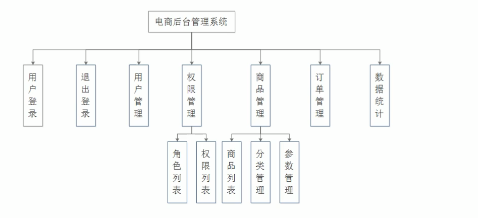
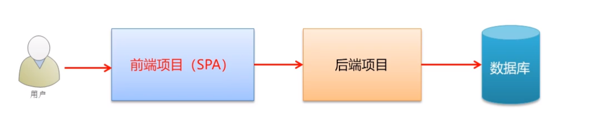
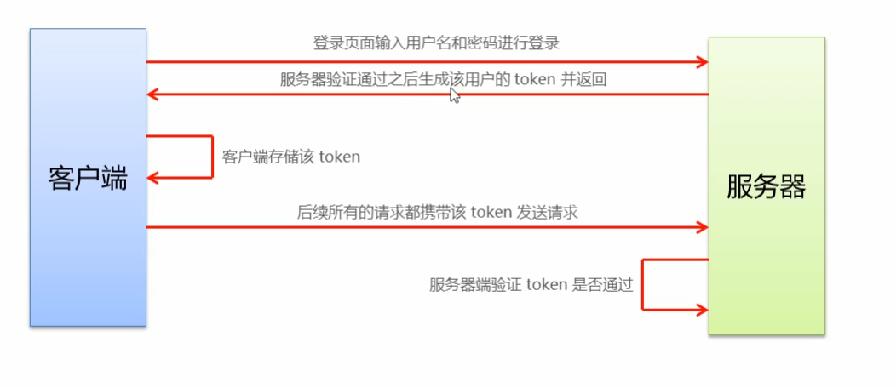
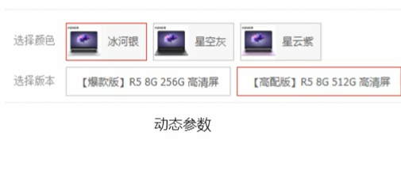
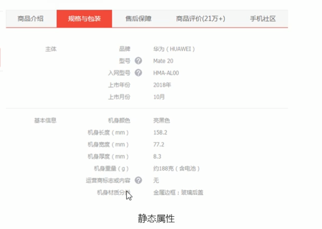

# 一、项目简介

## 1、后台管理系统的功能划分

电商后台管理系统用于管理用户账号、商品分类、商品信息、订单、数据统计等业务功能。 



## 2、后台管理系统的开发模式（前后端分离） 



前后端分离之后，开发流程将如下图所示。


在开发期间前后端共同商定好数据接口的交互形式和数据格式。然后实现前后端的并行开发，其中前端工程师再开发完成之后可以独自进行mock测试，而后端也可以使用接口测试平台进行接口自测，然后前后端一起进行功能联调并校验格式，最终进行自动化测试


## 3、电商后台管理系统的技术选型 

- 前端项目技术栈 

   ` Vue`  

  ` Vue-router` 

  `Element-UI `

  ` Axios` 

  ` Echarts `

- 后端项目技术栈 

  ` Node.js `

  ` Express`

   `Jwt `

  ` Mysql `

  ` Sequelize ` 

# 二、登录/退出功能

## 1、登录业务流程 

① 在登录页面输入用户名和密码 

② 调用后台接口进行验证 

③ 通过验证之后，根据后台的响应状态跳转到项目主页 

## 2、登录业务的相关技术点 

`http` 是无状态的,怎样记录用户的登录状态？

 通过 `cookie `在客户端记录状态 

通过 `session` 在服务器端记录状态 

 通过` token `方式维持状态 

在跨域的情况下，推荐使用`token`方式。

## 3、token原理分析

现在我们面临的一个问题就是，只要任何一个用户知道了服务端接口的地址，都可以进行访问，而我们有时候希望的是登录的用户才能够访问服务端的接口，所以这里需要加上相应的认证机制。关于认证机制，我们这里使用`JWT`.

` JSON Web Token（JWT）`是一个开放的标准（`RFC 7519`），它定义了一个紧凑且自包含的方式，用于在各方之间作为`JSON`对象安全地传输信息。由于此信息是经过数字签名的，因此可以被验证和信任。 

 **传统认证流程**

```
1、用户向服务器发送用户名和密码。

2、服务器验证通过后，在当前对话（session）里面保存相关数据，比如用户角色、登录时间等等。

3、服务器向用户返回一个 session_id，写入用户的 Cookie。

4、用户随后的每一次请求，都会通过 Cookie，将 session_id 传回服务器。

5、服务器收到 session_id，找到前期保存的数据，由此得知用户的身份。
```

这种模式的问题在于，扩展性（scaling）不好。单机当然没有问题，如果是服务器集群，或者是跨域的服务导向架构，就要求 session 数据共享，每台服务器都能够读取 session。所以说，在集群或者是跨域的应用环境下，推荐使用`token的模式`校验。

举例来说，A 网站和 B 网站是同一家公司的关联服务。现在要求，用户只要在其中一个网站登录，再访问另一个网站就会自动登录，请问怎么实现？

一种解决方案是 session 数据持久化，写入数据库或别的持久层。各种服务收到请求后，都向持久层请求数据。这种方案的优点是架构清晰，缺点是工程量比较大。另外，持久层万一挂了，就会单点失败。

另一种方案是服务器索性不保存 session 数据了，所有数据都保存在客户端，每次请求都发回服务器。`JWT` 就是这种方案的一个代表。

**`JWT`认证流程**




## 4、路由创建

在`src`目录下面，创建`router.js`文件,文件定义路由规则

```js
import Vue from "vue";
import Router from "vue-router";
import Login from "./components/Login.vue";
Vue.use(Router);
export default new Router({
  routes: [
    { path: "/", redirect: "/login" },
    { path: "/login", component: Login },
  ],
});
```

输入“/”的时候，会重定向到登录组件。

下面需要在`App.vue`组件中，定义路由占位符。

```vue
<template>
  <div id="app">
      <!--路由占位符-->
    <router-view></router-view> 
  </div>
</template>

<script>
export default {
  name: "App",
};
</script>

<style>
</style>
```

最后，需要在`main.js`文件中导入路由，并且在创建`vue`实例的时候，完成路由的注册。

```js
import router from "./router";

new Vue({
  router,
  render: (h) => h(App),
}).$mount("#app");

```


## 5、登录页面构建

**`Element UI`按需加载**

第一、安装`babel-plugin-component插件`

第二：在`src`目录下面创建`plugins`目录，在该目录下面创建`element.js`文件，在该文件中导入所需要的组件。

```js
import Vue from "vue";
import { Button, Form, FormItem, Input } from "element-ui";

Vue.use(Button);
Vue.use(Form);
Vue.use(FormItem);
Vue.use(Input);

```

第三：在`main.js`文件中导入`element.js`文件。

```js
import "./plugins/element.js";
```

第四：在项目根目录下的`babel.config.js`文件中添加如下`plugins`的配置信息。

```
module.exports = {
  presets: ["@vue/cli-plugin-babel/preset"],
  plugins: [
    [
      "component",
      {
        libraryName: "element-ui",
        styleLibraryName: "theme-chalk",
      },
    ],
  ],
};

```

在整个登录表单构建过程中，还需要注意以下几点：

**第一：数据绑定**

首先给`el-form`添加`model`属性，动态绑定表单元素所需要的数据。

```js
 :model="loginForm"
```

`loginForm`数据定义如下：

```js
data() {
    return {
      // 这是登录表单的数据绑定对象
      loginForm: {
        username: "admin",
        password: "123456",
      },
    }  
```

通过给文本框等表单元素添加`v-model`来绑定具体的数据。

```html
<el-input
            prefix-icon="iconfont icon-user"
            v-model="loginForm.username"
          ></el-input>
          
    <el-input
            prefix-icon="iconfont icon-3702mima"
            v-model="loginForm.password"
            type="password"
          ></el-input>        
```


**第二: 表单校验**

首先给`<el-form>`添加`rules`属性，该属性动态绑定的是表单校验的规则对象。

```js
 :rules="loginFormRules"
```

下面定义校验规则对象。

```js
  // 这是表单的验证规则对象
      loginFormRules: {
        // 验证用户名是否合法
        username: [
          { required: true, message: "请输入登录名称", trigger: "blur" },
          {
            min: 3,
            max: 10,
            message: "长度在 3 到 10 个字符",
            trigger: "blur",
          },
        ],
        // 验证密码是否合法
        password: [
          { required: true, message: "请输入登录密码", trigger: "blur" },
          {
            min: 6,
            max: 15,
            message: "长度在 6 到 15 个字符",
            trigger: "blur",
          },
        ],
      },
```

给`el-form-item` 添加`prop`属性，该属性的值为对应的校验规则属性。

```vue
 <el-form-item prop="username">
          <el-input
            prefix-icon="iconfont icon-user"
            v-model="loginForm.username"
          ></el-input>
        </el-form-item>
        <!-- 密码 -->
        <el-form-item prop="password">
          <el-input
            prefix-icon="iconfont icon-3702mima"
            v-model="loginForm.password"
            type="password"
          ></el-input>
 </el-form-item>
```


**第三：表单重置**

首先给“重置”按钮绑定单击事件，在其所对应的回调处理函数中，通过`resetFields( )`方法完成表单内容的重置。

```html
 <el-button type="info" @click="resetLoginForm">重置</el-button>
```

那么怎样调用`resetFields( )`方法呢？

需要获取`el-form`这个表单的实例。

所以，给`el-form`表单添加`ref`属性。

```js
 ref="loginFormRef"
```

在`resetLoginForm`这个方法中，我们通过当前组件的实例，获取`$refs`属性，然后通过该属性获取表单的实例，从而完成对`resetFields`方法的调用。

```js
  methods: {
    // 点击重置按钮，重置登录表单
    resetLoginForm() {
      // console.log(this);
      this.$refs.loginFormRef.resetFields();
    },
  },
```


完整登录组件的整体布局如下：

```vue
<template>
  <div class="login_container">
    <div class="login_box">
      <!-- 头像区域 -->
      <div class="avatar_box">
        
      </div>
      <!-- 登录表单区域 -->
      <el-form
        label-width="0px"
        class="login_form"
        :model="loginForm"
        :rules="loginFormRules"
        ref="loginFormRef"
      >
        <!-- 用户名 -->
        <el-form-item prop="username">
          <el-input
            prefix-icon="iconfont icon-user"
            v-model="loginForm.username"
          ></el-input>
        </el-form-item>
        <!-- 密码 -->
        <el-form-item prop="password">
          <el-input
            prefix-icon="iconfont icon-3702mima"
            v-model="loginForm.password"
            type="password"
          ></el-input>
        </el-form-item>
        <!-- 按钮区域 -->
        <el-form-item class="btns">
          <el-button type="primary">登录</el-button>
          <el-button type="info" @click="resetLoginForm">重置</el-button>
        </el-form-item>
      </el-form>
    </div>
  </div>
</template>
<script>
export default {
  data() {
    return {
      // 这是登录表单的数据绑定对象
      loginForm: {
        username: "admin",
        password: "123456",
      },
      // 这是表单的验证规则对象
      loginFormRules: {
        // 验证用户名是否合法
        username: [
          { required: true, message: "请输入登录名称", trigger: "blur" },
          {
            min: 3,
            max: 10,
            message: "长度在 3 到 10 个字符",
            trigger: "blur",
          },
        ],
        // 验证密码是否合法
        password: [
          { required: true, message: "请输入登录密码", trigger: "blur" },
          {
            min: 6,
            max: 15,
            message: "长度在 6 到 15 个字符",
            trigger: "blur",
          },
        ],
      },
    };
  },
  methods: {
    // 点击重置按钮，重置登录表单
    resetLoginForm() {
      // console.log(this);
      this.$refs.loginFormRef.resetFields();
    },
  },
};
</script>
<style scoped>
.login_container {
  background-color: #2b4b6b;
  height: 100%;
}
.login_box {
  width: 450px;
  height: 300px;
  background-color: #fff;
  border-radius: 3px;
  position: absolute;
  left: 50%;
  top: 50%;
  transform: translate(-50%, -50%);
}
.avatar_box {
  height: 130px;
  width: 130px;
  border: 1px solid #eee;
  border-radius: 50%;
  padding: 10px;
  box-shadow: 0 0 10px #ddd;
  position: absolute;
  left: 50%;
  transform: translate(-50%, -50%);
  background-color: #fff;
}
img {
  width: 100%;
  height: 100%;
  border-radius: 50%;
  background-color: #eee;
}
.login_form {
  position: absolute;
  bottom: 0;
  width: 100%;
  padding: 0 20px;
  box-sizing: border-box;
}

.btns {
  display: flex;
  justify-content: flex-end;
}
</style>

```

关于全局样式，定义在`assets/css/global.css`文件中，在`main.js`文件中导入全局样式

```js
import "./assets/css/global.css";
```

`global.css`中的初步代码：

```css
html,
body,
#app {
  height: 100%;
  margin: 0;
  padding: 0;
}
```

关于让文本框或者是密码框显示`icon`图标，也非常简单，可以使用第三方的图标库。

下载好的图标库(`fonts`)拷贝到`assets`目录下面，在`main.js`中引入对应的样式。

```js
import "./assets/fonts/iconfont.css";
```

通过`prefix-icon`属性为文本框或密码框前面添加对应的图标。

```html
 <el-input
            prefix-icon="iconfont icon-user"
            v-model="loginForm.username"
          ></el-input>
```

具体的第三方图标使用方式可以参考：`assets/fonts/demo_fontclass.html`文件。

## 6、登录前的表单校验

当用户单击“登录”按钮的时候，不是立即发送请求，而是先进行校验，校验用户在表单中输入的数据是否正确，正确了才会向服务端发送请求。

当用户单击“登录”按钮的时候，是通过`validate`方法来完成对整个表单进行校验。

给登录按钮添加单击事件

```html
  <el-button type="primary" @click="login">登录</el-button>
```

`login`方法实现

```js
 login() {
      this.$refs.loginFormRef.validate((valid) => {
        console.log(valid);
      });
    },
```

通过表单实例来调用`validate`方法，来完成表单校验，注意的一点就是该方法的参数是一个回调函数，回调函数的参数表示校验的结果，如果校验成功参数`valid`为`true`,否则为`false`.

## 7、配置`axios`发起登录请求

安装`axios`

```
npm install axios
```

在`main.js`文件中，导入`axios`,并且将其挂载到`prototype`原型上，同时配置所要访问的服务端的根路径

```js
import axios from "axios";
// 配置请求的跟路径
axios.defaults.baseURL = "http://127.0.0.1:8888/api/private/v1/";
Vue.prototype.$http = axios;
```

下面就可以在`Login.vue`组件中的`login`方法，通过`axios`发送请求。

```js
  login() {
      this.$refs.loginFormRef.validate(async (valid) => {
        // console.log(valid);
        if (!valid) return;//出错，就终止
        const { data: res } = await this.$http.post("login", this.loginForm);
        if (res.meta.status !== 200) return console.log("登录失败！");
        console.log("登录成功");
      });
    },
```

由于`axios`挂载到了`Vue`的原型的`$http`上，所以在每个组件中都可以通过`this.$http`来获取`axios`,然后调用其中的`post`或者是`get`等方法来发送请求。

请求的数据就是用户在表单中输入的，而这里表单已经与`loginForm`对象进行了绑定，所以可以通过`loginForm`对象来获取用户在登录表单中输入的数据，

`post`请求返回的结果是`Promise`对象，这里使用`async`与`await`简化其处理的过程。

最后判断其状态码，从而决定用户是否登录成功。

## 8、配置`Message`提示框

在`plugins/element.js`文件中导入`Message`组件，并且将其挂载到`Vue`实例的原型上。

```js
import Vue from "vue";
import { Button, Form, FormItem, Input, Message } from "element-ui";

Vue.use(Button);
Vue.use(Form);
Vue.use(FormItem);
Vue.use(Input);

Vue.prototype.$message = Message;

```

修改`Login.vue`组件中的`login`方法

```js
  login() {
      this.$refs.loginFormRef.validate(async (valid) => {
        // console.log(valid);
        if (!valid) return;
        const { data: res } = await this.$http.post("login", this.loginForm);
        if (res.meta.status !== 200) return this.$message.error("登录失败！");
        this.$message.success("登录成功");
      });
    },
```

在登录成功后调用的是`Message`组件中的`success`方法，登录失败调用的是`error`方法。

## 9、客户端存储`token`信息

前面在讲解`token`的原理的时候讲解过，在客户端要存储服务端返回的`token`信息。

因为项目中除了登录之外的其它`API`接口，必须在登录之后才能访问。这样，在访问其它的接口的时候，浏览器只要将存储的`token`信息发送到服务端，服务端校验成功，就允许客户端访问指定的接口。

那么，`token`信息是存储在`sessionStorage`中呢？还是`localStorage`中呢？

`token`信息只在当前网站打开期间生效，所以将`token信息`存储到`sessionStorage`中。

下面我们来看一下，具体的实现。

```js
   login() {
      this.$refs.loginFormRef.validate(async (valid) => {
        // console.log(valid);
        if (!valid) return;
        const { data: res } = await this.$http.post("login", this.loginForm);
        if (res.meta.status !== 200) return this.$message.error("登录失败！");
        this.$message.success("登录成功");
        //存储token信息
        window.sessionStorage.setItem("token", res.data.token);
        //跳转到home页面
        this.$router.push("/home");
      });
    },
```

当用户登录成功后，将`token`信息存储到`sessionStorage`中，同时，跳转到`home`页面。

在`components`目录下创建`Home.vue`.

基本的代码如下：

```vue
<template>
  <div>Home组件</div>
</template>

<script>
export default {};
</script>

<style scoped>
</style>

```

同时在`route.js`文件中，定义基本的路由规则

```js
import Vue from "vue";
import Router from "vue-router";
import Login from "./components/Login.vue";
import Home from "./components/Home.vue";
Vue.use(Router);
export default new Router({
  routes: [
    { path: "/", redirect: "/login" },
    { path: "/login", component: Login },
    { path: "/home", component: Home },
  ],
});

```

## 10、通过路由导航守卫控制页面访问权限

通过前面的讲解，我们知道要想访问`Home`组件的内容，必须要登录。

但是，现在面临的一个问题就是，如果某个用户知道了访问`Home`组件的`URL`地址，那么他可以在地址栏中直接输入该地址，也可以访问`Home`组件（这里可以删除`token`信息来演示一下），这样整个登录就没有任何的效果。

怎样避免这个问题呢？

这就需要用到路由导航守卫来解决这个问题。也就是如果用户没有登录，但是直接通过`URL`访问特定页面，需要重新跳转到登录页面，进行登录。登录以后才能访问。

路由导航守卫基本用法。

```js
// 为路由对象，添加`beforeEach`导航守卫
router.beforeEach((to,from,next)=>{
    //如果用户访问的是登录页，直接放行
    if(to.path==='/login') return next()
    const tokenStr=window.sessionStorage.getItem('token')
    // 没有token,强制跳转到登录页
    if(!tokenStr) return next('/login')
    next()
})
```

路由导航守卫本质就是`beforeEach`函数，该函数需要一个回调函数作为参数，回调函数中第一个参数`to`,表示将要访问的地址，`from`:表示是从哪个地址跳转过来的。`next` 表示继续执行的函数。

下面看一下`router.js`文件的代码改造

```js
import Vue from "vue";
import Router from "vue-router";
import Login from "./components/Login.vue";
import Home from "./components/Home.vue";
Vue.use(Router);
const router = new Router({
  routes: [
    { path: "/", redirect: "/login" },
    { path: "/login", component: Login },
    { path: "/home", component: Home },
  ],
});
// 挂载路由导航守卫
router.beforeEach((to, from, next) => {
  // to 将要访问的路径
  // from 代表从哪个路径跳转而来
  // next 是一个函数，表示放行
  //     next()  放行    next('/login')  强制跳转到登录页

  if (to.path === "/login") return next();
  // 获取token
  const tokenStr = window.sessionStorage.getItem("token");
  if (!tokenStr) return next("/login");
  next();
});
export default router;

```

## 11、实现退出功能

基于`token`的方式实现退出功能比较简单，只要销毁本地的`token`即可。这样，后续的请求就不会懈怠`token`，必须重新登录以后，生成一个新的`token`之后才可以访问其它的页面。

```js
// 清空token   
window.sessionStorage.clear()  
// 跳转到登录页   
this.$router.push('/login') 
```

在`Home`组件中，添加一个“退出”按钮，实现退出功能。

```vue
<template>
  <div>
    <el-button type="info" @click="logout">退出</el-button>
  </div>
</template>

<script>
export default {
  methods: {
    logout() {
      window.sessionStorage.clear();
      this.$router.push("/login");
    },
  },
};
</script>

<style  scoped>
</style>
```

# 三、主页布局和功能实现

## 1、主页基本布局实现

这里主要是使用了`element-ui`中的布局组件完成的。

`Home.vue`组件的布局如下：

```vue
<template>
  <el-container class="home-container">
    <!-- 头部区域 -->
    <el-header>
      <el-button type="info" @click="logout">退出</el-button>Header
    </el-header>
    <!-- 页面主体区域 -->
    <el-container>
      <!-- 侧边栏 -->
      <el-aside width="200px">Aside</el-aside>
      <!-- 右侧内容主体 -->
      <el-main>Main</el-main>
    </el-container>
  </el-container>
</template>

<script>
export default {
  methods: {
    logout() {
      window.sessionStorage.clear();
      this.$router.push("/login");
    },
  },
};
</script>

<style  scoped>
.home-container {
  height: 100%;
}
.el-header {
  background-color: #373d41;
}
.el-aside {
  background-color: #333744;
}
.el-main {
  background-color: #eaedf1;
}
</style>
```

注意：在`plugins/element.js`文件中要导入相应的布局组件。

```js
import Vue from "vue";
import {
  Button,
  Form,
  FormItem,
  Input,
  Message,
  Container,
  Header,
  Aside,
  Main,
} from "element-ui";

Vue.use(Button);
Vue.use(Form);
Vue.use(FormItem);
Vue.use(Input);
Vue.use(Container);
Vue.use(Header);
Vue.use(Aside);
Vue.use(Main);
Vue.prototype.$message = Message;

```

## 2、头部区域布局设计

首先对头部区域的结构做了一个简单的修改，添加了`logo`图标，以及相应的文字。

```vue
 <!-- 头部区域 -->
    <el-header>
      <div class="header-div">
        
        <span>电商后台管理系统</span>
      </div>
      <el-button type="info" @click="logout">退出</el-button>
    </el-header>
```

下面就是对头部区域的样式处理

```css
.el-header {
  background-color: #373d41;
  display: flex;
  justify-content: space-between;
  padding-left: 0;
  align-items: center;
  color: #fff;
  font-size: 20px;
}
.header-div {
  display: flex;
  align-items: center;
}
```

## 3、实现导航菜单的基本结构

这里需要了解`element-ui`中导航菜单的基本使用就可以。

```html
   <!-- 页面主体区域 -->
    <el-container>
      <!-- 侧边栏 -->
      <el-aside width="200px">
      <!--菜单区域-->
        <el-menu
          default-active="2"
          background-color="#545c64"
          text-color="#fff"
          active-text-color="#ffd04b"
        >
          <!-- 一级菜单 -->
          <el-submenu index="1">
            <!-- 一级菜单的模板区域 -->
            <template slot="title">
              <!-- 图标 -->
              <i class="el-icon-location"></i>
              <!-- 文本 -->
              <span>导航一</span>
            </template>
                <!-- 二级菜单 -->
                <el-menu-item index="1-1">
                  <!-- 图标 -->
                  <i class="el-icon-location"></i>
                  <!-- 文本 -->
                  <span>导航一</span>
                </el-menu-item>
          </el-submenu>
        </el-menu>
      </el-aside>
      <!-- 右侧内容主体 -->
      <el-main>Main</el-main>
    </el-container>
```

这里我们是在`<el-aside>`左侧区域添加了一个菜单，而且这里要求菜单只保留到二级菜单。

在`element.js`文件中，添加对菜单组件的注册。

```js
import Vue from "vue";
import {
  Button,
  Form,
  FormItem,
  Input,
  Message,
  Container,
  Header,
  Aside,
  Main,
  Menu,
  Submenu,
  MenuItem,
} from "element-ui";

Vue.use(Button);
Vue.use(Form);
Vue.use(FormItem);
Vue.use(Input);
Vue.use(Container);
Vue.use(Header);
Vue.use(Aside);
Vue.use(Main);
Vue.use(Menu);
Vue.use(Submenu);
Vue.use(MenuItem);
Vue.prototype.$message = Message;

```

## 4、通过`axios` 拦截器添加`token`验证

现在我们面临的一个问题，就是如果想要访问受保护的`API`应该怎样处理呢？

对了，可以将我们存在`sessionStorage`中的`token`信息发送到服务端，服务端就可以进行校验，如果合法，运行访问其对应的接口，

关键是怎样将`token`信息发送到服务端呢？

必须在请求头中使用`Authorization`字段来保存`token`数据。这时通过该字段，可以将`token`数据发送到服务端。

而我们知道，在我们的系统中，除了登录接口不需要`token`数据以外，其它的接口都是需要的，这就需要在每个请求服务端的`API`接口中都要加上``Authorization``字段。

那问题是怎样在每个请求中都加上``Authorization``字段呢？

这里可以通过`axios`请求拦截器添加`token`信息。

基本的语法：

```js
 // axios请求拦截   
axios.interceptors.request.use(config => {    
    // 为请求头对象，添加 Token 验证的 Authorization 字段    
    config.headers.Authorization = window.sessionStorage.getItem('token') 
    return config 
}
```

在`axios`中的`interceptors` 属性中有一个`request`,它就是`axios`的请求拦截器。

也就是说，每次使用`axios`向服务器发送请求，都会先执行`request`这个拦截器。这时会调用`use`函数（也就是请求在到达服务端之前，先执行`use`函数），在该函数的回调函数中，对请求进行处理，处理完成后继续向下执行，也就是将请求的内容做了一次处理后，在发送到服务端。

具体实现如下，在`main.js`文件中，在将`axios`挂载到`Vue`原型对象上之前，启用`axios`的拦截器。

```js
import axios from "axios";
// 配置请求的跟路径
axios.defaults.baseURL = "http://127.0.0.1:8888/api/private/v1/";
//axios拦截器
axios.interceptors.request.use((config) => {
  // console.log(config)
  config.headers.Authorization = window.sessionStorage.getItem("token");
  //最后必须返回config
  return config;
});
Vue.prototype.$http = axios;
```

## 5、获取左侧菜单数据

在`Home.vue`中发送请求，获取菜单数据。实现代码如下：

```js
<script>
export default {
  data() {
    return {
      menulist: [],//菜单数据
    };
  },
  created() {
      //调用getMenuList方法获取菜单数据
    this.getMenuList();
  },
  methods: {
    logout() {
      window.sessionStorage.clear();
      this.$router.push("/login");
    },
    //获取菜单数据
    async getMenuList() {
      const { data: res } = await this.$http.get("menus");
      if (res.meta.status !== 200) return this.$message.error(res.meta.msg);
      this.menulist = res.data;
      console.log(res);
    },
  },
};
</script>
```

在组件创建完成后，发送请求获取菜单数据。

## 6、渲染菜单结构

在上面的案例中，我们已经获取到了菜单数据。下面要将菜单数据渲染到页面中。

注意：服务端返回的菜单数据的格式。

```html
 <!-- 一级菜单 -->
          <el-submenu :index="item.id + ''" v-for="item in menulist" :key="item.id">
            <!-- 一级菜单的模板区域 -->
            <template slot="title">
              <!-- 图标 -->
              <i class="el-icon-location"></i>
              <!-- 文本 -->
              <span>{{item.authName}}</span>
            </template>
            <!-- 二级菜单 -->
            <el-menu-item :index="subItem.id+''" v-for="subItem in item.children" :key="subItem.id">
              <!-- 图标 -->
              <i class="el-icon-location"></i>
              <!-- 文本 -->
              <span>{{subItem.authName}}</span>
            </el-menu-item>
          </el-submenu>
```

由于服务端返回的菜单数据只要两级，所以这里通过两个`for`循环嵌套，就可以获取到所有的菜单数据。

首先，第一层循环遍历`menulist`,获取一级菜单的内容，注意:`index`属性的取值只能为字符串，不能能为数字，并且要唯一，

然后，第二层循环遍历`item.children`获取二级菜单内容。

思考：如果是多层菜单（不止二层）应该怎样处理？

 

## 7、菜单图标处理

在`Home.vue`组件中更换菜单名称前面的图标。

这里一级菜单的图标，使用的是第三方的图标。

```js
 data() {
    return {
      menulist: [],
      // 菜单图标
      iconsObj: {
        "125": "iconfont icon-user",
        "103": "iconfont icon-tijikongjian",
        "101": "iconfont icon-shangpin",
        "102": "iconfont icon-danju",
        "145": "iconfont icon-baobiao",
      },
    };
  },
```

`iconsObj` 对象中存储的是一级菜单的编号与图标样式的对应关系。

```html
  <!-- 图标 -->
              <i :class="iconsObj[item.id]"></i>
```

这里对一级菜单的样式进行动态的绑定，从`iconsObj`对象中根据菜单编号获取具体的样式。

二级菜单采用固定的图标

```html
 <!-- 图标 -->
              <i class="el-icon-menu"></i>
```

调整图标与菜单名称之间的填充距。

```css
.iconfont {
  margin-right: 10px;
}
```

下面我们要实现的效果就是每次只打开一个菜单项。

这里需要给`<el-menu>`添加`unique-opened`属性就可以了。

同时，当我们单击，二级菜单的时候，发现菜单超出了指定区域，这里只需要将`<el-menu>`的边框去掉就可以了。

```
 .el-menu {
    border-right: none;
  }
```

## 8、左侧菜单的折叠与展开效果

首先在侧边栏下面添加一个折叠的图标。

```html
  <!-- 侧边栏 -->
      <el-aside width=" 200px">
        <div class="toggle-button" @click="toggleCollapse">|||</div>
```

下面定义对应的样式

```css
.toggle-button {
  background-color: #4a5064;
  font-size: 10px;
  line-height: 24px;
  color: #fff;
  text-align: center;
  letter-spacing: 0.2em;
  cursor: pointer;
}
```

控制菜单的折叠与展开，需要给`el-menu`添加`collapse`属性，该属性为`true`,表示展开菜单，为`false`折叠菜单。

同时，可以给`el-menu`添加属性`collapse-transition`将菜单折叠的动画去掉，为`false`的时候就可以去掉。

```html
 <el-menu
          default-active="2"
          background-color="#545c64"
          text-color="#fff"
          active-text-color="#409EFF"
          unique-opened
          :collapse="isCollapse"
          :collapse-transition="false"
        >
```

`isCollapse`属性的定义如下：

```js
 data() {
    return {
      menulist: [],
      // 菜单图标
      iconsObj: {
        "125": "iconfont icon-user",
        "103": "iconfont icon-tijikongjian",
        "101": "iconfont icon-shangpin",
        "102": "iconfont icon-danju",
        "145": "iconfont icon-baobiao",
      },
      // 是否折叠
      isCollapse: false,
    };
```

`isCollapse`属性默认值为`false`,表示菜单是不折叠的。

当单击了按钮后，在`toggleCollapse`方法中修改`isCollapse`属性,控制菜单的隐藏域展示

```js
 // 点击按钮，切换菜单的折叠与展开
    toggleCollapse() {
      this.isCollapse = !this.isCollapse;
    },
```

由于整个菜单所在的左侧区域的宽度在这里，都固定死了，为`200px`.

```html
 <el-aside width=" 200px">
```

这样导致的结果就是，当菜单折叠起来以后，整个左侧区域的宽度没有改变，这样效果比较差。

```html
 <el-aside :width="isCollapse ? '64px' : '200px'">
```

所以这里根据菜单是否折叠，动态修改左侧区域的宽度。

## 9、实现首页路由的重定向

当用户登录成功后，会展示`Home`组件的内容，但是这里我们还想展示一个欢迎组件中的内容。

这里可以使用子路由以及路由重定向来实现。

下面，先在`components`中定义一个欢迎的组件`Welcome.vue`

```vue
<template>
  <div>
    <h2>欢迎登录电商管理系统</h2>
  </div>
</template>
```

注意：如果组件中只是展示固定的内容，并且没有样式，可以只写一个`template`模板。

修改`router.js`文件中的路由规则：

```js
import Vue from "vue";
import Router from "vue-router";
import Login from "./components/Login.vue";
import Home from "./components/Home.vue";
//导入Welcome组件
import Welcome from "./components/Welcome.vue";
Vue.use(Router);
const router = new Router({
  routes: [
    { path: "/", redirect: "/login" },
    { path: "/login", component: Login },
    {
      path: "/home",
      component: Home,
      redirect: "/welcome",
      children: [{ path: "/welcome", component: Welcome }],
    },
  ],
});
```

当用户访问`/home`的时候，先呈现出`Home`组件的内容，然后重定向到`/welcome`，这时会展示`Welcome`组件的内容。

那么`Welcome`组件的内容是在`Home`组件中进行展示，所以需要在`Home`组件中使用` <router-view>`添加一个占位符。

```html
 <!-- 右侧内容主体 -->
      <el-main>
        <router-view></router-view>
      </el-main>
```

这里在`Home`组件的右侧内容主体区域展示`Welcome`组件的内容。

## 10、启用菜单链接功能

要想让`element-ui`的菜单具有链接功能，需要为菜单添加` router`属性，默认值为`true`,表示启用超链接功能。

```html
  <el-menu
          default-active="2"
          background-color="#545c64"
          text-color="#fff"
          active-text-color="#409EFF"
          unique-opened
          :collapse="isCollapse"
          :collapse-transition="false"
          router <!--启用链接-->
        >
```

当单击二级菜单的时候，要跳转到具体的页面。

那么地址应该怎样确定呢？

当单击二级菜单的时候，发现模拟的值为`<el-menu-item>`的`index`属性的取值。

所以这里需要将`index`的值，修改成菜单的地址，而这个地址数据是服务端返回的。

所以修改后的内容如下：

```html
 <el-menu-item
              :index="'/' + subItem.path"
              v-for="subItem in item.children"
              :key="subItem.id"
            >
              <!-- 图标 -->
              <i class="el-icon-menu"></i>
              <!-- 文本 -->
              <span>{{subItem.authName}}</span>
            </el-menu-item>
```

在上面的代码中，修改了`index`属性的取值，注意路径前面要加上`/`.

# 四、用户列表布局和功能实现

## 1、用户列表基本展示

当单击菜单“用户列表”的时候，将用户列表组件，在其右侧进行展示。

首先，在`components`目录下面创建`user`目录，该目录存放的就是用户列表组件`Users.vue`.

```html
<template>
  <div>用户列表</div>
</template>
<script>
export default {};
</script>
<style scoped>
</style>
```

在`router.js`文件中定义路由规则。

```js
import Vue from "vue";
import Router from "vue-router";
import Login from "./components/Login.vue";
import Home from "./components/Home.vue";
import Welcome from "./components/Welcome.vue";
import Users from "./components/user/Users.vue";
Vue.use(Router);
const router = new Router({
  routes: [
    { path: "/", redirect: "/login" },
    { path: "/login", component: Login },
    {
      path: "/home",
      component: Home,
      redirect: "/welcome",
      children: [
        { path: "/welcome", component: Welcome },
        { path: "/users", component: Users },
      ],
    },
  ],
});
```

在`Home`添加子路由，这样如果用户输入的是`/users`，那么会展示`User`组件的内容，并且是在`Home`组件的"右侧内容主体"区域展示

```html
 <!-- 右侧内容主体 -->
      <el-main>
        <router-view></router-view>
      </el-main>
```

## 2、保存菜单的激活状态

当单击了某个菜单项以后，应该让该菜单高亮显示，同时如果用户单击刷新按钮，也应该能够保持菜单的高亮显示。

这里需要给`<el-menu>`添加`default-active`属性来实现，如果该属性的值为`/users`（菜单的路径，也就是`index`属性的值），表明用户列表这个菜单被选中。

首先，让`default-active`属性绑定一个动态值`activePath`,默认值为空字符串。

```html
 <el-menu
          <!--添加default-active-->
          :default-active="activePath"
          background-color="#545c64"
          text-color="#fff"
          active-text-color="#409EFF"
          unique-opened
          :collapse="isCollapse"
          :collapse-transition="false"
          router
        >
```

`activePath`属性的定义如下：

```js
  data() {
    return {
      menulist: [],
      iconsObj: {
        "125": "iconfont icon-user",
        "103": "iconfont icon-tijikongjian",
        "101": "iconfont icon-shangpin",
        "102": "iconfont icon-danju",
        "145": "iconfont icon-baobiao",
      },
      isCollapse: false,
      // 被激活的链接地址
      activePath: "",
    };
  },
```

下面，我们要考虑的就是，单击了哪个二级菜单，就需要将对应的地址赋值给`activePath`属性。

```html
  <!-- 二级菜单 -->
            <el-menu-item
              :index="'/' + subItem.path"
              v-for="subItem in item.children"
              :key="subItem.id"
              @click="saveNavState('/' + subItem.path)"
            >
```

在上面的代码找中，我们给二级菜单添加了单击事件，当事件触发后执行`saveNavState`方法，将所单击的菜单的路径作为参数传递到该方法中，

在该方法中，将传递过来的菜单的地址赋值给`activePath`属性。

```js
 // 保存链接的激活状态
    saveNavState(activePath) {
      window.sessionStorage.setItem('activePath', activePath)
      this.activePath = activePath
    }
```

同时，这里还要考虑当单击刷新按钮的时候，也要保持当前所单击菜单的选中状态，也就是高亮状态，所以将所单击的菜单的地址存储到了`sessionStorage`中。

而当点击浏览器的刷新按钮的时候，会执行`created`这个钩子函数，所以这里需要在该钩子函数中，把`sessionStorage`中存储的地址取出来，交给`activePath`属性。

## 3、用户列表基本布局实现

在用户列表的基本布局中，创建了面包屑，同时创建了卡片区域，在卡片区域中通过`el-row`与`el-col`进行了栅格布局。

```html
<template>
  <div>
    <!-- 面包屑导航区域 -->
    <el-breadcrumb separator-class="el-icon-arrow-right">
      <el-breadcrumb-item :to="{ path: '/home' }">首页</el-breadcrumb-item>
      <el-breadcrumb-item>用户管理</el-breadcrumb-item>
      <el-breadcrumb-item>用户列表</el-breadcrumb-item>
    </el-breadcrumb>
    <!-- 卡片视图区域 -->
    <el-card>
      <!-- 搜索与添加区域，gutter：栅格间隔 -->
      <el-row :gutter="20">
          <!--占8列-->
        <el-col :span="8">
          <el-input placeholder="请输入内容">
            <el-button slot="append" icon="el-icon-search"></el-button>
          </el-input>
        </el-col>
        <el-col :span="4">
          <el-button type="primary">添加用户</el-button>
        </el-col>
      </el-row>
    </el-card>
  </div>
</template>
<script>
export default {};
</script>
<style scoped>
</style>
```

同时需要在`element.js`文件中完成组件的注册。

```js
Vue.use(Breadcrumb);
Vue.use(BreadcrumbItem);
Vue.use(Card);
Vue.use(Row);
Vue.use(Col);
```

如果需要修改全局的样式，定义在`assets/css/global.css`文件中。

```css
/* 全局样式表 */
html,
body,
#app {
  height: 100%;
  margin: 0;
  padding: 0;
}
.el-breadcrumb {
  margin-bottom: 15px;
  font-size: 12px;
}

.el-card {
  box-shadow: 0 1px 1px rgba(0, 0, 0, 0.15) !important;
}
```

## 4、获取用户列表数据

在`Users.vue`组件中的`created`钩子函数中，构建请求，获取用户数据，这次请求的方式为`get`请求，并且需要参数。

```js
<script>
export default {
  data() {
    return {
      // 获取用户列表的参数对象
      queryInfo: {
        query: "",
        // 当前的页数
        pagenum: 1,
        // 当前每页显示多少条数据
        pagesize: 2,
      },
      userlist: [],
      total: 0,
    };
  },
  created() {
    this.getUserList();
  },
  methods: {
    async getUserList() {
      const { data: res } = await this.$http.get("users", {
          //通过params组织参数。
        params: this.queryInfo,
      });
      if (res.meta.status !== 200) {
        return this.$message.error("获取用户列表失败！");
      }
        //获取用户数据
      this.userlist = res.data.users;
        //获取总的记录数。
      this.total = res.data.total;
      console.log(res);
    },
  },
};
</script>
```

## 5、使用表格展示用户数据

表格基本使用比较简单，具体的细节可以参考文档。

我们是在`el-card`中，直接添加了表格内容。

```html
  <!-- 卡片视图区域 -->
    <el-card>
      <!-- 搜索与添加区域 -->
      <el-row :gutter="20">
        <el-col :span="8">
          <el-input placeholder="请输入内容">
            <el-button slot="append" icon="el-icon-search"></el-button>
          </el-input>
        </el-col>
        <el-col :span="4">
          <el-button type="primary">添加用户</el-button>
        </el-col>
      </el-row>
      <!-- 用户列表区域 -->
      <el-table :data="userlist" border stripe>
        <el-table-column type="index"></el-table-column>
        <el-table-column label="姓名" prop="username"></el-table-column>
        <el-table-column label="邮箱" prop="email"></el-table-column>
        <el-table-column label="电话" prop="mobile"></el-table-column>
        <el-table-column label="角色" prop="role_name"></el-table-column>
        <el-table-column label="状态"></el-table-column>
        <el-table-column label="操作"></el-table-column>
      </el-table>
    </el-card>
```

给表格指定了数据源，边框，以及各行换色的功能。

同时给表格添加了表头，以及通过`prop`指定每列所展示的数据。

在`element.js`文件中完成对表格组件的注册。

```js
Vue.use(Table);
Vue.use(TableColumn);
```

可以在`global.css`中对表格的样式进行重写。

```css
.el-table {
  margin-top: 15px;
  font-size: 12px;
}
```


## 6、自定义状态列的显示效果

在表格的状态这一列上添加一个`switch`开关，如果获取到的状态是`true`,则让`switch`开关处于打开状态，否则处于关闭状态。

在表格的状态这一列中，添加一个作用域的插槽（可以通过`scope`来获取到当前行的数据），在插槽中使用了`el-switch`组件。

```html
   <el-table-column label="状态">
          <template slot-scope="scope">
            <el-switch v-model="scope.row.mg_state"></el-switch>
          </template>
        </el-table-column>
```

在`element.js`文件中也需要完成`Switch`组件的注册

```
Vue.use(Switch);
```

插槽的问题。

## 7、自定义操作列

关于用户列表中的操作列，也是通过作用域插槽来完成的。

因为，我们在单击删除按钮，或者是编辑按钮的时候是可以通过`scope`来获取对应用户的编号的。

在这里，我们先把基本结构创建出来，后期在完善作用域插槽。

```html
 <el-table-column label="操作" width="180px">
          <template>
            <!-- 修改按钮 -->
            <el-button type="primary" icon="el-icon-edit" size="mini"></el-button>
            <!-- 删除按钮 -->
            <el-button type="danger" icon="el-icon-delete" size="mini"></el-button>
            <!-- 分配角色按钮 -->
            <el-tooltip effect="dark" content="分配角色" placement="top" :enterable="false">
              <el-button type="warning" icon="el-icon-setting" size="mini"></el-button>
            </el-tooltip>
          </template>
        </el-table-column>
```

同时在`element.js`文件中导入`Tooltip`组件。

```
Vue.use(Tooltip);
```

## 8、实现分页效果

在`Users.vue`组件中使用分页组件完成分页。

在`el-table`下面添加分页组件。

```html
   <!-- 分页区域 -->
      <el-pagination
        @size-change="handleSizeChange"
        @current-change="handleCurrentChange"
        :current-page="queryInfo.pagenum"
        :page-sizes="[1, 2, 5, 10]"
        :page-size="queryInfo.pagesize"
        layout="total, sizes, prev, pager, next, jumper"
        :total="total"
      ></el-pagination>
```

对应处理函数

```js
  // 监听 pagesize 改变的事件，当每页显示的记录数发生改变了，重新获取数据。
    handleSizeChange(newSize) {
      // console.log(newSize)
      this.queryInfo.pagesize = newSize;
      this.getUserList();
    },
    // 监听 页码值 改变的事件,当页码值发生改变了，重新获取数据
    handleCurrentChange(newPage) {
      console.log(newPage);
      this.queryInfo.pagenum = newPage;
      this.getUserList();
    },
```

注册`Pagination`组件

```
Vue.use(Pagination);
```

也可以在`global.css`中修改对应的样式。


## 9、修改用户状态

当单击`Switch`组件的时候，需要完成用户状态的更新。

当`Switch`组件改变的时候，会触发`change`事件。

```html
 <template slot-scope="scope">
            <el-switch v-model="scope.row.mg_state" @change="userStateChanged(scope.row)"></el-switch>
          </template>
```

在这里我们将`scope.row.mg_state`与`switch`进行了双向数据绑定，如果`mg_state`属性的值为`false`,表示`switch`关闭状态，否则就是打开状态。

反之，如果我们手动的修改了`switch`组件的状态，那么`mg_state` 的值也会发生变化。

假如我们现在将一个`switch`组件的状态有关闭状态修改成打开的状态，那么`mg_state`的值也会有`false`变成`true`,那么接下来要做的就是发送一个异步的请求，将这个数据发送到服务端，从而完成当前用户状态的更新。

```js
   // 监听 switch 开关状态的改变
    async userStateChanged(userinfo) {
      //console.log(userinfo);
      const { data: res } = await this.$http.put(
        `users/${userinfo.id}/state/${userinfo.mg_state}`
      );
      if (res.meta.status !== 200) {
        userinfo.mg_state = !userinfo.mg_state;
        return this.$message.error("更新用户状态失败！");
      }
      this.$message.success("更新用户状态成功！");
    },
```

注意：这里发送请求的方式为`put`.

同时还需要注意：如果更新数据库失败了，我们要将`switch`组件的状态进行还原。也就是说，我们手动的修改 了`switch`组件的状态（假如默认状态是关闭状态），在页面上已经呈现了打开状态，但是，如果数据库更新失败了，需要将`switch`组件的状态有打开状态还原到关闭状态。


## 10、用户搜索功能实现

```html
     <el-col :span="8">
          <el-input placeholder="请输入内容" v-model="queryInfo.query" clearable @clear="getUserList">
            <el-button slot="append" icon="el-icon-search" @click="getUserList"></el-button>
          </el-input>
        </el-col>
```

将搜索框与`queryInfo.query`属性进行双向数据绑定，同时给搜索框右侧添加一个删除的图标，单击删除的图标会将用户在搜索框中输入的内容清空，同时触发`@clear`事件，调用`getUserList`方法，这时就会查询出所有的用户数据。

当用户在搜索框中输入完搜索的条件后，单击搜索按钮触发单击事件，调用`getUserList`方法，这时由于搜索框与`query`属性进行了双向数据绑定，所以`query`属性中存储了用户输入的搜索条件，这样在调用`getUserList`方法的时候，会将搜索条件发送服务端，从而完成数据的搜索。

# 五、用户添加、编辑、删除功能实现

## 1、展示用户添加对话框

对话框的展示需要用到`Dialog`组件。

在`el-card`组件下面添加对话框

```html
 <!-- 添加用户的对话框 -->
    <el-dialog title="添加用户" :visible.sync="addDialogVisible" width="50%">
      <!-- 底部区域 -->
      <span slot="footer" class="dialog-footer">
        <el-button @click="addDialogVisible = false">取 消</el-button>
        <el-button type="primary" @click="addDialogVisible = false">确 定</el-button>
      </span>
    </el-dialog>
```

通过属性`addDialogVisible`控制对话框的显示与隐藏。

```json
data() {
    return {
      // 获取用户列表的参数对象
      queryInfo: {
        query: "",
        // 当前的页数
        pagenum: 1,
        // 当前每页显示多少条数据
        pagesize: 2,
      },
      userlist: [],
      total: 0,
      // 控制添加用户对话框的显示与隐藏
      addDialogVisible: false,
    };
```

当单击对话框中的“取消”按钮和“确定”按钮的时候，都会修改`addDialogVisible`属性的值为`false`,关闭对话框。

```html
    <el-col :span="4">
          <el-button type="primary" @click="addDialogVisible = true">添加用户</el-button>
        </el-col>
```

当单击“添加用户”按钮的时候，修改`addDialogVisible`属性的值为`true`,展示出对应的对话框。

`Vue.use(Dialog)`

## 2、展示添加用户表单

在对话框中添加用户表单

```html
 <!-- 添加用户的对话框 -->
    <el-dialog title="添加用户" :visible.sync="addDialogVisible" width="50%">
      <!-- 内容主体区域 -->
        <!--用户表单-->
      <el-form :model="addForm" :rules="addFormRules" ref="addFormRef" label-width="70px">
        <el-form-item label="用户名" prop="username">
          <el-input v-model="addForm.username"></el-input>
        </el-form-item>
        <el-form-item label="密码" prop="password">
          <el-input v-model="addForm.password"></el-input>
        </el-form-item>
        <el-form-item label="邮箱" prop="email">
          <el-input v-model="addForm.email"></el-input>
        </el-form-item>
        <el-form-item label="手机" prop="mobile">
          <el-input v-model="addForm.mobile"></el-input>
        </el-form-item>
      </el-form>

      <!-- 底部区域 -->
      <span slot="footer" class="dialog-footer">
        <el-button @click="addDialogVisible = false">取 消</el-button>
        <el-button type="primary" @click="addDialogVisible = false">确 定</el-button>
      </span>
    </el-dialog>
```

定义表单数据属性与校验规则

```js
  data() {
    return {
      // 获取用户列表的参数对象
      queryInfo: {
        query: "",
        // 当前的页数
        pagenum: 1,
        // 当前每页显示多少条数据
        pagesize: 2,
      },
      userlist: [],
      total: 0,
      // 控制添加用户对话框的显示与隐藏
      addDialogVisible: false,
      // 添加用户的表单数据
      addForm: {
        username: "",
        password: "",
        email: "",
        mobile: "",
      },
      // 添加表单的验证规则对象
      addFormRules: {
        username: [
          { required: true, message: "请输入用户名", trigger: "blur" },
          {
            min: 3,
            max: 10,
            message: "用户名的长度在3~10个字符之间",
            trigger: "blur",
          },
        ],
        password: [
          { required: true, message: "请输入密码", trigger: "blur" },
          {
            min: 6,
            max: 15,
            message: "用户名的长度在6~15个字符之间",
            trigger: "blur",
          },
        ],
        email: [{ required: true, message: "请输入邮箱", trigger: "blur" }],
        mobile: [{ required: true, message: "请输入手机号", trigger: "blur" }],
      },
    };
```

## 3、自定义校验规则

现在需要对邮箱与手机号码进行规则校验。具体的使用方式，可以参考官方文档：`https://element.eleme.cn/#/zh-CN/component/form`

中，对表单的自定义校验规则的实现。

在`data`中定义校验的函数。

```js
data() {
    // 验证邮箱的规则
    var checkEmail = (rule, value, cb) => {
      // 验证邮箱的正则表达式
      const regEmail = /^([a-zA-Z0-9_-])+@([a-zA-Z0-9_-])+(\.[a-zA-Z0-9_-])+/;

      if (regEmail.test(value)) {
        // 合法的邮箱
        return cb();
      }

      cb(new Error("请输入合法的邮箱"));
    };

    // 验证手机号的规则
    var checkMobile = (rule, value, cb) => {
      // 验证手机号的正则表达式
      const regMobile = /^(0|86|17951)?(13[0-9]|15[012356789]|17[678]|18[0-9]|14[57])[0-9]{8}$/;

      if (regMobile.test(value)) {
        return cb();
      }

      cb(new Error("请输入合法的手机号"));
    };

    
    
    return {
      // 获取用户列表的参数对象
      queryInfo: {
        query: "",
        // 当前的页数
        pagenum: 1,
        // 当前每页显示多少条数据
        pagesize: 2,
      },
      userlist: [],
      total: 0,
      // 控制添加用户对话框的显示与隐藏
      addDialogVisible: false,
      // 添加用户的表单数据
      addForm: {
        username: "",
        password: "",
        email: "",
        mobile: "",
      },
```

使用规则校验的函数。

```js
  email: [
          { required: true, message: "请输入邮箱", trigger: "blur" },
          { validator: checkEmail, trigger: "blur" },
        ],
        mobile: [
          { required: true, message: "请输入手机号", trigger: "blur" },
          { validator: checkMobile, trigger: "blur" },
        ],
```

这里是通过`validator`来使用校验的函数。

## 4、实现表单重置操作

如果在表单中输入了内容，然后单击了“取消”按钮，这时再次单击“添加”按钮后，弹出的表单中还保留了上次输入的内容。

而像这种情况，表单应该是呈现出最开始的默认状态。

具体的实现如下：

```html
 <el-dialog title="添加用户" :visible.sync="addDialogVisible" width="50%" @close="addDialogClosed">
```

给`dialog`对话框添加了`@close`事件，当关闭窗口的时候会触发该事件。

在`addDialogClosed`方法中，将表单的内容进行重置。在`methods`中，定义如下的方法。

```js
  // 监听添加用户对话框的关闭事件
    addDialogClosed() {
      this.$refs.addFormRef.resetFields();
    },
```

## 5、完成用户添加

首先，修改添加对话框中的“确定”按钮，为其添加单击事件。

```html
 <!-- 底部区域 -->
      <span slot="footer" class="dialog-footer">
        <el-button @click="addDialogVisible = false">取 消</el-button>
        <el-button type="primary" @click="addUser">确 定</el-button>
      </span>
```

`addUser`方法的实现如下：

```js
  // 点击按钮，添加新用户
    addUser() {
      this.$refs.addFormRef.validate(async (valid) => {
          //表单没有校验通过，终止请求的发送。
        if (!valid) return;
        // 可以发起添加用户的网络请求
        const { data: res } = await this.$http.post("users", this.addForm);

        if (res.meta.status !== 201) {
          this.$message.error("添加用户失败！");
        }

        this.$message.success("添加用户成功！");
        // 隐藏添加用户的对话框
        this.addDialogVisible = false;
        // 重新获取用户列表数据
        this.getUserList();
      });
    },
```

## 6、展示修改用户的对话框

在添加用户对话框的下面，再次创建一个对话框表示修改用户信息的对话框。

```html
<!-- 修改用户的对话框 -->
    <el-dialog title="修改用户" :visible.sync="editDialogVisible" width="50%">
      修改用户信息
      <span slot="footer" class="dialog-footer">
        <el-button @click="editDialogVisible = false">取 消</el-button>
        <el-button type="primary" @click="editDialogVisible = false">确 定</el-button>
      </span>
    </el-dialog>
```

`editDialogVisible`属性控制对话框的显示与隐藏。

在`data`中定义该属性，默认取值为`false`

```js
 // 控制修改用户对话框的显示与隐藏
      editDialogVisible: false,
```

为表格中的操作列中的编辑按键添加单击事件，该事件触发后弹出修改用户的窗口。

```html
  <!-- 修改按钮 -->
            <el-button type="primary" icon="el-icon-edit" size="mini" @click="showEditDialog"></el-button>
```

`showEditDialog`方法的实现如下

```js
  // 展示编辑用户的对话框
    async showEditDialog() {
      this.editDialogVisible = true;
    },
```

这样就实现了单击修改按钮，弹出窗口的效果。

下面要实现的功能就是在修改的窗口中添加表单，然后将要修改的用户数据填充到表单中。

## 7、根据用户编号查询用户信息

当单击“修改""按钮的时候，首先先获取用户的编号，然后根据该编号查询出对应的用户数据。

```html
   <template slot-scope="scope">
            <!-- 修改按钮 -->
            <el-button
              type="primary"
              icon="el-icon-edit"
              size="mini"
              @click="showEditDialog(scope.row.id)"
            ></el-button>
```

通过作用域插槽，将要编辑的用户编号传递到`showEditDialog`方法中。

```js
  // 展示编辑用户的对话框
    async showEditDialog(id) {
      const { data: res } = await this.$http.get("users/" + id);

      if (res.meta.status !== 200) {
        return this.$message.error("查询用户信息失败！");
      }

      this.editForm = res.data;
      this.editDialogVisible = true;
    },
```

根据传递过来的哟用户编号，发送异步请求，获取具体的用户数据，然后赋值给`editForm`属性。

在`data`中定义`editForm`属性来保存要编辑的用户数据。

```js
// 查询到的要编辑的用户信息对象
      editForm: {},
```

## 8、展示修改用户的表单

在修改用户的对话框中创建修改的表单，展示要修改的数据。

```html

    <!-- 修改用户的对话框 -->
    <el-dialog title="修改用户" :visible.sync="editDialogVisible" width="50%">
      <el-form :model="editForm" :rules="editFormRules" ref="editFormRef" label-width="70px">
        <el-form-item label="用户名">
          <el-input v-model="editForm.username" disabled></el-input>
        </el-form-item>
        <el-form-item label="邮箱" prop="email">
          <el-input v-model="editForm.email"></el-input>
        </el-form-item>
        <el-form-item label="手机" prop="mobile">
          <el-input v-model="editForm.mobile"></el-input>
        </el-form-item>
      </el-form>
      <span slot="footer" class="dialog-footer">
        <el-button @click="editDialogVisible = false">取 消</el-button>
        <el-button type="primary" @click="editDialogVisible = false">确 定</el-button>
      </span>
    </el-dialog>
```

在表单中，`model`属性已经绑定了`editForm`对象，而该对象中存储了要修改的用户数据，然后将`editForm`中的属性与文本框进行双向绑定，这样文本框中就会展示出要修改的用户数据。

同时给`el-form`表单添加了`rules`属性，指定了校验规则，校验规则有`editFormRules`对象完成定义，让每一个`el-form-item`表单项通过`prop`属性与校验规则对象`editFormRules`中的属性进行绑定，从而完成校验。

```js
   // 查询到的要编辑的用户信息对象
      editForm: {},
      // 修改表单的验证规则对象
      editFormRules: {
        email: [
          { required: true, message: "请输入用户邮箱", trigger: "blur" },
          { validator: checkEmail, trigger: "blur" },
        ],
        mobile: [
          { required: true, message: "请输入用户手机", trigger: "blur" },
          { validator: checkMobile, trigger: "blur" },
        ],
      },
```

## 9、完成用户信息编辑操作

首先给用户编辑窗口中的确定按钮，添加单击事件，对应的处理函数为`editUserInfo`

```html
   <el-button type="primary" @click="editUserInfo">确 定</el-button>
```

`editUserInfo`方法的实现如下：

```js
 // 修改用户信息并提交
    editUserInfo() {
      this.$refs.editFormRef.validate(async (valid) => {
        if (!valid) return;
        // 发起修改用户信息的数据请求
        const { data: res } = await this.$http.put(
          "users/" + this.editForm.id,
          {
            email: this.editForm.email,
            mobile: this.editForm.mobile,
          }
        );

        if (res.meta.status !== 200) {
          return this.$message.error("更新用户信息失败！");
        }
        // 关闭对话框
        this.editDialogVisible = false;
        // 刷新数据列表
        this.getUserList();
        // 提示修改成功
        this.$message.success("更新用户信息成功！");
      });
    },
```

## 10、删除用户数据

在删除具体的用户数据之前，应该先给用户一个提示信息。

首先先找到表格中的操作列，然后在找到删除按钮，给该按钮添加单击事件。

```html
    <!-- 删除按钮 -->
            <el-button
              type="danger"
              icon="el-icon-delete"
              size="mini"
              @click="removeUserById(scope.row.id)"
            ></el-button>
```

在调用`removeUserById`方法的时候，将用户编号作为参数。

```js
 // 根据Id删除对应的用户信息
    async removeUserById(id) {
      // 弹框询问用户是否删除数据
      //由于Confirm挂载到了`Vue`的原型上，所以这里可以直接使用this
      const confirmResult = await this.$confirm(
        "此操作将永久删除该用户, 是否继续?",
        "提示",
        {
          confirmButtonText: "确定",
          cancelButtonText: "取消",
          type: "warning",//窗口中的图标
        }
      ).catch((err) => err); //处理取消的情况。

      // 如果用户确认删除，则返回值为字符串 confirm
      // 如果用户取消了删除，则返回值为字符串 cancel
      // console.log(confirmResult)
      if (confirmResult !== "confirm") {
        return this.$message.info("已取消删除");
      }

      this.$message.success("删除用户成功！" + id);
    },
```

在`element.js`文件中导入`MessageBox`,并且将`confirm`挂载到`Vue`的原型上。

```
import {MessageBox} from "element-ui"
Vue.prototype.$confirm = MessageBox.confirm;
```

下面要实现的就是发送异步请求删除用户数据。

修改后的`removeUserById`的方法如下：

```js
   // 根据Id删除对应的用户信息
    async removeUserById(id) {
      // 弹框询问用户是否删除数据
      //由于Confirm挂载到了`Vue`的原型上，所以这里可以直接使用this
      const confirmResult = await this.$confirm(
        "此操作将永久删除该用户, 是否继续?",
        "提示",
        {
          confirmButtonText: "确定",
          cancelButtonText: "取消",
          type: "warning",
        }
      ).catch((err) => err); //处理取消的情况。

      // 如果用户确认删除，则返回值为字符串 confirm
      // 如果用户取消了删除，则返回值为字符串 cancel
      // console.log(confirmResult)
      if (confirmResult !== "confirm") {
        return this.$message.info("已取消删除");
      }
//指定删除接口,发送delete请求
      const { data: res } = await this.$http.delete("users/" + id);

      if (res.meta.status !== 200) {
        return this.$message.error("删除用户失败！");
      }

      this.$message.success("删除用户成功！");
      this.getUserList();
    },
```

# 六、权限列表

## 1、创建权限列表组件

首先先创建一个基本的权限组件，并且指定对应的路由规则。

在`components`目录下面创建`power`目录，在该目录下面创建`Rights.vue`文件。

```vue
<template>
  <div>
    <!-- 面包屑导航区域 -->
    <el-breadcrumb separator-class="el-icon-arrow-right">
      <el-breadcrumb-item :to="{ path: '/home' }">首页</el-breadcrumb-item>
      <el-breadcrumb-item>权限管理</el-breadcrumb-item>
      <el-breadcrumb-item>权限列表</el-breadcrumb-item>
    </el-breadcrumb>

    <!-- 卡片视图 -->
    <el-card>
      <el-table :data="rightsList" border stripe>
        <el-table-column type="index"></el-table-column>
        <el-table-column label="权限名称" prop="authName"></el-table-column>
        <el-table-column label="路径" prop="path"></el-table-column>
        <el-table-column label="权限等级" prop="level">
          <template slot-scope="scope">
            <el-tag v-if="scope.row.level === '0'">一级</el-tag>
            <el-tag type="success" v-else-if="scope.row.level === '1'">二级</el-tag>
            <el-tag type="warning" v-else>三级</el-tag>
          </template>
        </el-table-column>
      </el-table>
    </el-card>
  </div>
</template>

<script>
export default {
  data() {
    return {
      // 权限列表
      rightsList: [],
    };
  },
  created() {
    // 获取所有的权限
    this.getRightsList();
  },
  methods: {
    // 获取权限列表
    async getRightsList() {
      const { data: res } = await this.$http.get("rights/list");
      if (res.meta.status !== 200) {
        return this.$message.error("获取权限列表失败！");
      }

      this.rightsList = res.data;
      console.log(this.rightsList);
    },
  },
};
</script>

<style scoped>
</style>

```

路由设置：

```js
import Vue from "vue";
import Router from "vue-router";
import Login from "./components/Login.vue";
import Home from "./components/Home.vue";
import Welcome from "./components/Welcome.vue";
import Users from "./components/user/Users.vue";
import Rights from "./components/power/Rights.vue";
Vue.use(Router);
const router = new Router({
  routes: [
    { path: "/", redirect: "/login" },
    { path: "/login", component: Login },
    {
      path: "/home",
      component: Home,
      redirect: "/welcome",
      children: [
        { path: "/welcome", component: Welcome },
        { path: "/users", component: Users },
        { path: "/rights", component: Rights },//权限组件
      ],
    },
  ],
});
```

`Vue.use(Tag);`

## 2、用户角色权限关系介绍

# 七、角色列表

## 1、展示角色数据

在`components/power`目录下面创建`Roles.vue`

整个的组件结构如下：

```vue
<template>
  <div>
    <!-- 面包屑导航区域 -->
    <el-breadcrumb separator-class="el-icon-arrow-right">
      <el-breadcrumb-item :to="{ path: '/home' }">首页</el-breadcrumb-item>
      <el-breadcrumb-item>权限管理</el-breadcrumb-item>
      <el-breadcrumb-item>角色列表</el-breadcrumb-item>
    </el-breadcrumb>
    <!-- 卡片视图 -->
    <el-card>
      <!-- 添加角色按钮区域 -->
      <el-row>
        <el-col>
          <el-button type="primary">添加角色</el-button>
        </el-col>
      </el-row>
      <!-- 角色列表区域 -->
      <el-table :data="rolelist" border stripe>
        <!-- 展开列 -->
        <el-table-column type="expand"></el-table-column>
        <!-- 索引列 -->
        <el-table-column type="index"></el-table-column>
        <el-table-column label="角色名称" prop="roleName"></el-table-column>
        <el-table-column label="角色描述" prop="roleDesc"></el-table-column>
        <el-table-column label="操作" width="300px">
          <template slot-scope="scope">
            <el-button size="mini" type="primary" icon="el-icon-edit">编辑</el-button>
            <el-button size="mini" type="danger" icon="el-icon-delete">删除</el-button>
            <el-button
              size="mini"
              type="warning"
              icon="el-icon-setting"
              @click="showSetRightDialog(scope.row)"
            >分配权限</el-button>
          </template>
        </el-table-column>
      </el-table>
    </el-card>
  </div>
</template>
<script>
export default {
  data() {
    return {
      // 所有角色列表数据
      rolelist: [],
    };
  },
  created() {
    this.getRolesList();
  },
  methods: {
    // 获取所有角色的列表
    async getRolesList() {
      const { data: res } = await this.$http.get("roles");

      if (res.meta.status !== 200) {
        return this.$message.error("获取角色列表失败！");
      }

      this.rolelist = res.data;

      //   console.log(this.rolelist);
    },
  },
};
</script>
```

在上面的表格中，我们添加了一个展开列。

```html
  <!-- 展开列 -->
        <el-table-column type="expand"></el-table-column>
```

路由设置：

```js
import Vue from "vue";
import Router from "vue-router";
import Login from "./components/Login.vue";
import Home from "./components/Home.vue";
import Welcome from "./components/Welcome.vue";
import Users from "./components/user/Users.vue";
import Rights from "./components/power/Rights.vue";
import Roles from "./components/power/Roles.vue";

Vue.use(Router);
const router = new Router({
  routes: [
    { path: "/", redirect: "/login" },
    { path: "/login", component: Login },
    {
      path: "/home",
      component: Home,
      redirect: "/welcome",
      children: [
        { path: "/welcome", component: Welcome },
        { path: "/users", component: Users },
        { path: "/rights", component: Rights },
        { path: "/roles", component: Roles },
      ],
    },
  ],
});
```

添加了`Roles.vue`这个组件对应的路由内容。

## 2、渲染一级权限

这里重点要注意的就是，整个数据的结构。

当点击“展开列”时候，会展示出当前角色具有的权限。

而系统中，权限分为了三级，分别为1级权限，二级权限和三级权限。

整个权限的布采用的是栅格布局，一级权限占用5列，二级与三级权限占用19列。

在"展开列"中，通过作用域插槽来完成权限的展示。

```html
 <!-- 展开列 -->
        <el-table-column type="expand">
          <template slot-scope="scope">
            <el-row
              :class="['bdbottom', i1 === 0 ? 'bdtop' : '']"
              v-for="(item1, i1) in scope.row.children"
              :key="item1.id"
            >
              <!-- 渲染一级权限 -->
              <el-col :span="5">
                    <!-- 权限名 -->
                <el-tag>{{item1.authName}}</el-tag>
                    <!-- 右侧箭头图标 -->
                <i class="el-icon-caret-right"></i>
              </el-col>

              <!-- 渲染二级和三级权限 -->
              <el-col :span="19"></el-col>
            </el-row>
          </template>
        </el-table-column>
```

在上面的代码中我们通过`scope.row.children`获取的是当前角色具有的权限数据，下面通过`for`循环进行遍历。

基本的样式如下

```css
<style scoped>
.el-tag {
  margin: 7px;
}

.bdtop {
  border-top: 1px solid #eee;
}

.bdbottom {
  border-bottom: 1px solid #eee;
}
</style>
```

## 3、渲染二级权限

```vue
   <!-- 展开列 -->
        <el-table-column type="expand">
          <template slot-scope="scope">
            <el-row
              :class="['bdbottom', i1 === 0 ? 'bdtop' : '']"
              v-for="(item1, i1) in scope.row.children"
              :key="item1.id"
            >
              <!-- 渲染一级权限 -->
              <el-col :span="5">
                <el-tag>{{item1.authName}}</el-tag>
                <i class="el-icon-caret-right"></i>
              </el-col>

              <!-- 渲染二级和三级权限 -->
              <el-col :span="19">
                <!-- 通过for循环嵌套，渲染二级权限 -->
                <el-row
                  :class="[i2 === 0 ? '' : 'bdtop']"
                  v-for="(item2, i2) in item1.children"
                  :key="item2.id"
                >
                  <el-col :span="6">
                    <el-tag type="success">{{item2.authName}}</el-tag>
                    <i class="el-icon-caret-right"></i>
                  </el-col>
                  <el-col :span="18"></el-col>
                </el-row>
              </el-col>
            </el-row>
          </template>
        </el-table-column>
```

这里通过对一级权限下的`chilren`属性进行遍历，从而完成二级权限的渲染。

## 4、渲染三级权限

```html
 <!-- 展开列 -->
        <el-table-column type="expand">
          <template slot-scope="scope">
            <el-row
              :class="['bdbottom', i1 === 0 ? 'bdtop' : '']"
              v-for="(item1, i1) in scope.row.children"
              :key="item1.id"
            >
              <!-- 渲染一级权限 -->
              <el-col :span="5">
                <el-tag>{{item1.authName}}</el-tag>
                <i class="el-icon-caret-right"></i>
              </el-col>

              <!-- 渲染二级和三级权限 -->
              <el-col :span="19">
                <!-- 通过for循环嵌套，渲染二级权限 -->
                <el-row
                  :class="[i2 === 0 ? '' : 'bdtop']"
                  v-for="(item2, i2) in item1.children"
                  :key="item2.id"
                >
                  <el-col :span="6">
                    <el-tag type="success">{{item2.authName}}</el-tag>
                    <i class="el-icon-caret-right"></i>
                  </el-col>
                  <!--渲染三级权限 -->
                  <el-col :span="18">
                    <el-tag
                      type="warning"
                      v-for="(item3) in item2.children"
                      :key="item3.id"
                    >{{item3.authName}}</el-tag>
                  </el-col>
                </el-row>
              </el-col>
            </el-row>
          </template>
        </el-table-column>
```

这里通过对二级权限下的`chilren`属性进行遍历，从而完成三级权限的渲染。

## 5、删除指定角色下的权限

首先给每个权限名称右上角添加一个叉号按钮，当单击该叉号按钮后，删除对应的权限。

```vue
   <!-- 展开列 -->
        <el-table-column type="expand">
          <template slot-scope="scope">
            <el-row
              :class="['bdbottom', i1 === 0 ? 'bdtop' : '']"
              v-for="(item1, i1) in scope.row.children"
              :key="item1.id"
            >
              <!-- 渲染一级权限 -->
              <el-col :span="5">
                <el-tag closable @close="removeRightById(scope.row, item1.id)">{{item1.authName}}</el-tag>
                <i class="el-icon-caret-right"></i>
              </el-col>

              <!-- 渲染二级和三级权限 -->
              <el-col :span="19">
                <!-- 通过for循环嵌套，渲染二级权限 -->
                <el-row
                  :class="[i2 === 0 ? '' : 'bdtop']"
                  v-for="(item2, i2) in item1.children"
                  :key="item2.id"
                >
                  <el-col :span="6">
                    <el-tag
                      type="success"
                      closable
                      @close="removeRightById(scope.row, item2.id)"
                    >{{item2.authName}}</el-tag>
                    <i class="el-icon-caret-right"></i>
                  </el-col>
                  <!--渲染三级权限 -->
                  <el-col :span="18">
                    <el-tag
                      type="warning"
                      v-for="(item3) in item2.children"
                      :key="item3.id"
                      closable
                      @close="removeRightById(scope.row, item3.id)"
                    >{{item3.authName}}</el-tag>
                  </el-col>
                </el-row>
              </el-col>
            </el-row>
          </template>
        </el-table-column>
```

在上面的代码中，给`el-tag`组件添加了`closable`属性，同时指定了`@close`事件。

事件触发后，执行`removeRightById`处理函数，将角色的信息以及权限编号传递到该方法中。

```js
   // 根据Id删除对应的权限
    async removeRightById(role, rightId) {
      // 弹框提示用户是否要删除
      const confirmResult = await this.$confirm(
        "此操作将永久删除该文件, 是否继续?",
        "提示",
        {
          confirmButtonText: "确定",
          cancelButtonText: "取消",
          type: "warning",
        }
      ).catch((err) => err);

      if (confirmResult !== "confirm") {
        return this.$message.info("取消了删除！");
      }

      const { data: res } = await this.$http.delete(
        `roles/${role.id}/rights/${rightId}`
      );

      if (res.meta.status !== 200) {
        return this.$message.error("删除权限失败！");
      }

      // this.getRolesList()
      role.children = res.data; //将返回的最新数据重新赋值给children属性。
    },
```

# 八、分配权限、角色

## 1、分配权限---展示权限信息

当用户点击`分配权限`按钮的时候，会弹出一个对话框，在这个对话框中以树形方式展示出所有的权限。

在`el-card`组件下面添加窗口组件。

```vue
<!-- 分配权限的对话框 -->
    <el-dialog title="分配权限" :visible.sync="setRightDialogVisible" width="50%">
      <span slot="footer" class="dialog-footer">
        <el-button @click="setRightDialogVisible = false">取 消</el-button>
        <el-button type="primary" @click="setRightDialogVisible = false">确 定</el-button>
      </span>
    </el-dialog>
```

定义`setRightDialogVisible`属性，该属性的默认值为`false`.

```js
// 控制分配权限对话框的显示与隐藏
      setRightDialogVisible: false,
```

当单击操作列中的“分配权限”按钮弹出窗口，同时获取所有的权限信息。

```vue
          <el-button
              size="mini"
              type="warning"
              icon="el-icon-setting"
              @click="showSetRightDialog(scope.row)"
            >分配权限</el-button>
```

在调用`showSetRightDialog`方法的时候，传递了对应的角色信息。

```js

    // 展示分配权限的对话框
    async showSetRightDialog(role) {
      // 获取所有权限的数据
      const { data: res } = await this.$http.get("rights/tree");

      if (res.meta.status !== 200) {
        return this.$message.error("获取权限数据失败！");
      }

      // 把获取到的权限数据保存到 data 中
      this.rightslist = res.data;
      console.log(this.rightslist);
      console.log(role);
      // 展示出对话框
      this.setRightDialogVisible = true;
    },
```

把获取到的权限数据赋值给了`rightslist`属性。

```js
  // 所有权限的数据
      rightslist: [],
```

## 2、使用树形方式展示权限数据

下面要做的就是，在弹出的窗口中使用树形控件展示权限数据。

```vue
<!-- 分配权限的对话框 -->
    <el-dialog title="分配权限" :visible.sync="setRightDialogVisible" width="50%">
      <!-- 树形控件 -->
      <el-tree :data="rightslist" :props="treeProps"></el-tree>

      <span slot="footer" class="dialog-footer">
        <el-button @click="setRightDialogVisible = false">取 消</el-button>
        <el-button type="primary" @click="setRightDialogVisible = false">确 定</el-button>
      </span>
    </el-dialog>
```

在上面的代码中，为对话框添加了`el-tree`控件，`data`属性指定了数据源，`props`属性指定了树形控件中所要展示的内容以及父子关系。

```js
  data() {
    return {
      // 所有角色列表数据
      rolelist: [],
      // 控制分配权限对话框的显示与隐藏
      setRightDialogVisible: false,
      // 所有权限的数据
      rightslist: [],
      // 树形控件的属性绑定对象
      treeProps: {
        label: "authName",
        children: "children",
      },
    };
```

在`element.js`中注册`Tree`组件

```
Vue.use(Tree)
```

接下来，给树形控件添加了如下属性

```vue
 <el-tree :data="rightslist" :props="treeProps" show-checkbox node-key="id" default-expand-all></el-tree>
```

`show-checkbox`:每一个权限名称前面添加复选框。

`default-expand-all`: 将整棵树全部展开。

`node-key`:选中获取的是权限的编号。

## 3、将某个角色已有权限选中

如果想要让`el-tree`中权限名称前面的复选框选中，需要用到`default-checked-keys`属性, 该属性的值是一个数组，数组中存放的就是要选中的权限的编号。

```vue
 <el-tree
        :data="rightslist"
        :props="treeProps"
        show-checkbox
        node-key="id"
        default-expand-all
        :default-checked-keys="defKeys"
      ></el-tree>
```

定义`defKeys`数组

```js
data() {
    return {
      // 所有角色列表数据
      rolelist: [],
      // 控制分配权限对话框的显示与隐藏
      setRightDialogVisible: false,
      // 所有权限的数据
      rightslist: [],
      // 树形控件的属性绑定对象
      treeProps: {
        label: "authName",
        children: "children",
      },
      // 默认选中的节点Id值数组
      defKeys: [],
    };
```

怎样将某个角色已经有的权限选中呢(这里是将三级权限选中)，也就是说怎样将某个角色已有的三级权限编号存储到`defKeys`数组中？

```js
  // 通过递归的形式，获取角色下所有三级权限的id，并保存到 defKeys 数组中
    getLeafKeys(node, arr) {
      // 如果当前 node 节点不包含 children 属性，则是三级节点
      if (!node.children) {
        return arr.push(node.id);
      }

      node.children.forEach((item) => this.getLeafKeys(item, arr));
    },
```

这里就是通过递归的方式，看一下某个节点是否还有`children`属性，如果没有表示就是三级权限，这样就将对应的权限编号存储到一个数组中，如果有

`children`属性，继续遍历，并且再次调用`getLeafKeys`函数，判断通过循环取出来的节点是否有`children`属性，不断重复这个过程。

下面要思考的就是，什么时候调用`getLeafKeys`方法呢？

```js
// 展示分配权限的对话框
    async showSetRightDialog(role) {
      // 获取所有权限的数据
      const { data: res } = await this.$http.get("rights/tree");

      if (res.meta.status !== 200) {
        return this.$message.error("获取权限数据失败！");
      }

      // 把获取到的权限数据保存到 data 中
      this.rightslist = res.data;
      // console.log(this.rightslist);
      // console.log(role);
      // 递归获取三级节点的Id（开始的节点为当前角色）
      this.getLeafKeys(role, this.defKeys);

      // 展示出对话框
      this.setRightDialogVisible = true;
    },
```

我们是在`showSetRightDialog`方法中调用的`getLeafKeys`方法，也就是说，当用户单击`分配权限`按钮，弹出对话框前，就应该获取当前角色已有的权限编号，

并且存储到了`defkeys`数组中，这样当对话框展示出来以后，就会在对话框中以树形结构展示所有权限，并且将角色已经有的权限前面的复选框选中。

最后，这里有一个小的`Bug`需要解决，就是我们这里是不断的向`defKeys`数组中添加内容，这样就会出现如下的问题：当给第一个角色分配完权限后，关闭窗口，

又给第二个角色分配权限，这样所有的权限编号都累加到了`defkeys`数组中，所以这里在窗口关闭后，应该将`defKeys`数组中的内容清空。

```js
  // 监听分配权限对话框的关闭事件
    setRightDialogClosed() {
      this.defKeys = []
    },
```

关闭窗口的时候，调用上面的方法

```js
   <!-- 分配权限的对话框 -->
    <el-dialog
      title="分配权限"
      :visible.sync="setRightDialogVisible"
      width="50%"
      @close="setRightDialogClosed"
    >
```

## 4、完成权限的分配

当单击窗口中的“确定”按钮的时候，完成权限的分配。

```vue
<span slot="footer" class="dialog-footer">
        <el-button @click="setRightDialogVisible = false">取 消</el-button>
        <el-button type="primary" @click="allotRights">确 定</el-button>
      </span>
```

点击“确定”按钮后，执行`allotRights`方法。

```js
  // 点击为角色分配权限
    async allotRights() {
      const keys = [
        ...this.$refs.treeRef.getCheckedKeys(),
        ...this.$refs.treeRef.getHalfCheckedKeys(),
      ];

      const idStr = keys.join(",");

      const { data: res } = await this.$http.post(
        `roles/${this.roleId}/rights`,
        { rids: idStr }
      );

      if (res.meta.status !== 200) {
        return this.$message.error("分配权限失败！");
      }

      this.$message.success("分配权限成功！");
      this.getRolesList();
      this.setRightDialogVisible = false;
    },
```

发送到服务端的权限编号，要求有选中的和半选中（如果子级权限没有全部选中，则父级权限对应的复选框是处于半选中状态）的权限编号，这里可以通过`el-tree`组件的`getCheckedKeys`方法获取全选的权限编号，通过`getHalfCheckedKeys`方法获取半选的权限编号。

所以这里还需要给`el-tree`添加`ref`引用。

```vue
<el-tree
        :data="rightslist"
        :props="treeProps"
        show-checkbox
        node-key="id"
        default-expand-all
        :default-checked-keys="defKeys"
        ref="treeRef"//添加ref引用
      ></el-tree>
```

获取到权限的全选的权限编号与半选的权限编号后，需要拼接成字符串，并且用逗号分隔。

当然，在发送到服务端中的内容除了权限编号的内容，还要有对应的角色编号。

当用户单击“分配权限”按钮，打开窗口的时候，我们就获取到了角色信息，在这里可以将获取到的角色的编号存储到`data`状态属性中。

```js
 // 展示分配权限的对话框
    async showSetRightDialog(role) {
        //获取要分配权限的角色编号。
      this.roleId = role.id;
      // 获取所有权限的数据
      const { data: res } = await this.$http.get("rights/tree");

      if (res.meta.status !== 200) {
        return this.$message.error("获取权限数据失败！");
      }

      // 把获取到的权限数据保存到 data 中
      this.rightslist = res.data;
      // console.log(this.rightslist);
      // console.log("role=", role);
      // 递归获取三级节点的Id
      this.getLeafKeys(role, this.defKeys);

      // 展示出对话框
      this.setRightDialogVisible = true;
    },
```

在`data`中定义`roleId` 属性

```js
data() {
    return {
      // 所有角色列表数据
      rolelist: [],
      // 控制分配权限对话框的显示与隐藏
      setRightDialogVisible: false,
      // 所有权限的数据
      rightslist: [],
      // 树形控件的属性绑定对象
      treeProps: {
        label: "authName",
        children: "children",
      },
      // 默认选中的节点Id值数组
      defKeys: [],
      // 当前即将分配权限的角色id
      roleId: "",
    };
```

以上完成了对角色分配权限的功能。


## 5、为用户分配角色

**展示为用户分配角色的对话框**

在这里我们需要返回`components/user/Users.vue`组件,。

首先给用户表格中，操作列中的分配角色按钮添加单击事件。

```vue
  <!-- 分配角色按钮 -->
            <el-tooltip effect="dark" content="分配角色" placement="top" :enterable="false">
              <el-button
                type="warning"
                icon="el-icon-setting"
                size="mini"
                @click="setRole(scope.row)"
              ></el-button>
            </el-tooltip>
```

这时会将用户的信息传递到`setRole` 方法中。

在该方法中，我们会查询出所有的角色，然后弹出一个窗口，在这个窗口中，会显示要分配角色的用户信息，同时将查询出的角色最终会绑定到下拉框中。


```js
 // 展示分配角色的对话框
    async setRole(userInfo) {
      this.userInfo = userInfo;

      // 在展示对话框之前，获取所有角色的列表
      const { data: res } = await this.$http.get("roles");
      if (res.meta.status !== 200) {
        return this.$message.error("获取角色列表失败！");
      }

      this.rolesList = res.data;

      this.setRoleDialogVisible = true;
    },
  },
```

在调用`setRole`方法的时候，会将对应的要分配角色的用户信息传递过来，在这里我们给了`userInfo`这个属性，最终会将这个属性中存储的内容传递到窗口中进行展示。

接下来，会查询所有的角色信息，并且交给`roleList`这个属性存储。最后展示对应的对话框。

对话框内容

```vue
 <!-- 分配角色的对话框 -->
    <el-dialog title="分配角色" :visible.sync="setRoleDialogVisible" width="50%">
      <div>
        <p>当前的用户：{{userInfo.username}}</p>
        <p>当前的角色：{{userInfo.role_name}}</p>
        <p></p>
      </div>
      <span slot="footer" class="dialog-footer">
        <el-button @click="setRoleDialogVisible = false">取 消</el-button>
        <el-button type="primary" @click="saveRoleInfo">确 定</el-button>
      </span>
    </el-dialog>
```

对应的属性定义如下：

```js
 // 控制分配角色对话框的显示与隐藏
      setRoleDialogVisible: false,
      // 需要被分配角色的用户信息
      userInfo: {},
      // 所有角色的数据列表
      rolesList: [],
```

**将查询出来的角色数据绑定到下拉框中**

在分别角色的对话框中，我们添加了一个下拉框，

```vue
  <!-- 分配角色的对话框 -->
    <el-dialog title="分配角色" :visible.sync="setRoleDialogVisible" width="50%">
      <div>
        <p>当前的用户：{{userInfo.username}}</p>
        <p>当前的角色：{{userInfo.role_name}}</p>
        <p>
          分配新角色：
          <el-select v-model="selectedRoleId" placeholder="请选择">
            <el-option
              v-for="item in rolesList"
              :key="item.id"
              :label="item.roleName"
              :value="item.id"
            ></el-option>
          </el-select>
        </p>

      </div>
      <span slot="footer" class="dialog-footer">
        <el-button @click="setRoleDialogVisible = false">取 消</el-button>
        <el-button type="primary" @click="saveRoleInfo">确 定</el-button>
      </span>
    </el-dialog>
```

在上面的代码中，我们通过循环的方式，将`rolesList`中存储的角色数据全部取出来绑定到了`select`中。 `label`属性表示的是下拉框中展示的内容，`value`:表示选择后的值，同时选择后的值也就是所选择的角色编号会存储到`selectedRoleId`中。

需要在`data`中定义`selectedRoleId`属性。

```js
 // 已选中的角色Id值
      selectedRoleId: "",
```


同时将`Select`与`Option`组件进行注册

```
Vue.use(Select)
Vue.use(Option)
```

下面要实现的就是单击`分配角色对话框`中的“确定”按钮后，完成角色的分配。

**完成用户角色的分配**

`saveRoleInfo`方法的实现如下

```js
   // 点击按钮，分配角色
    async saveRoleInfo() {
      if (!this.selectedRoleId) {
        return this.$message.error("请选择要分配的角色！");
      }

      const { data: res } = await this.$http.put(
        `users/${this.userInfo.id}/role`,
        {
          rid: this.selectedRoleId,
        }
      );

      if (res.meta.status !== 200) {
        return this.$message.error("更新角色失败！");
      }

      this.$message.success("更新角色成功！");
      this.getUserList();
      this.setRoleDialogVisible = false;
    },
```

# 九、商品分类

## 1、商品分类功能介绍

商品分类用于在购物时，快速找到所要购买的商品，可以通过电商平台主页直观的看到。

## 2、商品分类组件基本创建

在`components`目录下面创建`goods`目录，在该目录下面创建`Cate.vue`作为商品分类组件。

基本结构如下：

```vue
<template>
  <div>
    <!-- 面包屑导航区域 -->
    <el-breadcrumb separator-class="el-icon-arrow-right">
      <el-breadcrumb-item :to="{ path: '/home' }">首页</el-breadcrumb-item>
      <el-breadcrumb-item>商品管理</el-breadcrumb-item>
      <el-breadcrumb-item>商品分类</el-breadcrumb-item>
    </el-breadcrumb>

    <!-- 卡片视图区域 -->
    <el-card>
      <el-row>
        <el-col>
          <el-button type="primary">添加分类</el-button>
        </el-col>
      </el-row>

      <!-- 表格区域 -->
      <!-- 分页区域 -->
    </el-card>
  </div>
</template>
<script>
export default {};
</script>
<style scoped>
</style>
```

设置对应的路由内容

```js
import Vue from "vue";
import Router from "vue-router";
import Login from "./components/Login.vue";
import Home from "./components/Home.vue";
import Welcome from "./components/Welcome.vue";
import Users from "./components/user/Users.vue";
import Rights from "./components/power/Rights.vue";
import Roles from "./components/power/Roles.vue";
import Cate from "./components/goods/Cate.vue";
Vue.use(Router);
const router = new Router({
  routes: [
    { path: "/", redirect: "/login" },
    { path: "/login", component: Login },
    {
      path: "/home",
      component: Home,
      redirect: "/welcome",
      children: [
        { path: "/welcome", component: Welcome },
        { path: "/users", component: Users },
        { path: "/rights", component: Rights },
        { path: "/roles", component: Roles },
        { path: "/categories", component: Cate },
      ],
    },
  ],
});
```

## 3、获取商品分类数据

```vue
<template>
  <div>
    <!-- 面包屑导航区域 -->
    <el-breadcrumb separator-class="el-icon-arrow-right">
      <el-breadcrumb-item :to="{ path: '/home' }">首页</el-breadcrumb-item>
      <el-breadcrumb-item>商品管理</el-breadcrumb-item>
      <el-breadcrumb-item>商品分类</el-breadcrumb-item>
    </el-breadcrumb>

    <!-- 卡片视图区域 -->
    <el-card>
      <el-row>
        <el-col>
          <el-button type="primary">添加分类</el-button>
        </el-col>
      </el-row>

      <!-- 表格区域 -->
      <!-- 分页区域 -->
    </el-card>
  </div>
</template>
<script>
export default {
  data() {
    return {
      // 查询条件
      querInfo: {
        type: 3,//表示展示的是三级分类
        pagenum: 1,
        pagesize: 5,
      },
      // 商品分类的数据列表，默认为空
      catelist: [],
      // 总数据条数
      total: 0,
    };
  },
  created() {
    this.getCateList();
  },
  methods: {
    // 获取商品分类数据
    async getCateList() {
      const { data: res } = await this.$http.get("categories", {
        params: this.querInfo,
      });

      if (res.meta.status !== 200) {
        return this.$message.error("获取商品分类失败！");
      }

      console.log(res.data);
      // 把数据列表，赋值给 catelist
      this.catelist = res.data.result;
      // 为总数据条数赋值
      this.total = res.data.total;
    },
  },
};
</script>
<style scoped>
</style>
```

## 4、使用`vue-table-width-tree-grid`展示数据

`vue-table-with-tree-grid` 是一个树形的表格插件

安装

```
npm i vue-table-with-tree-grid
```

安装好以后，在`main.js`文件中注册该组件

导入`vue-table-with-tree-grid`组件

```
import TreeTable from "vue-table-with-tree-grid";
```

注册组件

```
//注册TreeTable组件
Vue.component("tree-table", TreeTable);
```


```js
import Vue from "vue";
import App from "./App.vue";
import router from "./router";
import "./plugins/element.js";
import "./assets/css/global.css";
import "./assets/fonts/iconfont.css";
//导入vue-table-with-tree-grid
import TreeTable from "vue-table-with-tree-grid";
import axios from "axios";
// 配置请求的跟路径
axios.defaults.baseURL = "http://127.0.0.1:8888/api/private/v1/";
axios.interceptors.request.use((config) => {
  // console.log(config)
  config.headers.Authorization = window.sessionStorage.getItem("token");
  //最后必须返回config
  return config;
});
Vue.prototype.$http = axios;

Vue.config.productionTip = false;
//注册TreeTable组件
Vue.component("tree-table", TreeTable);
new Vue({
  router,
  render: (h) => h(App),
}).$mount("#app");

```

在`Cate.vue`中使用表格

```vue
 <!-- 表格区域 -->

      <tree-table
        :data="catelist"
        :columns="columns"
        :selection-type="false"
        :expand-type="false"
        show-index
        index-text="#"
        border
        :show-row-hover="false"
      >
      </tree-table>

```

配置表格中的列(`columns`)

```js
export default {
  data() {
    return {
      // 查询条件
      querInfo: {
        type: 3,
        pagenum: 1,
        pagesize: 5,
      },
      // 商品分类的数据列表，默认为空
      catelist: [],
      // 总数据条数
      total: 0,
      // 为table指定列的定义
      columns: [
        {
          label: "分类名称",
          prop: "cat_name",
        },
      ],
    };
  },
```

## 5、使用自定义模板列渲染表格数据

下面我们需要在`商品分类`这个表格中展示"是否有效"这一列的数据。而这一列数据需要展示出相应的图标内容，

所以需要用到自定义模板列来渲染对应的数据。

```vue
   <!-- 表格区域 -->

      <tree-table
        :data="catelist"
        :columns="columns"
        :selection-type="false"
        :expand-type="false"
        show-index
        index-text="#"
        border
        :show-row-hover="false"
      >
        <!-- 是否有效 -->
        <template slot="isok" slot-scope="scope">
          <i
            class="el-icon-success"
            v-if="scope.row.cat_deleted === false"
            style="color: lightgreen;"
          ></i>
          <i class="el-icon-error" v-else style="color: red;"></i>
        </template>
      </tree-table>
```

在表格中，我们增加了一个模板列同时通过作用域插槽获取对应的数据。

关于插槽`isok`的定义如下

```js
 // 为table指定列的定义
      columns: [
        {
          label: "分类名称",
          prop: "cat_name",
        },
        {
          label: "是否有效",
          // 表示，将当前列定义为模板列
          type: "template",
          // 表示当前这一列使用模板名称
          template: "isok",
        },
      ],
```

通过`label`定义当前列的标题，`type:'template'`:表示当前列为模板列，同时`template`表示这一列使用模板的名称。


下面我们要做的就是使用同样的方式，将“排序”列与“操作”列的内容给构建出来。

```vue
<!-- 表格区域 -->

      <tree-table
        :data="catelist"
        :columns="columns"
        :selection-type="false"
        :expand-type="false"
        show-index
        index-text="#"
        border
        :show-row-hover="false"
      >
        <!-- 是否有效 -->
        <template slot="isok" slot-scope="scope">
          <i
            class="el-icon-success"
            v-if="scope.row.cat_deleted === false"
            style="color: lightgreen;"
          ></i>
          <i class="el-icon-error" v-else style="color: red;"></i>
        </template>

        <!-- 排序 -->
        <template slot="order" slot-scope="scope">
          <el-tag size="mini" v-if="scope.row.cat_level === 0">一级</el-tag>
          <el-tag
            type="success"
            size="mini"
            v-else-if="scope.row.cat_level === 1"
            >二级</el-tag
          >
          <el-tag type="warning" size="mini" v-else>三级</el-tag>
        </template>
        <!-- 操作 -->
        <template slot="opt">
          <el-button type="primary" icon="el-icon-edit" size="mini"
            >编辑</el-button
          >
          <el-button type="danger" icon="el-icon-delete" size="mini"
            >删除</el-button
          >
        </template>
      </tree-table>
```

对应的数据如下：

```js
   // 为table指定列的定义
      columns: [
        {
          label: "分类名称",
          prop: "cat_name",
        },
        {
          label: "是否有效",
          // 表示，将当前列定义为模板列
          type: "template",
          // 表示当前这一列使用模板名称
          template: "isok",
        },
        {
          label: "排序",
          // 表示，将当前列定义为模板列
          type: "template",
          // 表示当前这一列使用模板名称
          template: "order",
        },
        {
          label: "操作",
          // 表示，将当前列定义为模板列
          type: "template",
          // 表示当前这一列使用模板名称
          template: "opt",
        },
      ],
```

## 6、分页功能实现

```vue
  <!-- 分页区域 -->
      <el-pagination
        @size-change="handleSizeChange"
        @current-change="handleCurrentChange"
        :current-page="querInfo.pagenum"
        :page-sizes="[3, 5, 10, 15]"
        :page-size="querInfo.pagesize"
        layout="total, sizes, prev, pager, next, jumper"
        :total="total"
      >
      </el-pagination>
```

对应方法的实现

```js
// 监听 pagesize 改变
    handleSizeChange(newSize) {
      this.querInfo.pagesize = newSize;
      this.getCateList();
    },
    // 监听 pagenum 改变
    handleCurrentChange(newPage) {
      this.querInfo.pagenum = newPage;
      this.getCateList();
    },
```

## 7、构建添加分类的对话框与表单

当单击“添加分类”按钮，会弹出一个窗口，在这个窗口中展示对应的表单。

下面先创建添加分类的对话框,并且在对话框中添加表单

```vue
 <!-- 添加分类的对话框 -->
    <el-dialog
      title="添加分类"
      :visible.sync="addCateDialogVisible"
      width="50%"
    >
      <!-- 添加分类的表单 -->
      <el-form
        :model="addCateForm"
        :rules="addCateFormRules"
        ref="addCateFormRef"
        label-width="100px"
      >
        <el-form-item label="分类名称：" prop="cat_name">
          <el-input v-model="addCateForm.cat_name"></el-input>
        </el-form-item>
        <el-form-item label="父级分类："> </el-form-item>
      </el-form>
      <span slot="footer" class="dialog-footer">
        <el-button @click="addCateDialogVisible = false">取 消</el-button>
        <el-button type="primary">确 定</el-button>
      </span>
    </el-dialog>
```

下面定义对应的数据，以及校验规则

```js
 // 控制添加分类对话框的显示与隐藏
      addCateDialogVisible: false,
      // 添加分类的表单数据对象(这里需要参数API文档)
      addCateForm: {
        // 将要添加的分类的名称
        cat_name: "",
        // 父级分类的Id
        cat_pid: 0,
        // 分类的等级，默认要添加的是1级分类
        cat_level: 0,
      },
      // 添加分类表单的验证规则对象
      addCateFormRules: {
        cat_name: [
          { required: true, message: "请输入分类名称", trigger: "blur" },
        ],
      },
```

当单击“添加分类”按钮后，弹出窗口

```html
   <el-button type="primary" @click="showAddCateDialog"
            >添加分类</el-button
          >
```

`showAddCateDialog`方法的实现如下

```js
 // 点击按钮，展示添加分类的对话框
    showAddCateDialog() {
      // 再展示出对话框
      this.addCateDialogVisible = true;
    },
```

## 8、获取父级分类数据

在弹出的添加分类窗口中，还需要为其添加一个下拉框，在下拉框中展示父级的类别数据，这样我们在添加某个类别的时候，可以确定其父类。

现在先获取系统中所有的父类的数据(这里只获取前两级，系统共分为3级)

首先定义获取父级类别数据的方法

```js
    // 获取父级分类的数据列表
    async getParentCateList() {
      const { data: res } = await this.$http.get("categories", {
        params: { type: 2 },//这里只获取两级
      });

      if (res.meta.status !== 200) {
        return this.$message.error("获取父级分类数据失败！");
      }

      console.log(res.data);
      //把获取到的父类数据赋值给parentCateList属性
      this.parentCateList = res.data;
    },
```

`getParentCateList`方法的调用是在窗口打开的时候被调用的。

```js
 // 点击按钮，展示添加分类的对话框
    showAddCateDialog() {
      // 先获取父级分类的数据列表
      this.getParentCateList();
      // 再展示出对话框
      this.addCateDialogVisible = true;
    },
```

同时在`data`中定义`parentCateList`属性，存储获取到的类别数据。

```js
   // 父级分类的列表
      parentCateList: [],
```

下面我们要做的就是将`parentCateList`中存储的类别数据绑定到下拉框中。

## 9、渲染级联选择器

下面我们需要在弹出的窗口的表单中添加一个级联的组件`el-cascader`

```vue
 <!-- 添加分类的对话框 -->
    <el-dialog
      title="添加分类"
      :visible.sync="addCateDialogVisible"
      width="50%"
    >
      <!-- 添加分类的表单 -->
      <el-form
        :model="addCateForm"
        :rules="addCateFormRules"
        ref="addCateFormRef"
        label-width="100px"
      >
        <el-form-item label="分类名称：" prop="cat_name">
          <el-input v-model="addCateForm.cat_name"></el-input>
        </el-form-item>
        <el-form-item label="父级分类：">
          <!-- options 用来指定数据源 -->
          <!-- props 用来指定配置对象， -->
          <!-- v-model="selectedKeys":在级联框中选择的类别的编号都存储到selectedKeys数组中-->
          <!-- 当选择不同的内容，会触发change事件,这时`selectedKeys`数组中存储的就是选择项的id -->
          <el-cascader
            expand-trigger="hover"
            :options="parentCateList"
            :props="cascaderProps"
            v-model="selectedKeys"
            @change="parentCateChanged"
            clearable
          
          >
          </el-cascader>
        </el-form-item>
      </el-form>
      <span slot="footer" class="dialog-footer">
        <el-button @click="addCateDialogVisible = false">取 消</el-button>
        <el-button type="primary">确 定</el-button>
      </span>
    </el-dialog>
```

`props`中的`cascaderProps`定义如下：

```js
  // 指定级联选择器的配置对象
      cascaderProps: {
        // value:表示选择一项后获取到的值
        value: "cat_id",
        //表示在级联窗口中显示的内容
        label: "cat_name",
        //children表示的是父子关系，这里也是通过服务端返回的`children`来指定内容的父子关系
        children: "children",
      },
```

`selectedKeys`定义

```js
      // 选中的父级分类的Id数组
      selectedKeys: [],
```

`parentCateChanged`方法的实现

```js
 // 选择项发生变化触发这个函数
    parentCateChanged() {
      console.log(this.selectedKeys);
    },
```

最后需要注册：`Vue.use(Cascader);`

## 10、根据父分类的变化处理表单中的数据

我们知道，当我们单击“添加分类”窗口中的“确定”按钮的时候，需要将`类别`表单中的数据发送到服务端。

而表单是与`addCateForm`对象绑定在一起的。该对象在`data`中的定义如下：

```js
 // 添加分类的表单数据对象(这里需要参数API文档)
      addCateForm: {
        // 将要添加的分类的名称
        cat_name: "",
        // 父级分类的Id
        cat_pid: 0,
        // 分类的等级，默认要添加的是1级分类
        cat_level: 0,
      },
```

首先`cat_name`属性的值已经确定了，就是用户在“分类名称”文本框中输入的内容。

现在`cat_pid`与`cat_level`属性的值没有确定。

但是要想确定这两个属性的值，就需要考虑到`el-cascader`组件，也就是用户在该组件中选择的父类别。

我们知道当选择`el-cascader`中的不同类别时会触发`change`事件，在对应的事件处理函数`parentCateChanged`中,确定`cat_pid`与`cat_level`这两个属性的值。

```js
  // 选择项发生变化触发这个函数
    parentCateChanged() {
      console.log(this.selectedKeys);
      // 如果 selectedKeys 数组中的 length 大于0，证明选中的父级分类
      // 反之，就说明没有选中任何父级分类
      if (this.selectedKeys.length > 0) {
        // 父级分类的Id
        this.addCateForm.cat_pid = this.selectedKeys[
          this.selectedKeys.length - 1
        ];
        // 为当前分类的等级赋值
        this.addCateForm.cat_level = this.selectedKeys.length;
        return;
      } else {
        // 父级分类的Id
        this.addCateForm.cat_pid = 0;
        // 为当前分类的等级赋值
        this.addCateForm.cat_level = 0;
      }
    },
```

首先判断`selectedKeys`数组中是否有值，我们知道当用户选择下拉框中的类别数据时，对应的所选择的类别的编号会存储到`selectedKeys`数组中，如果该数组没有值，表明用户没有选择任何类别。那也就是说现在用户所添加的类别是根类别，所以`cat_pid`与`cat_level`的值都为0.

如果`selectedKeys`数组中有值，我们可以取出数组中的最后一个`id`值作为当前所添加类别的父类别编号。

例如：如果`selectedKeys`数组中的值为:[12,13]  表明用户选择了编号为`12`这个根下的编号为`13`的类别，这时新添加的类别就是编号为`13`的子类别。

通过以上的处理，我们已经能够确定出`cat_pid`这个属性的值。

下面思考一下怎样确定`cat_level`这个属性的值？

该属性表示的是当前类别的等级。如果是一级则该属性的值为0，二级为1，三级为2.所以这里可以根据数组的长度来确定出`cat_level`的值。还是以上面的例子来说明，如果`selectedKeys`数组中的值为[12,13],那么获取到的数组长度的值为2，表明现在所添加的类别的等级值为2，也就是三级。

最后可以测试一下：

给窗口的确定按钮，添加单击事件

```vue
  <span slot="footer" class="dialog-footer">
        <el-button @click="addCateDialogVisible = false">取 消</el-button>
        <el-button type="primary" @click="addCate">确 定</el-button>
      </span>
```

`addCate`方法的实现如下：

```js
  // 点击按钮，添加新的分类
    addCate() {
      console.log(this.addCateForm);
    },
```

可以打印`addCateForm`中的值。

## 11、完成类别添加

最终的`addCate`方法的实现如下：

```js
   // 点击按钮，添加新的分类
    addCate() {
      //   console.log(this.addCateForm);
      this.$refs.addCateFormRef.validate(async (valid) => {
        if (!valid) return;
        const { data: res } = await this.$http.post(
          "categories",
          this.addCateForm
        );

        if (res.meta.status !== 201) {
          return this.$message.error("添加分类失败！");
        }

        this.$message.success("添加分类成功！");
        this.getCateList();
        this.addCateDialogVisible = false;
      });
    },
```

将`addCateForm`中存储的数据通过`post`方式发送到服务端。


# 十、分类参数

## 1、分类参数功能介绍

商品参数用于显示商品的固定的特征信息，可以通过电商平台商品详情页面直观看到。





## 2、构建分类参数组件

```vue
<template>
  <div>
    <!-- 面包屑导航区域 -->
    <el-breadcrumb separator-class="el-icon-arrow-right">
      <el-breadcrumb-item :to="{ path: '/home' }">首页</el-breadcrumb-item>
      <el-breadcrumb-item>商品管理</el-breadcrumb-item>
      <el-breadcrumb-item>参数列表</el-breadcrumb-item>
    </el-breadcrumb>

    <!-- 卡片视图区域 -->
    <el-card>
      <!-- 警告区域 -->
      <el-alert
        show-icon
        title="注意：只允许为第三级分类设置相关参数！"
        type="warning"
        :closable="false"
      ></el-alert>

      <!-- 选择商品分类区域 -->
      <el-row class="cat_opt">
        <el-col>
          <span>选择商品分类：</span>
          <!-- 选择商品分类的级联选择框 -->
          <el-cascader
            expand-trigger="hover"
            :options="catelist"
            :props="cateProps"
            v-model="selectedCateKeys"
            @change="handleChange"
          >
          </el-cascader>
        </el-col>
      </el-row>
    </el-card>
  </div>
</template>
<script>
export default {
  data() {
    return {
      // 商品分类列表
      catelist: [],
      // 级联选择框的配置对象
      cateProps: {
        value: "cat_id",
        label: "cat_name",
        children: "children",
      },
      // 级联选择框双向绑定到的数组
      selectedCateKeys: [],
    };
  },
  created() {
    this.getCateList();
  },

  methods: {
    // 获取所有的商品分类列表
    async getCateList() {
      const { data: res } = await this.$http.get("categories");
      if (res.meta.status !== 200) {
        return this.$message.error("获取商品分类失败！");
      }

      this.catelist = res.data;

      console.log(this.catelist);
    },
    // 级联选择框选中项变化，会触发这个函数
    handleChange() {
      //   console.log(this.selectedCateKeys);
      this.getParamsData();
    },
    // 获取参数的列表数据
    async getParamsData() {
      // 证明选中的不是三级分类
      //这里只允许选择第三个类别。
      if (this.selectedCateKeys.length !== 3) {
        this.selectedCateKeys = [];
        return;
      }
    },
  },
};
</script>
<style scoped>
.cat_opt {
  margin: 15px 0;
}
</style>

```

在上面的代码中，构建了级联选择框，并且获取了类别数据，填充到级联选择框中。

同时，这里对级联选择框中的类别选择有要求，只能选择第三个类别。

下面创建路由

```js
import Vue from "vue";
import Router from "vue-router";
import Login from "./components/Login.vue";
import Home from "./components/Home.vue";
import Welcome from "./components/Welcome.vue";
import Users from "./components/user/Users.vue";
import Rights from "./components/power/Rights.vue";
import Roles from "./components/power/Roles.vue";
import Cate from "./components/goods/Cate.vue";
import Params from "./components/goods/Params.vue";
Vue.use(Router);
const router = new Router({
  routes: [
    { path: "/", redirect: "/login" },
    { path: "/login", component: Login },
    {
      path: "/home",
      component: Home,
      redirect: "/welcome",
      children: [
        { path: "/welcome", component: Welcome },
        { path: "/users", component: Users },
        { path: "/rights", component: Rights },
        { path: "/roles", component: Roles },
        { path: "/categories", component: Cate },
        { path: "/params", component: Params },
      ],
    },
  ],
});
```

同时，由于在整个页面中，使用了`Alter`组件，所以需要在`element.js`文件中注册一下

```
Vue.use(Alert);
```

## 3、渲染`Tab`页签。

关于分类参数的展示，是通过`Tab`页签来实现的。

在选择商品分类区域的下面添加`el-tabs`组件。

```vue
 <!-- tab 页签区域 -->
      <el-tabs v-model="activeName" @tab-click="handleTabClick">
        <!-- 添加动态参数的面板 -->
        <el-tab-pane label="动态参数" name="many"></el-tab-pane>
        <el-tab-pane label="静态属性" name="only"></el-tab-pane>
      </el-tabs>
```

`v-model`所绑定的属性指的被激活的页签的名称。

在`data`中定义`activeName`

```js
  // 被激活的页签的名称
      activeName: "many",
```

单击页签会执行`handleTabClick`处理函数。

```js
  // tab 页签点击事件的处理函数
    handleTabClick() {
      console.log(this.activeName);
      //   this.getParamsData();
    },
```

同时要完成页签组件的注册。

```js
Vue.use(Tabs);
Vue.use(TabPane);
```

## 4、渲染添加参数与属性按钮

现在已经将基本的`tab`页签渲染出来了，下面要做的就是在"动态参数"与“静态属性”这两个页签下面添加相应的按钮，分别为“添加参数”按钮与“添加属性”按钮。

并且当用户选择了“商品分类”下拉框中的第三个类别的时候，这些按钮才会启用。

所以这里通过计算属性来判断数组`selectedCateKeys`中的长度是否为`3`,如果为`3`,表明用户选择了三级类别。

```vue
  <!-- tab 页签区域 -->
      <el-tabs v-model="activeName" @tab-click="handleTabClick">
        <!-- 添加动态参数的面板 -->
        <el-tab-pane label="动态参数" name="many">
          <!-- 添加参数的按钮 -->
          <el-button type="primary" size="mini" :disabled="isBtnDisabled">添加参数</el-button>
        </el-tab-pane>
        <el-tab-pane label="静态属性" name="only">
          <el-button type="primary" size="mini" :disabled="isBtnDisabled">添加属性</el-button>
        </el-tab-pane>
      </el-tabs>
```

在上面的代码中，我们在页签中添加了相应的按钮。并且让`disabled`动态绑定了计算属性`isBtnDisabled`

```js
  computed: {
    // 如果按钮需要被禁用，则返回true，否则返回false
    isBtnDisabled() {
      if (this.selectedCateKeys.length !== 3) {
        return true;
      }
      return false;
    },
  },
```

如果数组的长度不为`3`,返回`true`.表明要禁用按钮。

## 5、切换`Tab`页签获取数据

下面要实现的就是，当单击`动态参数`与`静态属性`这两个页签的时候，要查询到对应的数据，然后绑定到相应的表格中。

要想获得对应的数据，这里需要确定两个参数，一个是用户所选择的下拉框中第三类别的编号，再有一个就是所选择的`Tab`页签。

怎样获取用户所选择的“商品分类”下拉中用户选择的第三个类别的编号呢？

这里，也是通过计算属性来完成的。

```js
  computed: {
    // 如果按钮需要被禁用，则返回true，否则返回false
    isBtnDisabled() {
      if (this.selectedCateKeys.length !== 3) {
        return true;
      }
      return false;
    },
    // 当前选中的三级分类的Id
    cateId() {
      if (this.selectedCateKeys.length === 3) {
        return this.selectedCateKeys[2];
      }
      return null;
    },
  },
```

关于确定用户到底选择了哪个`Tab`页签，其实前面我们已经处理过了，

我们给`el-tabs`标签添加了`v-model="activeName" `,并且` activeName: "many",`表示的就是用户激活的页签的名称。

同时每一个`el-tab-pane `都添加了`name` 属性

现在，两个参数都已经确定好了，下面要考虑的就是什么时候将这两个参数发送到服务端呢？

第一种情况是：用户选择了“商品分类”下拉框中的某个第三级类别时，就应该发送请求，为什么呢？

因为，我们这是默认会有一个页签是选中的。这是可以将默认选中页签的名称与类别编号发送到服务端。

第二种情况是：用户选择了某个三级类别后，后期有选择了另外一个页签，这是也应该发送请求。

```js
 // 级联选择框选中项变化，会触发这个函数
    handleChange() {
      //   console.log(this.selectedCateKeys);
      this.getParamsData();
    },
    // tab 页签点击事件的处理函数
    handleTabClick() {
      console.log(this.activeName);
      this.getParamsData();
    },

    // 获取参数的列表数据
    async getParamsData() {
      // 证明选中的不是三级分类
      //这里只允许选择第三个类别。
      if (this.selectedCateKeys.length !== 3) {
        this.selectedCateKeys = [];
        return;
      }
      // 证明选中的是三级分类
      console.log(this.selectedCateKeys);
      // 根据所选分类的Id，和当前所处的面板，获取对应的参数
      const { data: res } = await this.$http.get(
        `categories/${this.cateId}/attributes`,
        {
          params: { sel: this.activeName },
        }
      );

      if (res.meta.status !== 200) {
        return this.$message.error("获取参数列表失败！");
      }

      console.log(res.data);
      if (this.activeName === "many") {
        this.manyTableData = res.data;
      } else {
        this.onlyTableData = res.data;
      }
    },
```

如果用户选择的是"动态参数",将查询到的数据存储到`manyTableData`这个状态属性上，否则存储到`onlyTableData`这个属性上，因为这里我们要将数据绑定到两个表格中。

## 6、渲染表格

现在，已经将数据全部取出来了，下面将这些数据渲染到相应的表格中。

```vue
  <!-- tab 页签区域 -->
      <el-tabs v-model="activeName" @tab-click="handleTabClick">
        <!-- 添加动态参数的面板 -->
        <el-tab-pane label="动态参数" name="many">
          <!-- 添加参数的按钮 -->
          <el-button type="primary" size="mini" :disabled="isBtnDisabled">添加参数</el-button>
          <!-- 动态参数表格 -->
          <el-table :data="manyTableData" border stripe>
            <!-- 展开行 -->
            <el-table-column type="expand"></el-table-column>
            <!-- 索引列 -->
            <el-table-column type="index"></el-table-column>
            <el-table-column label="参数名称" prop="attr_name"></el-table-column>
            <el-table-column label="操作">
              <template slot-scope="scope">
                <el-button
                  size="mini"
                  type="primary"
                  icon="el-icon-edit"
                  @click="showEditDialog(scope.row.attr_id)"
                >编辑</el-button>
                <el-button
                  size="mini"
                  type="danger"
                  icon="el-icon-delete"
                  @click="removeParams(scope.row.attr_id)"
                >删除</el-button>
              </template>
            </el-table-column>
          </el-table>
        </el-tab-pane>
        <el-tab-pane label="静态属性" name="only">
          <el-button type="primary" size="mini" :disabled="isBtnDisabled">添加属性</el-button>

          <!-- 静态属性表格 -->
          <el-table :data="onlyTableData" border stripe>
            <!-- 展开行 -->
            <el-table-column type="expand"></el-table-column>
            <!-- 索引列 -->
            <el-table-column type="index"></el-table-column>
            <el-table-column label="属性名称" prop="attr_name"></el-table-column>
            <el-table-column label="操作">
              <template slot-scope="scope">
                <el-button
                  size="mini"
                  type="primary"
                  icon="el-icon-edit"
                  @click="showEditDialog(scope.row.attr_id)"
                >编辑</el-button>
                <el-button
                  size="mini"
                  type="danger"
                  icon="el-icon-delete"
                  @click="removeParams(scope.row.attr_id)"
                >删除</el-button>
              </template>
            </el-table-column>
          </el-table>
        </el-tab-pane>
      </el-tabs>
```

在上面的`el-tabs`页签中，分别添加了两个表格，分别渲染"动态参数"“与”静态属性“相应的数据。

## 7、渲染添加参数的对话框

这里的参数分为“动态参数“与”静态属性“两种情况，这里我们都是通过一个窗口完成添加的。

在`el-card`组件下面

首先添加一个窗口组件。

```vue
<!-- 添加参数的对话框 -->
    <el-dialog
      :title="'添加' + titleText"
      :visible.sync="addDialogVisible"
      width="50%"
      @close="addDialogClosed"
    >
      <!-- 添加参数的对话框 -->
      <el-form :model="addForm" :rules="addFormRules" ref="addFormRef" label-width="100px">
        <el-form-item :label="titleText" prop="attr_name">
          <el-input v-model="addForm.attr_name"></el-input>
        </el-form-item>
      </el-form>
      <span slot="footer" class="dialog-footer">
        <el-button @click="addDialogVisible = false">取 消</el-button>
        <el-button type="primary">确 定</el-button>
      </span>
    </el-dialog>
```

这里，我们给窗口的标题采用了动态绑定的方式，也是使用了计算属性。

```js
computed: {
    // 如果按钮需要被禁用，则返回true，否则返回false
    isBtnDisabled() {
      if (this.selectedCateKeys.length !== 3) {
        return true;
      }
      return false;
    },
    // 当前选中的三级分类的Id
    cateId() {
      if (this.selectedCateKeys.length === 3) {
        return this.selectedCateKeys[2];
      }
      return null;
    },
    // 动态计算标题的文本
    titleText() {
      if (this.activeName === "many") {
        return "动态参数";
      }
      return "静态属性";
    },
  },
```

还有就是监听窗口关闭事件触发后，对应的处理函数。

```js
 // 监听添加对话框的关闭事件
    addDialogClosed() {
      this.$refs.addFormRef.resetFields();
    },
```

对应的`data`属性的定义如下：

```js
 // 控制添加对话框的显示与隐藏
      addDialogVisible: false,
      // 添加参数的表单数据对象
      addForm: {
        attr_name: "",
      },
      // 添加表单的验证规则对象
      addFormRules: {
        attr_name: [
          { required: true, message: "请输入参数名称", trigger: "blur" },
        ],
      },
```

单击“添加属性”与“添加参数”按钮将对话框展示出来。

```vue
  <!-- 添加参数的按钮 -->
          <el-button
            type="primary"
            size="mini"
            :disabled="isBtnDisabled"
            @click="addDialogVisible=true"
          >添加参数</el-button>
```

```vue
 <el-button
            type="primary"
            size="mini"
            :disabled="isBtnDisabled"
            @click="addDialogVisible=true"
          >添加属性</el-button>
```

## 8、完成参数的添加

当单击弹出的窗口中的"添加"按钮的时候，完成对应的添加。

```vue
  <el-button type="primary" @click="addParams">确 定</el-button>
```

对应的`addParams`方法的实现如下：

```js
   // 点击按钮，添加参数
    addParams() {
      this.$refs.addFormRef.validate(async (valid) => {
        if (!valid) return;
        const { data: res } = await this.$http.post(
          `categories/${this.cateId}/attributes`,
          {
            attr_name: this.addForm.attr_name,//获取表单中的数据
            attr_sel: this.activeName,//获取对应的页签名称
          }
        );

        if (res.meta.status !== 201) {
          return this.$message.error("添加参数失败！");
        }

        this.$message.success("添加参数成功！");
        this.addDialogVisible = false;
        this.getParamsData();
      });
    },
```

## 9、修改参数

在具体修改参数之前，首先会弹出一个对话框，在该对话框中展示要修改的参数。

```vue
 <!-- 修改参数的对话框 -->
    <el-dialog
      :title="'修改' + titleText"
      :visible.sync="editDialogVisible"
      width="50%"
      @close="editDialogClosed"
    >
      <!-- 添加参数的对话框 -->
      <el-form :model="editForm" :rules="editFormRules" ref="editFormRef" label-width="100px">
        <el-form-item :label="titleText" prop="attr_name">
          <el-input v-model="editForm.attr_name"></el-input>
        </el-form-item>
      </el-form>
      <span slot="footer" class="dialog-footer">
        <el-button @click="editDialogVisible = false">取 消</el-button>
        <el-button type="primary" @click="editParams">确 定</el-button>
      </span>
    </el-dialog>
```

添加对应的`data`属性。

```js
  // 控制修改对话框的显示与隐藏
      editDialogVisible: false,
      // 修改的表单数据对象
      editForm: {},
      // 修改表单的验证规则对象
      editFormRules: {
        attr_name: [
          { required: true, message: "请输入参数名称", trigger: "blur" },
        ],
      },
```

给两个表格中的修改按钮，绑定对应的单击事件，弹出上面指定的窗口。

```vue
 <el-button
                  size="mini"
                  type="primary"
                  icon="el-icon-edit"
                  @click="showEditDialog(scope.row.attr_id)"
                >编辑</el-button>
```

`showEditDialog`方法如下：

```js
 // 点击按钮，展示修改的对话框
    async showEditDialog(attr_id) {
      // 查询当前参数的信息
      const { data: res } = await this.$http.get(
        `categories/${this.cateId}/attributes/${attr_id}`,
        {
          params: { attr_sel: this.activeName },
        }
      );

      if (res.meta.status !== 200) {
        return this.$message.error("获取参数信息失败！");
      }

      this.editForm = res.data;
      this.editDialogVisible = true;
    },
    // 重置修改的表单
    editDialogClosed() {
      this.$refs.editFormRef.resetFields();
    },
```

下面就是单击窗口中的“确定”按钮的时候，完成参数信息的更新。

```vue
<el-button type="primary" @click="editParams">确 定</el-button>
```

`editParams`方法的实现如下：

```js
   // 点击按钮，修改参数信息
    editParams() {
      this.$refs.editFormRef.validate(async (valid) => {
        if (!valid) return;
        const {
          data: res,
        } = await this.$http.put(
          `categories/${this.cateId}/attributes/${this.editForm.attr_id}`,
          { attr_name: this.editForm.attr_name, attr_sel: this.activeName }
        );

        if (res.meta.status !== 200) {
          return this.$message.error("修改参数失败！");
        }

        this.$message.success("修改参数成功！");
        this.getParamsData();
        this.editDialogVisible = false;
      });
    },
```

## 10、删除参数

当单击表格中的“删除”按钮的时候，完成参数数据的删除。

```js
    // 根据Id删除对应的参数项
    async removeParams(attr_id) {
      const confirmResult = await this.$confirm(
        '此操作将永久删除该参数, 是否继续?',
        '提示',
        {
          confirmButtonText: '确定',
          cancelButtonText: '取消',
          type: 'warning'
        }
      ).catch(err => err)

      // 用户取消了删除的操作
      if (confirmResult !== 'confirm') {
        return this.$message.info('已取消删除！')
      }

      // 删除的业务逻辑
      const { data: res } = await this.$http.delete(
        `categories/${this.cateId}/attributes/${attr_id}`
      )

      if (res.meta.status !== 200) {
        return this.$message.error('删除参数失败！')
      }

      this.$message.success('删除参数成功！')
      this.getParamsData()
    }
```

以上就是完成数据删除的业务操作。

下面需要给两个表格中的“删除”按钮添加对应的事件。

```html
 <el-button
                  size="mini"
                  type="danger"
                  icon="el-icon-delete"
                  @click="removeParams(scope.row.attr_id)"
                >删除</el-button>
```

## 11、渲染参数下的可选项

当单击表格中第一列，展开列的时候，应该能够展示出每个类别下的对应的属性。

在展开列中展示的这些属性，都是保存在`attr_vals`这个属性中的，并且是以空格进行分隔，所以这里，我们可以以“空格”来作为分隔符，分隔成数组，然后通过遍历的方式，再将其渲染到页面中。

```js
// 获取参数的列表数据
    async getParamsData() {
      // 证明选中的不是三级分类
      //这里只允许选择第三个类别。
      if (this.selectedCateKeys.length !== 3) {
        this.selectedCateKeys = [];
        return;
      }
      // 证明选中的是三级分类
      console.log(this.selectedCateKeys);
      // 根据所选分类的Id，和当前所处的面板，获取对应的参数
      const { data: res } = await this.$http.get(
        `categories/${this.cateId}/attributes`,
        {
          params: { sel: this.activeName },
        }
      );

      if (res.meta.status !== 200) {
        return this.$message.error("获取参数列表失败！");
      }
      //对attr_vals的内容进行分隔。
      res.data.forEach((item) => {
        item.attr_vals = item.attr_vals ? item.attr_vals.split(" ") : [];
      });
      console.log(res.data);
      if (this.activeName === "many") {
        this.manyTableData = res.data;
      } else {
        this.onlyTableData = res.data;
      }
    },

```

在`getdParamsData`方法中，对服务端返回的内容进行遍历，然后获取每一项中的`attr_vals`属性，然后按照空格进行分隔。

分隔完后，返回的是一个数组，交给了`item.attr_vals`。

在前端对`item.attr_vals`进行循环遍历。

在两个表格中的展开列中，添加如下的内容。

```vue
  <!-- 展开行 -->
            <el-table-column type="expand">
              <template slot-scope="scope">
                <!-- 循环渲染Tag标签 -->
                <el-tag
                  v-for="(item, i) in scope.row.attr_vals"
                  :key="i"
                  closable
                  @close="handleClose(i, scope.row)"
                >{{item}}</el-tag>
              </template>
            </el-table-column>
```

## 12、实现指定参数属性的添加

经过上面的操作，现在已经实现了，单击展开列，会展示出相应的属性。下面实现属性的添加。

首先先展示出添加的窗口。

```vue
  <!-- 展开行 -->
            <el-table-column type="expand">
              <template slot-scope="scope">
                <!-- 循环渲染Tag标签 -->
                <el-tag
                  v-for="(item, i) in scope.row.attr_vals"
                  :key="i"
                  closable
                  @close="handleClose(i, scope.row)"
                >{{item}}</el-tag>
                <!-- 输入的文本框 -->
                <el-input
                  class="input-new-tag"
                  v-if="scope.row.inputVisible"
                  v-model="scope.row.inputValue"
                  ref="saveTagInput"
                  size="small"
                  @keyup.enter.native="handleInputConfirm(scope.row)"
                  @blur="handleInputConfirm(scope.row)"
                ></el-input>
                <!-- 添加按钮 -->
                <el-button
                  v-else
                  class="button-new-tag"
                  size="small"
                  @click="showInput(scope.row)"
                >+ New Tag</el-button>
              </template>
            </el-table-column>
```

在两个表格中的展开行中，添加输入框与按钮。

如果`scope.row.inputVisible`为`true`,展示输入框，否则展示添加按钮。

下面看一下`scope.row.inputVisible`是哪来的呢？

```js
//对attr_vals的内容进行分隔。
      res.data.forEach((item) => {
        item.attr_vals = item.attr_vals ? item.attr_vals.split(" ") : [];
        // 控制文本框的显示与隐藏
        item.inputVisible = false;
        // 文本框中输入的值
        item.inputValue = "";
      });
```

在`getParamsData`方法中，在对返回的数据进行遍历，取出每一项后，按照空格分隔，然后在给`item`对象添加`inputVisible`属性设置了`false`,`inputValue`设置为空字符串。

这样做的目的就是保证了`scope.row.inputVisible`,值的唯一，也就是每行中的值都是唯一的。

`handleInputConfirm`方法的实现如下：

```js
 // 文本框失去焦点，或摁下了 Enter 都会触发
    async handleInputConfirm(row) {
      console.log(row);
    },
```

当点击按钮的时候，会执行`showInput`方法，该方法的实现如下：

```js
    // 点击按钮，展示文本输入框
    showInput(row) {
      // console.log(row);
      row.inputVisible = true;
    },
```

这样将`inputVisible`设置为`true`后，会展示出对应的文本框。

现在能够完成添加按钮与文本框的切换了**，接下来要实现的就是让文本框能够自动获取到焦点。**

```js
  // 点击按钮，展示文本输入框
    showInput(row) {
      // console.log(row);
      row.inputVisible = true;
      // $nextTick 方法的作用，就是当页面上元素被重新渲染之后，才会执行回调函数中的代码
      this.$nextTick(() => {
        this.$refs.saveTagInput.$refs.input.focus();
      });
    },
```

在`showInput`方法中，添加了`$nextTick`函数。

当`  row.inputVisible = true;`设置为`true`后，并不能保证立即获取到文本框，而当`$nextTick`方法执行了，说明文本框渲染完了。


**下面要实现的就是属性的添加了**

当用户在文本框中输入了值以后，按下回车键或者让文本框失去焦点，就需要将用户在文本框中输入的内容发送到服务端，来完成对应的属性信息的添加操作。

下面需要修改`handleInputConfirm`方法，

```js
   // 文本框失去焦点，或摁下了 Enter 都会触发
    async handleInputConfirm(row) {
      // console.log(row);
      if (row.inputValue.trim().length === 0) {
        row.inputValue = "";
        row.inputVisible = false;
        return;
      }
      // 如果没有return，则证明输入的内容，需要做后续处理
      row.attr_vals.push(row.inputValue.trim());
      row.inputValue = "";//清空文本框中的内容
      row.inputVisible = false; //隐藏文本框。
      // 需要发起请求，保存这次操作
      this.saveAttrVals(row);
    },
    // 将对 attr_vals 的操作，保存到数据库
    async saveAttrVals(row) {
      // 需要发起请求，保存这次操作
      const { data: res } = await this.$http.put(
        `categories/${this.cateId}/attributes/${row.attr_id}`,
        {
          attr_name: row.attr_name,
          attr_sel: row.attr_sel,
            //row.attr_vals是一个数组，而服务端需要的是一个以空格进行分隔的字符串。
          attr_vals: row.attr_vals.join(" "),
        }
      );

      if (res.meta.status !== 200) {
        return this.$message.error("修改参数项失败！");
      }

      this.$message.success("修改参数项成功！");
    },
```

在`handleInputConfirm`方法中，首先判断一下`inputValue`中去掉空格以后的长度是否为0，如果为零，说明用户没有输入任何内容或者是输入了很多的空格，

这时清空内容将，文本框隐藏。

如果输入了内容后，将输入的内容清除空格，然后添加到`attr_vals`数组中，该数组中存储的就是属性信息。然后将文本框中的内容清空，同时隐藏文本框。

下面调用`saveAttrVals`方法，将内容发送到服务端，保存到数据库中.


## 13、删除参数

给属性所在的`el-tag` 标签添加删除事件。

我们知道，给`el-tag`标签添加了` closable`属性以后，在有上角会出现，叉号，而点击`叉号`就会触发`close`事件。

```vue
<el-tag
                  v-for="(item, i) in scope.row.attr_vals"
                  :key="i"
                  closable
                  @close="handleClose(i, scope.row)"
                >{{item}}</el-tag>
```

对应的`handleClose`方法如下：

```js
    // 删除对应的参数可选项
    handleClose(i, row) {
        //移除指定的内容。
      row.attr_vals.splice(i, 1);
      this.saveAttrVals(row);
    },
```

# 十一、商品列表

## 1、商品数据展示

在`components`目录下的`goods`目录下创建`List.vue`文件，实现整体的结构如下：

```vue
<template>
  <div>
    <!-- 面包屑导航区域 -->
    <el-breadcrumb separator-class="el-icon-arrow-right">
      <el-breadcrumb-item :to="{ path: '/home' }">首页</el-breadcrumb-item>
      <el-breadcrumb-item>商品管理</el-breadcrumb-item>
      <el-breadcrumb-item>商品列表</el-breadcrumb-item>
    </el-breadcrumb>

    <!-- 卡片视图区域 -->
    <el-card>
      <el-row :gutter="20">
        <el-col :span="8">
          <el-input placeholder="请输入内容" v-model="queryInfo.query" clearable @clear="getGoodsList">
            <el-button slot="append" icon="el-icon-search" @click="getGoodsList"></el-button>
          </el-input>
        </el-col>
        <el-col :span="4">
          <el-button type="primary" @click="goAddpage">添加商品</el-button>
        </el-col>
      </el-row>

      <!-- table表格区域 -->
      <el-table :data="goodslist" border stripe>
        <el-table-column type="index"></el-table-column>
        <el-table-column label="商品名称" prop="goods_name"></el-table-column>
        <el-table-column label="商品价格(元)" prop="goods_price" width="95px"></el-table-column>
        <el-table-column label="商品重量" prop="goods_weight" width="70px"></el-table-column>
        <el-table-column label="创建时间" prop="add_time" width="140px">
          <template slot-scope="scope">{{scope.row.add_time | dateFormat}}</template>
        </el-table-column>
        <el-table-column label="操作" width="130px">
          <template slot-scope="scope">
            <el-button type="primary" icon="el-icon-edit" size="mini"></el-button>
            <el-button
              type="danger"
              icon="el-icon-delete"
              size="mini"
              @click="removeById(scope.row.goods_id)"
            ></el-button>
          </template>
        </el-table-column>
      </el-table>
      <!-- 分页区域 -->
      <el-pagination
        @size-change="handleSizeChange"
        @current-change="handleCurrentChange"
        :current-page="queryInfo.pagenum"
        :page-sizes="[5, 10, 15, 20]"
        :page-size="queryInfo.pagesize"
        layout="total, sizes, prev, pager, next, jumper"
        :total="total"
        background
      ></el-pagination>
    </el-card>
  </div>
</template>
<script>
export default {
  data() {
    return {
      // 查询参数对象
      queryInfo: {
        query: "",
        pagenum: 1,
        pagesize: 10,
      },
      // 商品列表
      goodslist: [],
      // 总数据条数
      total: 0,
    };
  },
  created() {
    this.getGoodsList();
  },
  methods: {
    // 根据分页获取对应的商品列表
    async getGoodsList() {
      const { data: res } = await this.$http.get("goods", {
        params: this.queryInfo,
      });

      if (res.meta.status !== 200) {
        return this.$message.error("获取商品列表失败！");
      }

      this.$message.success("获取商品列表成功！");
      console.log(res.data);
      this.goodslist = res.data.goods;
      this.total = res.data.total;
    },
    handleSizeChange(newSize) {
      this.queryInfo.pagesize = newSize;
      this.getGoodsList();
    },
    handleCurrentChange(newPage) {
      this.queryInfo.pagenum = newPage;
      this.getGoodsList();
    },
  },
};
</script>
```

路由设置：

```js
import Vue from "vue";
import Router from "vue-router";
import Login from "./components/Login.vue";
import Home from "./components/Home.vue";
import Welcome from "./components/Welcome.vue";
import Users from "./components/user/Users.vue";
import Rights from "./components/power/Rights.vue";
import Roles from "./components/power/Roles.vue";
import Cate from "./components/goods/Cate.vue";
import Params from "./components/goods/Params.vue";
import GoodsList from "./components/goods/List.vue";
Vue.use(Router);
const router = new Router({
  routes: [
    { path: "/", redirect: "/login" },
    { path: "/login", component: Login },
    {
      path: "/home",
      component: Home,
      redirect: "/welcome",
      children: [
        { path: "/welcome", component: Welcome },
        { path: "/users", component: Users },
        { path: "/rights", component: Rights },
        { path: "/roles", component: Roles },
        { path: "/categories", component: Cate },
        { path: "/params", component: Params },
          //商品列表
        { path: "/goods", component: GoodsList },
      ],
    },
```

## 2、全局过滤器的创建

在`main.js`文件中创建全局的过滤器，对时间进行处理。

```js
Vue.filter("dateFormat", function(originVal) {
  const dt = new Date(originVal);

  const y = dt.getFullYear();
  const m = (dt.getMonth() + 1 + "").padStart(2, "0");
  const d = (dt.getDate() + "").padStart(2, "0");

  const hh = (dt.getHours() + "").padStart(2, "0");
  const mm = (dt.getMinutes() + "").padStart(2, "0");
  const ss = (dt.getSeconds() + "").padStart(2, "0");

  return `${y}-${m}-${d} ${hh}:${mm}:${ss}`;
});
```

在表格的作用域插槽中，获取时间数据，然后使用上面的过滤器，进行时间日期的过滤。

```vue
<el-table-column label="创建时间" prop="add_time" width="140px">
          <template slot-scope="scope">{{scope.row.add_time | dateFormat}}</template>
        </el-table-column>
```

## 3、删除商品信息

具体的删除操作如下：

```js
  async removeById(id) {
      const confirmResult = await this.$confirm(
        '此操作将永久删除该商品, 是否继续?',
        '提示',
        {
          confirmButtonText: '确定',
          cancelButtonText: '取消',
          type: 'warning'
        }
      ).catch(err => err)

      if (confirmResult !== 'confirm') {
        return this.$message.info('已经取消删除！')
      }

      const { data: res } = await this.$http.delete(`goods/${id}`)

      if (res.meta.status !== 200) {
        return this.$message.error('删除失败！')
      }

      this.$message.success('删除成功！')
      this.getGoodsList()
    },
```

单击表格中的删除按钮的时候，调用上面的方法。

```vue
  <el-button type="danger" icon="el-icon-delete" size="mini" @click="removeById(scope.row.goods_id)"></el-button>
```

# 十二、商品添加

## 1、商品添加页面构建

当单击商品列表页面中的“添加商品”按钮，会跳转到商品添加页面。

```vue
   <el-col :span="4">
          <el-button type="primary" @click="goAddpage">添加商品</el-button>
        </el-col>
```

`goAddpage`方法实现如下：

```js
goAddpage() {
      this.$router.push("/goods/add");
    },
```

路由设置如下：

```js
import Vue from "vue";
import Router from "vue-router";
import Login from "./components/Login.vue";
import Home from "./components/Home.vue";
import Welcome from "./components/Welcome.vue";
import Users from "./components/user/Users.vue";
import Rights from "./components/power/Rights.vue";
import Roles from "./components/power/Roles.vue";
import Cate from "./components/goods/Cate.vue";
import Params from "./components/goods/Params.vue";
import GoodsList from "./components/goods/List.vue";
import Add from "./components/goods/Add.vue";
Vue.use(Router);
const router = new Router({
  routes: [
    { path: "/", redirect: "/login" },
    { path: "/login", component: Login },
    {
      path: "/home",
      component: Home,
      redirect: "/welcome",
      children: [
        { path: "/welcome", component: Welcome },
        { path: "/users", component: Users },
        { path: "/rights", component: Rights },
        { path: "/roles", component: Roles },
        { path: "/categories", component: Cate },
        { path: "/params", component: Params },
        { path: "/goods", component: GoodsList },
          //添加商品
        { path: "/goods/add", component: Add },
      ],
    },
  ],
});
```

在`component`目录下的`goods`目录下面创建`Add.vue`这个组件，基本的布局如下：

```vue
<template>
  <div>
    <!-- 面包屑导航区域 -->
    <el-breadcrumb separator-class="el-icon-arrow-right">
      <el-breadcrumb-item :to="{ path: '/home' }">首页</el-breadcrumb-item>
      <el-breadcrumb-item>商品管理</el-breadcrumb-item>
      <el-breadcrumb-item>添加商品</el-breadcrumb-item>
    </el-breadcrumb>
    <!-- 卡片视图 -->
    <el-card>
      <!-- 提示区域 -->
      <el-alert title="添加商品信息" type="info" center show-icon :closable="false"></el-alert>
      <!-- 步骤条区域 -->
      <el-steps :space="200" :active="activeIndex" finish-status="success" align-center>
        <el-step title="基本信息"></el-step>
        <el-step title="商品参数"></el-step>
        <el-step title="商品属性"></el-step>
        <el-step title="商品图片"></el-step>
        <el-step title="商品内容"></el-step>
        <el-step title="完成"></el-step>
      </el-steps>

      <!-- tab栏区域 -->
      <el-tabs :tab-position="'left'" style="height:200px">
        <el-tab-pane label="基本信息">基本信息</el-tab-pane>
        <el-tab-pane label="商品参数">商品参数</el-tab-pane>
        <el-tab-pane label="商品属性">商品属性</el-tab-pane>
        <el-tab-pane label="商品图片">商品图片</el-tab-pane>
        <el-tab-pane label="商品内容">商品内容</el-tab-pane>
      </el-tabs>
    </el-card>
  </div>
</template>
<script>
export default {
  data() {
    return {
      activeIndex: 0,
    };
  },
};
</script>
```

在`element.js`文件中完成对步骤组件的注册。

```
Vue.use(Steps);
Vue.use(Step);
```


下面要实现的是单击`tab`栏，对应的步骤条也发生改变，也就是实现`tab`栏与步骤条之间的联动效果。

首先给`tabs`栏添加`v-model`属性，该属性绑定的值为`activeIndex`,这样当我们选择`tabs`中的不同的项的时候对应的`name`属性的值会赋值给`activeIndex`这个`data`属性。

```vue
 <!-- tab栏区域 -->
      <el-tabs :tab-position="'left'" style="height:200px" v-model="activeIndex">
        <el-tab-pane label="基本信息" name="0">基本信息</el-tab-pane>
        <el-tab-pane label="商品参数" name="1">商品参数</el-tab-pane>
        <el-tab-pane label="商品属性" name="2">商品属性</el-tab-pane>
        <el-tab-pane label="商品图片" name="3">商品图片</el-tab-pane>
        <el-tab-pane label="商品内容" name="4">商品内容</el-tab-pane>
      </el-tabs>
```

下面看一下步骤条的更改

```vue
 <el-steps :space="200" :active="activeIndex-0" finish-status="success" align-center>
```

当选择步骤条中的某一项时，对应的`activeIndex`中存储的就是这一项的一个编号（从0开始计算）。

这时我们可以看到步骤条与导航条共享了`activeIndex`这个状态属性。

但是要注意的就是步骤条中需要的`activeIndex`是一个数字，所以这里可以减去0，通过这种方式来转换成数字。

而导航条中使用的`activeIndex`属性的值为字符串。

## 2、基本表单实现

在这里，我们将表单的内容都分发到不同的页签下面。

首先构建的是第一个页签“基本信息”的表单。

```vue
<template>
  <div>
    <!-- 面包屑导航区域 -->
    <el-breadcrumb separator-class="el-icon-arrow-right">
      <el-breadcrumb-item :to="{ path: '/home' }">首页</el-breadcrumb-item>
      <el-breadcrumb-item>商品管理</el-breadcrumb-item>
      <el-breadcrumb-item>添加商品</el-breadcrumb-item>
    </el-breadcrumb>
    <!-- 卡片视图 -->
    <el-card>
      <!-- 提示区域 -->
      <el-alert title="添加商品信息" type="info" center show-icon :closable="false"></el-alert>
      <!-- 步骤条区域 -->
      <el-steps :space="200" :active="activeIndex-0" finish-status="success" align-center>
        <el-step title="基本信息"></el-step>
        <el-step title="商品参数"></el-step>
        <el-step title="商品属性"></el-step>
        <el-step title="商品图片"></el-step>
        <el-step title="商品内容"></el-step>
        <el-step title="完成"></el-step>
      </el-steps>

      <!-- tab栏区域 添加了一个表单 -->
      <el-form
        :model="addForm"
        :rules="addFormRules"
        ref="addFormRef"
        label-width="100px"
        label-position="top"
      >
        <el-tabs :tab-position="'left'" v-model="activeIndex">
          <el-tab-pane label="基本信息" name="0">
            <el-form-item label="商品名称" prop="goods_name">
              <el-input v-model="addForm.goods_name"></el-input>
            </el-form-item>
            <el-form-item label="商品价格" prop="goods_price">
              <el-input v-model="addForm.goods_price" type="number"></el-input>
            </el-form-item>
            <el-form-item label="商品重量" prop="goods_weight">
              <el-input v-model="addForm.goods_weight" type="number"></el-input>
            </el-form-item>
            <el-form-item label="商品数量" prop="goods_number">
              <el-input v-model="addForm.goods_number" type="number"></el-input>
            </el-form-item>
            <el-form-item label="商品分类" prop="goods_cat">
              <el-cascader
                expand-trigger="hover"
                :options="catelist"
                :props="cateProps"
                v-model="addForm.goods_cat"
                @change="handleChange"
              ></el-cascader>
            </el-form-item>
          </el-tab-pane>
          <el-tab-pane label="商品参数" name="1">商品参数</el-tab-pane>
          <el-tab-pane label="商品属性" name="2">商品属性</el-tab-pane>
          <el-tab-pane label="商品图片" name="3">商品图片</el-tab-pane>
          <el-tab-pane label="商品内容" name="4">商品内容</el-tab-pane>
        </el-tabs>
      </el-form>
    </el-card>
  </div>
</template>
<script>
export default {
  data() {
    return {
      activeIndex: 0,
      // 添加商品的表单数据对象
      addForm: {
        goods_name: "",
        goods_price: 0,
        goods_weight: 0,
        goods_number: 0,
        // 商品所属的分类数组
        goods_cat: [],
      },
      addFormRules: {
        goods_name: [
          { required: true, message: "请输入商品名称", trigger: "blur" },
        ],
        goods_price: [
          { required: true, message: "请输入商品价格", trigger: "blur" },
        ],
        goods_weight: [
          { required: true, message: "请输入商品重量", trigger: "blur" },
        ],
        goods_number: [
          { required: true, message: "请输入商品数量", trigger: "blur" },
        ],
        goods_cat: [
          { required: true, message: "请选择商品分类", trigger: "blur" },
        ],
      },
      // 商品分类列表
      catelist: [],
      cateProps: {
        label: "cat_name",
        value: "cat_id",
        children: "children",
      },
    };
  },
  created() {
    this.getCateList();
  },
  methods: {
    // 获取所有商品分类数据
    async getCateList() {
      const { data: res } = await this.$http.get("categories");

      if (res.meta.status !== 200) {
        return this.$message.error("获取商品分类数据失败！");
      }

      this.catelist = res.data;
      console.log(this.catelist);
    },
    // 级联选择器选中项变化，会触发这个函数
    handleChange() {
      console.log(this.addForm.goods_cat);
      if (this.addForm.goods_cat.length !== 3) {
        this.addForm.goods_cat = [];
      }
    },
  },
};
</script>
```

在上面的代码中，最主要的就是使用"表单"把整个`tabs`给包裹起来了，同时在“基本信息”这一个选项中，构建了基本的表单元素。

## 3、阻止标签页切换

如果用户在访问“基本信息”这一个页签中的内容时候，如果没有选择下拉菜单中的商品分类，并且是没有选择三级分类，然后又去点击其它的页签内容，这时应该给出相应的提示，禁止切换。

这里主要是使用了`before-leave`这个事件，该事件的触发是在切换页签的时候发生。我们可以在该事件对应的处理函数中，做相应的判断，判断是否选择了下拉框中的商品类别。如果没有，则禁止浏览其它页签。


```html
  <el-tabs :tab-position="'left'" v-model="activeIndex" :before-leave="beforeTabLeave">
```

`beforeTabLeave`方法的实现如下：

```js
  beforeTabLeave(activeName, oldActiveName) {
      // console.log('即将离开的标签页名字是：' + oldActiveName)
      // console.log('即将进入的标签页名字是：' + activeName)
      // return false
      //如果现在访问的是第一个页签（基本信息），并且没有选择三级类别，禁止访问其它的内容。
      if (oldActiveName === "0" && this.addForm.goods_cat.length !== 3) {
        this.$message.error("请先选择商品分类！");
        return false;
      }
    },
```

## 4、获取动态参数列表数据

当用户单击“商品参数”这个页签的时候，要获取对应的动态参数。

这时给`el-tabs`页签，添加`tab-click`事件，该事件是在单击页签的时候触发，在其对应的函数中，根据在“基本信息”这个页签中，选择的三级商品类别的编号来查询出对应的动态参数。

```html
   <el-tabs v-model="activeIndex" :tab-position="'left'" :before-leave="beforeTabLeave" @tab-click="tabClicked">
```

在上面的代码中，给`el-tabs`组件添加`tab-click`事件。

`tabClicked`对应的处理函数如下：

```js
 async tabClicked() {
      // console.log(this.activeIndex)
      // 证明访问的是动态参数面板,cateId类别编号，可以通过计算属性获取。
      if (this.activeIndex === "1") {
        const { data: res } = await this.$http.get(
          `categories/${this.cateId}/attributes`,
          {
            params: { sel: "many" },
          }
        );

        if (res.meta.status !== 200) {
          return this.$message.error("获取动态参数列表失败！");
        }

        console.log(res.data);

        this.manyTableData = res.data;
      }
    },
```

计算属性如下：

```js
 computed: {
    cateId() {
      //条件成立表明选择了三级类别。
      if (this.addForm.goods_cat.length === 3) {
        //获取最后一个类别编号
        return this.addForm.goods_cat[2];
      }
      return null;
    },
  },
```


**现在已经将动态数据查询出来了，下面需要将其渲染到页面中。**

```vue
<el-tab-pane label="商品参数" name="1">
            <!-- 渲染表单的Item项 -->
            <el-form-item :label="item.attr_name" v-for="item in manyTableData" :key="item.attr_id">
              <!-- 复选框组 -->
              <el-checkbox-group v-model="item.attr_vals">
                <el-checkbox :label="cb" v-for="(cb, i) in item.attr_vals" :key="i" border></el-checkbox>
              </el-checkbox-group>
            </el-form-item>
          </el-tab-pane>
```

在“商品参数”这个页签中，展示出对应的动态参数，我们知道每个参数名称前面都会有一个复选框，所以这里需要构建一个表单的项`el-form-item`.

然后对`manyTableData`中存储的动态数据进行循环遍历，遍历的就是复选框,复选框在`el-checkbox-group`中就是一组，而且该标签需要一个`v-model`进行双向数据绑定，绑定的类型必须是一个数组。

对`el-form-item`循环，展示的是属性名称（例如颜色），对复选框进行换行展示的就是动态参数（例如，红色，黑色等）。

在什么时候将`attr_vals`转换成数组呢？

在`tabClicked`方法中，将`attr_vals`转换成数组。

```js
    async tabClicked() {
      // console.log(this.activeIndex)
      // 证明访问的是动态参数面板,cateId类别编号，可以通过计算属性获取。
      if (this.activeIndex === "1") {
        const { data: res } = await this.$http.get(
          `categories/${this.cateId}/attributes`,
          {
            params: { sel: "many" },
          }
        );

        if (res.meta.status !== 200) {
          return this.$message.error("获取动态参数列表失败！");
        }

        console.log("aaaa=", res.data);
        //将attr_vals内容转换成数组
        res.data.forEach((item) => {
          item.attr_vals =
            item.attr_vals.length === 0 ? [] : item.attr_vals.split(" ");
        });
        this.manyTableData = res.data;
      }
    },
  },
```

## 5、获取静态属性

这里我们主要实现的就是商品属性这个页签中数据的展示操作。

这里是将静态属性的内容填充到表单中。

在第4小节的课程中，我们获取的是动态参数列表。

在获取动态参数的时候，在`tabClicked` 方法中我们是判断`this.activeIndex`的取值是否为1，如果为1，表示的是用户选择了“商品参数”这个页签，如果`this.activeIndex` 的取值为2，表示的是用户选择了“商品属性”这个标签。

这需要获取对应的静态属性数据。

```js
 async tabClicked() {
      // console.log(this.activeIndex)
      // 证明访问的是动态参数面板,cateId类别编号，可以通过计算属性获取。
      if (this.activeIndex === "1") {
        const { data: res } = await this.$http.get(
          `categories/${this.cateId}/attributes`,
          {
            params: { sel: "many" },
          }
        );

        if (res.meta.status !== 200) {
          return this.$message.error("获取动态参数列表失败！");
        }

        console.log("aaaa=", res.data);
        //将attr_vals内容转换成数组
        res.data.forEach((item) => {
          item.attr_vals =
            item.attr_vals.length === 0 ? [] : item.attr_vals.split(" ");
        });
        this.manyTableData = res.data;
      } else if (this.activeIndex === "2") {
          //获取静态属性
        const { data: res } = await this.$http.get(
          `categories/${this.cateId}/attributes`,
          {
            params: { sel: "only" },
          }
        );

        if (res.meta.status !== 200) {
          return this.$message.error("获取静态属性失败！");
        }

        console.log(res.data);
        this.onlyTableData = res.data;
      }
    },
```

在上面的代码中将获取到的静态属性数据赋值给了`onlyTableData`这个状态属性。

下面将该属性中的内容渲染到页面中就可以了。

```html
  <el-tab-pane label="商品属性" name="2">
            <el-form-item :label="item.attr_name" v-for="item in onlyTableData" :key="item.attr_id">
              <el-input v-model="item.attr_vals"></el-input>
            </el-form-item>
          </el-tab-pane>
```

这里的`attr_vals`不需要为数组。

## 6、图片上传

在商品图片这一个页签中，主要的就是实现图片的上传功能。

下面看一下具体的实现过程

这里使用的`Upload`组件来实现文件上传。

```vue
  <el-tab-pane label="商品图片" name="3">
            <!-- action 表示图片要上传到的后台API地址 -->
            <el-upload
              :action="uploadURL"
              :on-preview="handlePreview"
              :on-remove="handleRemove"
              list-type="picture"
              :headers="headerObj"
              :on-success="handleSuccess"
            >
              <el-button size="small" type="primary">点击上传</el-button>
            </el-upload>
          </el-tab-pane>
```

`on-preview`表示的是处理图片预览效果

`on-remove`表示的是处理移除图片的操作

`list-type`:表示的上传组件展示的效果

`headers`: 图片上传组件的headers请求头对象,这里非常关键，完成`API`权限校验

`on-success`:图片上传成功后的处理。

对应的`data`中属性的定义

```js
 // 上传图片的URL地址
      uploadURL: 'http://127.0.0.1:8888/api/private/v1/upload',
      // 图片上传组件的headers请求头对象
      headerObj: {
        Authorization: window.sessionStorage.getItem('token')
      },
```

对应的方法处理

```js
  // 处理图片预览效果
    handlePreview() {},
    // 处理移除图片的操作
    handleRemove() {},
    // 监听图片上传成功的事件
    handleSuccess(response) {
      console.log(response);
      // 1. 拼接得到一个图片信息对象
      const picInfo = { pic: response.data.tmp_path };
      // 2. 将图片信息对象，push 到pics数组中
      this.addForm.pics.push(picInfo);
      console.log(this.addForm);
    },
```

上传成功后，我们要获取服务端返回的图片的路径，将其存储到一个数组`pics`中（存储的元素格式为对象，具体格式参考API文档），最后提交表单的时候会发送到服务端。而发送服务端的内容不仅包含了上传成功的图片路径，还有前面表单中输入的数据，表单已经与`addForm`属性绑定了，所以这里可以将`pics`数组也添加到`addForm`这个表单中，最后将`addForm`中的内容发送到服务端就可以了。

```js
 // 添加商品的表单数据对象
      addForm: {
        goods_name: "",
        goods_price: 0,
        goods_weight: 0,
        goods_number: 0,
        // 商品所属的分类数组
        goods_cat: [],
        // 图片的数组
        pics: [],
      },
```

## 7、图片删除

可以删除图片。

```js
// 处理移除图片的操作
    handleRemove(file) {
      // console.log(file)
      // 1. 获取将要删除的图片的临时路径
      const filePath = file.response.data.tmp_path;
      // 2. 从 pics 数组中，找到这个图片对应的索引值
      const i = this.addForm.pics.findIndex((x) => x.pic === filePath);
      // 3. 调用数组的 splice 方法，把图片信息对象，从 pics 数组中移除
      this.addForm.pics.splice(i, 1);
      console.log(this.addForm);
    },
```

## 8、图片预览

当单击图片的名称的时候，可以实现图片预览的效果。

```js
  // 处理图片预览效果
    handlePreview(file) {
      console.log(file);
      this.previewPath = file.response.data.url;
      this.previewVisible = true;
    },
```

将服务端返回的绝对路径给`previewPath`属性，同时让窗口打开，把`previewVisible`属性设置为`true`.

属性定义

```
  previewPath: "",
      previewVisible: false,
```

窗口的定义

```vue
   <!-- 图片预览 -->
    <el-dialog title="图片预览" :visible.sync="previewVisible" width="50%">
      
    </el-dialog>
```

## 9、富文本编辑器使用

首先安装富文本编辑器

```
npm install vue-quill-editor --save
```

下面可以进行全局配置。

在`main.js`文件中注册组件，并导入相应的样式

```js
// 导入富文本编辑器
import VueQuillEditor from "vue-quill-editor";
// require styles 导入富文本编辑器对应的样式
import "quill/dist/quill.core.css";
import "quill/dist/quill.snow.css";
import "quill/dist/quill.bubble.css";

// 将富文本编辑器，注册为全局可用的组件
Vue.use(VueQuillEditor);
```

下面具体使用富文本编辑器

```vue
       <el-tab-pane label="商品内容" name="4">
            <!-- 富文本编辑器组件 -->
            <quill-editor v-model="addForm.goods_introduce"></quill-editor>
            <!-- 添加商品的按钮 -->
            <el-button type="primary" class="btnAdd" @click="add"
              >添加商品</el-button
            >
          </el-tab-pane>
```


在上面的代码中，将富文本编辑器与`addForm`中的`goods_introduce` 属性进行绑定，这样可以通过该属性获取用户在富文本编辑器中输入的内容。

同时在“商品内容”这个页签中添加了“添加商品”按钮，单击该按钮可以完成商品的添加。

```js
 addForm: {
        goods_name: "",
        goods_price: 0,
        goods_weight: 0,
        goods_number: 0,
        // 商品所属的分类数组
        goods_cat: [],
        // 图片的数组
        pics: [],
        // 商品的详情描述
        goods_introduce: "",
      },
```

在`global.css`文件中，定义样式来控制编辑器的高度。

```
.ql-editor {
  min-height: 300px;
}
```

## 10、完成商品的添加

下面要处理的就是商品的添加。

当单击“添加商品”按钮的时候，会执行`add`方法，该方法的具体实现如下：

```js
// 添加商品
    add() {
      this.$refs.addFormRef.validate(async (valid) => {
        if (!valid) {
          return this.$message.error("请填写必要的表单项！");
        }
        // 执行添加的业务逻辑
        // lodash   cloneDeep(obj)
        const form = _.cloneDeep(this.addForm);
        form.goods_cat = form.goods_cat.join(",");
        // 处理动态参数
        this.manyTableData.forEach((item) => {
          const newInfo = {
            attr_id: item.attr_id,
            attr_value: item.attr_vals.join(" "),
          };
          this.addForm.attrs.push(newInfo);
        });
        // 处理静态属性
        this.onlyTableData.forEach((item) => {
          const newInfo = { attr_id: item.attr_id, attr_value: item.attr_vals };
          this.addForm.attrs.push(newInfo);
        });
        form.attrs = this.addForm.attrs;
        console.log(form);

        // 发起请求添加商品
        // 商品的名称，必须是唯一的
        const { data: res } = await this.$http.post("goods", form);

        if (res.meta.status !== 201) {
          return this.$message.error("添加商品失败！");
        }

        this.$message.success("添加商品成功！");
        this.$router.push("/goods");
      });
    },
```

在上面的代码中

**首先先完成表单的校验**

然后使用`lodash`中的`cloneDeep`方法对`addForm`这个对象进行了深拷贝。这里为什么会对`addForm`对象进行深拷贝呢？

因为在向服务端发送数据时，要求`goods_cat`中的内容必须是字符串（以逗号作为分隔），而该属性是数组。

那么如果采用如下的写法是否可以呢？

```
this.addForm.goods_cat=this.addForm.goods_cat.join(',')
```

以上写法是不可以的，因为在向服务端发送的数据中，要求`goods_cat`是字符串，但是在`el-cascader`组件中使用`goods_cat` 必须为数组。

所以这里只能通过深拷贝重新拷贝出一个对象。最终将该对象（`form`）中的内容发送到服务端。

`lodash`的安装如下：

```
npm i --save lodash
```

安装好以后可以进行导入

```
  import _ from 'lodash'
```

下面还需要注意的一点就是，根据文档的要求，动态参数与静态属性都要放到`addForm` 对象中的`attrs`这个数组中。

所以这里首先对`manyTableData`进行循环遍历，创建`newInfo`对象来组织数据，注意：`attr_value`需要的字符串，所以将`attr_vals`转换成了字符串。

对于静态属性处理的时候，`attr_vals`本身就是字符串，无序转换。

下面将处理好的`addForm`中的`attrs`中的数据赋值给拷贝对象中的`atrrs`, 最后将其发送到服务端。

在`addForm`中定义`attrs`数组

```js
// 添加商品的表单数据对象
      addForm: {
        goods_name: '',
        goods_price: 0,
        goods_weight: 0,
        goods_number: 0,
        // 商品所属的分类数组
        goods_cat: [],
        // 图片的数组
        pics: [],
        // 商品的详情描述
        goods_introduce: '',
        attrs: []
      },
```

# 十三、订单列表

## 1、订单数据展示

实现订单数据的展示，并且完成相应的分页处理。

列表展示的代码如下：

```vue
<template>
  <div>
    <!-- 面包屑导航区域 -->
    <el-breadcrumb separator-class="el-icon-arrow-right">
      <el-breadcrumb-item :to="{ path: '/home' }">首页</el-breadcrumb-item>
      <el-breadcrumb-item>订单管理</el-breadcrumb-item>
      <el-breadcrumb-item>订单列表</el-breadcrumb-item>
    </el-breadcrumb>

    <!-- 卡片视图区域 -->
    <el-card>
      <el-row>
        <el-col :span="8">
          <el-input placeholder="请输入内容">
            <el-button slot="append" icon="el-icon-search"></el-button>
          </el-input>
        </el-col>
      </el-row>

      <!-- 订单列表数据 -->
      <el-table :data="orderlist" border stripe>
        <el-table-column type="index"></el-table-column>
        <el-table-column label="订单编号" prop="order_number"></el-table-column>
        <el-table-column label="订单价格" prop="order_price"></el-table-column>
        <el-table-column label="是否付款" prop="pay_status">
          <template slot-scope="scope">
            <el-tag type="success" v-if="scope.row.pay_status === '1'">已付款</el-tag>
            <el-tag type="danger" v-else>未付款</el-tag>
          </template>
        </el-table-column>
        <el-table-column label="是否发货" prop="is_send">
          <template slot-scope="scope">
            <template>{{scope.row.is_send}}</template>
          </template>
        </el-table-column>
        <el-table-column label="下单时间" prop="create_time">
          <template slot-scope="scope">{{scope.row.create_time | dateFormat}}</template>
        </el-table-column>
        <el-table-column label="操作">
          <template>
            <el-button size="mini" type="primary" icon="el-icon-edit" @click="showBox"></el-button>
            <el-button size="mini" type="success" icon="el-icon-location" @click="showProgressBox"></el-button>
          </template>
        </el-table-column>
      </el-table>
      <!-- 分页区域 -->
      <el-pagination
        @size-change="handleSizeChange"
        @current-change="handleCurrentChange"
        :current-page="queryInfo.pagenum"
        :page-sizes="[5, 10, 15]"
        :page-size="queryInfo.pagesize"
        layout="total, sizes, prev, pager, next, jumper"
        :total="total"
      ></el-pagination>
    </el-card>
  </div>
</template>
<script>
export default {
  data() {
    return {
      queryInfo: {
        query: "",
        pagenum: 1,
        pagesize: 10,
      },
      total: 0,
      orderlist: [],
    };
  },
  created() {
    this.getOrderList();
  },
  methods: {
    async getOrderList() {
      const { data: res } = await this.$http.get("orders", {
        params: this.queryInfo,
      });

      if (res.meta.status !== 200) {
        return this.$message.error("获取订单列表失败！");
      }

      console.log(res);
      this.total = res.data.total;
      this.orderlist = res.data.goods;
    },
    handleSizeChange(newSize) {
      this.queryInfo.pagesize = newSize;
      this.getOrderList();
    },
    handleCurrentChange(newPage) {
      this.queryInfo.pagenum = newPage;
      this.getOrderList();
    },
  },
};
</script>
```

基本路由设置

```js
import Vue from "vue";
import Router from "vue-router";
import Login from "./components/Login.vue";
import Home from "./components/Home.vue";
import Welcome from "./components/Welcome.vue";
import Users from "./components/user/Users.vue";
import Rights from "./components/power/Rights.vue";
import Roles from "./components/power/Roles.vue";
import Cate from "./components/goods/Cate.vue";
import Params from "./components/goods/Params.vue";
import GoodsList from "./components/goods/List.vue";
import Add from "./components/goods/Add.vue";
import Order from "./components/order/Order.vue";
Vue.use(Router);
const router = new Router({
  routes: [
    { path: "/", redirect: "/login" },
    { path: "/login", component: Login },
    {
      path: "/home",
      component: Home,
      redirect: "/welcome",
      children: [
        { path: "/welcome", component: Welcome },
        { path: "/users", component: Users },
        { path: "/rights", component: Rights },
        { path: "/roles", component: Roles },
        { path: "/categories", component: Cate },
        { path: "/params", component: Params },
        { path: "/goods", component: GoodsList },
        { path: "/goods/add", component: Add },
        { path: "/orders", component: Order },
      ],
    },
  ],
});
```

## 2、地址编辑

这里主要是实现地址的三级联动

当单击表格中的编辑按钮的时候弹出如下的表格

```
<el-button size="mini" type="primary" icon="el-icon-edit" @click="showBox"></el-button>
```


```vue
  <!-- 修改地址的对话框 -->
      <el-dialog
        title="修改地址"
        :visible.sync="addressVisible"
        width="50%"
        @close="addressDialogClosed"
      >
        <el-form
          :model="addressForm"
          :rules="addressFormRules"
          ref="addressFormRef"
          label-width="100px"
        >
          <el-form-item label="省市区/县" prop="address1">
            <el-cascader :options="cityData" v-model="addressForm.address1"></el-cascader>
          </el-form-item>
          <el-form-item label="详细地址" prop="address2">
            <el-input v-model="addressForm.address2"></el-input>
          </el-form-item>
        </el-form>
        <span slot="footer" class="dialog-footer">
          <el-button @click="addressVisible = false">取 消</el-button>
          <el-button type="primary" @click="addressVisible = false">确 定</el-button>
        </span>
      </el-dialog>
```

关于表单相关的属性定义

```js
 addressVisible: false,
      addressForm: {
        address1: [],//用来存储在下拉框中选择的地址信息，这里需要用数组
        address2: "",
      },
      addressFormRules: {
        address1: [
          { required: true, message: "请选择省市区县", trigger: "blur" },
        ],
        address2: [
          { required: true, message: "请填写详细地址", trigger: "blur" },
        ],
      },
      cityData,//下拉框展示的地址数据源
```

`el-cascader` 组件展示的省市地区，来外部文件

```js
import cityData from "./citydata.js";
```

同时在`data`中定义`cityData`

`showBox`方法的实现如下

```js
// 展示修改地址的对话框
    showBox() {
      this.addressVisible = true;
    },
```


`addressDialogClosed`方法实现如下。

```
 addressDialogClosed() {
      this.$refs.addressFormRef.resetFields();
    },
```


# 十四、项目优化

**项目优化的策略**

- 生成打包报告
- 第三方库启用`CDN`
- `Element-UI`组件按需加载
- 路由懒加载
- 首页内容定制

## 1、进度条使用

当数据加载慢的时候，可以展示出一个进度条。

```
 npm install --save nprogress
```

在`main.js`文件中导入`js`文件与`css`文件

```js
// 导入 NProgress 包对应的JS和CSS
import NProgress from "nprogress";
import "nprogress/nprogress.css";
```

在发送请求的时候开启进度条，在获取响应后关闭进度条

```js
// 在 request 拦截器中，展示进度条 NProgress.start()
axios.interceptors.request.use((config) => {
  // console.log(config)
  NProgress.start();
  config.headers.Authorization = window.sessionStorage.getItem("token");
  //最后必须返回config
  return config;
});
// 在 response 拦截器中，隐藏进度条 NProgress.done()
axios.interceptors.response.use((config) => {
  NProgress.done();
  return config;
});
```

## 2、移除`console.log`指令

在项目开发的时候，我们为了测试，写了很多的`console.log`输出打印，但是当项目发布的时候，就应该将这些内容删除掉。

通过 `babel-plugin-transform-remove-console` 这个包来完成。

安装

```
npm install babel-plugin-transform-remove-console --save-dev
```

在项目的根目录下面找到`babel.config.js`文件，做如下的配置

```js
// 这是项目发布阶段需要用到的 babel 插件
const prodPlugins = [];
if (process.env.NODE_ENV === "production") {
  prodPlugins.push("transform-remove-console");
}

module.exports = {
  presets: ["@vue/cli-plugin-babel/preset"],
  plugins: [
    [
      "component",
      {
        libraryName: "element-ui",
        styleLibraryName: "theme-chalk",
      },
    ],
    // 发布产品时候的插件数组
    ...prodPlugins,
  ],
};

```

在上面的代码中，首先判断是否在生产阶段，如果是采用`babel-plugin-transform-remove-console`插件。

将其添加到`prodPlugins`数组中，然后在`plugins`中进行配置。

## 3、生成打包报告

打包时，为了直观地发现项目中存在的问题，可以在打包时生成报告。生成报告的方式有两种：

第一种：通过命令行参数的形式生成报告 

```
 // 通过 vue-cli 的命令选项可以生成打包报告 
 // --report 选项可以生成 report.html 以帮助分析包内容 
 vue-cli-service build --report 
```

第二种：通过可视化的`UI`面板直接查看报告（推荐）      

 在可视化的`UI`面板中，通过控制台和分析面板，可以方便地看到项目中所存在的问题。 

例如: 依赖的文件(`js`,`css`)比较大，页面打开速度非常慢。

## 4、通过 `vue.config.js` 修改 `webpack` 的默认配置 

通过脚手架工具生成的项目，默认隐藏了所有 `webpack` 的配置项，目的是为了屏蔽项目的配置过程，让程 序员把工作的重心，放到具体功能和业务逻辑的实现上。 

如果程序员有修改 `webpack `默认配置的需求，可以在项目根目录中，按需创建 `vue.config.js `这个配置文件，从 而对项目的打包发布过程做自定义的配置（具体配置参考 https://cli.vuejs.org/zh/config/#vue-config-js）。 

```
  // vue.config.js 
  // 这个文件中，应该导出一个包含了自定义配置选项的对象   
  module.exports = {     
  // 选项...   
  } 
```

## 5、为开发模式与发布模式指定不同的打包入口 

默认情况下，`Vue`项目的开发模式与发布模式，共用同一个打包的入口文件（即` src/main.js`）。

为了将项目 的开发过程与发布过程分离，我们可以为两种模式，各自指定打包的入口文件，即： 

① 开发模式的入口文件为` src/main-dev.js`

 ② 发布模式的入口文件为` src/main-prod.js `


 **`configureWebpack` 和 `chainWebpack`**

在` vue.config.js` 导出的配置对象中，新增 `configureWebpack`或 `chainWebpack` 节点，来自定义`webpack `的打包配置。 

在这里， `configureWebpack` 和 `chainWebpack` 的作用相同，唯一的区别就是它们修改 `webpack `配置的方 式不同： 

第一：`chainWebpac`k 通过**链式编程**的形式，来修改默认的 `webpack` 配置

第二：`configureWebpack `通过操作对象的形式，来修改默认的` webpack `配置 

两者具体的使用差异，可参考如下网址：` https://cli.vuejs.org/zh/guide/webpack.html#webpack-%E7%9B%B8%E5%85%B3 `

## 6、 通过 `chainWebpack `自定义打包入口 

示例代码如下所示：

```js
module.exports = { 
  chainWebpack: config => { 
    config.when(process.env.NODE_ENV === 'production', config => { 
        //移除原有默认的入口，添加新的入口文件
      config.entry('app').clear().add('./src/main-prod.js') 
    }) 
    config.when(process.env.NODE_ENV === 'development', config => { 
      config.entry('app').clear().add('./src/main-dev.js') 
    }) 
  } 
} 
```

具体实现的方式如下：

在项目的根目录下面创建`vue.config.js`文件，并且添加如上代码。

同时将原有的`src/main.js`文件，重新命名为`main-dev.js`, 同时在新建一个`main-prod.js`文件，这两个文件内容是一样的。

## 7、通过 `externals` 加载外部 `CDN` 资源 

默认情况下，通过 import 语法导入的第三方依赖包，最终会被打包合并到同一个文件中，从而导致打包成功 后，单文件体积过大的问题。 

为了解决上述问题，可以通过 `webpack `的 `externals `节点，来配置并加载外部的` CDN `资源。凡是声明在 `externals` 中的第三方依赖包，都不会被打包。 

具体配置代码如下： 

```js
config.set('externals', { 
  vue: 'Vue', 
  'vue-router': 'VueRouter', 
  axios: 'axios', 
  lodash: '_', 
  echarts: 'echarts', 
  nprogress: 'NProgress', 
  'vue-quill-editor': 'VueQuillEditor' 
}) 
```

以上内容在`vue.config.js`文件中的`发布模式`下进行配置，那么在打包的时候，这些内容就不会被打包。

如下代码所示：

```js
module.exports = {
  chainWebpack: (config) => {
    config.when(process.env.NODE_ENV === "production", (config) => {
      //移除原有默认的入口，添加新的入口文件
      config
        .entry("app")
        .clear()
        .add("./src/main-prod.js");

      config.set("externals", {
        vue: "Vue",
        "vue-router": "VueRouter",
        axios: "axios",
        lodash: "_",
        echarts: "echarts",
        nprogress: "NProgress",
        "vue-quill-editor": "VueQuillEditor",
      });
    });
    config.when(process.env.NODE_ENV === "development", (config) => {
      config
        .entry("app")
        .clear()
        .add("./src/main-dev.js");
    });
  },
};

```

那么现在就有一个问题了，如果在发布模式下没有对这些内容进行打包，那么这些包就无法使用了，那么应该怎样进行解决呢？

解决的方案就是在` public/index.html` 文件的头部，添加如下的` CDN `资源引用： 

```
<!-- nprogress 的样式表文件 --> <link rel="stylesheet" href="https://cdn.staticfile.org/nprogress/0.2.0/nprogress.min.css" /> 
<!-- 富 文本编辑器
 
的样式表文件 --> <link rel="stylesheet" href="https://cdn.staticfile.org/quill/1.3.4/quill.core.min.css" /> 
<link rel="stylesheet" href="https://cdn.staticfile.org/quill/1.3.4/quill.snow.min.css" /> 
<link rel="stylesheet" href="https://cdn.staticfile.org/quill/1.3.4/quill.bubble.min.css" />


<script src="https://cdn.staticfile.org/vue/2.5.22/vue.min.js"></script> 
<script src="https://cdn.staticfile.org/vue-router/3.0.1/vue-router.min.js"></script> 
<script src="https://cdn.staticfile.org/axios/0.18.0/axios.min.js"></script> 
<script src="https://cdn.staticfile.org/lodash.js/4.17.11/lodash.min.js"></script> 
<script src="https://cdn.staticfile.org/echarts/4.1.0/echarts.min.js"></script> 
<script src="https://cdn.staticfile.org/nprogress/0.2.0/nprogress.min.js"></script> 
<!-- 富 文本编辑器的 js 文件 --> <script src="https://cdn.staticfile.org/quill/1.3.4/quill.min.js"></script> 
<script src="https://cdn.jsdelivr.net/npm/vue-quill-editor@3.0.4/dist/vue-quill-editor.js"></script> 
```

这样既可以使用`vue`,`axios`等，同时最终打包成功后的文件也变小了。

注意：需要将`/src/main-prod.js` 中的关于进度条样式与富文本编辑器的样式去掉（这些样式最终也会打包到一个文件中）。

## 8、通过 `CDN` 优化 `ElementUI` 的打包 

虽然在开发阶段，我们启用了`element-ui `组件的按需加载，尽可能的减少了打包的体积，但是那些被按需加 载的组件，还是占用了较大的文件体积。此时，我们可以将`element-ui `中的组件，也通过` CDN `的形式来加 载，这样能够进一步减小打包后的文件体积。 

具体操作流程如下： 

① 在 `main-prod.js `中，注释掉 `element-ui `按需加载的代码 (`import "./plugins/element.js";`)

② 在` index.html `的头部区域中，通过` CDN `加载 `element-ui` 的 `js `和` css `样式 

```js
<!-- element-ui 的样式表文件 --> 
<link rel="stylesheet" href="https://cdn.staticfile.org/element-ui/2.8.2/theme
chalk/index.css" /> 
<!-- element-ui 的 js 文件 --> 
<script src="https://cdn.staticfile.org/element-ui/2.8.2/index.js"></script> 
```

## 9、首页内容定制

不同的打包环境下，首页内容可能会有所不同。我们可以通过插件的方式进行定制，插件配置如下： 

```js
chainWebpack: config => {   
    config.when(process.env.NODE_ENV === 'production', config => {     
        config.plugin('html').tap(args => {       
            args[0].isProd = true       
            return args     
        })   
    }) 
    
    config.when(process.env.NODE_ENV === 'development', config => {    
        config.plugin('html').tap(args => {      
            args[0].isProd = false     
            return args     
        })  
    }) 
} 
    
```

动态添加了一个参数：`isProd`,如果在发布模式中为`true`,否则为`false`.

在` public/index.html` 首页中，可以根据` isProd `的值，来决定如何渲染页面结构

```js
<!– 按需渲染页面的标题 --> 
<title><%= htmlWebpackPlugin.options.isProd ? '' : 'dev - ' %>电商后台管理系统</title> 
 
<!– 按需加载外部的 CDN 资源 --> 
<% if(htmlWebpackPlugin.options.isProd) { %> <!—通过 externals 加载的外部 CDN 资源--> <% } %>
```

下面来具体实现一下

在`vue.config.js`文件中，添加`html`插件的配置。

```js
module.exports = {
  chainWebpack: (config) => {
    config.when(process.env.NODE_ENV === "production", (config) => {
      //移除原有默认的入口，添加新的入口文件
      config
        .entry("app")
        .clear()
        .add("./src/main-prod.js");

      config.set("externals", {
        vue: "Vue",
        "vue-router": "VueRouter",
        axios: "axios",
        lodash: "_",
        nprogress: "NProgress",
        "vue-quill-editor": "VueQuillEditor",
      });

      config.plugin("html").tap((args) => {
        args[0].isProd = true;
        return args;
      });
    });
    config.when(process.env.NODE_ENV === "development", (config) => {
      config
        .entry("app")
        .clear()
        .add("./src/main-dev.js");

      //通过html插件动态添加isProd属性，来判断是开发模式还是发布模式
      config.plugin("html").tap((args) => {
        args[0].isProd = false;
        return args;
      });
    });
  },
};

```

配置好以后，就可以修改`index.html`中的内容了。

```html
 <title>
      <%= htmlWebpackPlugin.options.isProd?'':'dev-' %>电商后台管理系统
    </title>
     
     <!-- 如果条件成立表示为发布模式，这时使用cdn模式引入外部文件 -->
    <% if(htmlWebpackPlugin.options.isProd){ %>
    <!-- nprogress 的样式表文件 -->
    <link
      rel="stylesheet"
      href="https://cdn.staticfile.org/nprogress/0.2.0/nprogress.min.css"
    />
        .........
        
     <%}%>  
        
```

## 10、路由懒加载

当打包构建项目时，JavaScript 包会变得非常大，影响页面加载。如果我们能把不同路由对应的组件分割成 不同的代码块，然后当路由被访问的时候才加载对应组件，这样就更加高效了。(默认情况下是加载所有的组件，但是实现了路由懒加载后，可以实现当路由被访问的时候才加载对应组件)

具体需要 3 步： 

① 安装 `@babel/plugin-syntax-dynamic-import` 包。

 ② 在` babel.config.js` 配置文件中声明该插件。 

③ 将路由改为按需加载的形式，示例代码如下

```js
const Foo = () => import(/* webpackChunkName: "group-foo" */ './Foo.vue') 
const Bar = () => import(/* webpackChunkName: "group-foo" */ './Bar.vue') 
const Baz = () => import(/* webpackChunkName: "group-boo" */ './Baz.vue') 
```

以上内容语法需要安装了``@babel/plugin-syntax-dynamic-import``才能使用，`import`方法有两部分组成，后面的是组件的路径，前面部分表示的分组。

我们可以看到`Foo.vue` 与`Bar.vue`这两个组件是同一组，那么在打包的时候，这两个组件会打包到同一个`js`文件中。如果请求`Foo`这个组件的时候，也会加载`Bar`这个组件。当然请求`Bar`这个组件的时候，也会加载`Foo`这个组件。

而`Baz`组件会被单独的打包到一个`js`文件中。

关于路由懒加载的详细文档，可参考如下链接： 
`https://router.vuejs.org/zh/guide/advanced/lazy-loading.html `


下面 安装 `@babel/plugin-syntax-dynamic-import` 包

```
npm install --save-dev @babel/plugin-syntax-dynamic-import
```

在`babel.config.js`文件中配置上面包

```js
// 这是项目发布阶段需要用到的 babel 插件
const prodPlugins = [];
if (process.env.NODE_ENV === "production") {
  prodPlugins.push("transform-remove-console");
}

module.exports = {
  presets: ["@vue/cli-plugin-babel/preset"],
  plugins: [
    [
      "component",
      {
        libraryName: "element-ui",
        styleLibraryName: "theme-chalk",
      },
    ],
    // 发布产品时候的插件数组
    ...prodPlugins,
    // 实现路由懒加载
    "@babel/plugin-syntax-dynamic-import",
  ],
};

```

下面改造`src/router.js`文件中的内容

```js
import Vue from "vue";
import Router from "vue-router";
// import Login from "./components/Login.vue";
// import Home from "./components/Home.vue";
// import Welcome from "./components/Welcome.vue";
// import Users from "./components/user/Users.vue";
// import Rights from "./components/power/Rights.vue";
// import Roles from "./components/power/Roles.vue";
// import Cate from "./components/goods/Cate.vue";
// import Params from "./components/goods/Params.vue";
// import GoodsList from "./components/goods/List.vue";
// import Add from "./components/goods/Add.vue";
// import Order from "./components/order/Order.vue";
//下面实现路由懒加载
const Login = () =>
  import(/* webpackChunkName: "login_home_welcome" */ "./components/Login.vue");
const Home = () =>
  import(/* webpackChunkName: "login_home_welcome" */ "./components/Home.vue");
const Welcome = () =>
  import(
    /* webpackChunkName: "login_home_welcome" */ "./components/Welcome.vue"
  );
const Users = () =>
  import(
    /* webpackChunkName: "Users_Rights_Roles" */ "./components/user/Users.vue"
  );
const Rights = () =>
  import(
    /* webpackChunkName: "Users_Rights_Roles" */ "./components/power/Rights.vue"
  );
const Roles = () =>
  import(
    /* webpackChunkName: "Users_Rights_Roles" */ "./components/power/Roles.vue"
  );

const Cate = () =>
  import(/* webpackChunkName: "Cate_Params" */ "./components/goods/Cate.vue");

const Params = () =>
  import(/* webpackChunkName: "Cate_Params" */ "./components/goods/Params.vue");
const GoodsList = () =>
  import(/* webpackChunkName: "GoodsList_Add" */ "./components/goods/List.vue");
const Add = () =>
  import(/* webpackChunkName: "GoodsList_Add" */ "./components/goods/Add.vue");
const Order = () =>
  import(/* webpackChunkName: "Order" */ "./components/order/Order.vue");
Vue.use(Router);
const router = new Router({
  routes: [
    { path: "/", redirect: "/login" },
    { path: "/login", component: Login },
    {
      path: "/home",
      component: Home,
      redirect: "/welcome",
      children: [
        { path: "/welcome", component: Welcome },
        { path: "/users", component: Users },
        { path: "/rights", component: Rights },
        { path: "/roles", component: Roles },
        { path: "/categories", component: Cate },
        { path: "/params", component: Params },
        { path: "/goods", component: GoodsList },
        { path: "/goods/add", component: Add },
        { path: "/orders", component: Order },
      ],
    },
  ],
});
```

实现了路由懒加载后，打包后的文件体积也会变小。

以上的优化配置已经完成了，下面可以上线，当然在上线之前，需要将项目进行打包

`npm run build`

命令完成项目的打包，打包后的项目会在`dist`目录下。下面需要进行部署上线。

## 十五、项目部署上线

关于项目部署上线，主要完成以下的配置

第一： 通过` node` 创建 `web` 服务器。 

第二： 开启` gzip` 配置。 

第三：配置 `https `服务

第四：使用 `pm2` 管理应用

## 1、通过 node 创建 web 服务器 

创建 `node` 项目，并安装` express`，通过`express` 快速创建 `web `服务器，将 `vue` 打包生成的` dist` 文件夹，

托管为静态资源即可，关键代码如下： 

```js
const express = require('express') 
// 创建 web 服务器 
const app = express() 
 
// 托管静态资源 
app.use(express.static('./dist')) 
 
// 启动 web 服务器
app.listen(80, () => { 
  console.log('web server running at http://127.0.0.1') 
}) 
```


具体实现过程如下：

首先新建一个文件夹，例如：`vue_shop_server`

然后在这个文件夹下面创建一个`node`项目来托管发布后的`Vue`项目。

在`vue_shop_server`目录下，进行项目的初始化

```
npm init -y
```

然后安装`express`,通过`express`快速启动服务。

```
npm i express -s
```

把打包好的`Vue`项目中的文件夹`dist`拷贝到`vue_shop_server`目录下。

同时在该目录下创建`app.js`文件，在该文件中添加如下代码：

```js
const express = require('express') 
// 创建 web 服务器 
const app = express() 
 
// 托管静态资源 
app.use(express.static('./dist')) 
 
// 启动 web 服务器
app.listen(80, () => { 
  console.log('web server running at http://127.0.0.1') 
}) 
```

通过`node app.js`命令启动以上服务，这时就可以访问我们打包好的`vue`项目。

## 2、开启 `gzip` 配置 

使用 `gzip` 可以减小文件体积，使传输速度更快。 

 可以通过服务器端使用` Express `做 `gzip `压缩。其配置如下： 

```js
  // 安装相应包   
  npm install compression -S  
  // 导入包   
  const compression = require('compression');  
  // 启用中间件   
  app.use(compression()); 
```

具体实现如下所示，修改`app.js`文件中的代码

```js
const express = require("express");
// 创建 web 服务器
const app = express();
const compression = require("compression");
// 一定要把这一行代码，写到 静态资源托管之前(注意顺序)
app.use(compression());
// 托管静态资源
app.use(express.static("./dist"));

// 启动 web 服务器
app.listen(8080, () => {
  console.log("web server running at http://127.0.0.1");
});

```

重新启动服务。

## 3、配置 `HTTPS` 服务 

**为什么要启用 `HTTPS` 服务？** 

传统的` HTTP` 协议传输的数据都是明文，不安全

 采用` HTTPS` 协议对传输的数据进行了加密处理，可以防止数据被中间人窃取，使用更安全 

**申请 `SSL` 证书（https://freessl.org）** 

① 进入` https://freessl.cn/` 官网，输入要申请的域名并选择品牌。 

② 输入自己的邮箱并选择相关选项。

 ③ 验证 `DNS`（在域名管理后台添加 `TXT` 记录）。 

④ 验证通过之后，下载 `SSL` 证书（` full_chain.pem` 公钥；`private.key` 私钥）。 


**在后台项目中导入证书** 

```js
 const https = require('https'); 
  const fs = require('fs'); 
  const options = { 
      cert: fs.readFileSync('./full_chain.pem'), 
      key: fs.readFileSync('./private.key') 
  } 
  https.createServer(options, app).listen(443); 
```

## 4、使用 `pm2` 管理应用 

现在我们要启动`node`服务，需要开启一个指令窗口，如果将该窗口关闭，那么整个服务也就停止了。

同时，窗口的管理也很麻烦。

① 在服务器中安装 `pm2：npm i pm2 -g `

② 启动项目：`pm2 start` 脚本` --name` 自定义名称   //脚本表示node项目起始文件(app.js)

③ 查看运行项目：`pm2 ls`  

④ 重启项目：`pm2 restart` 自定义名称 

⑤ 停止项目：`pm2 stop` 自定义名称 

⑥ 删除项目：`pm2 delete` 自定义名称  
