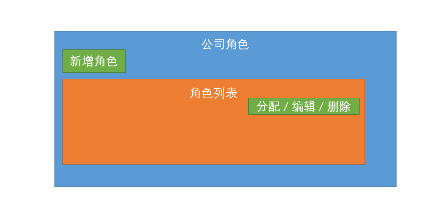

## 建立公司角色页面的基本结构

**`目标`**建立公司页面的基本结构


根据以上的结构，我们采用element-ui的组件实现

**`src/views/setting/index.vue`**

```vue
<template>
  <div class="dashboard-container">
    <div class="app-container">
      <el-card>
        <el-tabs>
          <!-- 放置页签 -->
          <el-tab-pane label="角色管理">
            <!-- 新增角色按钮 -->
            <el-row style="height:60px">
              <el-button
                icon="el-icon-plus"
                size="small"
                type="primary"
              >新增角色</el-button>
            </el-row>
            <!-- 表格 -->
            <el-table border="">
              <el-table-column label="序号" width="120" />
              <el-table-column label="角色名称" width="240" />
              <el-table-column label="描述" />
              <el-table-column label="操作">
                <el-button size="small" type="success">分配权限</el-button>
                <el-button size="small" type="primary">编辑</el-button>
                <el-button size="small" type="danger">删除</el-button>
              </el-table-column>
            </el-table>
            <!-- 分页组件 -->
            <el-row type="flex" justify="center" align="middle" style="height: 60px">
              <!-- 分页组件 -->
              <el-pagination layout="prev,pager,next" />
            </el-row>
          </el-tab-pane>
          <el-tab-pane label="公司信息">
            <el-alert
              title="对公司名称、公司地址、营业执照、公司地区的更新，将使得公司资料被重新审核，请谨慎修改"
              type="info"
              show-icon
              :closable="false"
            />
            <el-form label-width="120px" style="margin-top:50px">
              <el-form-item label="公司名称">
                <el-input disabled style="width:400px" />
              </el-form-item>
              <el-form-item label="公司地址">
                <el-input disabled style="width:400px" />
              </el-form-item>
              <el-form-item label="邮箱">
                <el-input disabled style="width:400px" />
              </el-form-item>
              <el-form-item label="备注">
                <el-input type="textarea" :rows="3" disabled style="width:400px" />
              </el-form-item>
            </el-form>
          </el-tab-pane>

        </el-tabs>
      </el-card>
    </div>
  </div>
</template>
```

**提交代码**

**`本节任务`**建立公司页面的基本结构

## 读取公司角色信息

**`目标`**： 封装公司角色请求，读取公司角色信息

### 读取角色列表数据

首先，封装读取角色的信息的请求 **`src/api/setting.js`**

```js
/**
 * 获取角色列表
 * ***/
export function getRoleList(params) {
  return request({
    url: '/sys/role',
    params
  })
}
```

> params是查询参数，里面需要携带分页信息

然后，在页面中调用接口获取数据，绑定表格数据 **`src/views/setting/index.vue`**

```js
import { getRoleList } from '@/api/setting'
export default {
  data() {
    return {
      list: [], // 承接数组
      page: {
        // 放置页码及相关数据
        page: 1,
        pagesize: 10,
        total: 0 // 记录总数
      }
    }
  },
  created() {
    this.getRoleList() // 获取角色列表
  },
  methods: {
    async getRoleList() {
      const { total, rows } = await getRoleList(this.page)
      this.page.total = total
      this.list = rows
    },
    changePage(newPage) {
      // newPage是当前点击的页码
      this.page.page = newPage // 将当前页码赋值给当前的最新页码
      this.getRoleList()
    }
  }
}
```

 **绑定表格数据**

```vue
  <el-table border="" :data="list">
              <el-table-column align="center" type="index" label="序号" width="120" />
              <el-table-column align="center" prop="name" label="名称" width="240" />
              <el-table-column align="center" prop="description" label="描述" />
              <el-table-column align="center" label="操作">
                <el-button size="small" type="success">分配权限</el-button>
                <el-button size="small" type="primary">编辑</el-button>
                <el-button size="small" type="danger">删除</el-button>
              </el-table-column>

            </el-table>
        
```

**绑定分页数据**

```vue
    <!-- 放置分页组件 -->
            <el-row type="flex" justify="center" align="middle" style="height:60px">
              <el-pagination
                :current-page="page.page"
                :page-size="page.pagesize"
                :total="page.total"
                layout="prev, pager, next"
                @current-change="changePage"
              />
            </el-row>
```

### 读取公司信息数据

> 第二个tab页，我们同样需要读取数据

封装读取公司信息的api  **`src/api/setting.js`**

```js
/**
 * 获取公司信息
 * **/
export function getCompanyInfo(companyId) {
  return request({
    url: `/company/${companyId}`
  })
}
```

**绑定公司表单数据**

```vue
   <el-form label-width="120px" style="margin-top:50px">
              <el-form-item label="公司名称">
                <el-input v-model="formData.name" disabled style="width:400px" />
              </el-form-item>
              <el-form-item label="公司地址">
                <el-input v-model="formData.companyAddress" disabled style="width:400px" />
              </el-form-item>
              <el-form-item label="邮箱">
                <el-input v-model="formData.mailbox" disabled style="width:400px" />
              </el-form-item>
              <el-form-item label="备注">
                <el-input v-model="formData.remarks" type="textarea" :rows="3" disabled style="width:400px" />
              </el-form-item>
            </el-form>
```

> 请求中的companyId来自哪里？它来自我们登录成功之后的用户资料，所以我们需要在该组件中使用vuex数据

 **`src/store/getters.js`**

```vue
  companyId: state => state.user.userInfo.companyId // 建立对于user模块的companyId的快捷访问
  computed: {
    ...mapGetters(['companyId'])
  },
```

**初始化时调用接口**

```js
    // 获取的公司的信息
    async getCompanyInfo() {
      this.formData = await getCompanyInfo(this.companyId)
    }
 created() {
    this.getRoleList() // 获取角色列表
    this.getCompanyInfo()
  },
```

**提交代码**

**`本节任务`**读取公司角色信息

## 删除角色功能

**`目标`**  实现删除角色的功能

**封装删除角色的api**

```js
/** **
 *  删除角色
 *
 * ****/
export function deleteRole(id) {
  return request({
    url: `/sys/role/${id}`,
    method: 'delete'
  })
}
```

**删除功能实现**

```js
    async deleteRole(id) {
      //  提示
      try {
        await this.$confirm('确认删除该角色吗')
        // 只有点击了确定 才能进入到下方
        await deleteRole(id) // 调用删除接口
        this.getRoleList() // 重新加载数据
        this.$message.success('删除角色成功')
      } catch (error) {
        console.log(error)
      }
    }
```

**删除按钮注册事件**

```vue
 <!-- 作用域插槽 -->
          <template slot-scope="{ row }">
                  <el-button size="small" type="success">分配权限</el-button>
                  <el-button size="small" type="primary">编辑</el-button>
                  <el-button size="small" type="danger" @click="deleteRole(row.id)">删除</el-button>
          </template>
```

**提交代码**

## 编辑角色功能

**`目标`**： 实现编辑角色的功能

### 封装编辑接口，新建编辑弹层

**封装编辑角色的功能api**

```js
/** *
 * 修改角色
 * ***/
export function updateRole(data) {
  return request({
    url: `/sys/role/${data.id}`,
    data,
    method: 'put'
  })
}
/**
 * 获取角色详情
 * **/
export function getRoleDetail(id) {
  return request({
    url: `/sys/role/${id}`
  })
}
```

**定义编辑弹层数据**

```js
      showDialog: false,
      // 专门接收新增或者编辑的编辑的表单数据
      roleForm: {},
      rules: {
        name: [{ required: true, message: '角色名称不能为空', trigger: 'blur' }]
      },
```

**编辑弹层结构**

```vue
 <el-dialog title="编辑弹层" :visible="showDialog" @close="btnCancel">
      <el-form ref="roleForm" :model="roleForm" :rules="rules" label-width="120px">
        <el-form-item label="角色名称" prop="name">
          <el-input v-model="roleForm.name" />
        </el-form-item>
        <el-form-item label="角色描述">
          <el-input v-model="roleForm.description" />
        </el-form-item>
      </el-form>
      <!-- 底部 -->
      <el-row slot="footer" type="flex" justify="center">
        <el-col :span="6">
          <el-button size="small" @click="btnCancel">取消</el-button>
          <el-button size="small" type="primary" @click="btnOK">确定</el-button>
        </el-col>
      </el-row>
    </el-dialog>
```

### 实现编辑功能，为新增功能留口

**编辑功能实现（为新增功能留口）**

```js
    async editRole(id) {
      this.roleForm = await getRoleDetail(id)
      this.showDialog = true // 为了不出现闪烁的问题 先获取数据 再弹出层
    },
      async btnOK() {
      try {
        await this.$refs.roleForm.validate()
        // 只有校验通过的情况下 才会执行await的下方内容
        // roleForm这个对象有id就是编辑 没有id就是新增
        if (this.roleForm.id) {
          await updateRole(this.roleForm)
        } else {
          // 新增业务
        }
        // 重新拉取数据
        this.getRoleList()
        this.$message.success('操作成功')
        this.showDialog = false
      } catch (error) {
        console.log(error)
      }
    },
```

**编辑按钮注册事件**

```vue
 <el-button size="small" type="primary" @click="editRole(row.id)">编辑</el-button>
```

**提交代码**

## 新增角色功能

**`目标`**实现新增角色功能

**封装新增角色功能api**

```js

/** *
 * 新增角色
 * ***/
export function addRole(data) {
  return request({
    url: '/sys/role',
    data,
    method: 'post'
  })
}

```

**新增功能实现和编辑功能合并（处理关闭）**

```js
    async btnOK() {
      try {
        await this.$refs.roleForm.validate()
        // 只有校验通过的情况下 才会执行await的下方内容
        // roleForm这个对象有id就是编辑 没有id就是新增
        if (this.roleForm.id) {
          await updateRole(this.roleForm)
        } else {
          // 新增业务
          await addRole(this.roleForm)
        }
        // 重新拉取数据
        this.getRoleList()
        this.$message.success('操作成功')
        this.showDialog = false // 关闭弹层  =>  触发el-dialog的事件close事件
      } catch (error) {
        console.log(error)
      }
    },
    btnCancel() {
      this.roleForm = {
        name: '',
        description: ''
      }
      // 移除校验
      this.$refs.roleForm.resetFields()
      this.showDialog = false
    }
```

**新增按钮注册事件**

```vue
<el-button type="primary" size="small" @click="showDialog = true">新增角色</el-button>
```

**提交代码**

**`本节任务`** 新增角色功能

## 总结



我们完成了公司中角色管理的部分，但是并没有完成分配权限的部分，该部门会在权限设计和管理的部门重点提及
