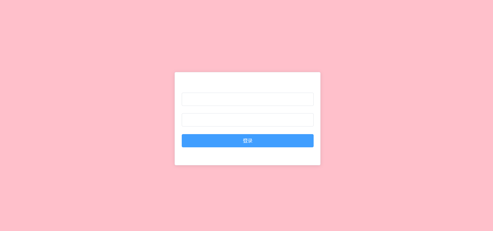
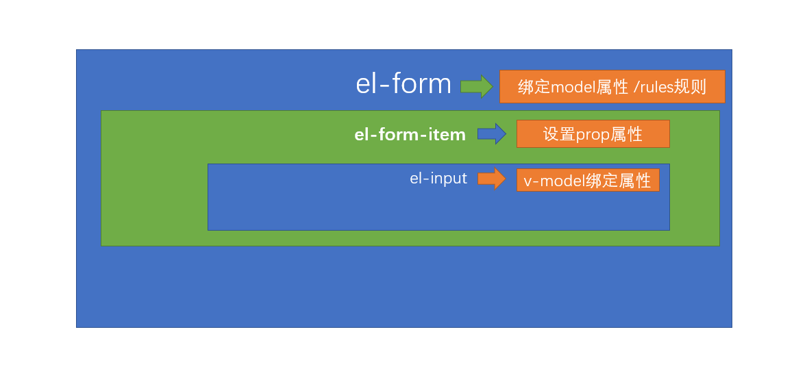

## Element的表单校验补充

> 我们尝试通过一个案例对Element的表单校验进行一下补充

### 实现表单基本结构

**创建项目**

```bash
$ vue create login
```

> 选择babel / eslint

**安装Element** 

开发时依赖 ： 开发环境所需要的依赖 ->  devDependencies

运行时依赖: 项目上线依然需要的依赖 -> dependencies

```bash
$ npm i element-ui
```

**在main.js中对ElementUI进行注册**

```js
import ElementUI from 'element-ui';
import 'element-ui/lib/theme-chalk/index.css';
Vue.use(ElementUI);
```

接下来,利用Element组件完成如图的效果



代码如下

```vue
<template>
  <div id="app">
    <!-- 卡片组件 -->
    <el-card class='login-card'>
      <!-- 登录表单 -->
      <el-form style="margin-top: 50px">
        <el-form-item>
          <el-input placeholder="请输入手机号"></el-input>
        </el-form-item>
        <el-form-item>
          <el-input placeholder="请输入密码"></el-input>
        </el-form-item>
        <el-form-item>
          <el-button type="primary" style="width: 100%">登录</el-button>
        </el-form-item>

      </el-form>
    </el-card>
  </div>
</template>

<script>

export default {
  name: 'App',
  components: {

  }
}
</script>

<style>
 #app {
   width: 100%;
   height: 100vh;
   background-color: pink;
   display: flex;
   justify-content: center;
   align-items: center;
 }
 .login-card {
   width: 440px;
   height: 300px;
 }
</style>

```

### 表单校验的先决条件

接下来，完成表单的校验规则如下几个先决条件



**model属性** (表单数据对象)

```js
  data () {
    // 定义表单数据对象
    return {
      loginForm: {
        mobile: '',
        password: ''
      }
    }
  }
```

**绑定model**

```vue
 <el-form style="margin-top:40px" :model="loginForm" >
```

**rules规则**  先定义空规则，后续再详解

```js
loginRules: {}
<el-form style="margin-top: 50px" model="loginForm" :rules="loginRules">
```

**设置prop属性**

> 校验谁写谁的字段

```vue
<el-form-item prop="mobile">
   ...
<el-form-item prop="password">
   ...
```

**给input绑定字段属性**

```vue
<el-input v-model="loginForm.mobile"></el-input>
<el-input v-model="loginForm.password"></el-input>
```

### 表单校验规则

此时，先决条件已经完成，要完成表单的校验，需要编写规则

> ElementUI的表单校验规则来自第三方校验规则参见 [async-validator](https://github.com/yiminghe/async-validator)

我们介绍几个基本使用的规则

| 规则      | 说明                                                         |
| --------- | ------------------------------------------------------------ |
| required  | 如果为true，表示该字段为必填                                 |
| message   | 当不满足设置的规则时的提示信息                               |
| pattern   | 正则表达式，通过正则验证值                                   |
| min       | 当值为字符串时，min表示字符串的最小长度，当值为数字时，min表示数字的最小值 |
| max       | 当值为字符串时，max表示字符串的最大长度，当值为数字时，max表示数字的最大值 |
| trigger   | 校验的触发方式，change（值改变） / blur （失去焦点）两种，   |
| validator | 如果配置型的校验规则不满足你的需求，你可以通过自定义函数来完成校验 |

校验规则的格式

***{ key(字段名): value(校验规则) => [{}] }***

根据以上的规则，针对当前表单完成如下要求

**手机号**  1.必填 2.手机号格式校验 3. 失去焦点校验

**密码** 1.必填 2.6-16位长度 3. 失去焦点校验

**规则如下**

```js
      loginRules: {
        mobile: [{ required: true, message: '手机号不能为空', trigger: 'blur' },
          { pattern: /^1[3-9]\d{9}$/, message: '请输入正确的手机号', trigger: 'blur' }],
        password: [{ required: true, message: '密码不能为空', trigger: 'blur' }, {
          min: 6, max: 16, message: '密码应为6-16位的长度', trigger: 'blur'
        }]
      }
```

### 自定义校验规则

> 自定义校验规则怎么用

**`validator`**是一个函数, 其中有三个参数 (**`rule`**(当前规则),`value`(当前值),**`callback`**(回调函数))

```js
var  func = function (rule, value, callback) {
    // 根据value进行进行校验 
    // 如果一切ok  
    // 直接执行callback
    callback() // 一切ok 请继续
    // 如果不ok 
    callback(new Error("错误信息"))
}
```

根据以上要求，增加手机号第三位必须是9的校验规则

如下

```js
// 自定义校验函数
    const checkMobile = function (rule, value, callback) {
      value.charAt(2) === '9' ? callback() : callback(new Error('第三位手机号必须是9'))
    }

 mobile: [
          { required: true, message: '手机号不能为空', trigger: 'blur' },
          { pattern: /^1[3-9]\d{9}$/, message: '请输入正确的手机号', trigger: 'blur' }, {
            trigger: 'blur',
            validator: checkMobile
   }],
```

### 手动校验的实现

>  最后一个问题，如果我们直接点登陆按钮，没有离开焦点，那该怎么校验 ？

此时我们需要用到手动完整校验  [案例](https://element.eleme.cn/#/zh-CN/component/form)

form表单提供了一份API方法，我们可以对表单进行完整和部分校验

| 方法名        | 说明                                                         | 参数                                                         |
| :------------ | :----------------------------------------------------------- | :----------------------------------------------------------- |
| validate      | 对整个表单进行校验的方法，参数为一个回调函数。该回调函数会在校验结束后被调用，并传入两个参数：是否校验成功和未通过校验的字段。若不传入回调函数，则会返回一个 promise | Function(callback: Function(boolean, object))                |
| validateField | 对部分表单字段进行校验的方法                                 | Function(props: array \| string, callback: Function(errorMessage: string)) |
| resetFields   | 对整个表单进行重置，将所有字段值重置为初始值并移除校验结果   | —                                                            |
| clearValidate | 移除表单项的校验结果。传入待移除的表单项的 prop 属性或者 prop 组成的数组，如不传则移除整个表单的校验结果 | Function(props: array \| string)                             |

这些方法是el-form的API，需要获取el-form的实例，才可以调用

**采用ref进行调用**

```vue
<el-form ref="loginForm" style="margin-top:40px" :model="loginForm" :rules="loginRules">

```

**调用校验方法**

```js
  login () {
      // 获取el-form的实例
      this.$refs.loginForm.validate(function (isOK) {
        if (isOK) {
          // 说明校验通过
          // 调用登录接口
        }
      }) // 校验整个表单
    }
```

## Async 和 Await 

针对异步编程，我们学习过Ajax的回调形式，promise的链式调用形式

**ajax回调模式**

```js
// 回调形式调用
$.ajax({
    url,
    data,
    success:function(result){
        $.ajax({
            data:result,
            success: function(result1){
                $.ajax({
                    url,
                    data: result1
              })
            }
        })
    }
})
```

**promise的链式回调函数**

```js
// 链式调用 没有嵌套
axios({ url, data}).then(result => {
    return  axios({ data:result }) 
}).then(result1 => {
     return  axios({ data:result1 }) 
}).then(result2 => {
   return axios({ data: result2 }) 
}).then(result3 => {
    return axios({ data: result3 }) 
})
```

### 关于Promise你必须知道几件事

> 关于Promise你必须知道几件事

如何声明一个Promise

```js
new Promise(function(resolve, reject){ })
```

如果想让Promise成功执行下去，需要执行resolve，如果让它失败执行下去，需要执行reject

```js
new Promise(function(resolve, reject) { 
    resolve('success')  // 成功执行
}).then(result => {
    alert(result)
})

new Promise(function(resolve, reject) { 
    reject('fail')  // 成功执行
}).then(result => {
    alert(result)
}).catch(error => {
     alert(error)
})
```

如果想终止在某个执行链的位置，可以用**Promise.reject(new Error())**

```js
new Promise(function(resolve, reject) {
    resolve(1)
}).then(result => {
    return result + 1
}).then(result => {
    return result + 1
}).then(result => {
  return  Promise.reject(new Error(result + '失败'))
   // return result + 1
}).then(result => {
    return result + 1
}).catch(error => {	
    alert(error)
})
```

### 异步编程的终极方案  **async /await**

> async 和 await实际上就是让我们像写同步代码那样去完成异步操作

**await** 表示强制等待的意思，**await**关键字的后面要跟一个promise对象，它总是等到该promise对象resolve成功之后执行，并且会返回resolve的结果

```js
 async test () {
      // await总是会等到 后面的promise执行完resolve
      // async /await就是让我们 用同步的方法去写异步
      const result = await new Promise(function (resolve, reject) {
        setTimeout(function () {
          resolve(5)
        }, 5000)
      })
      alert(result)
    }
```

上面代码会等待5秒之后，弹出5

**async 和 await必须成对出现**

由于await的强制等待，所以必须要求使用**await**的函数必须使用**async**标记， async表示该函数就是一个异步函数，不会阻塞其他执行逻辑的执行

```js
async test () {
      const result = await new Promise(function(resolve){  
         setTimeout(function(){
             resolve(5)
         },5000)
       })
       alert(result)
    },
    test1(){
      this.test()
      alert(1)
    }
```

通过上面的代码我们会发现，异步代码总是最后执行，标记了async的函数并不会阻塞整个的执行往下走

> 如果你想让1在5弹出之后再弹出，我们可以这样改造

```js
   async test1(){
     await this.test()
      alert(1)
   }
// 这充分说明 被async标记的函数返回的实际上也是promise对象
```

> 如果promise异常了怎么处理？

 promise可以通过catch捕获，async/ await捕获异常要通过 try/catch

```js
   async  getCatch () {
      try {
        await new Promise(function (resolve, reject) {
          reject(new Error('fail'))
        })
        alert(123)
      } catch (error) {
        alert(error)
      }
   }
```

async / await  用同步的方式 去写异步
