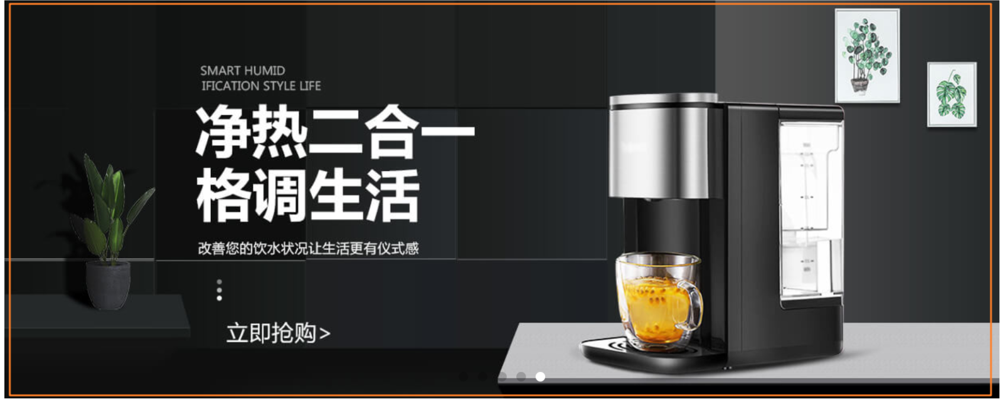
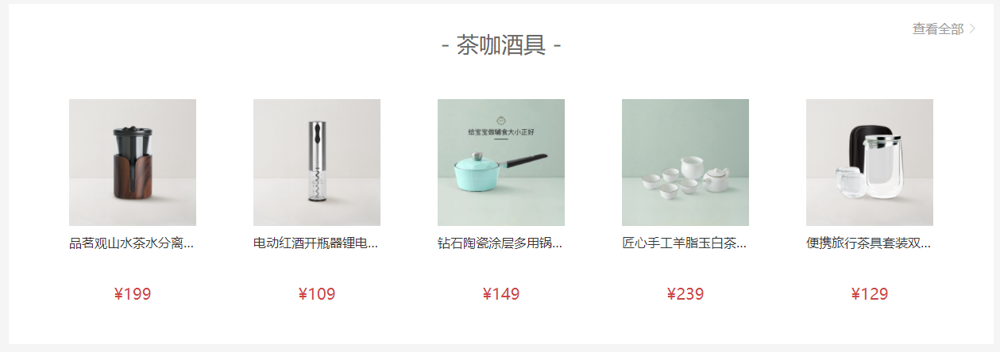
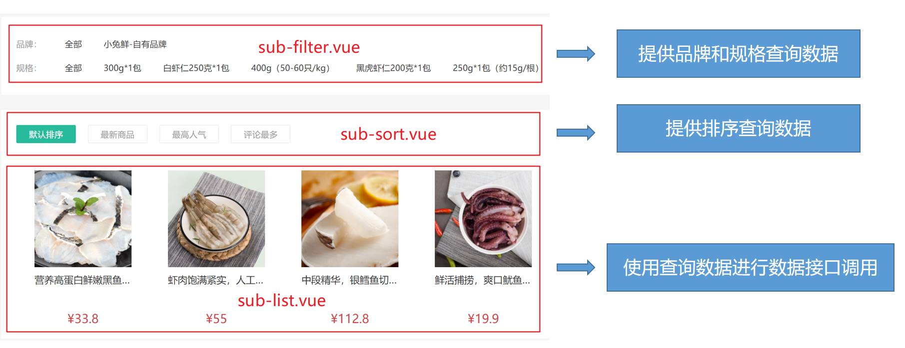
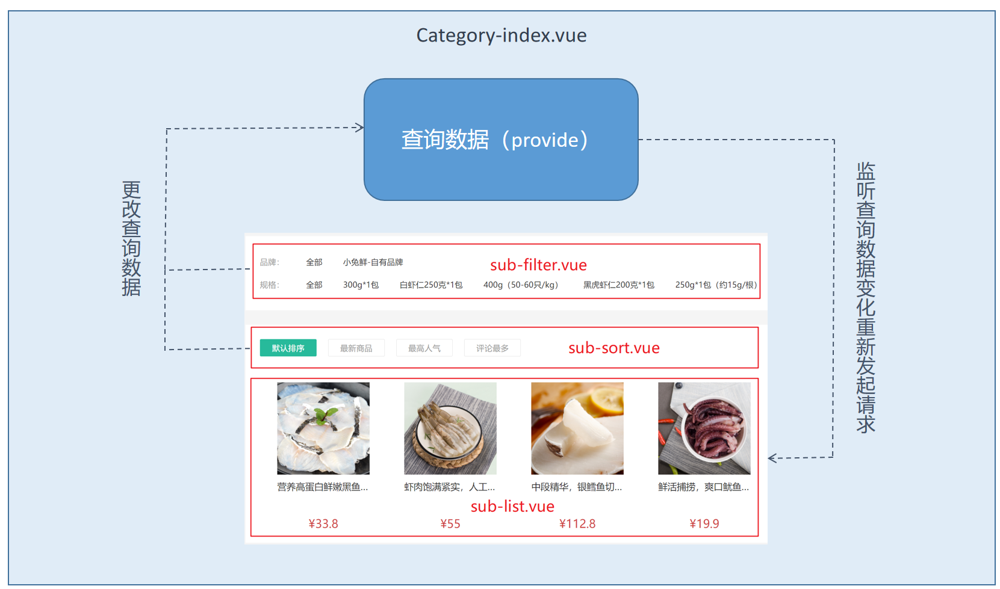

# 顶级类目


> 说明：
>
> 1. 从顶部导航点击进入的路由就是顶级类目，它包含了最大级别的商品类目，点击当前类目可以进入到详情展示
> 2. 观察克制顶级类目对应的内容展示区域和首页是一样的，所以它同为和首页路由并列的二级路由

## 1. 路由和组件

`本节目标:` 新增顶级类目并绑定路由

**实现步骤**

1. 新建相关组件
2. 把组件和路由绑定在一起
3. 给路由在导航区域添加上跳转链接
4. 点击跳转链接测试是否成功跳转

**代码落地**

1）新建组件

`src/views/category/index.vue`

```vue
<template>
  <div class='top-category'>
    <div class="container">
      顶级类目
    </div>
  </div>
</template>

<script>
export default {
  name: 'TopCategory'
}
</script>

<style scoped lang="less">
.top-category {
  h3 {
    font-size: 28px;
    color: #666;
    font-weight: normal;
    text-align: center;
    line-height: 100px;
  }
  .sub-list {
    margin-top: 20px;
    background-color: #fff;
    ul {
      display: flex;
      padding: 0 32px;
      flex-wrap: wrap;
      li {
        width: 168px;
        height: 160px;
        a {
          text-align: center;
          display: block;
          font-size: 16px;
          img {
            width: 100px;
            height: 100px;
          }
          p {
            line-height: 40px;
          }
          &:hover {
            color: @xtxColor;
          }
        }
      }
    }
  }
  .ref-goods {
    background-color: #fff;
    margin-top: 20px;
    position: relative;
    .head {
      .xtx-more {
        position: absolute;
        top: 20px;
        right: 20px;
      }
      .tag {
        text-align: center;
        color: #999;
        font-size: 20px;
        position: relative;
        top: -20px;
      }
    }
    .body {
      display: flex;
      justify-content: space-around;
      padding: 0 40px 30px;
    }
  }
}
</style>
```

2）绑定路由

`src/router/index.js`

```diff
const Layout = () => import('@/views/Layout')
const Home = () => import('@/views/home/index')
+const TopCategory = () => import('@/views/category/index')
const routes = [
  {
    path: '/',
    component: Layout,
    children: [
      { path: '/', component: Home },
+     { path: '/category/:id', component: TopCategory }
    ]
  }
]
```

3）添加路由跳转链接

`src/components/app-header-nav.vue`

```diff
<li @mouseenter="show(item)" @mouseleave="hide(item)" v-for="item in list" :key="item.id">
+  <RouterLink :to="`/category/${item.id}`">{{item.name}}</RouterLink>
</li>
```

## 2. 面包屑组件封装

### 2.1 思路参考

> 当我们想要封装一个组件，不知道如何设计的时候，可以参考成熟组件库的设计，比如我们非常熟悉的elementUI，打开它的面包屑组件，看看是如何使用的


1. 完整面包屑导航包括两个组件，`el-breadcrumb`  和 `el-breadcrumb-item`
2. `el-breadcrumb` 接受名称为separator的prop参数传入，决定了分隔符的显示
3. `el-breadcrumb-item` 组件接受名称为to的prop参数传入，如果有则可以跳转，如果没有显示纯文字

### 2.2 Bread结构实现

1）静态结构搭建

`components/Bread/index.vue`

```html
<template>
  <div class='xtx-bread'>
    <div class="xtx-bread-item">
      <span>首页</span>
    </div>
    <i class="iconfont icon-angle-right"></i>
    <div class="xtx-bread-item">
      <span>美食</span>
    </div>
    <i class="iconfont icon-angle-right"></i>
    <div class="xtx-bread-item">
      <span>巧克力</span>
    </div>
  </div>
</template>

<script>
export default {
  name: 'XtxBread'
}
</script>

<style scoped lang='less'>
.xtx-bread{
  display: flex;
  padding: 25px 10px;
  &-item {
    a {
      color: #666;
      transition: all .4s;
      &:hover {
        color: @xtxColor;
      }
    }
  }
  i {
    font-size: 12px;
    margin-left: 5px;
    margin-right: 5px;
    line-height: 22px;
  }
}
</style>
```

2）注册为全局可用

```js
import Skeleton from './Skeleton'
import Slider from './Slider'
import Bread from './Breadcrumb'
export default {
  install (app) {
    app.component('XtxSkeleton', Skeleton)
    app.component('XtxSlider', Slider)
    app.component('XtxBread', Breadcrumb)
  }
}
```

3）playground路由中测试使用

```html
<template>
  <xtx-bread/>
</template>
```

### 2.3 BreadItem抽离

1）新建`Item`组件

`components/Bread/Item.vue`

> 从Item的使用方式来讲，面包屑导航的文字是需要支持自定义的，所以我们把中间的文字设计为一个插槽
>
> 1. 如果有to属性 提供导航跳转功能
> 2. 组件标签中可以支持插入文字 （slot）

```html
<template>
  <div class="xtx-bread-item">
    <span><slot /></span>
    <i class="iconfont icon-angle-right"></i>
  </div>
</template>

<script>
export default {
  name: 'XtxBreadItem'
}
</script>
<style lang="less" scoped>
  .xtx-bread-item{
    // 最后一个i隐藏
    &:nth-last-of-type(1){
      i{
        display: none;
      }
    }
  }
</style>
```

2）父组件Breadcrumb修改

> 从使用方式可以得知父组件只需要保持一个匿名的插槽即可

```html
<template>
  <div class="xtx-bread">
    <slot/>
  </div>
</template>

<script>
export default {
  name: 'XtxBread'
}
</script>

<style lang='less'>
.xtx-bread {
  display: flex;
  padding: 25px 10px;
  &-item {
    a {
      color: #666;
      transition: all 0.4s;
      &:hover {
        color: @xtxColor;
      }
    }
  }
  i {
    font-size: 12px;
    margin-left: 5px;
    margin-right: 5px;
    line-height: 22px;
  }
}
</style>
```

### 2.4 Item支持to属性传入

**实现步骤**

1. 声明props中的to
2. 根据props中to的有无，渲染不一样的标签
3. 使用的地方传入to属性测试

**代码落地**

`components/BreadCrumb/Item.vue`

```html
<template>
  <div class="xtx-bread-item">
    <RouterLink v-if="to" :to="to"><slot /></RouterLink>
    <span v-else><slot /></span>
    <i class="iconfont icon-angle-right"></i>
  </div>
</template>

<script>
export default {
  name: 'XtxBreadItem',
  props: {
    to: {
      type: String
    }
  }
}
</script>
<style lang="less" scoped>
  .xtx-bread-item{
    // 最后一个i隐藏
    &:nth-last-of-type(1){
      i{
        display: none;
      }
    }
  }
</style>
```

### 2.5 分隔符自定义

`Bread.vue`  支持分隔符prop传入

```html
<script>
import { provide } from 'vue'
export default {
  name: 'XtxBread',
  props: {
    separator: {
      type: String
    }
  },
  setup (props) {
    provide('separator', props.separator)
  }
}
</script>
```

`Item.vue` 获取分隔符

> 如果有分隔符就使用传入的分隔符渲染，否则就使用默认的分隔符渲染

```html
<template>
  <div class="xtx-bread-item">
    <RouterLink v-if="to" :to="to"><slot /></RouterLink>
    <span v-else><slot /></span>
    <template v-if="separator">
      <i>{{separator}}</i>
    </template>
    <template v-else>
      <i class="iconfont icon-angle-right"></i>
    </template>
  </div>
</template>

<script>
import { inject } from 'vue'
export default {
  name: 'XtxBreadItem',
  props: {
    to: {
      type: String
    }
  },
  setup () {
    const separator = inject('separator')
    return {
      separator
    }
  }
}
</script>
```


## 3. 顶级类目整体功能实现

### 3.1 轮播图功能实现



`本节目标:` 利用封装好的轮播图组件实现功能

**实现步骤**

1. 使用我们封装好的轮播图组件
2. 准备获取轮播图数据的接口
3. 调用接口为轮播图组件传入数据

**代码落地**

> 获取banner数据的接口直接复用Home中的接口即可

`src/views/category/index.vue`

```html
<template>
  <div class="top-category">
    <div class="container">
      <!-- 轮播图 -->
      <XtxSlider :sliders="sliders" :autoPlay="true" style="height:500px"/>
    </div>
  </div>
</template>
<script>
import { findBanner } from '@/api/home'
import { ref, onMounted } from 'vue'
export default {
  name: 'TopCategory',
  components: { GoodsItem },
  setup () {
    // banner功能
    const sliders = ref([])
    async function loadBanner () {
      const { result } = await findBanner()
      sliders.value = result
    }
    onMounted(() => {
      loadBanner()
    })
    return {
      sliders
    }
  }
}
</script>
<style scoped lang="less">
.top-category {
  h3 {
    font-size: 28px;
    color: #666;
    font-weight: normal;
    text-align: center;
    line-height: 100px;
  }
  .sub-list {
    margin-top: 20px;
    background-color: #fff;
    ul {
      display: flex;
      padding: 0 32px;
      flex-wrap: wrap;
      li {
        width: 168px;
        height: 160px;
        a {
          text-align: center;
          display: block;
          font-size: 16px;
          img {
            width: 100px;
            height: 100px;
          }
          p {
            line-height: 40px;
          }
          &:hover {
            color: @xtxColor;
          }
        }
      }
    }
  }
}
</style>
```

### 3.2 全部分类模块


`本节目标:` 完成全部分类模块的数据渲染

**实现步骤**

1. 搭建分类模块需要的结构
2. 准备接口API
3. 调用接口渲染模板

**代码落地**

1）搭建结构

```html
<!-- 所有二级分类 -->
<div class="sub-list">
    <h3>全部分类</h3>
    <ul>
      <li v-for="i in 8" :key="i">
        <a href="javascript:;">
          
          <p>空调</p>
        </a>
      </li>
    </ul>
</div>
```

2）准备接口渲染数据

```html
<template>
  <div class="top-category">
    <div class="container">
      <!-- 所有二级分类 -->
      <div class="sub-list">
        <h3>全部分类</h3>
        <ul>
          <li v-for="item in categroyAllList" :key="item.id">
            <a href="javascript:;">
              
              <p>{{ item.name }}</p>
            </a>
          </li>
        </ul>
      </div>
    </div>
  </div>
</template>
<script>
import { findTopCategory } from '@/api/category'
import GoodsItem from './components/goods-item'
import { ref, onMounted } from 'vue'
import { useRoute } from 'vue-router'
export default {
  name: 'TopCategory',
  components: { GoodsItem },
  setup () {
   // 全部分类逻辑实现
    const categroyAllList = ref([])
    const categroyName = ref('')
    const route = useRoute() // route this.$route  route.params.id
    async function getCategroyAllList () {
      const res = await findTopCategory(route.params.id)
      categroyAllList.value = res.data.result.children
    }
    onMounted(() => {
      getCategroyAllList()
    })
    return {
      categroyAllList
    }
  }
}
</script>
```

### 3.3 各分类推荐商品



`本节目标:`  完成推荐商品模块的结构搭建和数据渲染

**实现步骤**

1. 准备推荐商品模块的静态结构
2. 使用真实接口数据进行渲染
3. 抽离复用商品模块组件

**代码落地**

1）搭建静态结构

`src/views/category/index.vue`

```html
<!-- 分类关联商品 -->
<div class="ref-goods" v-for="item in 3" :key="item">
    <div class="head">
      <h3>-  水具杯壶  -</h3>
      <XtxMore to="/" />
    </div>
    <div class="body">
      <RouterLink to="/" class="goods-item" v-for="good in 4" :key="good">
        
        <p class="name ellipsis">红功夫 麻辣小龙虾 19.99/500g 实惠到家</p>
        <p class="desc ellipsis">火锅食材</p>
        <p class="price">&yen;19.99</p>
      </RouterLink>
    </div>
</div>
<!-- 补充样式-->
<style lang="less" scoped>
 .goods-item {
    display: block;
    width: 220px;
    padding: 20px 30px;
    text-align: center;
    img {
      width: 160px;
      height: 160px;
    }
    p {
      padding-top: 10px;
    }
    .name {
      font-size: 16px;
    }
    .desc {
      color: #999;
      height: 29px;
    }
    .price {
      color: @priceColor;
      font-size: 20px;
    }
  }
</style>
```

2）渲染真实数据

> 1. 各分类数据使用`subCategoryList.children` 数据进行渲染
>
> 2. 内部商品内容使用 `goods字段`渲染出来
> 3. `查看全部` 添加路由链接跳转

```html
<!-- 分类关联商品 -->
<div
    class="ref-goods"
    v-for="item in categroyAllList" :key="item.id"
    >
    <div class="head">
      <h3>- {{ item.name }} -</h3>
      <p class="tag">{{ item.desc }}</p>
      <XtxMore :to="`/category/sub/${item.id}`" />
    </div>
    <div class="body">
      <RouterLink to="/" class="goods-item" v-for="good in item.goods" :key="good.id">
        
        <p class="name ellipsis">{{ good.name }}</p>
        <p class="desc ellipsis">{{ good.tag }}</p>
        <p class="price">&yen;{{ good.price }}</p>
      </RouterLink>
    </div>
</div>
```

3）抽离复用商品模块组件

`Category/components/goods-item.vue`

```html
<template>
  <RouterLink
    :to="`/product/${goods.id}`"
    class="goods-item"
  >
    
    <p class="name ellipsis">{{ goods.name }}</p>
    <p class="desc ellipsis">{{ goods.tag }}</p>
    <p class="price">&yen;{{ goods.price }}</p>
  </RouterLink>
</template>

<script>
export default {
  props: {
    goods: {
      type: Object,
      default: () => {
        return {}
      }
    }
  }
}
</script>

<style lang="less" scoped>
 .goods-item {
    display: block;
    width: 220px;
    padding: 20px 30px;
    text-align: center;
    img {
      width: 160px;
      height: 160px;
    }
    p {
      padding-top: 10px;
    }
    .name {
      font-size: 16px;
    }
    .desc {
      color: #999;
      height: 29px;
    }
    .price {
      color: @priceColor;
      font-size: 20px;
    }
  }
</style>
```

`Category/index.vue`

```html
<div class="body">
  <GoodsItem v-for="good in item.goods" :key="good.id" :goods="good" />
</div>
```

### 3.4 面包屑数据渲染

```jsx
<!-- 面包屑导航 -->
<XtxBread>
    <XtxBreadItem to="/">首页</XtxBreadItem>
    <XtxBreadItem>{{ categroyName }}</XtxBreadItem>
</XtxBread>

setup(){
   const categroyName = ref('')
    const route = useRoute() // route this.$route  route.params.id
    async function getCategroyAllList () {
      const res = await findTopCategory(route.params.id)
      categroyName.value = res.data.result.name
    }
    return { categroyName }
}
```

### 3.5 watch监听路由变化

`本节目标:`  解决路由复用数据不重新获取的问题

> 现存问题：由于路由的组件复用机制，当路由的路径path没有发生变化时，路由对应的组件会被直接复用，也就是生命周期钩子函数不再执行，请求也就不会再次发起
>
> 解决思路：使用watch监听路由id的变化，一旦变化立刻重新请求接口数据

```js
watch(
  () => { return route.params.id },
  () => { getCategroyAllList() }
)
```

# 二级类目


> 说明：
>
> 1. 二级类目为一级类目下的子类目，每一个一级类目下都有N个二级类目，属于细分分类，点击这里可以进入到当前二级分类的详情展示
> 2. 观察可知，二级类目的内容渲染和首页/顶级类目是在同一块区域，所以它同为和首页路由并列的二级路由

## 1. 路由和组件

`本节目标:` 新增二级类目组件并绑定路由

**实现步骤**

1. 新建二级类目组件
2. 把二级类目组件组件和路由绑定在一起
3. 给路由在二级导航区域添加上跳转链接
4. 点击跳转链接测试是否成功跳转到对应二级路由

**代码落地**

1）新建组件

`src/views/category/sub.vue`

```vue
<template>
  <div class='sub-category'>
    <div class="container">
      二级类目
    </div>
  </div>
</template>

<script>
export default {
  name: 'SubCategory'
}
</script>
<style scoped lang='less'>
.goods-list {
  background: #fff;
  padding: 0 25px;
  margin-top: 25px;
}
</style>
```

2）绑定路由

`src/router/index.js`

```js
const SubCategory = () => import('@/views/category/sub')
const routes = [
  {
    path: '/',
    component: Layout,
    children: [
      { path: '/category/sub/:id', component: SubCategory }
    ]
  }
]
```

3）添加路由连接跳转

`Layout/components/header/app-header-nav.vue`

```html
<ul>
  <li v-for="sub in item.children" :key="sub.id">
    <!--拼接路由参数-->
    <RouterLink :to="`/category/sub/${sub.id}`">
      
      <p>{{sub.name}}</p>
    </RouterLink>
  </li>
</ul>
```

## 2. 面包屑功能实现

`本节目标:`  实现二级类目面包屑导航功能


**主要功能：** 当前类目的上一级类目是可以被点击的，点击之后跳转到顶级类目下

1）封装接口

```js
/**
 * @description: 获取筛选数据
 * @param {*} id 路由id
 * @return {*}
 */
export const findSubCategoryFilter = (id) => {
  return request('/category/sub/filter', 'get', { id })
}
```

2）面包屑功能实现

`Category/Sub/sub-bread.vue`

```html
<template>
  <XtxBread>
    <XtxBreadItem to="/">首页</XtxBreadItem>
    <XtxBreadItem :to="`/category/${category.parentId}`">
      {{ category.parentName }}
    </XtxBreadItem>
    <XtxBreadItem >{{ category.name }}</XtxBreadItem>
  </XtxBread>
</template>
<script>
import { findSubCategoryFilter } from '@/api/category'
export default {
  name: 'SubBread',
  data () {
    return {
      category: {}
    }
  },
  mounted () {
    this.loadData()
  },
  methods: {
    async loadData () {
      const res = await findSubCategoryFilter(this.$route.params.id)
      this.category = res.result
    }
  }
}
</script>
```

3）watch监听路由变化重新请求数据

```js
watch: {
    '$route.params.id': function () {
      this.loadData()
    }
}
// 注：我们也可以开启watch函数的立即执行机制，省略mounted钩子函数的使用，大家可以自行尝试
```

4）二级类目首页使用面包屑

`Category/Sub/index.vue`

```html
<template>
  <div class='sub-category'>
    <div class="container">
      <!-- 面包屑 -->
      <SubBread />
    </div>
  </div>
</template>

<script>
import SubBread from './components/sub-bread'
export default {
  name: 'SubCategory',
  components: { SubBread}
}
</script>
```

## 3. 筛选区展示

> 说明：筛选区主要功能是工具不同的商品规格来对商品进行不同的分类筛选以达到快速定位目标商品的目的


**实现思路**

1. 定义一个组件来展示筛选区域
2. 获取数据进行品牌和属性的渲染
3. 由于接口数据中没有全部这个分类，需要我们自己添加

### 3.1 定义筛选组件

`本节目标:` 实现筛选组件的组件抽离和静态结构搭建

1）新建筛选静态组件

`src/views/category/sub-filter.vue`

```html
<template>
	<!-- 筛选区 -->
   <div class="sub-filter">
     <div class="item" v-for="i in 4" :key="i">
       <div class="head">品牌：</div>
       <div class="body">
         <a href="javascript:;">全部</a>
         <a href="javascript:;" v-for="i in 4" :key="i">小米</a>
       </div>
     </div>
   </div>
</template>
<script>
export default {
  name: 'SubFilter'
}
</script>
<style scoped lang='less'>
  // 筛选区
  .sub-filter {
    background: #fff;
    padding: 25px;
    .item {
      display: flex;
      padding: 10px 0;
      .head {
        width: 80px;
        color: #999;
      }
      .body {
        flex: 1;
        a {
          margin-right: 36px;
          transition: all .3s;
          &.active,
          &:hover {
            color: @xtxColor;
          }
        }
      }
    }
  }
</style>
```

2）在 `sub` 组件使用

```html
<template>
  <div class='sub-category'>
    <div class="container">
      <!-- 面包屑 -->
      <SubBread />
      <!-- 筛选区 -->
      <SubFilter />
    </div>
  </div>
</template>

<script>
import SubBread from './components/sub-bread'
import SubFilter from './components/sub-filter'
export default {
  name: 'SubCategory',
  components: { SubBread, SubFilter}
}
</script>
```

### 3.2 真实数据渲染

`本节目标:`  使用接口数据渲染静态模板

1）定义接口API

`src/api/category.js`

```js
/**
 * @description: 获取筛选数据
 * @param {*} id 二级分类id
 * @return {*}
 */
export const findSubCategoryFilter = (id) => {
  return request('/category/sub/filter', 'get', { id })
}
```

2）组件获取数据并渲染数据

`src/views/category/sub-filter.vue`

```html
<template>
  <!-- 筛选区 -->
  <div class="sub-filter" v-if="filterData">
    <div class="item">
      <div class="head">品牌：</div>
      <div class="body">
        <a  href="javasript:;" v-for="brand in filterData.brands" :key="brand.id">			             {{brand.name}}
        </a>
      </div>
    </div>
    <div class="item" v-for="p in filterData.saleProperties" :key="p.id">
      <div class="head">{{p.name}}：</div>
      <div class="body">
        <a href="javasript:;" v-for="attr in p.properties" :key="attr.id">{{attr.name}}</a>
      </div>
    </div>
  </div>
</template>
<script>
import { findSubCategoryFilter } from '@/api/category'
import { useRoute } from 'vue-router'
import { onMounted, ref } from 'vue'
export default {
  name: 'SubFilter',
  setup () {
    const route = useRoute()
    const filterData = ref(null)
    async function loadData () {
      const subId = route.params.id
      const { result } = await findSubCategoryFilter(subId)
      filterData.value = result
    }
    onMounted(() => {
      loadData()
    })
    return { filterData }
  }
}
</script>
```

### 3.3 手动新增全部类目

> 说明：虽然数据已经渲染出来了，但是和我们的目标样式有些不一致，我们需要在每一个分类前面都需要加一个`全部`类目


`本节目标:`  处理接口数据，在每一个list头部新增`全部` 类目

```js
setup () {
    const route = useRoute()
    const filterData = ref(null)
    async function loadData () {
      const subId = route.params.id
      const { result } = await findSubCategoryFilter(subId)
      // 数组顶部新增一项 保持数据结构字段一致
      result.brands.unshift({ id: null, name: '全部' })
      // 数组顶部定增一项 保持数据结构字段一致
      result.saleProperties.forEach(p => {
        p.properties.unshift({ id: null, name: '全部' })
      })
      filterData.value = result
    }
    onMounted(() => {
      loadData()
    })
    return { filterData }
}
```

### 3.4 监听路由id变化

`本节目标:`  解决id切换但是数据不会重新加载的问题

```js
setup () {
    // 省略部分代码
    // 新增watch
    watch(
      () => {
        return route.params.id
      },
      () => {
        loadData()
      }
    )
    return { filterData }
}
```

## 4. 排序组件封装


`本节目标:`  封装排序组件，完成排序切换效果

**实现步骤**

1. 定义一个组件 `sub-sort`，完成基础布局
2. 在 `Sub/index.vue` 组件使用
3. 完成切换排序时候的交互效果

**代码落地**

1）新建排序组件 

 `src/views/category/sub/sub-sort.vue`

```vue
<template>
  <div class='sub-sort'>
    <div class="sort">
      <a href="javascript:;">默认排序</a>  
      <a href="javascript:;">最新商品</a>
      <a href="javascript:;">最高人气</a>
      <a href="javascript:;">评论最多</a>
    </div>
  </div>
</template>
<script>
export default {
  name: 'SubSort'
}
</script>
<style scoped lang='less'>
.sub-sort {
  height: 80px;
  display: flex;
  align-items: center;
  justify-content: space-between;
  .sort {
    display: flex;
    a {
      height: 30px;
      line-height: 28px;
      border: 1px solid #e4e4e4;
      padding: 0 20px;
      margin-right: 20px;
      color: #999;
      border-radius: 2px;
      position: relative;
      transition: all .3s;
      &.active {
        background: @xtxColor;
        border-color: @xtxColor;
        color: #fff;
      }
      .arrow {
        position: absolute;
        border: 5px solid transparent;
        right: 8px;
        &.up {
          top: 3px;
          border-bottom-color: #bbb;
            &.active {
            border-bottom-color: @xtxColor;
          }
        }
        &.down {
          top: 15px;
          border-top-color: #bbb;
          &.active {
            border-top-color: @xtxColor;
          }
        }
      }
    }
  }
  .check {
    .xtx-checkbox {
      margin-left: 20px;
      color: #999;
    }
  }
}
</style>
```

2）使用组件

`src/views/category/sub.vue`

```html
<template>
  <div class='sub-category'>
    <div class="container">
      <!-- 面包屑 -->
      <sub-bread />
      <!-- 筛选区域 -->
      <sub-filter/>
      <!-- 结果区域 -->
      <div class="goods-list">
        <!-- 排序 -->
        <SubSort />
      </div>
    </div>
  </div>
</template>

<script>
import SubBread from './sub-bread'
import SubFilter from './sub-filter'
import SubSort from './sub-sort'
export default {
  name: 'SubCategory',
  components: { SubBread, SubFilter, SubSort }
}
</script>

<style scoped lang='less'>
.goods-list {
  background: #fff;
  padding: 0 25px;
  margin-top: 25px;
}
</style>
```

3）排序点击交互实现

>**实现思路：**
>
>1. 按照支持的排序的类别，进行排序类别定义
>2. 点击按钮把排序类别切换称当前按钮对应的排序类别
>3. 利用当前类别是否和按钮所对应的类别是否相等决定当前按钮是否添加`active`类名
>
>**排序类别和字段对应关系：**
>
>publishTime(最新)，orderNum(人气)，price(价格)， evaluateNum(评论)


```html
<template>
    <a 
    :class="{ active: sortField === null }" 
    @click="changeSort(null)" 
    href="javascript:;">默认排序</a>
    <a
    :class="{ active: sortField === 'publishTime' }"
    @click="changeSort('publishTime')"
    href="javascript:;">最新商品</a>
    <a
    :class="{ active: sortField === 'orderNum' }"
    @click="changeSort('orderNum')"
    href="javascript:;">最高人气</a>
    <a
    :class="{ active: sortField === 'evaluateNum' }"
    @click="changeSort('evaluateNum')"
    href="javascript:;">评论最多</a>
</template>
<script>
  export default {
     setup () {
        // publishTime(最新), orderNum(人气), price(价格), evaluateNum(评论)
        const sortField = ref(null)  
        function changeSort (sortField) {
          // 如果排序未改变停止逻辑
          if (sortField.value === sortField) return
          sortField.value = sortField
        }
        return {
          sortField,
          changeSort
        }
    }  
  }
</script>
```

## 5. 列表区域基础数据显示


`本节目标:`  使用接口拉取真实数据渲染基础list列表

**实现步骤**

1. 抽取sub-list组件并搭建静态结构
2. 二级类目首页中使用组件
3. 封装接口获取数据
4. 渲染模板

**代码落地**

1）新建`sub-list`组件并搭建静态结构

`scr/views/Category/Sub/components/sub-list.vue`

```html
<template>
  <div class="sort-list-container">
    <RouterLink to="/" class="goods-item" v-for="good in 4" :key="good">
      
      <p class="name ellipsis">红功夫 麻辣小龙虾 19.99/500g 实惠到家</p>
      <p class="desc ellipsis">火锅食材</p>
      <p class="price">&yen;19.99</p>
    </RouterLink>
  </div>
</template>

<style lang="less" scoped>
.sort-list-container {
  display: flex;
  flex-wrap: wrap;
  justify-content: space-around;
}
.goods-item {
  display: block;
  width: 220px;
  padding: 20px 30px;
  text-align: center;
  img {
    width: 160px;
    height: 160px;
  }
  p {
    padding-top: 10px;
  }
  .name {
    font-size: 16px;
  }
  .desc {
    color: #999;
    height: 29px;
  }
  .price {
    color: @priceColor;
    font-size: 20px;
  }
}
</style>

```

2）使用组件

`Category/Sub/index.vue`

```html
<template>
  <div class='sub-category'>
    <div class="container">
      <div class="goods-list">
        <!-- 排序 -->
        <SubSort />
        <!-- 列表 -->
        <SubList/>
      </div>
    </div>
  </div>
</template>

<script>
import SubList from './sub-list'
export default {
  name: 'SubCategory',
  components: { SubList }
}
</script>
```

3）定义获取数据的API 

`src/api/category.js`

```js
/**
 * @description: 获取筛选数据
 * @param {*} params
 * @return {*}
 */
export const findSubCategoryGoods = (params) => {
  return request('/category/goods', 'post', params)
}
```

4）编写获取数据逻辑 `sub-list.vue`

```html
<script>
import { findSubCategoryGoods } from '@/api/category'
import { useRoute } from 'vue-router'
import { onMounted, ref, watch } from 'vue'
export default {
  setup () {
    // 获取list
    const goodList = ref([])
    // 请求参数
    let reqParams = {
      page: 1,
      pageSize: 20,
      categoryId: route.params.id,
      sortField: null, // 排序类别
      attrs: [], // 商品属性
      brandId: null // 品牌名称
    }
    async function loadData () {
      const res = await findSubCategoryGoods(reqParams)
      goodList.value = res.result.items
    }
    onMounted(() => {
      loadData()
    })
    return {
      goodList
    }
  }
}
</script>
```

5）引入`goods-item`组件渲染模板

```html
<script>
 import GoodsItem from '@/views/Category/components/goods-item'
</script>

<template>
  <div class="sort-list-container">
    <GoodsItem  v-for="good in goodList" :key="good.id" :goods="good"/>
  </div>
</template>
```

6）监听路由变化重新拉取数据

```js
import { findSubCategoryGoods } from '@/api/category'
import { useRoute } from 'vue-router'
import { onMounted, ref, watch } from 'vue'
export default {
  setup () {
    // 省略...
    watch(() => { return route.params.id }, () => {
      // 初始化参数
      reqParams.page = 1
      reqParams.pageSize = 20
      reqParams.categoryId = route.params.id
      loadData()
    })
    // 省略
  }
}
```

## 6. 列表数据筛选（难点）

### 6.1 组件关系和通信方案

`本节目标:`  理清楚当前的组件关系确定数据通信方案





### 6.2 方案落地

**实现步骤**

1. 在共同父组件中使用`provide`提供查询数据以及操作数据的方法
2. `sub-filter`组件和`sub-sort`组件通过`inject` 获取到操作数据的方法
3. `sub-filter`组件和`sub-sort`组件中条件更改时通过调用方法把数据同步到共同父组件中
4. `sub-list`组件通过inject获取到查询数据
5. `sub-list`组件监听查询数据的变化，然后使用最新数据重新发起请求

**代码落地**

1）共同父组件提供数据和操作数据的方法

`Category/Sub/index.vue`

```html
<script>
import SubBread from './components/sub-bread'
import SubFilter from './components/sub-filter'
import SubSort from './components/sub-sort'
import SubList from './components/sub-list'
import { provide, reactive } from 'vue'
export default {
  name: 'SubCategory',
  components: { SubBread, SubFilter, SubSort, SubList },
  setup () {
    // 附加查询参数
    const filterData = reactive({
      attrs: [], // 一般商品属性
      sortField: null, // 排序
      brandId: null // 品牌ID
    })
    // 设置品牌名称
    function setBrandId (id) {
      filterData.brandId = id
    }
    // 设置条件(去重)
    function setAttrsData (attr) {
      const index = filterData.attrs.findIndex(attrItem => attrItem.groupId === attr.groupId)
      if (index > -1) {
        filterData.attrs.splice(index, 1)
      }
      filterData.attrs.push(attr)
    }
    // 设置排序
    function setSortFieldData (newSortField) {
      filterData.sortField = newSortField
    }
    // 清空数据
    function resetData () {
      filterData.attrs = []
      filterData.sortField = null
      filterData.brandId = null
    }
    provide('filterData', filterData)
    provide('setData', {
      setBrandId,
      setAttrsData,
      setSortFieldData,
      resetData
    })
  }
}
</script>
```

2）`sub-filter` 同步数据

```jsx
import { inject } from 'vue'

const setData = inject('setData')
// 品牌字段同步
function changeBrand (id) {
  setData.setBrandId(id)
}
// 规格字段同步
function changeAttrs (attr, p) {
  setData.setAttrsData({
    propertyName: attr.name,
    groupName: p.name,
    groupId: p.id
  })
}

<div class="item">
  <div class="head">品牌：</div>
  <div class="body">
    <a
      href="javasript:;"
      v-for="brand in filterData.brands"
      :key="brand.id"
      @click="changeBrand(brand.id)"
      >{{ brand.name }}</a
    >
  </div>
</div>
<div class="item" v-for="p in filterData.saleProperties" :key="p.id">
  <div class="head">{{ p.name }}：</div>
  <div class="body">
    <a
      href="javasript:;"
      v-for="attr in p.properties"
      :key="attr.id"
      @click="changeAttrs(attr,p)">{{
      attr.name
    }}</a>
  </div>
</div>
```

3）`sub-sort` 同步数据

```js
const setData = inject('setData')
// 排序功能
const activeType = ref(null)
function changeSort (sortField) {
  // 如果排序未改变停止逻辑
  if (sortParams.sortField === sortField) return
  activeType.value = sortField
  // 同步出去
  setData.setSortFieldData(sortField)
}
```

4）`sub-list`监听数据变化

```js
const filterData = inject('filterData')

watch(
  () => { return filterData },
  () => {
    // 合并参数 以父组件中的最新数据为准
    reqParams = { ...reqParams, ...filterData }
    loadData()
  },
  { deep: true }
)
```

## 7. 封装加载更多组件

`本节目标:`  封装加载更多组件提供下一页数据加载

### 1. 组件封装

**思路**

1. 使用`useIntersectionObserver` 监听组件是否已经进入视口
2. 进入视口之后，抛出一个load事件，通知父组件可以开始加载下一页数据
3. 做额外判断，是否正在加载中，如果是就不触发load事件，是否已经全部加载完毕，如果是不触发事件

**代码落地**

`components/InfiniteLoad/index.vue`

```html
<template>
  <div class="xtx-infinite-loading" ref="container">
    <div class="loading" v-if="isLoading">
      <span class="img"></span>
      <span class="text">正在加载...</span>
    </div>
    <div class="none" v-if="isFinished">
      <span class="text">亲，没有更多了</span>
    </div>
  </div>
</template>

<script>
import { ref } from 'vue'
import { useIntersectionObserver } from '@vueuse/core'
export default {
  name: 'XtxInfiniteLoad',
  emits: ['load'],
  props: {
    // 是否在加载中
    isLoading: {
      type: Boolean,
      default: false
    },
    // 数据全部加载完毕
    isFinished: {
      type: Boolean,
      default: false
    }
  },
  setup (props, { emit }) {
    const container = ref(null)
    useIntersectionObserver(
      container,
      ([{ isIntersecting }], dom) => {
        if (isIntersecting) {
          // 只有数据不在加载中且还没全部结束时才触发load事件
          if (props.isLoading === false && props.isFinished === false) {
            emit('load')
          }
        }
      },
      {
        threshold: 0
      }
    )
    return { container }
  }
}
</script>

<style scoped lang='less'>
.xtx-infinite-loading {
  .loading {
    display: flex;
    align-items: center;
    justify-content: center;
    height: 200px;
    .img {
      width: 50px;
      height: 50px;
      background: url(../.././images/./images/load.gif) no-repeat center / contain;
    }
    .text {
      color: #999;
      font-size: 16px;
    }
  }
  .none {
    display: flex;
    align-items: center;
    justify-content: center;
    height: 200px;
    .text {
      color: #999;
      font-size: 16px;
    }
  }
}
</style>
```

### 2. 分类列表组件使用

```jsx
 <XtxInfiniteLoad
    @load="loadNextPage"
    :isLoading="isLoading"
    :isFinished="isFinished"
  />
 
 setup(){
    const isLoading = ref(false)  // 是否在加载中
    const isFinished = ref(false) // 是否全部加载完毕
    async function loadNextPage () {
      // 开始加载
      isLoading.value = true
      // 页数加一
      reqParams.page++
      // 发送请求
      const res = await findSubCategoryGoods(reqParams)
      goodList.value = [...goodList.value, ...res.data.result.items]
      isLoading.value = false
      if (res.data.result.items.length === 0) {
        isFinished.value = true
      }
    }
    return {
      loadNextPage,
      isLoading,
      isFinished
    }
 }  
```

## 8. 问题修复

### 1. sub-list组件一上来就加载俩次list

```js
async function getGoodsList () {
  // 加载首页数据的时候 先把上拉加载功能关掉
  isLoading.value = true
  const res = await findSubCategoryGoods(reqParams)
  goodsList.value = res.data.result.items
  // 搞定第一页数据之后再开启
  isLoading.value = false
}
```

### 2. 切换查询条件的时候page是以现在的为主，没有重置为1

```js
// 使用provide提供额外的请求参数
// ref reactive
const filterData = reactive({
  page: 1, // 重置为1 
  attrs: [], // 一般商品属性
  sortField: null, // 排序
  brandId: null // 品牌ID
})
```

